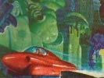

  
[Intangible Textual Heritage](../../index)  [UFOs](../index.md) 
[Index](index)  [Previous](irl02)  [Next](irl04.md) 

------------------------------------------------------------------------

[Buy this Book at
Amazon.com](https://www.amazon.com/exec/obidos/ASIN/0932813631/internetsacredte.md)

------------------------------------------------------------------------

  
*I Remember Lemuria*, by Richard S. Shaver, \[1948\], at Intangible
Textual Heritage

------------------------------------------------------------------------

p. 17

### CHAPTER II

#### From Art to Embryology

From the moment that I pocketed a disc that bore the faun-legged girl's
name and address, I was no longer an aspiring artist; I wanted to know
what she knew, wanted to learn what she was learning.

Arl was her name, a short, sweet name for a girl and hard to forget,
too. You can't forget a girl who wags her tail at you just like that.

And so she took me into the medical school and directed me to her own
teacher. I became a member of the class immediately and discovered that
I had entered upon the opening discourse.

The class was dominated by the immense presence of the teacher, a son of
the Titans, bearded and horned, expounding in the exact syllogism of the
technicon training. As he spoke, I became certain that this dynamo of
human force should soon charge such a small battery as myself with
everything in the way of knowledge I could assimilate.

There was only one slight disturbing factor. Just as I had sensed a
strange, deeply buried and secret fear in the Sybyl, I knew that in the
mind of this great son of the Titans there was a gnawing something that
a part of his brain dwelt on continually. Fear was a smell that was ever
in the nose down here in Tean City. The realization disturbed me so much
that I failed to absorb a portion of the teacher's discourse. My
absorption must have caught his attention, too, for I saw him staring
disapprovingly at me. With a start, I re-concentrated my mind on what he
was saying.

". . . a great cold ball hung in space. Once it had

p. 18

been a mighty, living planet, swinging ponderously around a dying sun
that it had never seen, being covered with clouds. Then that sun had
gone out, and the deadly ter [12](#fn_11.md)
stiffened the surface life into glittering death.

"The planet's forests, which had lived in dense, dripping fog, had, in
their many ages of life, deposited coal beds untold miles in depth—clear
down to the stony core of the planet. No fire had ever touched these
forests, because the dense fog had never allowed fire to burn.

"Venus, our nearest neighbor in space, is such a planet now, although
much smaller. As it is on Venus, so it was on the unknown planet.

"Hanging in space the dead immensity of this ball was largely potential
heat, for its tremendously thick shell was mostly pure carbon.

"Such once was the sun, your sun and mine; the sun of which Mu is a
daughter.

"Then a blazing meteor, spewed violently from some sun in space, came
flaming toward this cold ball. Deep it plunged into the beds of carbon.
The fire spread swiftly—an ever-fire of disintegrance, not the
passing-fire of combustion—and our sun was born into live-giving flame!

"A carbon fire is a clean fire and contains no dense metals like radium,
titanium, uranium, polonium—whose emanations in disintegrance in suns
cause old age and death because minute particles given off accumulate
and convey the ever-fire into the body, there to kill it in time.

"Then sun heat was clean, and life sprang furiously into being on its
daughter, Mu's surface. Nor did this life die—death came only by being
eaten. Then life suffered old age not at all, for there was no cause."

The voice of the teacher paused a moment, and now indeed I knew that
there was much for me to learn. Here was something that struck deep into
me with an instantly

p. 19

vital interest. Most provoking of all was his peculiar emphasis on the
word "then." I could not help the question that sprang to my lips.

"Why do you say 'Then life suffered old age not at all, for there was no
cause.'? Is there cause now?"

It was as though I had placed a torch beneath the hidden fear in the
Titan's eyes, for it flamed forth suddenly for all to see; but it was as
quickly quelled. All in the class looked at me with that shocked
expression which plainly said I had overstepped my bounds; but in the
eyes of Arl I thought I saw the gleam of approval, and I found a dam to
hold back my ebbing courage.

The teacher looked at me, and I saw kindliness in his eyes.

"You are new here, Mutan Mion. Therefore it is easy to understand that
you have not heard of the projected migration of all Atlans to a new
world under a beneficial sun. . .

"Yes, young ro, there is cause." He was answering my question with
determination now, but he was not speaking to me alone; he was making
his answer a part of his discourse. "I have spoken of the carbon fire as
a clean fire. By this I mean that the atoms of carbon, when
disintegrated, send forth the beneficial energy ash called exd which can
be assimilated by our bodies and used to promote life-growth. However,
the source of this ash is not carbon alone, but all other elements
excepting the heavy metals such as I mentioned before. It is when these
heavy elements begin to disintegrate in the ever-fire that we come to
the cause of age.

"The particles of radium and other radioactive metals are the poison
that causes the aging of tissue. These particles are thrown out by all
old suns whose shell of carbon has been partly or altogether burned
away, permitting the disintegrating fire to reach and seize upon the
heavy metals at the sun's core. Our sun has begun to

p. 20

throw out great masses of these poisonous particles. They fall upon Mu
in a continual flood, entering into living tissue and infecting it with
the radioactive disease we call age.

"Through the years, the centuries, these poisons accumulate in the soil
of the planet, and are continually being washed out of it by the rains
with the result that all the water on Mu is becoming increasingly
contaminated. When these waters are drunk, the poisons accumulate in the
body, finally becoming numerous enough to completely halt all growth and
still worse, to prevent any effectual use of exd, which is the food of
all integration.

"The technicons, of course, have devised means to protect us from the
accumulation of the age poisons, but it has become evident that their
efforts are not entirely foolproof. We have discovered that we are
living on a world that circles a sun that is growing old and is
therefore deadly. We are living in the shadow of death, a shadow that
will grow greater as the years pass until finally death with strike us
all. We would, if we remained, not even begin to live out our lives.
Centuries and centuries would be lost to us, and ultimately we might not
even attain the initial growth of maturity!"

I ventured another question.

"What methods have the technicons devised?"

"They are simple ones. Multiple distillation of the water in which we
drink and bathe; treatment of the water in a centrifuge to remove the
very finely divided age poisons that cannot be removed by distillation;
ben generators to create a magnetic field of ben energies; air
centrifuges to remove poisons from the air. But I must impress upon you
that it is impossible to shield us from all of the age poison; from that
small amount that actually falls upon our own bodies and accumulates
there as it does in the water. Eventually, if we remain on Mu, we will
grow old, [13](#fn_12.md) and finally die."

p. 21

I looked him squarely in the eyes, respectful in a degree equal to the
kindly interest that shone in his as he returned my look.

"It is not the age poisons you fear," I accused.

He looked at me silently; and a flood of force seemed to flow through
me, encouraging me, protecting me, cautioning

p. 22

me. It was the same feeling I had gotten from the Sybyl.

"Come, students," he said gently. "We will go now to the embryo
laboratory."

Before we entered the laboratory we were given nutrient potions
prescribed by the Titan for his students to make them more receptive and
hence his work easier. We were told that we would receive these potions
regularly. Even as I took the first draught my brain throbbed with a new
growth of ideas and strange new images. I was exhilarated beyond all
imagining, and my enthusiasm knew no bounds. I took Arl's hand in mine
as we trooped into the laboratory.

It was truly a wonderful place, the most amazing I had ever seen. I felt
like a mite admitted to the treasure-house of a giant. Here were things
that were beyond my intelligence to create of my own mind power; and yet
I was being given free and welcome access to all of them, to learn from
them, and to use the knowledge if I wished in my future life and work.

Many strange machines filled the laboratory, all performing tasks that I
could only guess at. But these machines were subordinate to the real
science of this great room, being designed only to chemically and
electronically nourish and develop the many human embryos that moved and
grew in synthetically duplicated mother-blood in sealed bottles.

The older ones kicked and tugged healthily at the grafted umbilical tube
which supplied the life fluid—called

p. 23

\[paragraph continues\] Icor, the "blood
of the gods." And it was this blood that was the subject of the lecture
the Titan now gave us.

He told us of the upkeep and preparation of this fluid, both in the
embryo and the adult; the difficult and important part being (he now
stressed his words with greater emphasis with his attention bent
especially toward me) the process of detecting and removing the
slightest trace of the radio-active poisons that cause age.

I studied and I learned! These were the processes which had given the
planet Mu its health and enabled us to live under more aging suns than
other races. These were the life methods that had given us our
fecundity; which had populated space for thousands of centuries with the
seed of Atlan. I wanted to know all there was to learn about them.

The Titan, an old master at this most basic process of Atlan life, had
imbued me with an enthusiasm for the true creation of life in its
infinite possibilities of growth—such as no mere painter ever had. The
delicate handling of those ultra-minute products of disintegrance from
which primary integrations are formed; the mixing of these integrations
into the atoms of elements; the chemistry of combining these atoms into
the molecules of the substances used in the manufacture of the synthetic
blood, Icor—all these steps were sheer artistry, yet were made as simple
as child thought by the genius of the Titan.

Once more the Titan commented on the proposed emigration from Mu,
weaving it into his lecture. There seemed to me to be an undercurrent of
double meaning in his motive for repeating it; a double meaning that I
strove to associate mentally with the fear-thing that was something else
and also something so secret it must not be mentioned. It was as though
even the fact that there was fear of that "something" must be kept
secret. Our aging sun (he said) threw off increasingly large amounts of
these sun's seeds, small but dense and active

p. 24

disintegrative particles, and I learned that keeping Atlan's peoples
young was an increasingly difficult job for the technicons. I learned
that the coordinators and rodite [14](#fn_13.md)
were preparing the plans and ships for our migration to a young,
new-born sun, where the force setup of life conditions left a greater
margin of exd for intake of power, where integrance went on at a faster
pace, and where the infection that caused the occasional trouble with
detrimental energy robotism or detrimental err [15](#fn_14.md) in the human did not occur.

W hen the lecture in the embryo laboratory was finished we filed back to
the classroom, and there the Titan flipped the switch that controlled
the teleyes that supplied the

p. 25

home telesets of many with the course. We had not been dismissed, and I
could see from the puzzled looks on the faces of the other students that
this was not in accordance with the regular schedule.

For a long moment the Titan looked at us, and especially at me. Then he
spoke:

"Today things have been said and seen and discussed in this class that
had no direct bearing on the course you came here to take. You, Mutan
Mion, have been the most brash—" my face grew red, and he hastened to
add, "No, Mutan, I do not mean that you have been too forward; I meant
brash in the sense that you have exposed yourself to a greater danger
than that of my wrath." His eyes twinkled at the word wrath, and I knew
that such would never be much of a danger! "I meant the menace that has
caused the fear you have somehow seen in me. Perhaps you have sensed
this in other places in Tean City, among others of the Titans; so it
must be, for you to have been so certain of it as to challenge me.

"Yes, there was, and is, fear in me. And it is a fear that we all try to
keep secret because those of us who show fear also show suspicion if not
knowledge, and either has been equivalent to the signing of a death
warrant. There are spying rays on us . . . at the moment we are screened
. . . that seek out our knowledge and destroy us before we can
coordinate it into an effective counteraction to the thing that is going
on; to the thing we fear."

"What is that thing?" I breathed aloud, so intense was my interest.

The Titan drew a deep breath. "It has come to me that certain groups of
Atlan are against the projected migration, and the recent disappearance
of several men important to our work lends color to the story. Of course
we all know that the only units able to do anything of the kind would be
the key rodite of Sub Atlan and Center Mu. Some of these may have
accidentally suffered a severe

p. 26

flashback of detrimental ion flow, so that their will has become one
under detrimental hypnosis. What rodite area has become so corrupt as to
allow such a condition to go unchecked I cannot understand; but that we
are all in danger until the thing is checked is most certainly true.

"Therefore, since you here have gained an inkling of something wrong, it
is only your right to be aware of it, so that inadvertent words may not
cause you great harm. Also, we must fight this thing; and all of us must
fight. So you may consider yourselves deputized by the ruling life of Mu
to seek out the information that will clear the way for the migration.
Until that is done we suffer fear, not new to me, but new to most of
you.

"You may go."

Looking back at his gigantic form as I left the classroom, I saw him
musing deeply; and the concern on his face told be that things must be
even more fearful of consequence than he had made us believe. Reason
told me, too, that it must be so—for great indeed must be the evil that
can bring fear to the heart of a Titan, the super being of all Mu and of
the universe.

------------------------------------------------------------------------

### Footnotes

[18:12](irl03.htm#fr_11.md) Ter—the Lemurian word
for cold.—Ed.

[20:13](irl03.htm#fr_12.md) Impressed with the
implications contained in this portion of p.
21 the story of Mutan Mion, we wrote Mr. Shaver for additional
information on this theory of the cause of age. This information is
curious, because some of the theories seem to be modern (by Mr. Shaver)
and others those of Mutan Mion, with no particular designation as to
which is which. However, we present the whole for your judgment.

"The sun itself seems to be the mother source of all radioactivity,
infecting all the earth's surface and all the life on its surface. The
sun projects minute disintegrances down upon us in a steady, numerous
rain whose effects we call age. In water the poison is heavily present
in suspension, especially so in thermal springs. In the air the poison
floats forever with the tiny thistledown of dust it has infected and to
which it clings. It settles on the leaves of plants. So we take the
poison in with every breath, with every bite of food, with every drink
of water; thus we age as the poison accumulates.

"But we do not have to let in that poison; we can protect ourselves and
grow through a longer youth to a much greater age, with superior mental
powers. It is very plain that a mother's body cells, although replaced
every four to seven years, are not young because they remain in contact
with the poison retaining fabric of the body and so age swiftly. Yet,
the baby is young. Young because it gets filtered blood, filtered
through the placenta—and would remain young if the poisons were to be
continued to be filtered out by a duplication of the placenta filter.
The stalk of a plant is old, yet its seed is young, capable of
reproducing itself without passing on the poisons of age. It is because
the stalk contains a filter to prevent passage of the poison to the
seed. The simple filtration processes of birth and seeding CAN BE COPIED
by man, thus putting off old age.

"Here are a few verbatim quotations from Madame Curie's notes: 'Finally,
the radiation of radium was contagious. Contagious like a disease and
like persistent scent. It was impossible for an object, a plant, an
animal or a person to be left near a table of radium without it
immediately acquiring radioactivity—becoming radioactive—a notable
activity which a sensitive apparatus could detect.' A later page: 'Thus
the radio elements formed strange and cruel families in which each
member was created by degeneration from the mother substance—radium was
created by degeneration from uranium—polonium from radium, etc.' And
from a later page: 'When one studies strongly radioactive substances
special precautions must be taken if one wishes to be able to take
delicate measurements. The various objects used in a chemical laboratory
and those used in physics experiments all become radioactive in a short
time, and affect photo paper p. 22 through
black paper. Dust, the air of the room, one's clothes all become
radio-active. The evil has reached an acute stage in our laboratory.'

"Note the word mother. The sun is the mother source of radioactives.

"It is a matter of common knowledge that certain watch factories
formerly allowed workers (young girls of twenty) to tongue-tip the
brushes with which they painted the radioactive dials. They died of OLD
AGE at twenty and twenty-five years! Not of a disease, but of age
poison; [radioactive](errata.htm#2.md) particles, whose origination is from
the disintegration of the heavy metals of which radium is a member!"—Ed.

[24:14](irl03.htm#fr_13.md) Rodite—Life pattern
synchronizers.—Ed.

[24:15](irl03.htm#fr_14.md) This is mainly due
(explains Mr. Shaver) to depolarization of the matter of the brain; it
is no longer earth polared, it is sun polared—and hence inducts the
disintegrant flows from the sun into the brain by simple dynamic
induction. I think a magnet could be sun polared and point to the poles
of the sun just as an ordinary compass points to the poles of the earth.
This is what happens to parts of the brain; they become sun polared. In
the desert this is known as "cafard," to become crazed and kill until
killed. Others are just stupid, depending on what parts of the brain are
affected. The Malay "amok" and the Norse "berserk" are the same
phenomena. When it lies in the part of the brain devoted to memory, the
result is absent mindedness. When it lies in the nervous system and ego
recognition of activating centers, the victim is a killer or a
repressive reactionary. It is simply true that man is an electrical
machine which functions well when his p. 25
energy flows are of his own creating, but functions especially ill when
the energy flows are from the sun.

The sun is quite a dynamo; it always gives off, from the surface; while
earth always takes in, from the surface. Much of this intake is
"snap-back"; that is, it is returning to a state of matter. Gravity is
merely the disintegrant energy of suns returning to material form. Much
of it, however, is like radium, a persistent disintegrant seed of a sun.
Radioactivity is the seeds of disintegration.

Hence, a mind powered by sun particle energy flows of a detrimental
nature becomes robot. The result is robotism, or the inability to think
constructively. Victims of detrimental err have but one basic thought,
to kill, in keeping with the natural elemental instinct of the
disintegrant metals. (The reader has been presented here with two
sensational theories which appear in complete form later in the
manuscript; the nature of gravity, and the interrelation of energy and
matter in an endless circle.—Ed.

------------------------------------------------------------------------

[Next: Chapter III. Terror in Tean City](irl04.md)
