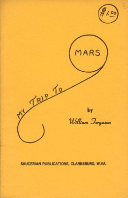

  
[Intangible Textual Heritage](../../../index)  [UFOs](../../index) 
[Mars](../index)  [Index](index)  [Next](mttm01) 

------------------------------------------------------------------------

*My Trip to Mars*, by William Ferguson, \[1955\], at Intangible Textual
Heritage

------------------------------------------------------------------------

# MY TRIP TO MARS

### by William Ferguson

#### Saucerian Publications, Clarksburg, WV

#### \[1955\]

Scanned for Intangible Textual Heritage, November 2006. This text is in
the public domain because it was not renewed at the US Copyright Office
in a timely fashion as required by law.

   
Front Cover

------------------------------------------------------------------------

[Next: My Trip to Mars](mttm01)
