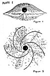
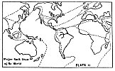

  
[Intangible Textual Heritage](../../index)  [UFOs](../index.md) 
[Index](index)  [Previous](otof06)  [Next](otof08.md) 

------------------------------------------------------------------------

p. 48

### CHAPTER 3

### MAGNETISM: THE UNIVERSAL 'I AM'

In the discussion of *The Grand Man* of the Universe, we have shown the
similarity, or *oneness* of all Creation from Microcosm to Macrocosm.

When we previously mentioned an electromagnetic field or vortex, we were
referring to the Fourth Great Primary Force, or the *Resonating
Electromagnetic Field* (RMF) which present day science knows nothing
about although they suspect its existence.

The Four Forces are: Static-Magnetic Field (SM), as in a bar magnet;
Electro-Static Field (ES), as in a charged capacitor; Electro-Magnetic
Wave (EM), as radio waves, light, heat, etc.; Resonating Electromagnetic
Field (RMF), like that of all celestial bodies (operating in a vortex),
space craft propulsion field, the basis of life, the elemental life.

Throughout space are positive and negative parallel light lines of force
running between each other at right angles and consisting of charged
particles vibrating at varying rates producing a rhythmic wave effect of
bands. These lines of force also vary in the number of particles they
contain in a given distance, that is, they vary in their density. When
negative and positive lines or bands ( equal to the diameter of the
particle to be) with equal densities and vibrations cross, a vortex is
set up which condenses the *positive* particles and these become
*substance* 

p. 49

as nuclei . . . either a proton (atomic nucleus), or a comet (early
evolutionary form of a planet), or a sun (nucleus of a solar system).
The *negative* particles are condensed as the *Resonating
Electro-magnetic Field* (*vortex*) of an atom, a planet, or a sun.

When the positive particles have condensed sufficiently, and the
surrounding negative vortex has gained sufficient strength, the
insulating force of pure light between and around the positive and
negative forces is reduced and polarity is set up from the flux motion
of the positive and negative. A strong vortex is indicated by flattened
poles (oblateness) and equatorial bulging in the particle. If the vortex
breaks the substance disappears as it returns into the solution of the
light lines of force, known as the ether or space. (The vortex of the
planet Lucifer, the planet now known as the asteroid belt, broke through
hydrogen experimentation.) When the particle is sufficiently polarized,
rotation results from the constant application of the positive and
negative light forces to the vortex.

A comet travels in the currents of the sun's [vortex](errata.htm#11.md)
(RMF) until its own vortex (RMF) breaks (The Andromedes, or Bielid
meteors move in the path of the lost Biela's comet which disintegrated
and was last seen in 1852) or it becomes sufficiently powerful to attain
an orbit of its own, in which case it becomes a planet.

Now let us consider three bodies which operate in a Resonating
Electro-magnetic Field of Force: (1) The Sun (acting as a nucleus):
One-hundred

p. 50

years ago, in 1854, the eminent astronomer Sir William Herschel
suggested that the Sun may be inhabited and that the inhabitants may no
more suffer from intense heat than those who live in the tropical
regions of Earth! He believed the Sun to be a cool body, not a hot,
flaming gas ball.

Since it has been shown that the satellite planets are magnetic in
nature, it is only right to assume that the governing body that rules
those planets is also magnetic in nature. So, we might say that the Sun
is the magnetic "brain" or ganglion of our entire Solar System. Its
forces are the directing intelligence of all the functions of our
System. It is from this great central, nuclear body that the planets
draw their magnetic energy so that they, too, may generate forces.

The Sun's vortex is very intense as would be expected of such a huge
body, and it must extend to the very outer limits of the System. Its
atmosphere has three main layers: the chromosphere; the reversing layer;
and the photosphere. Completely enveloping these layers is the corona.
When photographed in hydrogen light the Sun displays its magnetic
structure very well. Such a photograph shows a grainy effect very
similar to that produced when iron filings are sprinkled in a magnetic
field.

Scientists today state that the Sun is a gigantic atomic furnace
radiating a tremendous amount of heat to the satellite planets each
second. The temperature at its surface is said to be thousands of
degrees and the internal temperature is supposedly

p. 51

in the millions of degrees. However, it is unexplainable how
super-heated gasses can act magnetically. For, it is an elementary fact
of physics that a substance loses its magnetism when heated! Since
astronomers have definitely recorded magnetic effects upon the Sun, we
have a direct conflict between the Sun's true nature and the suggested
temperature. This conflict only indicates that the Sun is not the
super-heated mass of gases that scientists think it is, but rather, a
cool body as Herschel said it was.

There is much evidence to prove that the Sun it, indeed, a cool body.
The process of determining the Sun's temperature is very complex and
involves the radiation laws of physics. Fundamentally, here is how such
temperatures are determined: the radiation of the body per square
centimeter per second, times the body's effective temperature
quadrupled, equals the rate of radiation quadrupled times the body's
luminosity divided by its diameter squared. In solving for the Sun, one
comes up with an average of 5900 absolute degrees. The mathematics
involved is agreeable, but astronomers base their calculations on these
two assumptions:

First, they assume the Sun is a perfect radiating body; second, and most
important, they assume that the Sun is radiating heat! This is because
they believe that heat on Earth, as well as heat on other planetary
bodies, comes directly from the Sun. People feel the heat when they
stand in sunlight, so they say the Sun must be a burning mass radiating
that heat. That is like saying a radio transmitter

p. 52

radiates sound waves because when we turn on our radios, we hear sound.
But we know that such a transmitter radiates radio waves, and that these
waves are turned into sound inside the radio!

In 1543, a great comet came closer to the Sun than any previous comet
had and this was repeated by another comet in 1882. They actually
entered the Sun's corona which supposedly has a temperature of
one-million degrees absolute. These comets traveled over one-million
kilometers through this blazing corona and emerged unscathed and with no
change in velocity or direction. If the Sun is radiating heat, why
weren't these comets instantly disintegrated upon entering a tremendous
heat of one-million absolute degrees? Surely nothing could survive such
a treatment!

Astronomers have told us that the planet Mercury is devoid of life
because it is only thirty-six million miles from the Sun. They have told
us that if Mercury was any closer, it would have turned into
"nothingness" long ago. How then did the two comets survive without at
least showing some effects of their journey through the Sun's corona? We
must conclude that the answer is that the Sun does not radiate heat, as
such! Therefore, it cannot be any kind of a super-hot body.

The prominences supply us with some more proof of the above conclusion.
These prominences are said to be hydrogen gas explosions and first
appear in the Sun's photosphere. There are many theories, but as yet
astronomers have been puzzled over their

p. 53

origin. The behavior of these so-called "hydrogen clouds of gas"
contradicts one of the oldest, and supposedly, most stable law of
physics . . . the law of gravity of Newton.

Some prominences travel at the unbelievable speed of 450 m.p.s. and
reach an altitude of one-million miles; that's one-hundred ninety-one
thousand miles more than the Sun's diameter. To add to the oddity of
this phenomenon, is the fact that these prominences rise to fantastic
heights, and then just "hang" in mid-air, unsupported, in complete
defiance of Newton's law of gravity! Others appear to "materialize" from
nowhere, and hang motionless. Surely the Sun with all its tremendous
mass and "pulling" power could bring these prominences down again if
they were composed of hydrogen gas. Astronomers say they are composed of
such gas because the spectroscope has labeled them such. But the
spectroscope is very inaccurate because between the Sun's atmosphere and
this instrument, the atmosphere of the Earth intervenes, and the upper
atmosphere of our planet contains almost pure hydrogen. This could be
the hydrogen that astronomers say is on the Sun.

Sunspots and prominences have puzzled scientists for years, yet they are
part of the same phenomenon. Sunspots and prominences are manifestations
of the Sun's auroral activity as viewed from different angles. They have
never photographed the solar prominences except at the edge of the Sun.
Prominences take the form, or appear as sunspots when seen on

p. 54

the face of the Sun. The shape and particulars of the prominences cannot
be observed unless the light of the Sun is blotted out. These
prominences are not super-heated hydrogen gas because their very
behavior proves otherwise! They behave as *forces*, not as *elements*
(gas, etc.).

The prominence force of the Sun is similar to the auroral force
emanating from the polar vents of the Earth. This auroral force is known
as the aurora borealis in the Northern Hemisphere, and the aurora
australis in the Southern Hemisphere. The names, "northern" and
"southern" lights, are also given to this phenomenon. This Earth force
which is continually being sent into the atmosphere, has the exact
characteristics of the prominence force of the Sun. Although it is
continually emanating from the Earth, it is only seen at certain times
when atmospheric conditions are right.

The auroral and prominence forces are *identical*. Under the thick
atmosphere of the Sun are hidden planetary bodies which are emanating
aurora forces known on the Sun as prominence forces. The fact that there
are planets under the Sun's photosphere is also evident from the fact
that in atomic structure the electrons are balanced by an equal number
of protons within the nucleus. This makes a balanced system.

The prominence forces manifest in the atmosphere of the hidden, or inner
planets, pass through their electro-magnetic field, then manifest once
again in the atmosphere of the Sun. Then what

p. 55

about the so-called "hanging prominences" which "materialize" from
*nowhere* in the upper atmosphere of the Sun? The solution to this
baffling question can be found easily. When the auroral forces of the
outer planets (Earth, Mars, etc.) pass through their vortex or
electro-magnetic field, they are ultimately drawn into the great Sun
body where they manifest. At this stage, astronomers observe the
"hanging prominences" which "materialize" from *nowhere*!

Another puzzle that has confronted astronomers, is that some sunspots
appear to have polarity, and that some prominences are pulled
mysteriously toward certain sunspots. Prominences and sunspots have
already been shown to be manifestations of the auroral activity of the
hidden or inner planets under the Sun's photosphere. There are twelve
inner planets and twelve outer planets.

Astronomers ask why sunspots arise at the more or less irregular
intervals of eleven years, and why do first spots of a new series appear
in high latitudes, and why is there a slow progression of the spots
toward the solar equator as the sunspot cycle advances, and why is there
a change in polarity of sunspots in alternate cycles? The answers to
these questions will give an accurate and complete theory of sunspots,
and the answers lie in the fact that the inner or hidden planets create
these conditions by their periods of rotation and revolution.

Heat and light are effects of the positive rays of the Sun. Heat is felt
on the Earth because the Sun's

p. 56

positive rays intersect with its negative atmosphere and crust causing a
friction or change in the quality of motion of the particles given off
as heat radiation in consequence of this friction. The effect of the
Sun's rays on the Earth's atmosphere is also responsible for the
phenomenon of visible light which results from a different kind of
motion of the particles.

The eyes are only sensitive to positive light rays reflected from
negative substance, thus light is an interaction of negative and
positive forces. The Sun does not send us heat and light, although it is
responsible for its manifestation on Earth; the Sun sends only positive
lines of force which interact with the negative crust and atmosphere of
the Earth to produce the phenomena of the electro-magnetic spectrum
which includes heat and light.

Science has explored the upper atmosphere of the Earth and found that
sixty miles above the Earth artificial light is needed, and ninety miles
above the Earth it is dark as "pitch". The higher we go the colder it
gets, so we see even by logic that heat and light do not come from the
Sun. Only lines of force come from the great sun body.

Since distance and nearness to the Sun have nothing to do with whether a
planet is "boiling" or "frigid", we can immediately see that all planets
in our Solar System have nearly the same climate. The Earth does not
enjoy perfect climate because it is unbalanced magnetically.

What has been learned from space visitors about our Sun is not really
anything new, but only a return

p. 57

to the ageless wisdom possessed by the Earth's most ancient races. These
students of the long ago said that the true color of the Sun was blue,
and it is interesting to note that the musical note of blue is Sol, a
name for the Sun, itself!

\(2\) The planet Earth (acting as an electron): As already stated, a
comet is an early evolutionary form of a planet. But the behavior of a
vortex in the formation of a particle such as the Earth has already been
discussed.

H. T. Statson, research associate, M.I.T., says: "The source and nature
of the earth's magnetism is still one of the great mysteries of
science." It is still a great mystery because the Fourth Great Primary
Force (RMF) is not understood; when it is understood a key will be found
to many of the present day problems of science.

We cannot think of the orbit of the Earth as being merely a circle or
ellipse, because it is a *spiral* also. This is because the Sun is
moving through space at many miles a second. The Earth's orbit could
only be an ellipse or circle if the Sun were standing still. Remember,
the Earth is carried along within the solar vortex (RMF), in addition to
following its own orbit.

The Earth's auroral force emanates from the polar vents at both north
and south poles. The positive light lines of force leave at the north
polar vent, and the negative light lines of force leave at the south
polar vent. The bending of these light lines of force when they leave
the polar vents manifests as the

p. 58

aurora under proper atmospheric conditions, and they follow the general
form of the RMF.

Reports state that recent polar expeditions have discovered the actual
vents or openings that lead into the interior of the Earth at the North
and South Poles. Ancient tradition asserts the existence of a fountain
of life in the bowels of the Earth and in the North Pole. It is the
"blood" of the Earth, the electro-magnetic current, which circulates
through all the arteries; and which is said to be found stored in the
"navel" of the Earth.

Tschermak noted the resemblance of structure between meteorites and
volcanic products. This is because both meteorites and matter or "bombs"
ejected by volcanoes are created in a vortex. The "bombs" ejected from
volcanoes do not come from the bowels of the Earth, but are actually
created within the volcanic vortex which is a sub-vortex of the Earth's
RMF.

Hurricanes, known also as cyclones and typhoons, are the most dangerous
storms on Earth. Their vortex may cover half a million square miles.
Sometimes a hurricane generates a number of tornadoes on its fringes.
Hurricanes sometimes spend energy [equivalent](errata.htm#12.md) to that of
several thousand atomic bombs per second. Therefore, we can see the
tremendous power of a vortex. The heavy rains carried by a hurricane are
concentrated in great spiraling lines which run inward, showing again
the Universal spiral form. Tornadoes, whirlpools, etc., are sub-vortices
within the Earth's vortex.

p. 59

 

[  
Click to enlarge](img/pl01.jpg.md)  
Plate I  

 

p. 60

[Plate I](#img_pl01.md) shows two views of the RMF of a nuclear particle.
Fig. 1 shows a side view of the RMF surrounding a nuclear particle. Fig.
2 shows the same RMF viewed from above, and looking down toward the
polar vent area.

In these illustrations the nuclear particle is shown as a black sphere.
This sphere can represent an electron, an atomic nucleus, a Saucer, a
moon, a planet, a sun, the nuclear area of a galaxy, or the nuclear area
of a supergalaxy, in their respective Resonating Electro-magnetic
Fields.

The shape of galaxies (spiral nebulae) as observed through the telescope
is the perfect shape of an RMF. This shape is seen throughout the
Creation from Microcosm to Macrocosm, and the form is Universal. Other
examples would be the form of Saturn with its rings; and the shape of
several types of spacecraft (Saucers). Celestial bodies and Saucers take
the shape of their respective RMF, that's why there is so much
similarity.

Spiral nebulae when appearing edgewise look like Fig. 1, and when they
appear more nearly circular, because their equatorial planes are
perpendicular to the line of sight, they look like Fig. 2.

\(3\) A Saucer (acting in an artificial and controlled RMF): The
statement has been made that a Saucer can enter the Earth's vortex (RMF)
because it has an RMF itself, therefore, a rocket ship cannot penetrate
the cleavage layer of the Earth's RMF and is disintegrated because it
does not operate in such an RMF. The rocket craft has a magnetic field
to

p. 61

be sure, or else if couldn't exist, but it does not have a resonating
force field about it.

Since Resonating Electro-magnetic Fields are found throughout the
Omniverse, they are interacting and only a Saucer or spacecraft with an
*artificial* and *controlled* RMF can travel in an interstellar manner.

Meteorites do not have RMF, and therefore, some will say they cannot
penetrate the Earth's field or vortex. First of all, many meteorites and
tektites are formed *within* the RMF of the Earth itself by a process of
gathering together at a vortex center of primal matter present
everywhere in so-called space. When these meteorites and tektites get
large enough, like raindrops, they fall by the inward force of the
vortex (scientists would say "gravity" and Einstein in his Unified Field
Theory says "magnetism").

The Earth was originally created in this manner, and cosmic debris was
gathered toward its vortex center until it was big enough and had a
field intensive enough to go from the comet to the orbiting planet
phase. The Earth is still gathering material daily and adding to its
mass by the formation of meteorites within its own RMF. These meteorites
drop to the surface of the planet.

The stone meteorites are created within the Earth's vortex, as are the
tektites. These tektites do not come from the Moon as has been
suggested. The iron meteorites are created by vortical action within the
solar vortex (RMF).

An object that doesn't have an RMF will be disintegrated

p. 62

when it enters a vortex in proportion not only to the intensity of the
RMF, but also in proportion to its energy which depends on mass and
velocity. Thus, a dense, fast-moving object would not be disintegrated
to pure energy, while a less dense, slow body would be if given the same
expo-sure time in the same field.

For example, Capt. Mantell's plane was torn to pieces when it came in
contact with the RMF of the Saucer, whereas it would have disintegrated
into pure energy if it had attempted to enter the Earth's RMF.

Another example is found when we consider the asteroid belt between Mars
and Jupiter. These asteroids are fragments of a planet once known as
Lucifer. The question arises: "How could the fragments from this
destroyed planet have entered the Earth's vortex since they did not have
an RMF themselves?" The reason is that the asteroid fragments, or any
other fragments beyond our planet's RMF, *can* enter the Earth's field .
. . but they disintegrate by so doing. The law is NOT: "*Nothing* can
enter the field unless it also has an RMF" . . . but the law IS:
"*Anything* can enter the field, but it will be disintegrated in
proportion to its energy (mass times velocity squared) and the intensity
of the field (RMF) it is entering.

First, a fine dust came from exploded Lucifer and struck the Earth
turning everything red, then a fine sand came, then coarser sand, then
gravel, then meteorites destroyed villages. When Lucifer was

p. 63

destroyed, and its vortex broke, the smallest particles had the greatest
velocity, therefore, the larger fragments came last. For more
information on Lucifer-Maldek see *Maldek and Malona* in this book in
the section called: *Other Tongues*.

Some researchers say that Saucers operate in a *static field*, but this
is not the case. No interplanetary craft could travel as it does in a
static field. Only utilization of the Fourth Force, or RMF will enable
any kind of a craft to go from one world to another.

Saucers and all spacecraft contain their own atmosphere around them like
a celestial body. They can go under water and the RMF will keep the
liquid from touching the craft. Refer once again to [Plate
I](#img_pl01.md): In Fig. 1, the black sphere can represent a Saucer in its
RMF. The perfect shape of a spaceship is a globe or ball, and planets
that have only recently succeeded in developing interplanetary craft use
such devices. Celestial bodies are round and globe-like for the same
reason. As a planet advances scientifically its technicians are able to
intensify the RMF, and the Saucer takes on the shape of its on field.
That is why very flat, discus-shaped Saucers have been seen and also,
globes have been observed. The more highly advanced the world, the
flatter the craft. Eventually, no craft is needed to travel the
interstellar distances, and beings are projected" to other worlds by
thought alone! The reason Saucers sometimes have blinking lights on the
top and bottom of their craft is because these

p. 64

are the polar vent areas of the ship, just like the polar vent area of
Earth which emit the auroral force. Crossed lines of force exist at the
vents, therefore observers see blinking of pulsating lights of various
colors. North-South and East-West propulsion operates on different
force. Also, a different force is used if the Saucer goes up or down.

The human being has a very complex field with a maze of vortices.
Therefore a Saucer pilot can leave the RMF of his craft by two methods.
First of all, as the Saucer lowers Earthward, its RMF is reduced and
drawn into the rim of the craft. Otherwise, its own field would keep it
off the ground. If the ship is to be lowered all the way to Earth, then
the RMF must be completely drawn into the rim area. This action enables
any occupant of the Saucer to emerge unharmed. Secondly, if advanced
enough, a Saucer pilot can control his own field composed of numerous
vortices and thereby go through another RMF of low intensity. When
Christ walked on the water and performed other so-called miracles, he
utilized such knowledge.

If the reader will refer to photographs of the crescent-shaped
arrow-craft or mastercraft in *The Coming Of The Saucers*, by Arnold and
Palmer, the craft's flowing center can be observed. This center is the
polar vent area where lines of force are crossing. In the same book,
mention was made of the Saucer that exploded over Maury Island.
Sometimes the craft are not constructed perfectly, and their own RMF
begins to tear them apart. The angle

p. 65

of incidence of a Saucer determines whether it has a high or low
intensity field. Likewise, the more the poles are flattened on a planet,
the more intense is its RMF.

From the Delawarr Laboratories, Oxford, England, comes the following
information: "We have been able to materialize energy particles in a
controlled magnetic field and would agree that the materialization of
'saucers' at certain positions in the earth's magnetic field is entirely
possible." (B.S.R.A., CQC-B-7, April 1, 1954).

Many ask: "How are Saucers constructed? They don't exhibit rivets,
bolts, screws . . . their surfaces are extraordinarily smooth and their
openings don't show when closed!" Needless to say, a Saucer is not
"built" as we on Earth construct anything. First of all, an
electro-magnetic field is set up, and within this field, a technician
constructs sections of a Saucer by his own powers of thought! This is
similar to the vortex within the volcano creating the ejected "bombs";
or the Earth's vortex, itself, originally creating the Earth. After the
various small sections are completed, they are joined by pins that are
hidden from view. Therefore, no obvious joining-together shows from the
exterior of the craft. People of other planets do not hammer and pound,
cut and saw; they utilize their own creative abilities (such as we all
possess) to construct their craft and many other objects. Their clothes
have no seams, and this is also because they are "woven" in an entirely
different manner than ours!

p. 66

In *The Secret Of The Ages*, Robert Collier says: "All about you is
energy . . . electronic energy . . . exactly like that which makes up
the solid objects you possess. The only difference is that the loose
energy round about is unappropriated. It is still virgin gold . . .
undiscovered, unclaimed. *You can think it into anything you wish* . . .
into gold or dross, into health or sickness, into strength or weakness,
into success or failure. Which shall it be? 'There is nothing either
good or bad,' said Shakespeare, 'but *thinking* makes it so.' The
understanding of that law will enable you to control every other law
that exists. In it is to be found the panacea for all ills, the
satisfaction of all want, all desire. It is Creative Mind's own
provision for man's freedom. And now man is beginning to get a glimpse
of the final freedom that shall be his from all material causes when he
shall acquire the complete understanding that mind is the only *cause*
and that *effects* are what he sees. There is no intelligence in matter
. . . whether it be stone or iron, wood or flesh. Matter is Vital Force
crystallized into the pattern we have given it. Mind is the only
intelligence . . . it alone is eternal . . . it alone is supreme in the
Universe. Therefore, all Vital Force is good. It is only our patterns
that are at fault."

Before leaving *Magnetism: The Universal 'I Am'* it is only proper to
discuss what I believe to be the greatest discovery pertaining to the
field of anthropological science. Scientists have long pondered the
question of what is culture? What constitutes

p. 67

culture? Why culture?

Cosmetology is called the science dealing with the effect of cosmic
phenomena on life. If we consider it from the standpoint of magnetism
and its effects on humanity and culture, it becomes sort of a science of
*cultural magnetism*.

In *The Saucers Speak!* a space intelligence said: "On your Earth there
are magnetic anomalies. Your scientists wonder why meteorites fall in a
pattern in certain locations over the world. They also wonder why great
civilizations are found where meteorites are found. The answer is
simple. The anomalies attract the meteorites, and these same anomalies
amplify Universal influx from outer space. Therefore, you will find
better living conditions, finer art and music and so on in the same
place you find the meteorites."

In geology, anomaly is a departure from the normal pull of "gravity" as
calculated for any particular place on the Earth's surface. Scientists
say that when positive, the anomaly indicates very heavy material
beneath the surface; when negative, very light material. Examples of
such magnetic anomalies are the Oregon Vortex; Mystery Spots at Santa
Cruz, San Jose, Guerneville, and Los Gatos, California; Mystery spot at
St. Augustine, Florida; and other locations are known to exist in
several places in the United States. There are a number of vortices in
the Ojai Valley, others in Canada, others in Mexico, etc. Scientists who
have investigated the strange anomalies have only concluded that they

p. 68

know absolutely nothing about the causes for strange visual effects and
other distortions in the various anomalies.

An anomaly has its own vortex which is a sub-vortex of the Earth's RMF.
The anomaly acts as a Universal radio because it amplifies everything
coming in from outer space. Highly sensitive individuals have strange
experiences when they enter an anomaly area. Their ability at reception
is increased to a fantastic degree. If man on Earth wants to communicate
with other planets he should set-up his equipment in one of these
vortices!

One of the interesting phases of the study of meteorites is their
distribution over the surface of the Earth. If one would look at a world
map that shows the distribution of the *iron* meteorites, it would be
immediately seen that where the meteorites fall there is great
civilization or highly civilized peoples. This, as stated before, is
because meteorites are attracted to the anomalies, and the anomalies are
amplifiers of Universal knowledge constantly permeating all space as the
"music of the spheres." Great cultural centers are found over and near
such anomalies! The individuals living in such areas are receivers of
this Universal knowledge and it manifests itself in great works of art,
music, literature, scientific achievement, architecture, philosophy,
etc. Depending on what vibration an individual is operating in, he will
create in one of these fields.

Here at last is the answer to: Why culture? Careful studies of
geological maps in connection with the

p. 70

 

[  
Click to enlarge](img/pl02.jpg.md)  
Plate II. Major Fault Lines of the World  

 

p. 71

number of cancer cases in different areas showed Brunler that the
radiation (vortical action?) of the Earth must have an important bearing
on this disease. Therefore everything man does, thinks, says, creates,
etc. is *magnetic* in nature! Magnetism is truly the Universal *'I Am'*.

A study of the major fault lines of Earth also shows that culture
follows these lines because magnetic anomalies are found along them as
well as volcanoes. Trace the fault lines on the world map of [Plate
II](#img_pl02.md) and see where they cross areas of great cultural
advancement. Remember, this does not necessarily mean civilized centers.
Native peoples have created many wonderful cultural items that have
never been equalled in modern civilization.

The many complex questions arising when origin of certain cultural
traits are discussed can be answered by investigation of anomaly areas
as they follow the fault zones of Earth. It is interesting to note here
that the Seven Shangri-Las or Seven Great Hidden cities mentioned by
Brown Landone are found directly over major fault lines of Earth! Any
center of cosmic truth preserving the ancient wisdom would have to be
located in such an area. Its inhabitants would require the amplifying
qualities of the anomaly in order to continue their higher metaphysical
research as masters.

Truly, *God Provided--Man Divided!* For all is magnetic, all is one, all
is God!

Spinoza said: "The Universe is ONE. There is no supernatural: all is
related, cause and sequence.

p. 71

\[paragraph continues\] Nothing exists but substance and its modes of
motion."

------------------------------------------------------------------------

[Next: Chapter 1. The Solex-Mal](otof08.md)
