  
[Intangible Textual Heritage](../../index)  [UFOs](../index.md) 
[Index](index)  [Previous](otof07)  [Next](otof09.md) 

------------------------------------------------------------------------

p. 72

# BOOK II

## OTHER TONGUES

 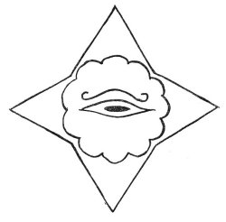

#### ISHTAL--MAXIN

In the Solex-Mal, this is the symbol for the "All-Seeing Eye," the
"Light of Creation," the four-pointed star stands for the Four Great
Primary Forces of Creation, the flower of twelve petals represents the
twelve planets.

p. 73

#### CHAPTER 1

#### THE SOLEX-MAL

 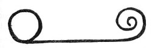

This is the symbol of the Solex-Mal, the Solar or Mother Tongue, the
universal language of all mankind. This language was the original tongue
once spoken on Earth by all people and is still used by the inhabitants
of other worlds in outer space. It is a symbolic, pictographic language.

Solex means Solar, and Mal means Tongue. In Spanish, the word Mal means
bad, sin, evil, hurt, injury, illness. In the drawing heading this
chapter, we see the Solar Disc or Circle on the left. Extending out from
this disc, to the right, is a curved or curled tongue. Therefore, it is
literally a tongue as well as a language referring to a tongue.

How did the word Mal meaning tongue come to signify evil and other
negative conditions? James 3:5-8 says: "Even so the *tongue* is a little
member, and boasteth great things. Behold, how great a matter a little
fire kindleth! And the tongue is a fire, a world of iniquity: so is the
tongue among our members, that it defileth the whole body, and setteth
on fire the course of nature; and it is set on

p. 74

fire of hell. For every kind of beasts, and of birds, and of serpents,
and of things in the sea, is tamed, and hath been tamed of mankind: But
the tongue can no man tame; it is an unruly evil, full of deadly poison.

Job 5:21: "Thou shalt be hid from the scourge of the tongue: neither
shalt thou be afraid of destruction when it cometh."

I Peter 3:10: "For he that will love life, and see good days, let him
refrain his tongue from evil, and his lips that they speak no guile."

Proverbs 10:20: "The tongue of the just is as choice silver: the heart
of the wicked is little worth."

Proverbs 12:18: "There is that speaketh like the piercings of a sword:
but the tongue of the wise is health."

Proverbs 12:19: "The lip of truth shall be established for ever: but a
lying tongue is but for a moment."

Proverbs 15:4: "A wholesome tongue is a tree of life: but perverseness
therein is a breach in the spirit."

Proverbs 18:21: "Death and life are in the power of the tongue: and they
that love it shall eat the fruit thereof."

Proverbs 21:23: "Whoso keepeth his mouth and his tongue keepeth his soul
from troubles."

Jeremiah 9:5: "And they will deceive every one his neighbor, and will
not speak the truth: they have taught their tongue to speak lies, and
weary themselves to commit iniquity."

p. 75

Jeremiah 3:18: "My little children, let us not love in word, neither in
tongue; but in deed and in truth."

Again in James, 1:26: "If any man among you seem to be religious, and
bridleth not his tongue, but deceiveth his own heart, this man's
religion is vain."

In a Psalm of David, Psalm 39:1, we find: "I said, I will take heed to
my ways, that I sin not with my tongue: I will keep my mouth with a
bridle, while the wicked is before me."

There are many other references to the tongue of man in the Bible, but
those referred to will be sufficient to show how the word for tongue in
the original Mother Language came to be used in later languages and
meant bad or evil.

St. Matthew 15:11: "Not that which goeth into the mouth defileth a man;
but that which cometh out of the mouth, this defileth a man."

And in St. Matthew 15:17-20, Jesus said: "Do not ye yet understand, that
whatsoever entereth in at the mouth goeth into the belly, and is cast
out into the draught? But those things which proceed out of the mouth
come forth from the heart; and they defile the man. For out of the heart
proceed evil thoughts, murders, adulteries, fornications, thefts, false
witness, blasphemies: These are the things which defile a man: but to
eat with unwashen hands defileth not a man."

Therefore, evil comes from the heart of man and the tongue is the
conveyor of that evil to other men.

p. 76

\[paragraph continues\] We must not translate Solex-Mal to mean Solar
Bad or Solar Evil. For originally there wasn't any evil in our Solar
System. Therefore, Solex-Mal means, simply, Solar Tongue. The word Mal
has come down to us from the dim past and is still used in certain
languages of our Earth.

The inhabitants of the Earth at one time spoke and used the Solar
Tongue. All anthropologists and linguists agree that at one time there
was only one language, and that from that one language all those
existing today came into being. The countless languages of Earth are
likened unto a tree with many branches. As we go from the top of the
tree we see the branches thinning out; suddenly there are only two or
three large branches; then we arrive at the single trunk. Science knows
what languages are represented by the two or three large branches, but
they have never yet discovered the original, parent language of Earth.
All languages of today are related to it.

Our Holy Bible wholly agrees with this theory, and tells us how many
languages came out of one. In Genesis 11:1-9, we read: "And the whole
earth was of one language, and of one speech. And it came to pass, as
they journeyed from the east, that they found a plain in the land of
Shinar; and they dwelt there. And they said one to another, Go to, let
us make brick, and burn them thoroughly. And they had brick for stone,
and slime had they for mortar. And they said, Go to, let us build us a
city and a tower, whose top may reach unto heaven; and let us make

p. 77

us a name, lest we be scattered abroad upon the face of the whole earth.
And the Lord came down to see the city and the tower, which the children
of men builded. And the Lord said, Behold, the people is one, and they
have all one language; and this they begin to do: and now nothing will
be restrained from them, which they have imagined to do. Go to, let us
go down, and there confound their language, that they may not understand
one another's speech. So the Lord scattered them abroad from thence upon
the face of all the earth: and they left off to build the city.
Therefore is the name of it called Babel; because the Lord did there
confound the language of all the earth: and from thence did the Lord
scatter them abroad upon the face of all the earth."

The Tower of Babel was built by Nimrod and intended to reach to heaven.
Nimrod, king of Babylon, wished for greater power and decided to war on
God. His tower of bricks in Shinar was built by six-hundred-thousand men
and was so tall that it took a year to reach the top. From it some men
shot arrows at the sky, and they came back bloodied. When the tower was
not quite finished, God sent seventy angels to confuse the tongues of
the workmen. One did not understand the next; they fought, some were
transformed into apes and demons, and the survivors were scattered as
the seventy nations on the face of the earth. One third of the tower
sank into the earth, one third was burned, one third remained. Whoever
passes the place where the tower stood loses his memory completely.
Tradition names

p. 78

the tower of Birs-Nimrud at Borsippa as the original. The story may have
been inspired in the nomadic people by the ziggurats and the swarming
cosmopolitan life of the large Babylonian cities. Somewhat similar
legends accounting for the diversity of languages are found in Africa,
eastern Asia, and Mexico.

Ancient manuscripts tell us that at one time man on Earth lived in a
Golden Age and "spoke with angels." This simply means that in Atlantis
and Lemuria and before, Earth people were in constant contact with
beings from outer space or "angels." Through evil and greed and lust,
the Golden Age passed from the Earth and with it went the ability to
speak the Solex-Mal. We will again speak this "language of angels," in
the New Age now dawning.

Already we can see the evidence mounting that man needs a common,
universal language. The new language of science is "Interlingua". A
grammar and a dictionary of Interlingua has been published. This
publication climaxed twenty-five years of work by expert linguists who
developed the new language. It comes from some of the languages of the
western world and in its written form more closely resembles Spanish
than any other, although it also has French, Italian and English words.
It has a twenty-seven thousand word vocabulary, including seventeen
thousand scientific and technical terms which already have wide
international usage. The grammar is simpler than that of any of the
national languages and can be learned in a short time.

The following is written in Interlingua: "Energia

p. 79

es necessari pro toto que occure in le mundo. In temporas passate le
plus grande parge del energia applicate esseva fornite per le fortia
muscular del homies e del animales domestic." The English translation of
the above is: "Energy is necessary for all that occurs in the world. In
past times the greatest part of the applied energy was furnished by the
muscular strength of men and domestic animals."

Interlingua is now a scientific language, but it could become a means of
international communication in other fields. For the greatest possible
progress in science it is essential that research workers know the
results of work along similar lines by investigators in other countries.
There should be a continual exchange of ideas and results. Wouldn't it
be wonderful if any person could travel through the world and converse
understandably with any literate person in any nation?

The new world interlanguage is Esperanto. It is steadily growing in
practical use in every civilized land. The pronunciation is simple,
there are no irregular verbs, and there are no exceptions to the few
grammatical rules. It is so constructed that a vocabulary is quickly
acquired. Esperanto short-wave broadcasts average one-hundred fifty-five
a month and it is taught in five-hundred and fifty schools and colleges,
some in the United States. It is being increasingly used by business,
and particularly by travel organizations to solve language barriers.

The following is written in Esperanto, see how easy it really is:
"Inteligenta persono lernas la interlingvon

p. 80

\[paragraph continues\] Esperanto rapide kaj facile. Esperonto estas la
moderna, kultura lingvo por la internacia monda. Simpla, fleksebla,
praktika solvo de la problemo de generala interkompreno, Esperanto
meritas seriozan konsideron."

Bill Cunningham, in "The Boston Herald," said: "There can never really
be one world until there's one language . . . one working language that
the people running that world can speak, write and understand . . ."

Undoubtedly we need some sort of international language to surmount the
barriers that diverse languages have created ever since the building of
the Tower of Babel. The difficulty lies in getting people to learn a
tongue different from their own. Why learn an artificial language, say
the English-speaking nations, when English is so eminently suitable? On
the other hand, the French and the Germans and the Italians stubbornly
insist that French or German or Italian is the best means of
communication. However illogical such a position might appear, one
really can't blame them. So we need an international language.

The meetings of the United Nations Security Council bear out this need.
Everything the Russian delegate says has to be translated into English
and French. Not only is this a waste of precious time, but it is also a
burden on those who understand Russian and French as well as English.
They have to listen to the delegate's words three times running. If the
delegate could speak in some international language, much time would be
saved and his speeches

p. 81

would have to be heard only once.

Many of the old ways will be eliminated in the New Age. Even now we can
see the trend. We are now in a transitional stage to the Golden Dawn
just ahead of us. We will again "speak with angels," for we will
understand and speak the Solex-Mal, the original, and Universal Mother
Tongue of Creation.

The inhabitants of other worlds call our Earth Saras or Saros. Saros is
a Babylonian numeral representing sixty sixties or three-thousand six
hundred. It is also the Chaldean cycle of years, and in ancient Chaldean
it meant "repetition", or "repetition of cataclysms". A fitting word for
the Earth planet! Our world is also called Chan or Shan. This word also
describes our Earth very well, indeed! Our world has been termed the
"sorrowful planet". Perhaps the word *sorrow* came from *saros*; at
least, it sounds like it could have.

Eventually, dictionaries will not even be used, for the Solex-Mal is a
symbolic, pictographic language. When reading it in written form, one
interprets symbols instead of reading words. Therefore, a symbol will be
understood by all whether they have ever seen the particular symbol
before or not.

The following symbolic writing was received by our research group in
northern Arizona in 1952. It is believed to be written in Solex-Mal. It
has not been translated as yet. Some of it is Atlantean in character and
the signatures of prominent personages are in evidence. It is evidently
a complete message in itself.

|                                                 |                                                                                                                                                                                                                                                                                      |
|-------------------------------------------------|--------------------------------------------------------------------------------------------------------------------------------------------------------------------------------------------------------------------------------------------------------------------------------------|
| p. 82                 |                                                                                                                                                                                                                                                                                      |
|  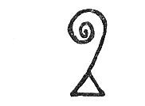 | TAUMA                                                                                                                                                                                                                                                                                |
|  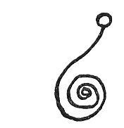 | RAU                                                                                                                                                                                                                                                                                  |
|   | MAMMAU                                                                                                                                                                                                                                                                               |
|   | RAMDA                                                                                                                                                                                                                                                                                |
|  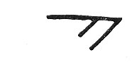 | LENN-YAH                                                                                                                                                                                                                                                                             |
|  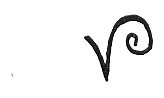 | MU-NATAI                                                                                                                                                                                                                                                                             |
|   | KAAR-MU-DUM                                                                                                                                                                                                                                                                          |
|  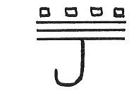 | MEXEL-TAUX-MANILIL                                                                                                                                                                                                                                                                   |
| p. 83                 |                                                                                                                                                                                                                                                                                      |
|  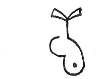 | MASU-RA                                                                                                                                                                                                                                                                              |
|  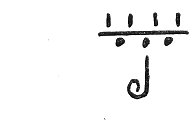 | MEXEL-MANU-VEC                                                                                                                                                                                                                                                                       |
|  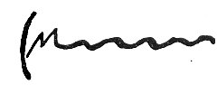 | RAGDA-MUNLIL                                                                                                                                                                                                                                                                         |
|  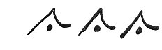 | JOSH-TAU-MAXIM                                                                                                                                                                                                                                                                       |
|  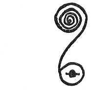 | MESMAI                                                                                                                                                                                                                                                                               |
|  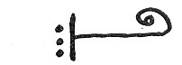 | LENNA (Protruding tongue symbols).                                                                                                                                                                                                                                                   |
|  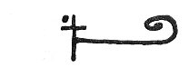 | LENISH                                                                                                                                                                                                                                                                               |
|  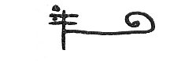 | LENMAL                                                                                                                                                                                                                                                                               |
| p. 84                 |                                                                                                                                                                                                                                                                                      |
|  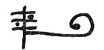 | LENVA                                                                                                                                                                                                                                                                                |
|  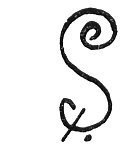 | SHOSH (Snake-form symbols).                                                                                                                                                                                                                                                          |
|  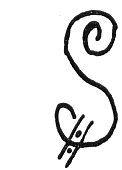 | SHAP                                                                                                                                                                                                                                                                                 |
|  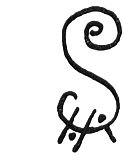 | SHOP’H                                                                                                                                                                                                                                                                               |
|  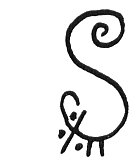 | SHEN’LIL                                                                                                                                                                                                                                                                             |
|  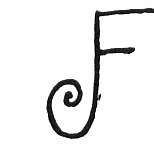 | FAMMA (Arms-forward symbols).                                                                                                                                                                                                                                                        |
| p. 85                 |                                                                                                                                                                                                                                                                                      |
|  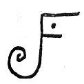 | FAMMIL                                                                                                                                                                                                                                                                               |
|  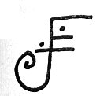 | FAMMNAL                                                                                                                                                                                                                                                                              |
|  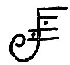 | FAMMOSH                                                                                                                                                                                                                                                                              |
|  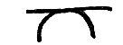 | ASAP’H (Civilization on world sphere).                                                                                                                                                                                                                                               |
|  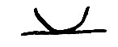 | ASAP’H-UN (Civilization under world sphere).                                                                                                                                                                                                                                         |
|  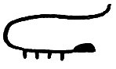 | SART-MUNDAI                                                                                                                                                                                                                                                                          |
|  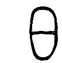 | EDEN-MAI (This could be the symbol for the division in the Garden of Eden).                                                                                                                                                                                                          |
|  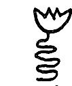 | XEN’PH-MAU                                                                                                                                                                                                                                                                           |
|  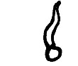 | MAX-MAL-KISH-ROK TAU-MUN                                                                                                                                                                                                                                                             |
| p. 86                 |                                                                                                                                                                                                                                                                                      |
|  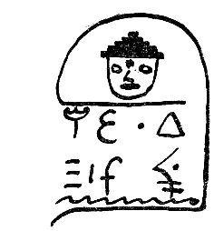 | (Signature of a person).                                                                                                                                                                                                                                                             |
|  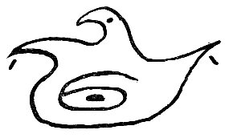 | AGASSI-PAN-AGASSI-MALDEC-TOM-MU (There is reference here to the planet Maldek (c) and to the Motherland of Lemuria. (Mu).                                                                                                                                                            |
|   | EXTEL-HAI                                                                                                                                                                                                                                                                            |
|  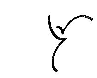 | UR                                                                                                                                                                                                                                                                                   |
|  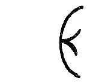 | EIL                                                                                                                                                                                                                                                                                  |
|   | MUS                                                                                                                                                                                                                                                                                  |
| p. 87                 |                                                                                                                                                                                                                                                                                      |
|  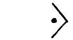 | NA’SHI                                                                                                                                                                                                                                                                               |
|  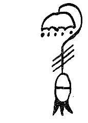 | SHUK-TUM-MU (Lemuria, Mu, mentioned again).                                                                                                                                                                                                                                          |
|  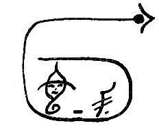 | (Signature of a person).                                                                                                                                                                                                                                                             |
|  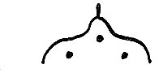 | RAGIF-KONT-VA                                                                                                                                                                                                                                                                        |
|  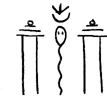 | MEGAL-MEX-MAL                                                                                                                                                                                                                                                                        |
|  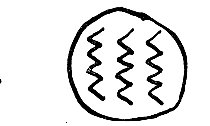 | UDAI-HUN-DALAI                                                                                                                                                                                                                                                                       |
| p. 88                 |                                                                                                                                                                                                                                                                                      |
|  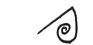 | ENLIL                                                                                                                                                                                                                                                                                |
|  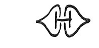 | KAL-MU-KAL                                                                                                                                                                                                                                                                           |
|   | ISO-TOK-MAL                                                                                                                                                                                                                                                                          |
|  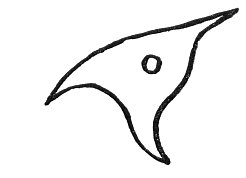 | LESH-TAL                                                                                                                                                                                                                                                                             |
|  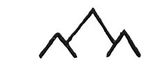 | PITASH-ROK (Evidently identical with Pitach-Rhok, mountains of Poseid or Atlantis.                                                                                                                                                                                                   |
|  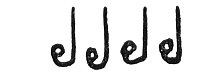 | IMELEX                                                                                                                                                                                                                                                                               |
|   | UR-MUN ZELPH                                                                                                                                                                                                                                                                         |
|  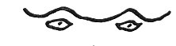 | SHAM-TOK-MARU (The eight-pointed star is the "Star of Baptism" or "Regeneration.")                                                                                                                                                                                                   |
| p. 89                 |                                                                                                                                                                                                                                                                                      |
|   | MEP’TH-MAU                                                                                                                                                                                                                                                                           |
|   | MEP                                                                                                                                                                                                                                                                                  |
|   | MEP’TH                                                                                                                                                                                                                                                                               |
|  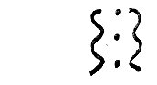 | NAAG                                                                                                                                                                                                                                                                                 |
|  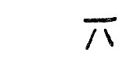 | TESH                                                                                                                                                                                                                                                                                 |
|  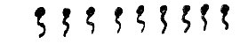 | ELHIM-NAZ                                                                                                                                                                                                                                                                            |
|  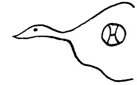 | RAGGA-DAHL                                                                                                                                                                                                                                                                           |
|   | REG-MAHL (The Four Great Primary Forces contained within the Universe, which, in turn, is within the hand of God).                                                                                                                                                                   |
|   | VIZ                                                                                                                                                                                                                                                                                  |
|   | MARN                                                                                                                                                                                                                                                                                 |
| p. 90                 |                                                                                                                                                                                                                                                                                      |
|   | MARF                                                                                                                                                                                                                                                                                 |
|   | MAR-TOK-MARU                                                                                                                                                                                                                                                                         |
|   | MAR-TOK-KAL                                                                                                                                                                                                                                                                          |
|   | MAR-TOK (The "shadowed" left eye shows that this individual does not have spiritual perception).                                                                                                                                                                                     |
|   | TEC-LACMAL                                                                                                                                                                                                                                                                           |
|   | RAP’H                                                                                                                                                                                                                                                                                |
|   | ERMON                                                                                                                                                                                                                                                                                |
| p. 91                 |                                                                                                                                                                                                                                                                                      |
|   | PHAMMON (A highly developed individual displaying many accomplishments. The "shadowed" mouth shows that his tongue speaks no evil).                                                                                                                                                  |
|   | PHLIL                                                                                                                                                                                                                                                                                |
|   | PHLAN                                                                                                                                                                                                                                                                                |
|   | URNA ("U" or Urn-shaped symbols).                                                                                                                                                                                                                                                    |
|   | URNAS                                                                                                                                                                                                                                                                                |
|   | URNAN                                                                                                                                                                                                                                                                                |
|   | URNEP’H                                                                                                                                                                                                                                                                              |
| p. 92                 |                                                                                                                                                                                                                                                                                      |
|   | SHEO-SHEOI (To the apples we salt we return).                                                                                                                                                                                                                                        |
|   | AKASH (Memory of other lives. Similar to Akasa in the Sanskrit, one of the five elements of the Sankhya philosophy, identified as space, ether, or sky. Devotees who gaze upward until stiffening muscles prevent change of facial position are termed Akas-Mukhi, or "sky-facers"). |
|   | PLAMMA (Past lives remembered by memory stirred through dreams).                                                                                                                                                                                                                     |
|   | PLAMMA (New experiences discovered in dreams. "Plamma" means forces active at night).                                                                                                                                                                                                |
|   | ARAMMA (Force or forces aiding progression upward; the road to ever-expanding grandeur).                                                                                                                                                                                             |

p. 93

Much of the foregoing symbolism is similar to the ancient scroll writing
of the Atlanteans. Every written thought in Atlantis was a challenge to
the reader's mental development and a great variety of translations
could be given to the same scrolled copy. The scroll form was used
because it is symbolic of evolution, it is ever expanding.

Atlantis, however, used a modified form of the original Solex-Mal. So we
would expect to find great similarities if not exact duplications in
some cases.

Actually, there is nothing new under the sun; the New Age will not
really be "new" at all--we are only returning to that status which we
lost millennia ago.

In St. James 3:10, we find: "Out of the same mouth proceedeth blessing
and cursing. My brethren, these things ought not so to be."

Poisonous insects were often used in ancient times to symbolize the
deadly power of the human tongue--and it was an accurate portrayal. But
in the near future blessing and cursing will not proceed out of the same
mouth; the mouth that insists on cursing will be sealed up, but the
mouth which blesses will be the mouth that tastes of the fruit of things
promised.

Aphorismic statement was one of the favorite methods of instruction used
in the Pythagorean university of Crotona. One aphorism says: "Govern
your tongue before all other things, following the gods."

p. 94

Just as science and religion will be one, so will all language be *one
language*: the evil tongue will be silent and the wise tongue will
rejoice; we shall "follow the gods", for this is the promise of OTHER
TONGUES!

------------------------------------------------------------------------

[Next: Chapter 2. Tracks on the Desert](otof09.md)
