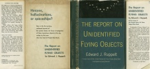
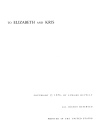

  
[Intangible Textual Heritage](../../index)  [UFOs](../index) 
[Index](index)  [Next](rufo01) 

------------------------------------------------------------------------

[Buy this Book at
Amazon.com](https://www.amazon.com/exec/obidos/ASIN/1605970301/internetsacredte)

------------------------------------------------------------------------

  
*The Report on Unidentified Flying Objects*, by Edward J. Ruppelt,
\[1956\], at Intangible Textual Heritage

------------------------------------------------------------------------

# The Report on Unidentified Flying Objects

## by Edward J. Ruppelt,

###### Former head of the United States Air Force Project Blue Book

#### DOUBLEDAY & COMPANY

#### Garden City, New York

#### \[1956\]

Scanned, proofed and formatted at Intangible Textual Heritage, May 2008.
This text is in the public domain in the US because the copyright on
this book was not renewed in a timely fashion.

TO ELIZABETH AND KRIS

 
[  
Click to enlarge](img/jacket.jpg)  
Jacket  

  [  
Click to enlarge](img/title.jpg)  
Title Page  

 
[  
Click to enlarge](img/verso.jpg)  
Verso  

  [  
Click to enlarge](img/rrsrch.jpg)  
Registration and Renewal Report from Thompson Compumark on the Copyright
Status of this work  

Flap Text

"Unidentified Flying Objects"—exactly what are they? Are they
interplanetary spaceships manned by intelligent beings? Or is the whole
UFO business just a mass of hoaxes, hallucinations, and readily
explained natural phenomena?

This is the first serious book about UFOs to be written by anyone
actively connected with the official investigation of these phenomena.
As chief of the Air Force project assigned to the investigation and
analysis of UFOs, Mr. Ruppelt and his staff studied over 4,500 reports
and discussed them with everyone from out-and-out crackpots to top-level
scientists and generals.

All reports received were subjected to military intelligence analysis
procedures. Astronomers, physicists, aerodynamic engineers, and
psychologists were consulted in the course of the Air Force's exhaustive
investigations.

(Continued on back flap)

(Continued from front flap)

The official Air Technical Intelligence Center reports of their
findings, many details from which are revealed for the first time in
this book, contain some completely baffling detailed accounts of UFO
sightings by thoroughly reliable witnesses.

Here are the complete official accounts of the classic cases—the Lubbock
Lights, the Utah Movies, the Florida Scoutmaster, the Washington
Sightings—as well as a wealth of less-publicized but equally amazing
incidents.

While others who have written books and articles on UFOs imply that they
were conferring with officials in the inner sanctum, Mr. Ruppelt, as
this fascinating book makes clear, was the inner sanctum.

About the Author

From early 1951 until September 1953, Edward J. Ruppelt was chief of the
United States Air Force's Project Blue Book, an operation of the Air
Technical Intelligence Center. Since 1953 the author has been in close
contact with the present project staff and recently made a trip across
the country to check current developments. Mr. Ruppelt is now a research
engineer for the Northrop Aircraft Company.

JACKET PHOTOGRAPH OF LUBBOCK LIGHTS BY CARL HART, JR.

back of Jacket

Hoaxes,  
hallucinations,  
or spaceships?

Here is the first serious, unbiased account of the United States Air
Force investigation of these mysterious objects in the sky, written by
the man who was head of Project Blue Book.

------------------------------------------------------------------------

[Next: Foreword](rufo01)
