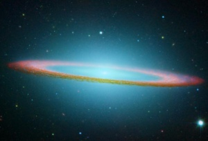

  
[Intangible Textual Heritage](../../index)  [UFOs](../index) 

------------------------------------------------------------------------

[Buy this Book at
Amazon.com](https://www.amazon.com/exec/obidos/ASIN/B0007EHL0Q/internetsacredte)

------------------------------------------------------------------------

<table width="75%">
<colgroup>
<col style="width: 50%" />
<col style="width: 50%" />
</colgroup>
<tbody>
<tr class="odd">
<td width="50%" data-valign="TOP"> 
Sombrero Galaxy [NASA-JPL] (Public Domain Image)</td>
<td width="50%" data-valign="CENTER"><h1 id="the-secret-of-the-saucers" data-align="CENTER">The Secret of the Saucers</h1>
<h2 id="by-orfeo-m.-angelucci" data-align="CENTER">by Orfeo M. Angelucci</h2>
<h2 id="edited-by-ray-palmer" data-align="CENTER">edited by Ray Palmer</h2>
<h4 id="section" data-align="CENTER">[1955]</h4></td>
</tr>
</tbody>
</table>

------------------------------------------------------------------------

[Contents](#contents)    [Start Reading](sos00)    [Page
Index](pageidx)    [Text \[Zipped\]](sostxt.zip)

------------------------------------------------------------------------

|                                                                                                                           |
|---------------------------------------------------------------------------------------------------------------------------|
|  |

This is one of the best contactee accounts of the 1950s. Mr. Angelucci's
Secret of the Saucers is a memoir of a more innocent time, and a tale of
spiritual growth. It was edited by Ray Palmer, the gray eminence behind
FATE magazine, the publisher of the first flying saucer accounts, and
the [Shaver mythos](../irl/index) before that. In fact, Angelucci's name
doesn't appear on the title page, simply Palmer as editor. Angelucci is,
strangely, only listed as a copyright holder.

The well-named 'Orfeo' (see Orpheus and his journey into the underworld)
was, like Shaver, a regular guy, a swing-shift line worker at a Lockheed
factory in southern California. On Friday, May 23, 1952, by this
account, he was strangely drawn to a remote location in Griffith Park;
actually not a bad place to land a UFO in Los Angeles. He was contacted
by an alien entity named 'Neptune.' Later he is taken aboard a
spaceship, gets to visit their paradisiacal home planet by exchanging
bodies with Neptune, meets Jesus, and gets to see the end of the world
(in 1986).

Angelucci (or Palmer?) does some seminal UFO myth-building here. There
was a being named Lucifer who lived on a planet between Mars and
Jupiter. His hubris led to the planet being shattered into the asteroid
belt. Humans were imprisoned on Earth, to work off the karmic debt.
There is a 'prime directive' which prevents the UFO builders from
interfering in Earth's affairs. However, humanity's spiritual evolution
is helped along by extraterrestrial, godlike entities such as Jesus. The
contactee is instructed to spread the UFO builders' message to the world
at large, and only a handful are picked from the multitudes. All of
these themes have become incorporated in one form or another into
various UFO belief systems.

There is a field guide to UFOs at the end with some fascinating details.
The UFOs are grown as a single large crystal with all of the subsystems
intact, and work on some kind of magnetic principle. They have
capabilities such as tractor beams, cloaking devices, and inertial
dampening; the concepts were so fresh in 1955 they didn't even have
names yet. Some are small drones, used for surveillance. Others are huge
motherships.

Among the highlights on earth are a description of the first ever UFO
convention, and a speaking tour that goes horribly wrong. The book makes
a brisk read (again, a hallmark of Palmer), and if you suspend
disbelief, it works as science fiction as well.

--J.B.Hare, Dec. 20, 2007

------------------------------------------------------------------------

 [Title Page](sos00)  
[Contents](sos01)  
[Foreword](sos02)  
[Chapter I. The Disk From Another World](sos03)  
[Chapter II. I Travel in a Flying Saucer](sos04)  
[Chapter III. My Meeting With Neptune](sos05)  
[Chapter IV. “We Can Appear and Function As Earthmen, Orfeo!”](sos06)  
[Chapter V. The Past Is Never Dead!](sos07)  
[Chapter VI. Airplanes Do Disappear!](sos08)  
[Chapter VII. Flying Saucer Convention In Hollywood](sos09)  
[Chapter VIII. My Awakening On Another Planet](sos10)  
[Chapter IX. The Trip East](sos11)  
[Chapter X. Neptune Again and Phenomena in New Jersey](sos12)  
[Chapter XI. I Have a Vision](sos13)  
[Chapter XII. How to Know A Flying Saucer](sos14)  
[Chapter XIII. Structure and Motive Forces of Flying Disks](sos15)  
[Chapter XIV. The True Nature of the Saucer Mystery](sos16)  
