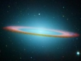

  
[Intangible Textual Heritage](../../index)  [UFOs](../index) 
[Index](index)  [Previous](sos15) 

------------------------------------------------------------------------

[Buy this Book at
Amazon.com](https://www.amazon.com/exec/obidos/ASIN/B0007EHL0Q/internetsacredte)

------------------------------------------------------------------------

  
*The Secret of the Saucers*, by Orfeo M. Angelucci, \[1955\], at
Intangible Textual Heritage

------------------------------------------------------------------------

p. 160

### CHAPTER XIV

### THE TRUE NATURE OF THE SAUCER MYSTERY

Only a short time ago we should have been obliged to go to great lengths
to convince most people of the actual existence of flying saucers.
Today, fortunately, we are spared the indignity of such futile efforts.
The saucers definitely are here, and the majority of persons now are
willing to admit this awesome fact. But the interpretation of flying
saucer phenomena is an entirely different matter. As strange as it
seems, the mystery of the unidentified flying objects is little nearer a
solution than it was in 1947 when several flyers first made reports of
sighting nine of the disks near Seattle.

Since then impressive files of new data have been amassed, but much of
this evidence is so contradictory and bewildering that instead of
offering a solution to the problem, the new facts have only rendered it
more complex. Significantly enough, the most erroneous conceptions have
been ponderously expounded by those whose every thought and utterance is
in slavish conformity with the known laws of physics and the analytical
laboratory method of approach. Insofar as the saucers are concerned, the
"I know it all because I can prove it" attitude, whether uttered or
insinuated, has only indicated

p. 161

with absolute certainty that no infinitesimal part of the true answer is
known.

Today it is almost impossible to ignore the saucers, and those who
attempt to do so are motivated in no small degree by egoistic personal
prejudices. Yet to accept them unreservedly as coming from outer space
is still considered by many to be somehow laughable. Thus have the
saucers become a ready target for jokes and laughter. It is well that
this is so, for a measure of humor is always a safety factor in any
human struggle to new heights of understanding. The coming of the
saucers will ultimately prove one of the most tremendous struggles of
the ages in the evolving consciousness of mankind.

The story of generic man and his history upon Earth presents a
ponderously slow, painful and often bloody pageant of evolution out of
evils inherent in himself. No animal is as cruel as man. The pages of
history are stained with records of deeds motivated by violent
intolerances, vicious hatreds, arrogant lustings for power and wealth,
sadistic cruelties, connivings, treacheries and mass slaughtering of
fellowmen. Thus have we evolved to our present questionable status.

Yet as in the days of the building of the ancient tower of Babel many of
us arrogantly feel that we have attained dizzy pinnacles of wisdom and
scientific "know-how". Whereas, from a cosmic viewpoint, we are but an
innately selfish, warlike species of earthbound grubs who have only
within the last

p. 162

few years become conscious of the boundless universe. Only during the
last fifty years have we learned to build ponderous vehicles that will
fly and explore a tiny way above the surface of our planet. And our
first thoughts are of conquest: conquest of new planets, conquest of the
moon for a space station to police the world. Even as our agile minds
are busy with these thoughts, we continue to plot mutual slaughter of
our own kind.

Even the dulled wings of our imaginations will not permit us to imagine
that intelligent beings who inhabit other planets in the universe may
not have evolved as we did through cruel animalistic natural laws of
survival of the fittest, the cruelest and the most insidiously clever.
Thus with the first reports of the saucers people everywhere considered
with alarm a possible intrusion of space craft from other worlds. We, by
our own standards, expected them to have predatory ideas of conquest and
enslavement of mankind. As a result the flood of horror films of
monstrous extra-terrestrial invaders has not yet ceased.

As a matter of fact, the coming of the saucers is not an intrusion of a
new order on our Earth; neither was it omitted from the original plan of
nature on this planet. The saucer phenomena we have thus far witnessed
is an integral part of a vastly greater plan for us than our finite
minds can begin to comprehend. Thus, the saucers definitely are not to
be feared!

But it would be a terrifying thought to think that

p. 163

we are drifting aimlessly all alone in boundless time and space upon an
insignificant speck of matter we call Earth. In reality, we are not
alone either during our sojourn upon this planet or in the universe. Our
conscious minds, however, are so limited that we base practically all of
our conclusions upon a strictly material foundation. Hence most of our
conclusions are erroneous. But the secret of life we have been unable to
fathom from any material viewpoint. In the final analysis even science
must revert to the abstract idea of a vastly greater intelligence as the
source of life. But having admitted so much, can we believe that this
intelligence has long ago abandoned us here upon our ball of clay? To
many it has seemed so, but only because the erroneous nature of our
conscious minds is incapable of realizing mankind's true condition and
state of being.

It is the will of the Creator that we perfect both our planetary home
and the microcosm of our individual selves. As long as man progresses in
the right direction, no matter how slowly or precariously, he shall
continue to receive greater spiritual insight and a gradual broadening
of material horizons in the fields of science. But each revelation of
the hitherto unknown comes to us bounded by its own mystic shroud.
Slowly these mystic shrouds of matter are expanding as concerns the
macrocosm and ever closing in upon the atom. But as advanced as we like
to think we are, in our present state of consciousness, a revelation of
the true beauty behind

p. 164

all things would shatter our conscious minds. The eternal enigma
"inside" even a humble bacterium enthralls the researcher and holds him
spellbound. Yet, even he cannot behold its true reality!

Thus it is my sincere hope that the factual story I have told you about
my contacts with extra-terrestrial visitors will prove not only a
discovery of the true nature of the beings from out of space and time,
but perhaps the infinitely greater discovery of your own true self and
from whence you came, why you are here, and whither you are bound.

Although my story is given in good faith, some are bound to doubt me.
For man does not trust man because the evil inherent in the human heart
so often betrays him. Yet to many my words will bring greater
understanding and release from the bonds of a prison. My experiences are
interwoven with the truth of man's being as inextricably as strands of
thread are a part of the fabric.

If this very day my story could be proved to every skeptical person, the
mystery of our space visitors would be ended. And we should be ready and
eager to greet them as brothers in the infinite federation of the
universe. But ideas preponderantly spiritual cannot now and have never
been capable of proof by material methods. Hence no material proof of
the reality of my experiences may be given to satisfy skeptics.

First, to remove all possible fear from the idea of space invaders, I
wish to state that in the vast majority of cases those who have
conquered the

p. 165

problems of space travel have progressed to, or have always existed in,
a state of spiritual consciousness which we today can conceive only in
the abstract. For one of the immutable laws of the cosmos is that evil
projected to its limits is self-destroyed; hence too great a
preponderance of evil invariably results in self-destruction and a new
beginning in greater densities of matter. Evolving toward good or evil,
life and brotherhood, all go forth in majesty akin to the glory of the
gods of the ancients. The evolved spiritual intelligences of the planets
communicate only with the graduates of other planets; none others are or
may be aware of their true natures.

Today the evolution of Earth both material and spiritual has reached its
most critical point. Thus chronologically speaking the hour has struck
upon our planet which has not only permitted, but demanded the influx of
outer space entities and their material manifestation in our sphere of
consciousness. They have come as harbingers of light to do everything
possible to turn the tide of destruction which threatens to engulf Earth
and terminate in a new fall for man into greater darkness and bondage in
heavier chains of matter.

In the space being's contacts with me there has actually been some
factual evidence—almost enough to serve as proof, even to materialists.
But not quite enough! The evidence has been minus that same enigmatical
fraction of verification necessary in nearly every instance of saucer
manifestation throughout the world—whether in case of personal

p. 166

experiences or with official branches of certain governments (except in
a few specific cases involving spacecraft of a most primitive type from
which factual and technical data have been obtained, as intended by
them). And herein we find pinpointed a significant clue to the true
nature and mission of space visitors. They have ingeniously enshrouded
their presence in mystery; certainly not because they have any desire to
be mysterious, but only because we are not sufficiently mature to bear
the impact of the full revelation of even the least of our
extraterrestrial visitors. Understanding of them will come eventually,
but only through our own interpretations. Thus will we begin to
understand in terms of our own finite and immature intelligence some of
the mysteries of beings who live in worlds less erroneous than our
three-dimensional, pain-pleasure, suffering-and-death sphere.

In any research, in any revelation, in any miracle when so many
individuals and groups of individuals have witnessed a certain
phenomenon, or some phase of that phenomenon, it is usually sufficient
proof to accept as true the existence of that phenomenon. When this
point is reached the boundaries of understanding usually advance
further. Insofar as the saucers are concerned, we have now reached that
point. Hence, I am now telling my story more completely. Parts of my
story have previously appeared in the single issue of my own newspaper,
*The Twentieth Century Times*, and parts have been published in MYSTIC
magazine, but

p. 167

never before has the entire account appeared in print. Only now has the
mystery of the saucer phenomena come to an apparent dead-end which
requires elucidation before anything further may be gained from
extra-terrestrials. In other words, this book is Earth's answer to their
signals to us. I hope it will produce results.
