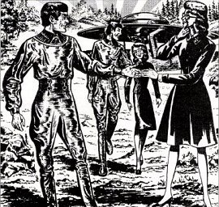

  
[Intangible Textual Heritage](../../index)  [UFOs](../index.md) 

------------------------------------------------------------------------

<table width="75%">
<colgroup>
<col style="width: 50%" />
<col style="width: 50%" />
</colgroup>
<tbody>
<tr class="odd">
<td width="50%" data-valign="TOP"></td>
<td width="50%" data-valign="CENTER"><h1 id="we-met-the-space-people" data-align="CENTER">We Met the Space People</h1>
<h2 id="by-helen-and-betty-mitchell" data-align="CENTER">by Helen and Betty Mitchell</h2>
<h4 id="section" data-align="CENTER">[1959]</h4></td>
</tr>
</tbody>
</table>

------------------------------------------------------------------------

This is a UFO contactee account by two sisters from the Midwest US in
the late 1950s. The Mitchell sisters, Helen and Betty, are approached by
space aliens, who can pass for human beings, in (of all places) a coffee
shop in St. Louis, Missouri. On a second encounter (again in the coffee
shop) they are given a schematic for a communicator, which they build,
and through it they receive messages from the Space People from Mars and
Venus. Unlike the more aggressive aliens of later decades, they wait
until the third date to take Helen on a ride to the mothership. There
she learns that the aliens have one-piece uniforms that 'feel like
satin,' speak a Universal Language, and play a game like shuffleboard
when off-duty.

After Helen returns, the Space People transmit an urgent message that
nuclear weapons testing must be ended, otherwise our civilization will
go the way of Atlantis. One thinks that they would have mentioned this
earlier when she was on the mothership. And why deliver this rather
important message to the Mitchell sisters of Saint Louis, Missouri? Why
not the United Nations or President Eisenhower? Other ideas that the
Space Brothers tell the sisters to spread are vegetarianism and the need
for educational TV. Nuclear test ban? Educational TV? Apparently the
Space People are (gasp) *liberals*.

This yarn was apparently good enough for the Mitchell sisters to make
the rounds of the UFO conventions, although nowadays it would make all
but the most gullible enthusiast laugh out loud. Nonetheless, the naive
charm of this little relic of a simpler time makes it an irresistible
read.

------------------------------------------------------------------------

[Title Page](wmsp00.md)  
[Helen's Story](wmsp01.md)  
[Betty's Account](wmsp02.md)  
