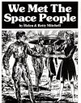

  
[Intangible Textual Heritage](../../index)  [UFOs](../index.md) 
[Index](index)  [Next](wmsp01.md) 

------------------------------------------------------------------------

*We Met the Space People*, by Helen and Betty Mitchell, \[1959\], at
Intangible Textual Heritage

------------------------------------------------------------------------

# We Met The Space People

###### The Story of the Mitchell Sisters

### By Helen & Betty Mitchell

#### Clarksburg, West Virginia

#### Saucerian Books

#### \[1959\]

This text is in the public domain in the United States because it was
not registered or renewed at the US Copyright Office in a timely
fashion, as required by law at the time.

[  
Click to enlarge](img/cover.jpg.md)  
Front Cover  

------------------------------------------------------------------------

[Next: Helen's Story](wmsp01.md)
