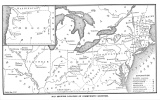

  
[Intangible Textual Heritage](../../index)  [Utopia](../index.md) 
[Index](index)  [Previous](csus02)  [Next](csus04.md) 

------------------------------------------------------------------------

[Buy this Book at
Amazon.com](https://www.amazon.com/exec/obidos/ASIN/0486215806/internetsacredte.md)

------------------------------------------------------------------------

*The Communistic Societies of the United States*, by Charles Nordhoff,
\[1875\], at Intangible Textual Heritage

------------------------------------------------------------------------

p. 9 p. 10 p. 11

### INTRODUCTION

THOUGH it is probable that for a long time to come the mass of mankind
in civilized countries will find it both necessary and advantageous to
labor for wages, and to accept the condition of hired laborers (or, as
it has absurdly become the fashion to say, employees), every thoughtful
and kind-hearted person must regard with interest any device or plan
which promises to enable at least the more intelligent, enterprising,
and determined part of those who are not capitalists to become such, and
to cease to labor for hire.

Nor can any one doubt the great importance, both to the security of the
capitalists, and to the intelligence and happiness of the
non-capitalists (if I may use so awkward a word), of increasing the
number of avenues to independence for the latter. For the character and
conduct of our own population in the United States show conclusively
that nothing so stimulates intelligence in the poor, and at the same
time nothing so well enables them to bear the inconveniences of their
lot, as a reasonable prospect that with industry and economy they may
raise themselves out of the condition of hired laborers into that of
independent employers of their own labor. Take away entirely the grounds
of such a hope, and a great mass of our poorer people would gradually
sink into stupidity, and a blind discontent which education would only
increase, until they became a danger to the state; for the greater their
intelligence, the greater would be the dissatisfaction with their
situation—just as we see that the dissemination of education among the

p. 12

\[paragraph continues\] English
agricultural laborers (by whom, of all classes in Christendom,
independence is least to be hoped for), has lately aroused these
sluggish beings to strikes and a struggle for a change in their
condition.

Hitherto, in the United States, our cheap and fertile lands have acted
as an important safety-valve for the enterprise and discontent of our
non-capitalist population. Every hired workman knows that if he chooses
to use economy and industry in his calling, he may without great or
insurmountable difficulty establish himself in independence on the
public lands; and, in fact, a large proportion of our most energetic and
intelligent mechanics do constantly seek these lands, where with patient
toil they master nature and adverse circumstances, often make fortunate
and honorable careers, and at the worst leave their children in an
improved condition of life. I do not doubt that the eagerness of some of
our wisest public men for the acquisition of new territory has arisen
from their conviction that this opening for the independence of laboring
men was essential to the security of our future as a free and peaceful
state. For, though not one in a hundred, or even one in a thousand of
our poorer and so-called laboring class may choose to actually achieve
independence by taking up and tilling a portion of the public lands, it
is plain that the knowledge that any one may do so makes those who do
not more contented with their lot, which they thus feel to be one of
choice and not of compulsion.

Any circumstance, as the exhaustion of these lands, which should
materially impair this opportunity for independence, would be, I
believe, a serious calamity to our country; and the spirit of the
Trades-Unions and International Societies appears to me peculiarly
mischievous and hateful, because they seek to eliminate from the
thoughts of their adherents the hope or expectation of independence. The
member of a Trades-Union is taught to regard himself, and to act toward
society, as a

p. 13

hireling for life; and these societies are united, not as men seeking a
way to exchange dependence for independence, but as hirelings,
determined to remain such, and only demanding better conditions of their
masters. If it were possible to infuse with this spirit all or the
greater part of the non-capitalist class in the United States, this
would, I believe, be one of the gravest calamities which could befall us
as a nation; for it would degrade the mass of our voters, and make free
government here very difficult, if it did not entirely change the form
of our government, and expose us to lasting disorders and attacks upon
property.

We see already that in whatever part of our country the Trades-Union
leaders have succeeded in imposing themselves upon mining or
manufacturing operatives, the results are the corruption of our
politics, a lowering of the standard of intelligence and independence
among the laborers, and an unreasoning and unreasonable discontent,
which, in its extreme development, despises right, and seeks only
changes degrading to its own class, at the cost of injury and loss to
the general public.

The Trades-Unions and International Clubs have become a formidable power
in the United States and Great Britain, but so far it is a power almost
entirely for evil. They have been able to disorganize labor, and to
alarm capital. They have succeeded, in a comparatively few cases, in
temporarily increasing the wages and in diminishing the hours of labor
in certain branches of industry—a benefit so limited, both as to
duration and amount, that it cannot justly be said to have inured to the
general advantage of the non-capitalist class. On the other hand, they
have debased the character and lowered the moral tone of their
membership by the narrow and cold-blooded selfishness of their spirit
and doctrines, and have thus done an incalculable harm to society; and,
moreover, they have, by alarming capital, lessened the wages fund,
seriously checked

p. 14

enterprise, and thus decreased the general prosperity of their own
class. For it is plain that to no one in society is the abundance of
capital and its free and secure use in all kinds of enterprises so
vitally important as to the laborer for wages—to the Trades-Unionist.

To assert necessary and eternal enmity between labor and capital would
seem to be the extreme of folly in men who have predetermined to remain
laborers for wages all their lives, and who therefore mean to be
peculiarly dependent on capital. Nor are the Unions wiser or more
reasonable toward their fellow-laborers; for each Union aims, by
limiting the number of apprentices a master may take, and by other
equally selfish regulations, to protect its own members against
competition, forgetting apparently that if you prevent men from becoming
bricklayers, a greater number must seek to become carpenters; and that
thus, by its exclusive policy, a Union only plays what Western gamblers
call a "cut-throat game" with the general laboring population. For if
the system of Unions were perfect, and each were able to enforce its
policy of exclusion, a great mass of poor creatures, driven from every
desirable employment, would be forced to crowd into the lowest and least
paid. I do not know where one could find so much ignorance, contempt for
established principles, and cold-blooded selfishness, as among the
Trades-Unions and International Societies of the United States and Great
Britain—unless one should go to France. While they retain their present
spirit, they might well take as their motto the brutal and stupid saying
of a French writer, that "Mankind are engaged in a war for bread, in
which every man's hand is at his brother's throat." Directly, they offer
a prize to incapacity and robbery, compelling their ablest members to do
no more than the least able, and spoiling the aggregate wealth of
society by burdensome regulations restricting labor. Logically, to the
Trades-Union leaders the Chicago or Boston fire seemed a more beneficial

p. 15

event than the invention of the steam-engine; for plenty seems to them a
curse, and scarcity the greatest blessing. [\*](#fn_0.md)

p. 16

Any organization which teaches its adherents to accept as inevitable for
themselves and for the mass of a nation the condition of hirelings, and
to conduct their lives on that premise, is not only wrong, but an injury
to the community. Mr. Mill wisely says on this point, in his chapter on
"The Future of the Laboring Classes": "There can be little doubt that
the *status* of hired laborers will gradually tend to confine itself to
the description of work-people whose low moral qualities render them
unfit for any thing more independent; and that the relation of masters
and work-people will be gradually superseded by partnership in one of
two forms: in some cases, association of the laborers with the
capitalist; in others, and perhaps finally in all, association of
laborers among themselves." I imagine that the change he speaks of will
be very slow and gradual; but it is important that all doors shall be
left open for it, and Trades-Unions would close every door.

Professor Cairnes, in his recent contribution to Political Economy, goes
further even than Mr. Mill, and argues that a change of this nature is
inevitable. He remarks: "The modifications which occur in the
distribution of capital among its several departments, as nations
advance, are by no means fortuitous, but follow on the whole a
well-defined course, and move toward a determinate goal. In effect, what
we find is a constant growth of the national capital, accompanied with a
nearly equally constant decline in the proportion of this capital which
goes to support productive labor.... Though the fund for the
remuneration of mere labor, whether skilled or unskilled, must, so long
as industry is progressive, ever bear a

p. 17

constantly diminishing proportion alike to the growing wealth and
growing capital, there is nothing in the nature of things which
restricts the laboring population to this fund for their support. In
return, indeed, for their mere labor, it is to this that they must look
for their sole reward; but *they may help production otherwise than by
their labor: they may save, and thus become themselves the owners of
capital;* and profits may thus be brought to aid the wages-fund." [\*](#fn_1.md)

Aside from systematized emigration to unsettled or thinly peopled
regions, which the Trades-Unions of Europe ought to organize on a great
scale, but which they have entirely neglected, the other outlets for the
mass of dissatisfied hand-laborers lie through co-operative or
communistic efforts. Co-operative societies flourish in England and
Germany. We have had a number of them in this country also, but their
success has not been marked; and I have found it impossible to get
statistical returns even of their numbers. If the Trades-Unions had used
a tenth of the money they have wasted in futile efforts to shorten hours
of labor and excite their members to hatred, indolence, and waste, in
making public the statistics and the possibilities of co-operation, they
would have achieved some positive good.

But while co-operative efforts have generally failed in the United
States, we have here a number of successful Communistic Societies,
pursuing agriculture and different branches of manufacturing, and I have
thought it useful to examine these, to see if their experience offers
any useful hints toward the solution of the labor question. Hitherto
very little, indeed almost nothing definite and precise, has been made
known concerning these societies; and Communism remains loudly but very
vaguely spoken of, by friends as well as enemies, and is commonly a word
either of terror or of contempt in the public prints.

p. 18

In the following pages will be found, accordingly, an account of the
COMMUNISTIC SOCIETIES now existing in the United States, made from
personal visit and careful examination; and including for each its
social customs and expedients; its practical and business methods; its
system of government; the industries it pursues; its religious creed and
practices; as well as its present numbers and condition, and its
history.

It appears to me an important fact that these societies, composed for
the most part of men originally farmers or mechanics—people of very
limited means and education—have yet succeeded in accumulating
considerable wealth, and at any rate a satisfactory provision for their
own old age and disability, and for the education of their children or
successors. In every case they have developed among their membership
very remarkable business ability, considering their original station in
life; they have found among themselves leaders wise enough to rule, and
skill sufficient to enable them to establish and carry on, not merely
agricultural operations, but also manufactures, and to conduct
successfully complicated business affairs.

Some of these societies have existed fifty, some twenty-five, and some
for nearly eighty years. All began with small means; and some are now
very wealthy. Moreover, while some of these communes are still living
under the guidance of their founders, others, equally successful, have
continued to prosper for many years after the death of their original
leaders. Some are celibate; but others inculcate, or at least permit
marriage. Some gather their members into a common or "unitary" dwelling;
but others, with no less success, maintain the family relation and the
separate household.

It seemed to me that the conditions of success vary sufficiently among
these societies to make their histories at least interesting, and
perhaps important. I was curious, too, to ascertain if their success
depended upon obscure conditions, not generally

p. 19

attainable, as extraordinary ability in a leader; or undesirable, as
religious fanaticism or an unnatural relation of the sexes; or whether
it might not appear that the conditions absolutely necessary to success
were only such as any company of carefully selected and reasonably
determined men and women might hope to command.

I desired also to discover how the successful Communists had met and
overcome the difficulties of idleness, selfishness, and unthrift in
individuals, which are commonly believed to make Communism impossible,
and which are well summed up in the following passage in Mr. Mill's
chapter on Communism:

"The objection ordinarily made to a system of community of property and
equal distribution of the produce, that each person would be incessantly
occupied in evading his fair share of the work, points, undoubtedly, to
a real difficulty. But those who urge this objection forget to how great
an extent the same difficulty exists under the system on which nine
tenths of the business of society is now conducted. The objection
supposes that honest and efficient labor is only to be had from those
who are themselves individually to reap the benefit of their own
exertions. But how small a part of all the labor performed in England,
from the lowest paid to the highest, is done by persons working for
their own benefit. From the Irish reaper or hodman to the chief justice
or the minister of state, nearly all the work of society is remunerated
by day wages or fixed salaries. A factory operative has less personal
interest in his work than a member of a Communist association, since he
is not, like him, working for a partnership of which he is himself a
member. It will no doubt be said that, though the laborers themselves
have not, in most cases, a personal interest in their work, they are
watched and superintended, and their labor directed, and the mental part
of the labor performed, by persons who have. Even this, however, is far
from being universally the fact. In all public, and many of the largest
and most successful private undertakings, not only the labors of detail,
but the control and superintendence are entrusted to salaried officers.
And though the 'master's eye,' when the master is vigilant and
intelligent, is of proverbial value, it must be remembered that in a
Socialist farm or manufactory, each laborer would be under the eye, not
of one master, but of the whole

p. 20

community. In the extreme case of obstinate perseverance in not
performing the due share of work, the community would have the same
resources which society now has for compelling conformity to the
necessary conditions of the association. Dismissal, the only remedy at
present, is no remedy when any other laborer who may be engaged does no
better than his predecessor: the power of dismissal only enables an
employer to obtain from his workmen the customary amount of labor, but
that customary labor may be of any degree of inefficiency. Even the
laborer who loses his employment by idleness or negligence has nothing
worse to suffer, in the most unfavorable case, than the discipline of a
workhouse, and if the desire to avoid this be a sufficient motive in the
one system, it would be sufficient in the other. I am not undervaluing
the strength of the incitement given to labor when the whole or a large
share of the benefit of extra exertion belongs to the laborer. But under
the present system of industry this incitement, in the great majority of
cases, does not exist. If communistic labor might be less vigorous than
that of a peasant proprietor, or a workman laboring on his own account,
it would probably be more energetic than that of a laborer for hire, who
has no personal interest in the matter at all. The neglect by the
uneducated classes of laborers for hire of the duties which they engage
to perform is in the present state of society most flagrant. Now it is
an admitted condition of the communist scheme that all shall be
educated; and this being supposed, the duties of the members of the
association would doubtless be as diligently performed as those of the
generality of salaried officers in the middle or higher classes; who are
not supposed to be necessarily unfaithful to their trust, because so
long as they are not dismissed their pay is the same in however lax a
manner their duty is fulfilled. Undoubtedly, as a general rule,
remuneration by fixed salaries does not in any class of functionaries
produce the maximum of zeal; and this is as much as can be reasonably
alleged against communistic labor.

"That even this inferiority would necessarily exist is by no means so
certain as is assumed by those who are little used to carry their minds
beyond the state of things with which they are familiar....

"Another of the objections to Communism is similar to that so often
urged against poor-laws: that if every member of the community were
assured of subsistence for himself and any number of children, on the
sole condition of willingness to work, prudential restraint on the
multiplication of mankind would be at an end, and population would start
forward at a rate which would reduce the community through successive

p. 21

stages of increasing discomfort to actual starvation. There would
certainly be much ground for this apprehension if Communism provided no
motives to restraint, equivalent to those which it would take away. But
Communism is precisely the state of things in which opinion might be
expected to declare itself with greatest intensity against this kind of
selfish intemperance. Any augmentation of numbers which diminished the
comfort or increased the toil of the mass would then cause (which now it
does not) immediate and unmistakable inconvenience to every individual
in the association—inconvenience which could not then be imputed to the
avarice of employers or the unjust privileges of the rich. In such
altered circumstances opinion could not fail to reprobate, and if
reprobation did not suffice, to repress by penalties of some
description, this or any other culpable self-indulgence at the expense
of the community. The communistic scheme, instead of being peculiarly
open to the objection drawn from danger of over-population, has the
recommendation of tending in an especial degree to the prevention of
that evil."

It will be seen in the following pages that means have been found to
meet these and other difficulties; in one society even the prudential
restraint upon marriage has been adopted.

Finally, I wished to see what the successful Communists had made of
their lives; what was the effect of communal living upon the character
of the individual man and woman; whether the life had broadened or
narrowed them; and whether assured fortune and pecuniary independence
had brought to them a desire for beauty of surroundings and broader
intelligence: whether, in brief, the Communist had any where become
something more than a comfortable and independent day-laborer, and
aspired to something higher than a mere bread-and-butter existence.

To make my observations I was obliged to travel from Maine in the
northeast to Kentucky in the south, and Oregon in the west. I have
thought it best to give at first an impartial and not unfriendly account
of each commune, or organized system of communes; and in several
concluding chapters I have analyzed and compared their different customs
and practices, and

p. 22

attempted to state what, upon the facts presented, seem to be the
conditions absolutely requisite to the successful conduct of a
communistic society, and also what appear to be the influences, for good
and evil, of such bodies upon their members and upon their neighbors.

I have added some particulars of the Swedish Commune which lately
existed at Bishop Hill, in Illinois, but which, after a flourishing
career of seven years, has now become extinct; and I did this to show,
in a single example, what are the causes which work against harmony and
success in such a society.

Also I have given some particulars concerning three examples of
colonization, which, though they do not properly belong to my subject,
are yet important, as showing what may be accomplished by co-operative
efforts in agriculture, under prudent management.

It is, I suppose, hardly necessary to say that, while I have given an
impartial and respectful account of the religious faith of each commune,
I am not therefore to be supposed to hold with any of them. For
instance, I thought it interesting to give some space to the very
singular phenomena called "spiritual manifestations" among the Shakers;
but I am not what is commonly called a "Spiritualist."

[  
Click to enlarge](img/map.jpg.md)  
Map Showing Location of Communistic Societies  

------------------------------------------------------------------------

### Footnotes

[15:\*](csus03.htm#fr_0.md) Lest I should to some
readers appear to use too strong language, I append here a few passages
from a recent English work, Mr. Thornton's book "On Labor," where he
gives an account of some of the regulations of English Trades-Unions:

"A journeyman is not permitted to teach his own son his own trade, nor,
if the lad managed to learn the trade by stealth, would he be permitted
to practice it. A master, desiring out of charity to take as apprentice
one of the eight destitute orphans of a widowed mother, has been told by
his men that if he did they would strike. A bricklayer's assistant who
by looking on has learned to lay bricks as well as his principal, is
generally doomed, nevertheless, to continue a laborer for life. He will
never rise to the rank of a bricklayer, if those who have already
attained that dignity can help it."

"Some Unions divide the country round them into districts, and will not
permit the products of the trades controlled by them to be used except
within the district in which they have been fabricated.... At Manchester
this combination is particularly effective, preventing any bricks made
beyond a radius of four miles from entering the city. To enforce the
exclusion, paid agents are employed; every cart of bricks coming toward
Manchester is watched, and if the contents be found to have come from
without the prescribed boundary the bricklayers at once refuse to
work.... The vagaries of the Lancashire brick makers are fairly
paralleled by the masons of the same county. Stone, when freshly
quarried, is softer, and can be more easily cut than later: men
habitually employed about any particular quarry better understand the
working of its particular stone than men from a distance; there is great
economy, too, in transporting stone dressed instead of in rough blocks.
The Yorkshire masons, however, will not allow Yorkshire stone to be
brought into their district if worked on more than one side. All the
rest of the working, the edging and jointing, they insist on doing
themselves, though they thereby add thirty-five per cent, to its
price.... A Bradford contractor, requiring for a staircase some steps of
hard delf-stone, a material which Bradford masons so much dislike that
they often refuse employment rather than undertake it, got the steps
worked at the quarry. But when they arrived ready for setting, his
masons insisted on their being worked over again, at an expense of from
5s. to 10s. per step. A master-mason at Ashton obtained some stone ready
polished from a quarry near Macclesfield. His men, however, in obedience
to the rules of their club, refused to fix it until the polished part
had been defaced and they had polished it again by hand, though not so
well as at first.... In one or two of the northern counties, the
associated plasterers and associated plasterers' laborers have come to
an understanding, according to which the latter are to abstain from all
plasterers' work except simple whitewashing; and the plasterers in
return are to do nothing except pure plasterers' work, that the laborers
would like to do for them, insomuch that if a plasterer wants laths or
plaster to go on with, he must not go and fetch them himself, but must
send a laborer for them. In consequence of this agreement, a Mr. Booth,
of Bolton, having sent one of his plasterers to bed and point a dozen
windows, had to place a laborer with him during the whole of the four
days he was engaged on the job, though any body could have brought him
all p. 16 he required in half a day.... At
Liverpool, a bricklayer's laborer may legally carry as many as twelve
bricks at a time. Elsewhere ten is the greatest number allowed. But at
Leeds 'any brother in the Union professing to carry more than the common
number, which is eight bricks, shall be fined 1*s*.'; and any brother
'knowing the same without giving the earliest information thereof to the
committee of management shall be fined the same.'... During the building
of the Manchester Law Courts, the bricklayers' laborers struck because
they were desired to wheel bricks instead of carrying them on their
shoulders."

[17:\*](csus03.htm#fr_1.md) "Some Leading Principles
of Political Economy Newly Expounded." By J. E. Cairnes, M.A. New York,
Harper & Brothers.

------------------------------------------------------------------------

[Next: I. Introduction](csus04.md)
