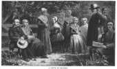
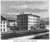
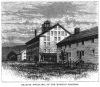

  
[Intangible Textual Heritage](../../index)  [Utopia](../index.md) 
[Index](index)  [Previous](csus13)  [Next](csus15.md) 

------------------------------------------------------------------------

[Buy this Book at
Amazon.com](https://www.amazon.com/exec/obidos/ASIN/0486215806/internetsacredte.md)

------------------------------------------------------------------------

*The Communistic Societies of the United States*, by Charles Nordhoff,
\[1875\], at Intangible Textual Heritage

------------------------------------------------------------------------

#### II.—"MOTHER ANN."

The "Millennial Church, or United Society of Believers, commonly called
Shakers," was formally organized at New Lebanon, a village in Columbia
County, New York, in September, 1787, three years after the death of Ann
Lee, whose followers they profess themselves, and whom they revere as
the second appearance of Christ upon this earth, holding that Christ
appeared first in the body of Jesus.

Ann Lee, according to the account of her accepted among and published by
the Shakers, was an English woman, born of humble parents in Manchester,
February 29th, 1736. Her father was a blacksmith; she was one of eight
children; in her

[  
Click to enlarge](img/11800.jpg.md)  
A GROUP OF SHAKERS.  

p. 119

[  
Click to enlarge](img/11900.jpg.md)  
SHAKER DWELLING—MOUNT LEBANON  

[  
Click to enlarge](img/11901.jpg.md)  
GRANITE DWELLING, OF THE ENFIELD SHAKERS  

childhood she was employed in a cotton factory, and later as a cutter of
hatters’ fur. She was also at one time cook in a Manchester infirmary;
and to the day of her death she could neither read nor write.

About the year 1747, some members of the Society of Quakers, under the
influence of a religious revival, formed themselves into a society, at
the head of which was a pious couple, Jane and James Wardley. To these
people Ann Lee and her parents joined themselves in 1758, Ann being then
twenty-three years of age and unmarried. These people suffered
persecution from the ungodly, and some of them were even cast into
prison, on account of certain unusual and violent manifestations of
religious fervor, which caused them to receive the name of "Shaking
Quakers;" and it was while Ann Lee thus lay in jail, in the summer of
1770, that "by a special manifestation of divine light the present
testimony of salvation and eternal life was fully revealed to her," and
by her to the society, "by whom she from that time was acknowledged as
*mother* in Christ, and by them was called *Mother Ann*." [\*](#fn_3.md)

She saw the Lord Jesus Christ in his glory, who revealed to her the
great object of her prayers, and fully satisfied all the desires of her
soul. The most astonishing visions and divine manifestations were
presented to her view in so clear and striking a manner that the whole
spiritual world seemed displayed before her. In these extraordinary
manifestations she had a full and clear view of the mystery of iniquity,
of the root and foundation of human depravity, and of the very act of
transgression committed by the first man and woman in the garden of
Eden. Here she saw whence and wherein all mankind were lost from God,
and clearly realized the only possible way of recovery." [†](#fn_4.md) "By the immediate revelation

p. 120

of Christ, she henceforth bore an open testimony against the lustful
gratifications of the flesh as the source and foundation of human
corruption; and testified, in the most plain and pointed manner, that no
soul could follow Christ in the regeneration while living in the works
of natural generation, or in any of the gratifications of lust." [\*](#fn_5.md)

In a volume of "Hymns and Poems for the Use of Believers" (Watervliet,
Ohio, 1833), Adam is made to confess the nature of his transgression and
the cause of his fall, in a dialogue with his children:

  "*First Adam being dead, yet speaketh, in a dialogue with his
children*.

  "*Children*. First Father Adam, where art thou?  
  With all thy num'rous fallen race;  
  We must demand an answer now,  
  For time hath stript our hiding-place.  
  Wast thou in nature made upright—  
  Fashion'd and plac'd in open light?

  "*Adam*. Yea truly I was made upright:  
  This truth I never have deni'd,  
  And while I liv'd I lov'd the light,  
  But I transgress'd and then I died.  
  Ye've heard that I transgress'd and fell—  
  This ye have heard your fathers tell.

  "*Ch*. Pray tell us how this sin took place—  
  This myst'ry we could never scan,  
  That sin has sunk the human race,  
  And all brought in by the first man.  
  'Tis said this is our heavy curse—  
  Thy sin imputed unto us.

  "*Ad*. When I was plac'd on Eden's soil,  
  I liv'd by keeping God's commands—  
  To keep the garden all the while,  
  And labor, working with my hands.  
  I need not toil beyond my pow'r,  
  Yet never waste one precious hour. p. 121

  "But in a careless, idle frame,  
  I gazed about on what was made:  
  And idle hands will gather shame,  
  And wand'ring eyes confuse the head:  
  I dropp'd my hoe and pruning-knife,  
  To view the beauties of my wife.

  "An idle beast of highest rank  
  Came creeping up just at that time,  
  And show'd to Eve a curious prank,  
  Affirming that it was no crime:—  
  'Ye shall not die as God hath said—  
  'Tis all a sham, be not afraid.'

  "All this was pleasant to the eye,  
  And Eve affirm'd the fruit was good;  
  So I gave up to gratify  
  The meanest passion in my blood.  
  O horrid guilt! I was afraid:  
  I was condemn'd, yea I was dead.

  "Here ends the life of the first man,  
  Your father and his spotless bride;  
  God will be true, his word must stand—  
  The day I sinn'd that day I died:  
  This was my sin, this was my fall!—  
  This your condition, one and all.

  "*Ch*. How can these fearful things agree  
  With what we read in sacred writ—  
  That sons and daughters sprung from thee,  
  Endu'd with wisdom, power, and wit;  
  And all the nations fondly claim  
  Their first existence in thy name?

  "*Ad*. Had you the wisdom of that beast  
  That took my headship by deceit,  
  I could unfold enough at least  
  To prove your lineage all a cheat.  
  Your pedigree you do not know,  
  The SECOND ADAM told you so. p. 122

  "When I with guile was overcome,  
  And fell a victim to the beast,  
  My station first he did assume,  
  Then on the spoil did richly feast.  
  Soon as the life had left my soul,  
  He took possession of the whole.

  "He plunder'd all my mental pow'rs,  
  My visage, stature, speech, and gait;  
  And, in a word, in a few hours,  
  He was first Adam placed in state:  
  He took my wife, he took my name;  
  All but his nature was the same.

  "Now see him hide, and skulk about,  
  Just like a beast, and even worse,  
  Till God in anger drove him out,  
  And doom'd him to an endless curse.  
  O hear the whole creation groan!  
  The Man of Sin has took the throne!

  "Now in my name this beast can plead,  
  How God commanded him at first  
  To multiply his wretched seed,  
  Through the base medium of his lust.  
  O horrid cheat! O subtle plan!  
  A hellish beast assumes the man!

  "This is your father in my name:  
  Your pedigree ye now may know:  
  He early from perdition came,  
  And to perdition he must go.  
  And all his race with him shall share  
  Eternal darkness and despair."

The same theory of the fall [\*](#fn_6.md) is stated
in another hymn:

p. 123

  "We read, when God created man,  
  He made him able then to stand  
  United to his Lord's command  
       That he might be protected;  
  But when, through Eve, he was deceiv'd,  
  And to his wife in lust had cleav'd,  
  And of forbidden fruit receiv'd,  
       He found himself rejected.

  "And thus, we see, death did begin,  
  When Adam first fell into sin,  
  And judgment on himself did bring,  
       Which he could not dissemble:  
  Old Adam then began to plead,  
  And tell the cause as you may read;  
  But from his sin he was not freed,  
       Then he did fear and tremble.

  "Compell'd from Eden now to go,  
  Bound in his sins, with shame and woe,  
  And there to feed on things below—  
       His former situation:  
  For he was taken from the earth,  
  And blest with a superior birth,  
  But, dead in sin, he's driven forth  
       From his blest habitation.

  "Now his lost state continues still,  
  In all who do their fleshly will,  
  And of their lust do take their fill,  
       And say they are commanded:  
  Thus they go forth and multiply,  
  And so they plead to justify  
  Their basest crimes, and so they try  
       To ruin souls more candid."

The "way of regeneration" is opened in another hymn in the same
collection:

p. 124

  "*Victory over the Man of Sin*.

  "Souls that hunger for salvation,  
  And have put their sins away,  
  Now may find a just relation,  
  If they cheerfully obey;  
  They may find the new creation,  
  And may boldly enter in  
  By the door of free salvation,  
  And subdue the Man of Sin.

  "Thus made free from that relation,  
  Which the serpent did begin,  
  Trav'ling in regeneration,  
  Having pow'r to cease from sin;  
  Dead unto a carnal nature,  
  From that tyrant ever free,  
  Singing praise to our Creator,  
  For this blessed jubilee.

  "Sav'd from passions, too inferior  
  To command the human soul;  
  Led by motives most superior,  
  Faith assumes entire control:  
  Joined in the new creation,  
  Living souls in union run,  
  Till they find a just relation  
  To the First-born two in one.

  "But this prize cannot be gained.  
  Neither is salvation found,  
  Till the Man of Sin is chained,  
  And the old deceiver bound.  
  All mankind he has deceived,  
  And still binds them one and all,  
  Save a few who have believed,  
  And obey'd the Gospel call.

  "By a life of self-denial,  
  True obedience and the cross,  
  We may pass the fiery trial,  
  Which does separate the dross. p. 125  
  If we bear our crosses boldly,  
  Watch and ev'ry evil shun,  
  We shall find a body holy,  
  And the tempter overcome.  
  \*    \*    \*    \*    \*    \*

  "By a pois'nous fleshly nature,  
  This dark world has long been led;  
  There can be no passion greater—  
  This must be the serpent's head:  
  On our coast he would be cruising,  
  If by truth he were not bound:  
  But his head has had a bruising,  
  And he's got a deadly wound.

  "And his wounds cannot be healed,  
  Light and truth do now forbid,  
  Since the Gospel has revealed  
  Where his filthy head was hid:  
  With a fig-leaf it was cover'd,  
  Till we brought his deeds to light;  
  By his works he is discover'd,  
  And his head is plain in sight."

It should be said that Ann Lee had married previously to these
manifestations, her husband being Abraham Stanley, like her father, a
blacksmith. By him she had four children, all of whom died in infancy.
It is related that she showed from girlhood a decided repugnance to the
married state, and married only on the long-continued and urgent
persuasion of her friends; and after 1770 she seems to have returned to
her parents.

She and her followers were frequently abused and persecuted; and in 1773
"she was by a direct revelation instructed to repair to America;" and it
is quaintly added that "permission was given for all those of the
society who were able, and who felt any special impressions on their own
minds so to do, to accompany her." [\*](#fn_7.md)
She had announced, says the

p. 126

same authority, that "the second Christian Church would be established
in America; that the colonies would gain their independence; and that
liberty of conscience would be secured to all people, whereby they would
be able to worship God without hinderance or molestation." Accordingly
Ann Lee embarked at Liverpool in May, 1774, eight persons accompanying
her, six men and two women, among them her husband and a brother and
niece. They landed in New York in August; and, after some difficulties
and hardships on account of poverty, finally settled in what appears to
have been then a wilderness, "the woods of Watervliet, near Niskeyuna,
about seven miles northwest of Albany." In the mean time Ann Lee had
supported herself by washing and ironing in New York, and her husband
had misconducted himself so grossly toward her that they finally
separated, he going off with another woman.

At Niskeyuna, Ann Lee and her companions busied themselves in clearing
land and providing for their subsistence. They lived in the woods, and
Ann was their leader and preacher. She foretold to them that the time
was near when they should see a large accession to their numbers; but
they had so long to wait that their hearts sometimes failed them. They
settled at Watervliet in September, 1775, and it was not until 1780
that, by a curious chance, their doctrines were at last brought to the
knowledge of persons inclined to receive them.

In the spring of that year there occurred at New Lebanon a religious
revival, chiefly among the Baptists, who had a church in that
neighborhood. Some of the subjects of this revival wandered off, seeking
light and comfort from strangers, and found the settlement of which Ann
Lee was the chief. Her doctrines, which inculcated rigid self-denial and
repression of the passions, were at once embraced by them; they brought
others to hear Ann Lee's statements, and thus a beginning was at last
made.

p. 127

New Lebanon, where the new converts lived, lies upon the border of
Massachusetts and Connecticut; and into these states, particularly the
first, the new doctrine spread. Ann Lee, now called by her people Mother
Ann, or more often Mother, traveled from place to place, preaching and
advising; in Massachusetts she appears to have remained two years. It is
asserted, too, that she performed miracles at various places, healing
the sick by laying on of hands, and revealing to others their wickedness
and concealed sins. For instance:

"Mary Southwick, of Hancock \[in Massachusetts, where there was a colony
of Ann Lee's followers\], testifies: That about the beginning of August,
1783 (being then in the twenty-first year of her age), she was healed of
a cancer in her mouth, which had been growing two years, and which for
about three weeks had been eating, attended with great pain and a
continual running, and which occasioned great weakness and loss of
appetite.

"That she went one afternoon to see Calvin Harlowe, to get some
assistance; that Mother being at the house, Calvin asked her to look at
it. That she accordingly came to her, and put her finger into her mouth
upon the cancer; at which instant the pain left her, and she was
restored to health, and was never afflicted with it afterward.

"Taken from the mouth of the said Mary Southwick, the 23d day of April,
1808. In presence of Jennet Davis, Rebecca Clarke, Daniel Cogswell,
Daniel Goodrich, and Seth Y. Wells. (Signed) MARY SOUTHWICK."

The volume from which this formal statement is extracted [\*](#fn_8.md) contains a number of similar affidavits,
which show that miraculous powers of healing diseases are claimed to
have been

p. 128

exercised during Ann Lee's life, not only by her, but by her chief
followers, Elder William Lee her brother, John Hocknell, Joseph Markham,
and others.

It does not appear that Ann Lee made any attempts to settle her
followers in colonies or communities, or that she interrupted the family
life, except that she insisted on celibacy. But she seems to have
gathered her followers in congregations, because she from the first
required, as a sign of true repentance and a condition of admission,
that "oral confession of all the sins of the past life, to God, in the
presence of an elder brother," which is still one of the most rigorous
rules of the order.

She is reported to have said: "When I confessed my sins, I labored to
remember the time when and the place where I committed them. And when I
had confessed them \[to Jane and James Wardley, in Manchester\], I cried
to God to know if my confession was accepted; and by crying to God
continually I traveled out of my loss." [\*](#fn_9.md) Also she said: "The first step of obedience
that any of you can take is to confess your sins to God before his
witnesses." "To those who came to confess to her she said: 'If you
confess your sins, you must confess them to God; we are but his
witnesses.' To such as asked her forgiveness, she used to say: 'I can
freely forgive you, and I pray God to forgive you. It is God that
forgives you; I am but your fellow-servant.'" [†](#fn_10.md)

Ann Lee died at Watervliet, N. Y., on the 8th of September, 1784, in the
forty-ninth year of her age.

In the "Summary View of the Millennial Church," as well as in some other
works published by the Shakers, there are recorded details of her life
and conversation, from which one gets the idea that she was a woman of
practical sense, sincerely pious, and humble-minded. She was "rather
below the common stature of woman, thickset but straight, and otherwise

p. 129

well-proportioned and regular in form and feature. Her complexion was
light and fair, and her eyes were blue, but keen and penetrating; her
countenance mild and expressive, but grave and solemn. Her manners were
plain, simple, and easy. She possessed a certain dignity of appearance
that inspired confidence and commanded respect. By many of the world who
saw her without prejudice she was called beautiful; and to her faithful
children she appeared to possess a degree of dignified beauty and
heavenly love which they had never before discovered among
mortals." [\*](#fn_11.md) She never learned to read
or write. Aside from her strictly religious teachings, she appears to
have inculcated upon her followers the practical virtues of honesty,
industry, frugality, charity, and temperance. "Put your hands to work
and give your hearts to God." "You ought never to speak to your children
in a passion; for if you do, you will put devils into them." "Do all
your work as though you had a thousand years to live; and as you would
if you knew you must die to-morrow." "You can never enter the kingdom of
God with hardness against any one, for God is love, and if you love God
you will love one another." "Be diligent with your hands, for godliness
does not lead to idleness." "You ought not to cross your children
unnecessarily, for it makes them ill-natured." To a woman: "You ought to
dress yourself in modest apparel, such as becomes the people of God, and
teach your family to do likewise. You ought to be industrious and
prudent, and not live a sumptuous and gluttonous life, but labor for a
meek and quiet spirit, and see that your family is kept decent and
regular in all their goings forth, that others may see your example of
faith and good works, and acknowledge the work of God in your family."
To some farmers who had gathered at Ashfield, in Massachusetts, in the
winter, to listen to her instructions: "It is now spring

p. 130

of the year, and you have all had the privilege of being taught the way
of God; and now you may all go home and be faithful with your hands.
Every faithful man will go forth and put up his fences in season, and
will plow his ground in season, and put his crops into the ground in
season; and such a man may with confidence look for a blessing."

These are some of the sayings reported of her. They are not remarkable,
except as showing that with her religious enthusiasm she united
practical sense, which gave her doubtless a power over the people with
whom she came in contact, mostly plain farmers and laborers.

Mother Ann was succeeded in her rule over the society, or "Church," as
they preferred to call it, by Elder James Whittaker, one of those who
had come over with her. He was called Father James; and under his
ministry was built, in 1785, "the

|                                                                                |
|--------------------------------------------------------------------------------|
|  |

first house for public worship ever built by the society." He died at
Enfield in July, 1787, less than three years after Mother Ann; and was
succeeded by Joseph Meacham, an American, a native of Connecticut, in
early life a Baptist preacher; and with him was associated Lucy Wright,
as "the first leading character in the female line," as the "Summary"
quaintly expresses it. She was a native of Pittsfield, in Massachusetts.
Joseph Meacham died in 1796, at the age of fifty-four, and it seems that
Lucy Wright then succeeded to the entire administration and "lead of the
society." She died in 1821, at the age of sixty-one.

p. 131

\[paragraph continues\] "During her
administration the several societies in the states of Ohio and Kentucky
were established, and large accessions were made to the Eastern
societies." [\*](#fn_12.md)While Joseph Meacham was
elder, and in the period between 1787 and 1792, eleven societies were
formed, of which two were in New York, four in Massachusetts, two in New
Hampshire, two in Maine, and one in Connecticut.

Meantime, in the first year of this century broke out in Kentucky a
remarkable religious excitement, lasting several years, and attended
with extraordinary and in some cases horrible physical demonstrations.
Camp-meetings were held in different counties, to which people flocked
by thousands; and here men and women, and even small children, fell down
in convulsions, foamed at the mouth and uttered loud cries. "At first
they were taken with an inward throbbing of the heart; then with weeping
and trembling; from that to crying out in apparent agony of soul;
falling down and swooning away, until every appearance of animal life
was suspended, and the person appeared to be in a trance." "They lie as
though they were dead for some time, without pulse or breath, some
longer, some shorter time. Some rise with joy and triumph, others crying
for mercy." "To these encampments the people flocked by hundreds and
thousands—on foot, on horseback, and in wagons and other carriages." At
Cabin Creek, in May, 1801, a "great number fell on the third night; and
to prevent their being trodden under foot by the multitude, they were
collected together and laid out in order in two squares of the
meetinghouse; which, like so many dead corpses, covered a considerable
part of the floor." At Concord, in Bourbon County, in June, 1801, "no
sex or color, class or description, were exempted from the pervading
influence of the Spirit; even from the age of eight months to sixty
years." In August, at Cane Ridge,

p. 132

in Bourbon County, "about twenty thousand people" were gathered; and
"about three thousand" suffered from what was called "the falling
exercise." These brief extracts are from the account of an eye-witness,
and one who believed these manifestations to be of divine origin. [\*](#fn_13.md) The accuracy of McNemar's descriptions is
beyond question. His account is confirmed by other writers of the time.

Hearing of these extraordinary events, the Shakers at New Lebanon sent
out three of their number—John Meacham, Benjamin S. Youngs, and Issachar
Bates—to "open the testimony of salvation to the people, provided they
were in a situation to receive it." They set out on New-Year's day,
1805, and traveled on foot about a thousand miles, through what was then
a sparsely settled country, much of it a wilderness. They made some
converts in Ohio and Kentucky, and were, fortunately for themselves,
violently opposed and in some cases attacked by bigoted or knavish
persons; and with this impetus they were able to found at first five
societies, two in Ohio, two in Kentucky, and one in Indiana. The Indiana
society later removed to Ohio; and two more societies were afterward
formed in Ohio, and one more in New York.

All these societies were founded before the year 1830; and no new ones
have come into existence since then.

Following the doctrines put forth by Ann Lee, and elaborated by her
successors, they hold:

I. That God is a dual person, male and female; that Adam was a dual
person, being created in God's image; and that "the distinction of sex
is eternal, inheres in the soul itself; and that no angels or spirits
exist who are not male and female."

II\. That Christ is a Spirit, and one of the highest, who

p. 133

appeared first in the person of Jesus, representing the male, and later
in the person of Ann Lee, representing the female element in God.

III\. That the religious history of mankind is divided into four cycles,
which are represented also in the spirit world, each having its
appropriate heaven and hell. The first cycle included the
antediluvians—Noah and the faithful going to the first heaven, and the
wicked of that age to the first hell. The second cycle included the Jews
up to the appearance of Jesus; and the second heaven is called Paradise.
The third cycle included all who lived until the appearance of Ann Lee;
Paul being "caught up into the third heaven." The heaven of the fourth
and last dispensation "is now in process of formation," and is to
supersede in time all previous heavens. Jesus, they say, after his
death, descended into the first hell to preach to the souls there
confined; and on his way passed through the second heaven, or Paradise,
where he met the thief crucified with him.

IV\. They hold themselves to be the "Church of the Last Dispensation,"
the true Church of this age; and they believe that the day of judgment,
or "beginning of Christ's kingdom on earth," dates from the
establishment of their Church, and will be completed by its development.

V. They hold that the Pentecostal Church was established on right
principles; that the Christian churches rapidly and fatally fell away
from it; and that the Shakers have returned to this original and perfect
doctrine and practice. They say: "The five most prominent practical
principles of the Pentecost Church were, first, common property; second,
a life of celibacy; third, non-resistance; fourth, a separate and
distinct government; and, fifth, power over physical disease." To all
these but the last they have attained; and the last they confidently
look for, and even now urge that disease is an offense to God, and that
it is in the power of men to be healthful, if they will.

p. 134

VI\. They reject the doctrine of the Trinity, of the bodily
resurrection, and of an atonement for sins. They do not worship either
Jesus or Ann Lee, holding both to be simply elders in the Church, to be
respected and loved.

VII\. They are Spiritualists. "We are thoroughly convinced of spirit
communication and interpositions, spirit guidance and obsession. Our
spiritualism has permitted us to converse, face to face, with
individuals once mortals, some of whom we well knew, and with others
born before the flood." [\*](#fn_14.md) They assert
that the spirits at first labored among them; but that in later times
they have labored among the spirits; and that in the lower heavens there
have been formed numerous Shaker churches. Moreover, "it should be
distinctly understood that special inspired gifts have not ceased, but
still continue among this people." It follows from what is stated above,
that they believe in a "probationary state in the world of spirits."

VIII\. They hold that he only is a true servant of God who lives a
perfectly stainless and sinless life; and they add that to this
perfection of life all their members ought to attain.

IX\. Finally, they hold that their Church, the Inner or Gospel Order, as
they call it, is supported by and has for its complement the world, or,
as they say, the Outer Order. They do not regard marriage and property
as crimes or disorders, but as the emblems of a lower order of society.
And they hold that the world in general, or the Outer Order, will have
the opportunity of purification in the next world as well as here.

In the practical application of this system of religious faith, they
inculcate a celibate life; "honesty and integrity in all

p. 135

words and dealings;" "humanity and kindness to friend and foe;"
diligence in business; prudence, temperance, economy, frugality, "but
not parsimony;" "to keep clear of debt;" "suitable education of
children;" a "united interest in all things," which means community of
goods; suitable employment for all; and a provision for all in sickness,
infirmity, and old age.

------------------------------------------------------------------------

### Footnotes

[119:\*](csus14.htm#fr_3.md) "Shakers' Compendium of
the Origin, History, etc., with Biographies of Ann Lee," etc. By F. W.
Evans, 1859.

[119:†](csus14.htm#fr_4.md) "A Summary View of the
Millennial Church," etc. Albany, 1848.

[120:\*](csus14.htm#fr_5.md) "A Summary View of the
Millennial Church," etc.

[122:\*](csus14.htm#fr_6.md) It is curious that the
Jewish Talmud (according to Eisenmenger) has a somewhat similar
theory—namely, that Eve cohabited with devils for a period of one
hundred and thirty years; and that Cain was not the child of Adam, but
of one of these devils.

[125:\*](csus14.htm#fr_7.md) "Shakers' Compendium."

[127:\*](csus14.htm#fr_8.md) "Testimony of Christ's
Second Appearing," etc. Published by the United Society of Shakers.
Albany, 1856. \[The first edition was printed in 1808.\]

[128:\*](csus14.htm#fr_9.md) "Shakers' Compendium."

[128:†](csus14.htm#fr_10.md) "Summary View," etc.

[129:\*](csus14.htm#fr_11.md) "Summary View."

[131:\*](csus14.htm#fr_12.md) "Shakers'
Compendium."

[132:\*](csus14.htm#fr_13.md) "The Kentucky
Revival, or a Short History of the late extraordinary Outpouring of the
Spirit of God in the Western States of America," etc. By Richard
McNemar. Turtle Hill, Ohio, 1807.

[134:\*](csus14.htm#fr_14.md) "Plain Talks upon
Practical Religion; being Candid Answers," etc. By Geo. Albert Lomas
(Novitiate Elder at Watervliet). 1873.

------------------------------------------------------------------------

[Next: III.—The Order of Life Among the Shakers](csus15.md)
