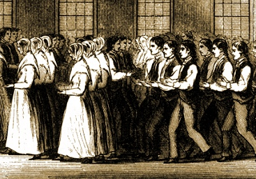

  
[Intangible Textual Heritage](../../index)  [Utopia](../index) 

------------------------------------------------------------------------

[Buy this Book at
Amazon.com](https://www.amazon.com/exec/obidos/ASIN/0486215806/internetsacredte)

------------------------------------------------------------------------

<table width="75%">
<colgroup>
<col style="width: 50%" />
<col style="width: 50%" />
</colgroup>
<tbody>
<tr class="odd">
<td width="50%" data-valign="TOP"></td>
<td width="50%" data-valign="CENTER"><h1 id="the-communistic-societies-of-the-united-states" data-align="CENTER">The Communistic Societies of the United States</h1>
<h2 id="by-charles-nordhoff" data-align="CENTER">by Charles Nordhoff</h2>
<h4 id="section" data-align="CENTER">[1875]</h4></td>
</tr>
</tbody>
</table>

------------------------------------------------------------------------

[Contents](#contents)    [Start Reading](csus00)

------------------------------------------------------------------------

|                                                                                                                           |
|---------------------------------------------------------------------------------------------------------------------------|
|  |

One of the persistent themes of US history is an urge to return to the
land and create the 'perfect' society. However, few besides specialist
historians are today aware that there was a huge communal living
movement in the mid-19th century. This resulted in a number of
functional utopian communities, some more experimental than others. On
the whole, though, these 19th century pioneers exceeded the wildest
imagination of the hippies, with a whole string of prosperous
agricultural colonies from New England to the Pacific.

This book is a itself pioneering work on the sociology of communes.
Nordhoff studied and toured all of the major settlements, including the
Shakers, the Amana Colony, the Perfectionists, the Icarians, and other
long-forgotten roadside utopias. He includes extensive information on
their religious beliefs, poetry, architecture, internal politics, living
arrangements and sexual practices.

------------------------------------------------------------------------

 [Title Page](csus00)  
[Table of Contents](csus01)  
[List of Illustrations](csus02)  
[Introduction](csus03)  

### The Inspirationists, at The Amana Community

[I. Introduction](csus04)  
[II.—Historical.](csus05)  
[III.—Amana—1874.](csus06)  
[IV.—Religion and Literature.](csus07)  

### The Harmony Society

[I.—Economy In 1874](csus08)  
[II.—Historical.](csus09)  
[III.—Doctrines and Practical Life In Economy; With Some Particulars of
“Father Rapp.”](csus10)  

### The Society Of Separatists, at Zoar, Ohio

[I.—History](csus11)  
[II.—Religious Faith and Practical Life.](csus12)  

### The Shakers.

[I. Introduction](csus13)  
[II.—“Mother Ann.”](csus14)  
[III.—The Order of Life Among the Shakers](csus15)  
[IV.—A Visit To Mount Lebanon.](csus16)  
[Details of the Shaker Societies](csus17)  
[Shaker Literature, Spiritualism, etc.](csus18)  

### The Perfectionists of Oneida and Wallingford.

[I.—Historical](csus19)  
[II.—Religious Belief And Faith-Cures.](csus20)  
[III.—Daily Life And Business Administration.](csus21)  
[IV.—Sunday At The Oneida Community, With Some Account Of
“Criticism.”](csus22)  

### The Aurora And Bethel Communes.

[I.—Aurora in Oregon](csus23)  
[II.—Bethel.](csus24)  

 

[The Icarians](csus25)  
[The Bishop Hill Commune.](csus26)  
[The Cedar Vale Community.](csus27)  
[The Social Freedom Community.](csus28)  
[Colonies Which Are Not Communistic.](csus29)  

### A Comparative View of the Customs and Practices of the American Communes

[I.—Statistical](csus30)  
[II.—Communal Politics And Political Economy.](csus31)  
[III.—Character of the People; Influences of Communistic
Life.](csus32)  
[IV.—Conditions and Possibilities of Communistic Living.](csus33)  

 

[Bibliography.](csus34)  
[Index](csus35)  
