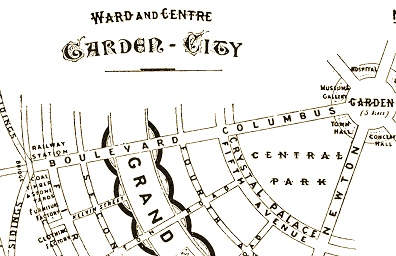

  
[Intangible Textual Heritage](../../index)  [Utopia](../index.md) 

------------------------------------------------------------------------

[Buy this Book at
Amazon.com](https://www.amazon.com/exec/obidos/ASIN/0262580020/internetsacredte.md)

------------------------------------------------------------------------

<table width="75%">
<colgroup>
<col style="width: 50%" />
<col style="width: 50%" />
</colgroup>
<tbody>
<tr class="odd">
<td width="50%" data-valign="TOP"></td>
<td width="50%" data-valign="CENTER"><h1 id="garden-cities-of-to-morrow" data-align="CENTER">Garden Cities of To-morrow</h1>
<h2 id="by-ebenezer-howard" data-align="CENTER">by Ebenezer Howard</h2>
<h4 id="section" data-align="CENTER">[1902]</h4></td>
</tr>
</tbody>
</table>

------------------------------------------------------------------------

[Contents](#contents)    [Start Reading](gcot00.md)

------------------------------------------------------------------------

|                                                                                                                           |
|---------------------------------------------------------------------------------------------------------------------------|
|  |

Among the many 'utopian' proposals of the 19th century, this particular
short text stands out. Howard was a 19th century British reformer and
city planner. He was influenced by Bellamy's [Looking
Backwards](../lb/index.md). He saw new, planned towns as a necessary
counterbalance to the squalid, Dickensian 19th century London. These
towns would balance urban and rural occupations, and include a whole
range of amenities which we have come to take for granted: libraries,
museums, schools, wide avenues, and a mix of commercial and residential
zones. Howard strove to keep a balance between the community and
individual needs, and to operate within the framework of Capitalism,
rather than rejecting or attempting to replace it.

This book was originally published in 1898 as To-morrow, and reissued in
1902 as Garden Cities of To-morrow. The first Garden City, built under
the aegis of Howard, Letchworth, was founded in 1903 (Howard was one of
the first residents). Later he founded a second Garden City, Welwyn,
1919. Both, now London suburbs, are still very much in existence and
proved successful over time, with its residents, in particular, in
better health than the general population. Howard's proposal had a great
influence on urban planning in the 20th century, particularly post-WWII.
The American urban planning critic, Lewis Mumford, was one of Howard's
proponents. In the history of planned societies, Ebenezer Howard stands
out as one of the successes, even though he is little-known other than
to architects and urban planners.

PRODUCTION NOTES: Since the original book is hard to obtain, I used the
1967 MIT Press edition, omitting all new material. The pagination of
this etext reflects the MIT edition. A couple of start-of-chapter quotes
are identified in the MIT edition as belonging to the first edition.
These are printed in green in this etext.

------------------------------------------------------------------------

 [Title Page](gcot00.md)  
[Contents](gcot01.md)  
[Introduction](gcot02.md)  
[Chapter One. The Town-Country Magnet](gcot03.md)  
[Chapter Two. The Revenue of Garden City, and how it is obtained—The
Agricultural Estate](gcot04.md)  
[Chapter Three. The Revenue of Garden City—Town Estate](gcot05.md)  
[Chapter Four. The Revenue of Garden City—General Observations on its
Expenditure](gcot06.md)  
[Chapter Five. Further Details of Expenditure on Garden City](gcot07.md)  
[Chapter Six. Administration](gcot08.md)  
[Chapter Seven. Semi-Municipal Enterprise—Local Option—Temperance
Reform](gcot09.md)  
[Chapter Eight. Pro-Municipal Work](gcot10.md)  
[Chapter Nine. Some Difficulties Considered](gcot11.md)  
[Chapter Ten. A Unique Combination of Proposals](gcot12.md)  
[Chapter Eleven. The Path followed up](gcot13.md)  
[Chapter Twelve. Social Cities](gcot14.md)  
[Chapter Thirteen. The Future of London](gcot15.md)  
