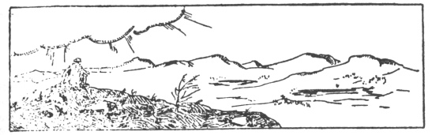
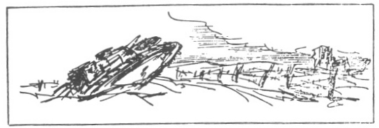
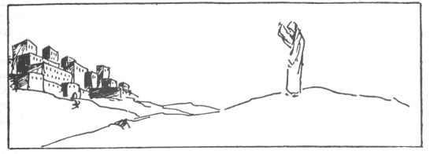
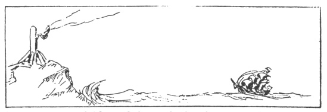
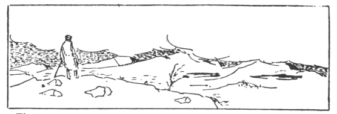

  
[Intangible Textual Heritage](../../index)  [Utopia](../index.md) 
[Index](index)  [Previous](sou02)  [Next](sou04.md) 

------------------------------------------------------------------------

[Buy this Book at
Amazon.com](https://www.amazon.com/exec/obidos/ASIN/0766127907/internetsacredte.md)

------------------------------------------------------------------------

*The Story of Utopias*, by Lewis Mumford, \[1922\], at Intangible
Textual Heritage

------------------------------------------------------------------------

p. ix

 

### INTRODUCTION

IT is a sunny day and I am sitting on the top of a mountain. Until this
morning, it had been the mountain of a fairy story that was twenty
centuries old.

Now, it is a mighty hill and I can feel its warm coat of white
reindeer-moss, and if I were willing to stretch out my hand, I could
pluck the red berries that are in full bloom.

A hundred years from now it will be gone.

For it is really a large chunk of pure iron, dumped by a playful
Providence in the very heart of Lapland.

Do you remember an old tale of Norse mythology? How somewhere, far in
the north, there stood a high peak of iron, which was a hundred miles
high and a hundred miles wide? And how a little bird came to it once
every thousand years to sharpen its beak? And how, when the mountain was
gone, a single second of all eternity would have passed by?

I heard it told as a child.

I remembered it always, and I told it to my own boys when they began to
learn history. It seemed the invention of some prehistoric Hans
Christian Andersen. It belonged to the imaginary scenery of our dreams.

The story has come true, and I have found my old mountain where I least
expected it.

To make the cycle of coincidence perfect, this hill was named after a
bird. The Lapp, with a fine sense of sound, called the ptarmigan "Kiru."
Kirunavaara no longer hears the shrill "kiru-kiru" of rising birds.
Twice a day it listens to the terrific detonation of half a hundred
charges of dynamite.

Then it is shaken by the little trains which carry the rock to the
valley.

In the evening, it sees the lights of the large electric engines which
hoist the valuable metal across the arctic wilderness of Lake
Tornotrask.

Two months later, the ore has been melted and worked into those modern
articles of trade which go by the name of bridges

p. x

and automobiles and ships and apartment houses and a thousand other
things which once promised to elevate man from the ranks of the beasts
of burden.

What has become of that promise, the survivors of the last eight years
know with great if gruesome accuracy.

Even the humble Lapp has heard of the great upheaval, and has asked why
the white people should kill each other when the whole world was full of
reindeer and when God has given us the hills and the plains so that
forever there should be food enough for the long days of summer and the
longer nights of the endless winter.

But the ways of the Lapp are not the ways of the white man. These simple
followers of a pure and much undiluted nature follow the even tenor of
their ways as their ancestors did, five and ten thousand years ago.

 

We, on the other hand, have our engines and we have our railroad trains
and we have our factories and we cannot get rid of these iron servants
without destroying the very basis of our civilization. We may hate these
ungainly companions, but we need them. In time to come, we shall know
how to be their masters. Then Plato shall give us a revised Republic
where all the houses are heated by steam and where all the dishes are
washed by electricity.

We are not suffering from too much machinery, but from too little. For
let there be enough iron servants and more of us shall be able to sit on
the tops of mountains and stare into the blue sky and waste valuable
hours, imagining the things that ought to be.

The Old Testament used to call such people prophets. They raised strange
cities of their hearts' delight, which should be based exclusively upon
righteousness and piety. But the greatest of all their prophets the Jews
killed to make a Roman holiday. The Greeks knew such wise men as
philosophers. They allowed

p. xi

them great freedom and rejoiced in the mathematical precision with which
their intellectual leaders mapped out those theoretical roads which were
to lead mankind from chaos to an ordered state of society.

The Middle Ages insisted with narrow persistence upon the Kingdom of
Heaven as the only possible standard for a decent Christian Utopia.

They crushed all those who dared to question the positive existence of
such a future state of glory and content. They built it of stone and
precious metals, but neglected the spiritual fundament. And so it
perished.

The sixteenth and seventeenth centuries fought many bitter wars to
decide the exact nature of a whitewashed Paradise, erected upon the
crumbling ruins of the mediæval church.

 

The eighteenth century saw the Promised Land lying just across the
terrible bulwark of stupidity and superstition, which a thousand years
of clerical selfishness had erected for its own protection and safety.

There followed a mighty battle to crush the infamy of ignorance and
bring about an era of well-balanced reason.

Unfortunately, a few enthusiasts carried the matter a trifle too far.

Napoleon, realist-in-chief of all time, brought the world back to the
common ground of solid facts.

Our own generation drew the logical conclusion of the Napoleonic
premises.

Behold the map of Europe and see how well we have wrought. For alas!
this world needs Utopias as it needs fairy stories. It does not matter
so much where we are going, as long as we are making consciously for
some definite goal. And a Utopia, however strange or fanciful, is the
only possible beacon upon the uncharted seas of the distant future.

It encourages us in our efforts. Sometimes the light is hidden by

p. xii

the clouds and for a moment we may lose our way. Then the faint light
once more breaks through the darkness and we press forward with new
courage.

And when life is dull and meaningless (the main curse of all existence)
we find consolation in the fact that a hundred years

 

from now, our children shall reach the shore for which we were bound
when we ourselves left the bridge and were lowered to the peaceful
bottom of the ocean.

And now the sun has gone down and a chill wind blows from Kebnekajse,
where the wild geese of little Nils Holgerson live amidst the endless
silence of the eternal snow. Soon the top shall be hidden in the mist
and I shall have to find my way back by the noise of the steam shovels,
plying their elephantine trade at the foot of the first terrace.

 

The mountain of my fairy story once more a will be the profitable
investment of a Company of Iron-mongers.

But that does not matter.

Lewis Mumford, for whom I am writing this, will understand what I
mean.

|                                                          |
|----------------------------------------------------------|
|  |

And I shall be content.

Kiruna, Lapland,

14 Sept., 1922.

 

 

 

 

------------------------------------------------------------------------

[Next: Chapter One](sou04.md)
