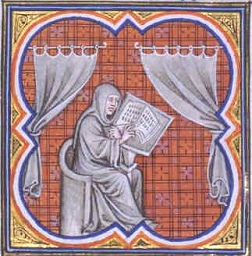

title: "How to prepare content"
---
### HOW TO PREPARE CONTENT FOR SACRED-TEXTS.COM

Intangible Textual Heritage is the largest free access repository of
copyright-free (public domain) and copyrighted but redistributable
electronic texts (etexts) on Religion, Mythology, Folklore and the
Esoteric.

We are actively seeking new content for this website. The principal need
is for original electronic transcriptions of public domain books in
entirety. We cannot offer monetary compensation—the rewards of preparing
texts for this site are intangible. Each book unearthed from the
enormous set of untouched public domain books and lovingly transcribed
is a service for humanity as a whole.

We encourage you to take on material in a religion or field which is new
to you--we do this all the time. Doing a transcription of one of these
books is normally the equivalent of a college-level seminar on the
subject. It can only broaden your understanding of other viewpoints.

If you are stumped as to where to begin, there is a whole list of books
which we'd like to see transcribed [on the wishlist page](wishlist.md).
This only scratches the surface, however.

##### Submitting original material

If you have *book-length* original content to submit (you must be the
author or have clearance from the copyright holder) please contact us
for more information. We are *not* interested in publishing original
off-topic books, short articles, opinion or advocacy pieces, rants,
poetry, fiction, etc. etc. Original content must be primarily in English
(unless they are presentations of texts in their original language such
as Latin, Hebrew, Arabic, etc.) You must give Intangible Textual
Heritage the right to post the file at our site for free worldwide
distribution. While you retain the copyright on your file, please be
aware that once it is posted at our site, we have no control over how it
is used or copied and cannot be held responsible for any violations of
your copyright.

Please do not send unsolicited original material: please contact us
first to establish our level of interest first.

##### Preparing public domain material

The rest of this page describes how to prepare public domain texts for
the site.

Content at this site is presented in HTML only: PDF, DOC and other
formats must be converted to HTML and marked up for this site's content
management system before submission. To reiterate, it must be on the
topic of Religion, Mythology, Folklore or the Esoteric.

We prefer that you not submit material that has appeared at other sites,
unless there are extenuating circumstances. If you are planning to start
a project for eventual submission to this site, please contact us
*first* to determine whether it is suitable and not already being
prepared.

The transcriptions of the books at Intangible Textual Heritage are
intended to be used by scholars who are studying the texts and want to
be able to cite them. In other words, the etexts at Intangible Textual
Heritage should retain as much information as possible from the paper
book. They should be able to be referenced as though the printed copy
was in front of you. For this reason we include page numbers, index,
front matter, footnotes and so on. We preserve as much formatting as
possible within the limitations of HTML, and include as much significant
information from the original book as possible.

Here is how to prepare a book for sacred-texts.

1\. Select the book.

2\. Clear the copyright status.

3\. Scan, OCR, proof and markup the text.

The following is a walk-through of this process:

### 1. Select the book.

Please select a book that has not yet been transcribed electronically.
To verify that there is no existing transcription, visit Online Books
(<https://digital.library.upenn.edu/books/>) and Project Gutenberg
(<https://www.gutenberg.org/catalog/>) and search their catalog. You
should also conduct a search using Google or other search engines for
the book title and author, and visit the Wikipedia page for the author
to locate existing transcriptions on the web which may not be indexed at
Online Books or Project Gutenberg.

The exception to this would be if the existing transcriptions are
incomplete, heavily edited, or of poor quality, in which case we'll be
happy to publish a better transcription prepared from scratch.

Next you need to obtain the physical copy of the book which you will be
scanning: this is called the *copytext*. Unlike some etext providers, we
use a specific edition of a book to prepare the etext. This edition is
identified clearly, and, when possible, we post page images of the
*title page* and *verso*—the page on the reverse of the title page,
normally where the copyright notice is located. This is also called the
'TP&V.' Providing these images is considered proof that you have
completed 'due diligence' in verifying the copyright status of the book.

You should obtain an original first edition of the book, or a
photographic reproduction of it. We use libraries, inter-library loans,
and used books from sites such as Alibris.com and ABEBooks.com.
Photographic reproductions of public books are available from Kessinger
Publications, although these may be more difficult to OCR, as they are
low-resolution images and bound in a format which is clumsy to scan.
Dover Publications sells a line of inexpensive, high-quality
reproductions of public domain books.

If you use a later republication, you will have to verify that it has
not been edited extensively, and omit any new material such as
introduction, editorial footnotes etc. This is a last resort if no first
editions or reproductions are available.

### 2. Clear the copyright status.

This site has very firm criteria for which books we can publish and
which we must exclude. In some cases (books published prior to January,
1st, 1923) it will be easy to determine whether a given book meets the
copyright criteria. At the other extreme there may be grey areas where
the status of the book may be impossible to determine, in which case we
will probably have to decline publishing it.

<table data-border="1">
<colgroup>
<col style="width: 33%" />
<col style="width: 33%" />
<col style="width: 33%" />
</colgroup>
<tbody>
<tr class="odd">
<td> 

Acceptable
</td>
<td> 

Acceptable Under Certain Conditions
</td>
<td> 

Not Acceptable
</td>
</tr>
<tr class="even">
<td> 

Any book published prior to January 1st, 1923.
</td>
<td> 

Books originally published in the United States between 1923 and 1963 inclusive.
</td>
<td> 

Books originally published outside the United States after 1922. Any book published after 1963.
</td>
</tr>
</tbody>
</table>

If the book falls into the middle category in the above table we have
resources to check whether it is acceptable and can conduct this
investigation for you.

### 3. Scan, OCR, proof and markup the text.

#### 3.1 Scanning and OCRing

You will need a computer, a flat bed scanner, OCR (Optical Character
Recognition) software and a word processor with a customizable spell
checker. A sturdy book lectern is a cheap but excellent investment.
These can be found in any office supply store. In addition, you will
need a high-intensity lamp if you don't have good overhead or natural
light: do not attempt this without good lighting.

Scanning is the least time consuming part of any etext project. It will
take about half an hour to an hour to complete a hundred pages, which
means that you can scan an average 200-300 page book in an evening. It
is, frankly, an extremely boring task; fortunately you can listen to
music or watch TV at the same time!

Any consumer-grade flatbed scanner, (these normally cost less than $100)
will be fine.

We recommend that you use a commercial OCR package such as OmniPage
(which we use), ReadIris, FineReader, PaperPort, TextBridge etc. These
software packages can be purchased online at Amazon.com, and cost less
than $100.

We use Microsoft Word but any word processor will do.

We first select a two or three letter abbreviation for the book which we
will use consistently through the project. This must be different than
any other book in the particular category. This is usually the first
letters of the book title, although sometimes we use the authors
initials (if there is no other book by that author).

After scanning, we save both the page images and the text in batches of
about a hundred pages at a time. The pages are scanned 'two-up' which
means that they are scanned two facing pages per image: most books will
fit onto a standard 8 1/2 by 11 inch scanner plate. This reduces the
labor of scanning.

We save the page images so that we can use them to proof the book (we
use a two-monitor setup). This reduces the wear on the copytext and
allows extraction of images easily at a later time. However, to keep the
page images you will need a lot of disk space.

We scan the pages to grayscale, 300 dpi images, unless the particular
page has a color illustration. We save the files as JPGs: even though
this is a 'lossy' format, it saves disk space. These end up being 3300 X
2550 pixel files, and each one is a bit larger than one megabyte.
Scanning to monochrome (black and white) will mean lower quality OCR and
more work in the proof pass and we don't recommend this.

We save each OCR into a plain text file: although most OCR packages can
recognize formatting, this can be a bit uneven. After we're done we
concatenate each file into a single text file in the correct order. Then
we load this into Microsoft Word, and save it as an HTML file. This is
the 'Proof file'. If you are using a Macintosh with Microsoft Word, it
may be better to use RTF format to save the proof file.

Some older books have a condition which we call 'bowing.' This is where
the facing pages become misaligned after sitting on a shelf for many
years. The problem is that one or both of any given pair of facing pages
will be skewed, which reduces the OCR quality. This is particularly
noticeable at the page signature boundaries. In this case it may be
necessary to scan the facing pages separately. Most OCR packages can
automatically straighten a skewed image and we recommend turning this
feature on.

Many of the books at Intangible Textual Heritage use accents and
non-Latin characters. Some of these are part of the HTML 8-bit character
set. Others are presented using Unicode. Your OCR package may be able to
recognize accented characters automatically, which saves the trouble of
inserting them by hand. We've found that adding recognition for French
and German in OmniPage will enable automatic recognition of the most
common accents, particularly acute, grave, umlaut and circumflex. In
other cases you can use the 'training' feature found in most OCR
packages to recognize additional accents.

Standard OCR packages cannot automatically recognize Greek, Hebrew,
Arabic, Sanskrit, and other non-Latin alphabets. These parts of the text
will either have to be entered by hand or recognized using specialized
OCR packages. It is acceptable to use inline image files for small
blocks of non-Latin alphabets if you cannot transcribe them by hand. We
have an in-house system to transliterate Greek, Hebrew and Cyrillic, but
this requires specialized knowledge of these alphabets.

#### 3.2 Proofing

This is the part which is the most time consuming. However, even a
novice should be able to proof and markup 20-50 pages in about two to
four hours of a moderately difficult book, and with a bit of practice,
even more. This means that it should take about ten sittings to complete
an average 200-300 page book.

After scanning and OCRing the book you will need to sit down and go
through the proof file to check that it matches the printed text
exactly, including typographic errors in the original. Please observe
the following:

Eliminate spaces before commas, semicolons, colons, exclamation marks
and question marks.

Eliminate tabs, page breaks, soft hyphens, and other characters which
are not supported in HTML.

Either convert em-hyphens (—) to two standard hyphens (--) or leave all
of the em-hyphens in the file intact.

Either convert all curved quotes to straight quotes or leave them
intact. Turn off 'Auto-quote' in your word processor.

Change any instance of a digit followed by a lower-case 'o' to an actual
zero. That is, change any instance of '4o' to '40' and so on.

These can be accomplished by global search and replace before starting
to proof the file.

You will need to have the copytext handy while proofing, even if you are
using the page images to proof the file. Sometimes pages are
accidentally omitted from the scan and you'll have to go back and do
them. And sometimes you'll need to take a look at the physical book to
find details which you can't see in the grayscale page image.

Generally we proof with Microsoft Word's 'Check spelling as you type'
option on. This can be accessed from the Tools/Options dialog, on the
'Spelling and Grammar' tab. We turn off all of the other options on this
dialog, particularly the grammar check. Turn off any 'Autocorrect'
features as this may inadvertently 'fix' spelling that should be
retained, or change non-English words into English words they resemble.
Finally, we turn off the 'smart quotes' feature.

Take note, it is easy to 'crash' Word's spell-checker. This behavior has
been consistent for every version of Word from 2.0 through the latest:
you think that they would have fixed it by now, but...it's Microsoft.
The key is that the spell-check apparently only runs on the text on
screen. We've found that it helps to view as little of the text as
possible, by carefully editing one screen at a time and then scrolling
down when you're done. It also helps to edit at 200 percent, even if you
don't have bad eyesight: this also cuts down on how much text is on
screen at any given time. If you are going to do a global search and
replace, turn the spell-checker off temporarily: this can also trigger a
Word spell-check melt-down. Lastly, take note that the spell-checker
doesn't like Unicode. It will happily allow you to enter words with
Unicode values higher than 256, but it will promptly forget them!

Be advised. If the spell-check crashes, you will see anything from a
'helpful' dialog advising you that 'there are too many spelling errors'
in the current document, all the way to a Blue Screen of Death. The way
to recover from this is to save your document and close it, then reopen
it, and go back to the spelling tab and turn off 'Hide Spelling Errors
in this Document.' Of course, you should always save your work early and
often. You should also regularly back up the spell check dictionary (see
below)--sometimes a spell-check crash **will completely erase the
contents of the current custom spell-check dictionary**. Hey Microsoft:
FIX YOUR SPELLCHECKER!

Many of the books at Intangible Textual Heritage, since they were
published prior to the 20th century use idiosyncratic spelling, and many
use 'British' spelling variants: all of these must be preserved in the
electronic version.

Set up a custom spell-check dictionary. To do so in Microsoft Word 2003
or later, go to the Tools/Options Spelling and Grammar tab and click on
the 'Custom Dictionaries' button. Click on 'New' and type in the book
abbreviation you've selected. Then (important) you must find the
dictionary in the list box on the Custom Dictionaries dialog, select it
and click on the 'Change Default' button. Otherwise all of your custom
words will go into 'USER.DIC.'

Under Windows XP, Microsoft Word's custom dictionaries are stored in
C:\\Documents and Settings\\&lt;your login&gt;\\Application
Data\\Microsoft\\Proof. These are all just text files with one entry per
line. You can manage the files from the 'Custom Dictionaries' dialog,
but sometimes it is easier just to go into these files and edit them by
hand. Don't worry about sorting them, they will be re-sorted when Word
loads them again. Note: back up this directory often, as Word can
sometimes completely erase the contents of your current dictionary
during a hard crash. Technically, it truncates the dictionary file to a
zero length file. The files aren't that large, so backing it is no
problem.

Now we are ready to proof. We generally mark-up (see [STML](#stml).md) the
file at the same time as proofing, but for the purpose of exposition,
the proofing process is discussed separately in this document.

While it is possible for a really experienced proof-reader to correct a
text without a spell-checker active, a text cannot be proofed to the
highest level without one. Even the best proof-readers get distracted or
tired and miss errors occasionally.

In addition, proofing an electronic transcription is not exactly the
same as proofing an original text. You are not trying to correct errors,
but instead you are trying to get the electronic transcription to match
the original text exactly, 'warts and all.'

With either the page images or the copytext at hand, go through the file
from start to end. Where there is a word flagged by the spell-checker
(in Microsoft Word these are underlined in red), compare it with the
copytext. If it matches the copytext, add it to the custom dictionary.
You do this in Microsoft Word by right-clicking on the word and
selecting 'Add to Dictionary.' If it does not match the copytext,
correct it so that matches the copytext.

Some words will not be flagged by the spell-checker but they do not
match the copytext. *These are OCR errors and can only be corrected by
an **attentive** human being, that is,* **YOU**. Some of these errors
are because the OCR software attempts to match a word to the closest
English word. Others are due to poor typography in the copytext, or a
low-resolution copytext, or artistic but ambiguous fonts, particularly
those with fancy ligatures.

Some instances of OCR errors are substituting certain letters with
similar shape, where both the error and the original are valid English,
notoriously 'b' and 'h.' This results in 'he/be,' 'band/hand' and many
others. Certain early versions of OmniPage did this consistently and
this will often turn up in older Project Gutenberg etexts.

Sometimes broken, skewed, or poorly printed type can result in one
letter being split into two, most notably 'n' and 'ri,' e.g. 'arid' for
'and;' or 'd' mistaken for 'cl' e.g. 'down' and 'clown.' Another similar
problem is where 'e' is turned into 'c,' resulting in the embarrassing
error of 'seat' turning into 'scat.'

Some techniques for doing this are to read each page on the screen for
comprehension, and to scan through the page on the screen backwards.
Eventually you will develop a feel for potential OCR errors.

Punctuation must be also be retained from the original book, *even if it
is incorrect*. Also be on the lookout for missing or incorrect
punctuation: OCR packages have trouble with this issue to this day.

The letters 'l,' 'I' and the number '1' often get confused by even the
most advanced OCR programs. Some 19th century books use a small letter
which looks like 'I' for '1' which must be corrected by hand. Add to
this the confusion between upper case 'O' and the digit zero, and 101
can easily turn in to 'LOL'!

There are specialized STML tags to indicate errata and punctuation
errors, but in general the original text of the book must be able to be
reconstructed from the electronic version.

#### 3.3 STML Markup

We use a markup system named 'STML' (Sacred Texts Markup Language) to
prepare documents for sacred-texts.

STML markup is piggybacked on top of the proof file's format (typically
HTML or RTF). In other words, STML tags are written in plain text and
can be edited using a Word Processor, rather than embedded in the
document format (as with an XML markup language).

STML is read ('parsed') by a computer program which we have written. The
output of this program is the 'book' as it appears online at the site.
Typically each book is split into a series of files, normally at the
chapter level. Each file is linked to an 'index' file (not to be
confused with the book index). That is:

<table data-border="1">
<colgroup>
<col style="width: 33%" />
<col style="width: 33%" />
<col style="width: 33%" />
</colgroup>
<tbody>
<tr class="odd">
<td> 

<em>source</em>
</td>
<td> 

<em>parser</em>
</td>
<td> 

<em>output</em>
</td>
</tr>
<tr class="even">
<td> 

Proof file -&gt;
</td>
<td> 

STML Parser-&gt;
</td>
<td> 

index.htm 
file000.htm 
file001.htm 
etc.
</td>
</tr>
</tbody>
</table>

The file which you submit to sacred-texts is the 'Proof file.' This is
normally a single HTML file. We use the STML parser to generate the
output files. These files are then uploaded to the site for viewing by
the public.

Most STML markup is enclosed in wavy brackets { }.

This is because these brackets are rarely used in pre-20th century
books. Where brackets occur verbatim in the copytext, you need to
'escape' them using a backslash: \\{ and \\}.

The following is a primer of the most useful STML tags. It doesn't
include everything in the STML language, but just the tags which
volunteers should be conversant with and insert into transcribed texts.
While using STML is not required, it will greatly improve the
presentation of the file at the website and allow scholars to cite the
text reliably.

##### 3.3.1 file

{file "title"}

{file "title" "filename"}

This indicates where a file break occurs. This tag has either one or two
string arguments, both of which must be enclosed in double straight
quotes.

The first string is the title of the file. This is what is displayed on
the index page, at the bottom of the previous page link, and in the HTML
TITLE tag for the file.

Usually the files are numbered sequentially automatically. In some cases
it may be desirable to specify a specific file name for the file
(including the '' suffix), for instance {file "Chapter Four" "chap04"}.

##### 3.3.2 page

{p. NNN}

It is important to preserve the page numbers from the original book.
This is because it is difficult to proof the book unless you have the
original page numbers in the etext, as well as locate and fix errors
after the book is posted. In addition, scholars need the page numbers to
cite the text properly.

The page number is specified by the 'NNN' argument, e.g. {p. 42}. Note
that there must be a period after the 'p' and exactly one space between
the period and the number. NNN must not have any spaces in it, nor can
there be a space between NNN and the closing wavy bracket.

Strictly speaking the NNN argument does not have to be a decimal number:
it could be a roman numeral e.g. {p. xlii}, or some other text {p.
title}, if the page does not have a specific number in the book. But,
again, it must not have any spaces in it: {p. the end} is not correct,
nor is {p. fred }.

If a word is hyphenated at the end of a page, join the portion of the
word after the hyphen with the part on the first page, unless the word
is footnoted on the successive page, in which case the word is
concatenated on the second page. This is so that search engines can
index the word intact.

If a paragraph is split between two pages and the start of the paragraph
on the second page does not begin with a lowercase letter (i.e. 'a'
through 'z'), put the continuation tag on the second page: {cont}. This
is so that the paragraph structure can be analyzed correctly. This means
that if the continuation paragraph starts with an uppercase letter, a
punctuation mark, a digit, etc. you must insert a {cont} tag.

Each page number in the entire book must be unique. If you need to
indicate a page number in footnote, or insert a page number which is not
otherwise unique, use the {fp. NNN} variation, where NNN can be any
text.

A page reference can be indicated using the {pr. } and {prr. } tags.
{pr. NNN} gets converted into a reference into page NNN in the format
"p. NNN," while {prr. NNN} gets converted into a simple link to the page
with the text NNN: this is useful if the page number in the text is in
the form "Page NNN" (mark this up as PAGE {prr. NNN}).

##### 3.3.3 Footrefs and Footnotes.

{fr. NNN}

{fn. NNN. *text...*}

Footnotes consist of a matching footref (the footnote in the text) and
footnote (the footnote itself).

The footref tag is used to mark a footnote reference. NNN must be a
single word, number, or punctuation mark (e.g. asterisk {fr. \*}).

The footref tag must have a period after the 'fr' followed by exactly
one space. Do not put any space after the NNN.

The footnote tag encloses the entire text of the footnote. It begins
with fn., one space, the matching NNN for the footref, a period and at
least one space, followed by the text of the footnote.

For instance:

This is some text with a footnote at the end of the sentence{fr. 2}.

:

:

{fn. 2. This is the text of footnote number two...}

The footnote reference and footnote 'numbers' must be unique on the
particular page (that is the page indicated by the {p. }) tag.

Note that a footref can be *inside* a footnote, as long as it is also
unique on that page. Sometimes footnotes have footnotes!

If there are no page numbers in the book, the footnote 'numbers' must be
unique in the entire text.

It is acceptable (but not desirable) to renumber footnotes to follow the
above rules of uniqueness.

A footnote can be referenced using the {frr. page:note} tag. The page
argument is separated from the note 'number' by a colon with no
intervening spaces, e.g "See note {frr. 42:3} on page 42"

##### 3.3.4. Images

{img basename}

{img basename "Caption"}

{thumb basename}

{thumb basename "Caption"}

It is important to include images in the text. The {img} tag inserts an
image 'inline' in the text, that is, at the exact location of the tag.
{thumb } inserts a placeholder graphic in the text which the user can
click on to view the full-sized image. The "Caption" string is an
optional title for the image. The caption is important because it
assists search engines, and the caption is also automatically embedded
in the HTML IMG 'ALT' attribute for the benefit of sight-impaired
visitors to the site.

For instance:

{img 22004 "This is figure four, a picture of a balloon"}

Usually the {thumb } tag is used for most images to reduce bandwidth
load on the site visitors and the costs of hosting the image at the
site. This way, if a page with a lot of graphics is loaded, only the
small thumbnail files are fetched from the server. Then if the visitor
wants to view the full sized image, they can click on the thumbnail.

The 'basename' argument is the name of the file without the 'jpg'
extension. That is, if the file is named 33000.jpg, the full sized image
will be in the 'img' subdirectory and referenced {thumb 33000}. The
equivalent thumbnail file is named 33000.jpg in the 'tn' subdirectory.

Images are stored in the directory 'img' and thumbnails in 'tn' under
the main directory for the project. All files are stored in JPG format.
To generate the 'img' version, cut out the image at 300 dpi, and then
reduce the horizontal dimension of the image file by half, while leaving
the aspect ratio intact. This can be easily done in any image processing
software program using the 'resize' operation. In other words, if the
300 dpi version of the image is 600 X 300 pixels, resize it to 300 X
150. This effectively reduces the size of the file by 75%. To create the
equivalent thumbnail file, reduce it to 100 pixels wide, unless it is
much wider than it is high, in which case reduce the vertical dimension
to 100 pixels.

Conventionally, we number the images by a three digit page number and a
two digit sequence number per page, that is 32004 is the fourth image on
page 320. This helps when trying to manage a lot of image rather than
using descriptive titles such as "balloon.jpg." If the images have been
already assigned a figure or plate number, that can be used instead,
e.g. fig04 or pl5.

It helps reduce the size of the file and to make it more legible on the
web to run a 'contrast' filter on it, particularly if it is simply line
art. This is because there is often 'bleed-through' from the other side
of the page, as well as paper speckles in the original image. This
usually, but not always, cleans up the image without eliminating any
information from it. It is not as desirable with half-tone photographs
or color images.

When reducing the size of some images, particularly woodcuts or
illustrations with a lot of fine lines, running a 'sharpen' filter will
help make the result look better.

When scanning large maps, it may be helpful to do two scans, one a large
one of the map at a reduced size, and a second or third full-sized
cutout scan of areas with a lot of details.

To make a left or right aligned image, prefix 'r' or 'l' to the tag,
e.g. {lthumb fig40 "Figure 40"}. This aligns the image on the left hand
side of the page and lets the text flow around it.

To create an HTML link in the output text which references a specific
image, you can use the {ir. } tag. This requires two arguments: the
image basename, and the tag text, e.g. {ir. front "Frontispiece"} create
a link to the location of front.jpg, with the HTML tag labeled
<u>Frontispiece</u>.
