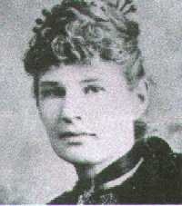

  
[Intangible Textual Heritage](../../index)  [Women](../index) 

------------------------------------------------------------------------

<table width="100%">
<colgroup>
<col style="width: 50%" />
<col style="width: 50%" />
</colgroup>
<tbody>
<tr class="odd">
<td width="50%"></td>
<td width="50%"><h1 id="clothed-with-the-sun" data-align="CENTER">"CLOTHED WITH THE SUN"</h1>
<h2 id="by-anna-bonus-kingsford" data-align="CENTER">by ANNA (BONUS) KINGSFORD</h2>
<h4 id="st-edition-preface-and-footnotes-by-edward-maitland" data-align="CENTER">1st Edition Preface and Footnotes By Edward Maitland</h4>
<h4 id="st-edition-preface-and-footnotes-by-samuel-hopgood-hart" data-align="CENTER">2st Edition Preface and Footnotes By Samuel Hopgood Hart</h4>
<h6 id="london-john-m.-watkins" data-align="CENTER">London, John M. Watkins</h6>
<h5 id="section" data-align="CENTER">[1889]</h5></td>
</tr>
</tbody>
</table>

[Jump to Index](#index)           [Start Reading](cws02)  
*Images*  
[Front Cover](front.jpg)  [Entire Cover](cover.jpg)  [Back
Cover](back.jpg)  
[Another Photograph of Anna Kingsford](anna2.jpg)  

------------------------------------------------------------------------

Anna Kingsford was an extraordinary 19th Century woman. She was one of
the first women in Britain to become a medical doctor, edited a feminist
newspaper, and served as president of the Theosophical Society. She knew
Helena P. Blatavsky, Eliphas Levi, and many other primary figures in
Occult and Esoteric circles of the time. She was a principled vegetarian
and anti-vivisectionist, and opposed foxhunting. She was considered one
of the inspirations for the Golden Dawn, a ritual magic secret society
which was one of the sources of modern neo-paganism, although she did
not live to join it. In particular, the equality of the sexes in the
Golden Dawn is acknowledged as her contribution.

Anna Kingsford claimed to be in contact with fairies as a child. As an
adult she had channeled visions, both waking and in lucid dreams, in
which she tapped esoteric knowledge imparted by angelic beings,
travelled in time, and witnessed shamanistic visions of a vast cosmos
alive at every scale of creation. These 'illuminations', as she called
them, were exhausting and sometimes terrifying. Her close collaborator
Edward Maitland worked with Kingsford to record her illuminations in
this book, published after her death.

Much of the channeled and revealed literature of the 19th Century is
surreal fantasy, invented pseudo-histories, or pure free-association. By
contrast, Anna Kingsford's illuminations are consistent, coherent, and
display a deep understanding of occult traditions. Her theology could be
described as Gnostic Christian Polytheist. She had a radical feminist
viewpoint which seems fresh even today, one in which a Goddess figure,
the 'Sophia' of the Essenes, Gnostics and early Christians has a central
role:

> For the woman is the crown of man, and the final manifestation of
> humanity.  
> She is the nearest to the throne of God, when she shall be revealed.  
> But the creation of woman is not yet complete: but it shall be
> complete in the time which is at hand.  
> All things are thine, O Mother of God: all things are thine, O Thou
> who risest from the sea; and Thou shalt have dominion over all the
> worlds.  

Kingsford was chronically ill her entire life; she died of complications
from pneumonia at the early age of 42, on February 22nd 1888.

------------------------------------------------------------------------

[Title Page](cws00)  
[Table Of Contents](cws01)  
[Preface To The Second Edition](cws02)  
[Preface To The First Edition](cws03)  

### Part The First: Illuminations

[Part The First: Illuminations](cws04)  
[No. I: Concerning The Three Veils Between Man And God](cws05)  
[No. II: Concerning Inspiration and Prophesying](cws06)  
[No. III: Concerning The Prophecy Of The Immaculate Conception](cws07)  
[No. IV: Concerning Revelation](cws08)  
[No. V: Concerning The Interpretation Of The Mystical
Scriptures](cws09)  
[No. VI: Concerning The Mosaic Cosmogony](cws10)  
[No. VII: Concerning The Fall](cws11)  
[No. VIII: Concerning The Prophecy Of The Deluge](cws12)  
[No. IX: Concerning the Prophecy of the Book of Esther](cws13)  
[No. X: Concerning The Prophecy Of The Vision Of
Nebuchadnezzar](cws14)  
[No. XI: Concerning The Prophecy Of The Time Of The End](cws15)  
[No. XII: Concerning The Soul: Its Origin, Nature, And
Potentialities](cws16)  
[No. XIII: Concerning Persephone, Or The Soul's Descent Into
Matter](cws17)  
[No. XIV: Concerning The Genius Or Daimon](cws18)  
[No. XV: Concerning The ''Powers Of The Air''](cws19)  
[No. XVI: Concerning The Devil And Devils](cws20)  
[No. XVII: Concerning The Gods](cws21)  
[No. XVIII: Concerning The Greek Mysteries](cws22)  
[No. XIX: Concerning The Origin Of Evil, And The Tree As The Type Of
Creation](cws23)  
[No. XX: Concerning The Great Pyramid, And The Initiations
Therein](cws24)  
[No. XXI: Concerning The ''Man Of Power''](cws25)  
[No. XXII: Concerning The ''Work Of Power''](cws26)  
[No. XXIII: Concerning Regeneration](cws27)  
[No. XXIV: Concerning The Man Regenerate](cws28)  
[No. XXV: Concerning The Christ And The Logos](cws29)  
[No. XXVI: Concerning The Perfectionment Of The Christ](cws30)  
[No. XXVII: Concerning Christian Pantheism](cws31)  
[No. XXVIII: Concerning The ''Blood Of Christ''](cws32)  
[No. XXIX: Concerning Vicarious Atonement](cws33)  
[No. XXX: Concerning Paul And The Disciples Of Jesus](cws34)  
[No. XXXI: Concerning The Manichæanism Of Paul](cws35)  
[No. XXXII: Concerning The Gospels: Their Origin And
Composition](cws36)  
[No. XXXIII: Concerning The Actual Jesus](cws37)  
[No. XXXIV: Concerning The Previous Lives Of Jesus](cws38)  
[No. XXXV: Concerning The Holy Family](cws39)  
[No. XXXVI: Concerning The Metempsychosis Or Avatâr](cws40)  
[No. XXXVII: Concerning The Æon of the Christ](cws41)  
[No. XXXVIII: Concerning The Doctrine Of Grace](cws42)  
[No. XXXIX: Concerning The ''Four Atmospheres''](cws43)  
[No. XL: Concerning The Hereafter](cws44)  
[No. XLI: Concerning The True Ego](cws45)  
[No. XLII: Concerning God](cws46)  
[No. XLIII: Concerning Psyche, Or The Superior Human Soul](cws47)  
[No. XLIV: Concerning The Poet, As Type Of The Heavenly
Personality](cws48)  
[No. XLV: Concerning Psyche](cws49)  
[No. XLVI: Concerning Consciousness And Memory In Relation To
Personality](cws50)  
[No. XLVII: Concerning The Substantial Ego As The True Subject](cws51)  
[No. XLVIII: Concerning The Christian Mysteries](cws52)  
[No. XLIX: Concerning Dying](cws53)  
[No. L: Concerning The One Life: Being A Recapitulation](cws54)  

### Part The Second: The Book of the Mysteries of God

[Part The Second: The Book of the Mysteries of God](cws55)  
[''I AM''](cws56)  
[No. I: The Credo](cws57)  
[No. II: The ''Lord's Prayer''](cws58)  
[No. III: Concerning Holy Writ](cws59)  
[No. IV: Concerning Sin And Death](cws60)  
[No. V: Concerning The ''Great Work,'' The Redemption, And The Share Of
Christ Jesus Therein](cws61)  
[No. VI: Concerning Original Being; Or, ''Before The
Beginning''](cws62)  
[No. VII: Alpha, Or ''In The Beginning''](cws63)  
[No. VIII: Beta, Or Adonai, The Manifestor](cws64)  
[No. IX: Gamma, Or The Mystery Of Redemption](cws65)  
[No. X: Delta, Or The Mystery Of Generation](cws66)  
[No. XI: Epsilon, Or The First Of The Gods](cws67)  
[No. XII: Zeta, Or The Second Of The Gods](cws68)  
[No. XIII: Eta, Or (mystically) The Third Of The Gods](cws69)  
[No. XIV: Theta, Or (mystically) The Fourth Of The Gods](cws70)  
[No. XV: Lambda, Or The Last Of The Gods; Being The Secret Of
Satan](cws71)  
[No. XVI: The Seven Spirits Of God And Their Correspondences](cws72)  
[No. XVII: The Mysteries Of The Kingdoms Of The Seven Spheres](cws73)  

### Part The Third: Concerning The Divine Image Or The Vision Of Adonai

[Part The Third: Concerning The Divine Image Or The Vision Of
Adonai](cws74)  

### Appendix

[Appendix](cws75)  
