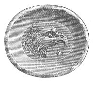
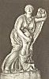
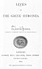

  
[Intangible Textual Heritage](../../index)  [Women](../index.md) 
[Classics](../../cla/index)  [Index](index)  [Next](lgh01.md) 

------------------------------------------------------------------------

p. iii

# LIVES

###### OF

#### THE GREEK HEROINES.

## BY LOUISA MENZIES,

###### AUTHOR OF "LEGENDARY TALES OF THE ANCIENT BRITONS."

 

#### LONDON:

#### GEORGE BELL AND SONS, YORK STREET,

#### COVENT GARDEN.

#### \[1880\]

*The right of translation is reserved*.

[  
Click to enlarge](img/front.jpg.md)  
NIOBE  

[  
Click to enlarge](img/title.jpg.md)  
Title Page  

NOTICE OF ATTRIBUTION  
Scanned at Intangible Textual Heritage, June 2005. Proofed and Formatted
by John Bruno Hare. This text is in the public domain in the United
States because it was published prior to 1923. These files may be used
for any non-commercial purpose provided this notice of attribution is
left intact in all copies.

p. iv

CHISWICK PRESS:--C. WHITTINGHAM, TOOKS COURT, CHANCERY LANE

p. v

TO

MISS EMILY DAVIES

THIS BOOK IS INSCRIBED IN TESTIMONY OF

THE HONOUR IN WHICH SHE

IS HELD BY THE

AUTHOR.

*October*, 1879

------------------------------------------------------------------------

[Next: Preface](lgh01.md)
