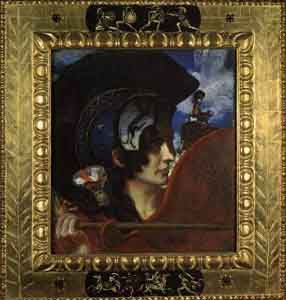

  
[Intangible Textual Heritage](../../index)  [Women](../index.md) 

------------------------------------------------------------------------

<table width="75%">
<colgroup>
<col style="width: 50%" />
<col style="width: 50%" />
</colgroup>
<tbody>
<tr class="odd">
<td data-witdh="50%" data-valign="CENTER"></td>
<td data-witdh="50%" data-valign="CENTER"><h1 id="religious-cults-associated-with-the-amazons" data-align="CENTER">Religious Cults Associated With the Amazons</h1>
By Florence Mary Bennett
<h4 id="section" data-align="CENTER">[1912]</h4></td>
</tr>
</tbody>
</table>

------------------------------------------------------------------------

[Contents](#contents)    [Start Reading](rca00.md)

------------------------------------------------------------------------

After I finished the etext of [The Amazons](../ama/index.md), I did a
search to see if there was any other material on the same subject in the
public domain. This dissertation is the only other item that turned up.
Bennett's thesis explores the possible religious beliefs of the Amazons.
She examines the legend of the Amazons and many of the goddess cults of
ancient Greece and Asia Minor (Turkey). Her research is, as befits a
scholarly paper, extensively documented. The footnote to text ratio is
extremely rich.

Bennett describes in great detail what is known about ancient goddess
worship through primary documents. She describes many details that are
taken for granted today, such as the double axe symbol, and some aspects
that are not so well understood. For instance, some of the male deities
of later classical Greek religion turn out to originally be of ambiguous
gender. And Aphrodite, who in later mythology is a love goddess, was
originally a war goddess.

Whether or not the Amazons were literal history or belonged to the realm
of pure mythology, they left an indisputably huge trace in classical
literature. This monograph is a superb summation of this evidence.

------------------------------------------------------------------------

 [Title Page](rca00.md)  
[Contents](rca01.md)  
[Chapter I: The Amazons in Greek Legend](rca02.md)  
[Chapter II: The Great Mother](rca03.md)  
[Chapter III: Ephesian Artemis](rca04.md)  
[Chapter IV: Artemis Astrateia and Apollo Amazonius](rca05.md)  
[Chapter V: Ares](rca06.md)  
[Conclusion](rca07.md)  
[Bibliography](rca08.md)  
