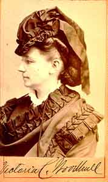

  
[Intangible Textual Heritage](../../index)  [Women](../index) 

------------------------------------------------------------------------

<table width="75%">
<colgroup>
<col style="width: 50%" />
<col style="width: 50%" />
</colgroup>
<tbody>
<tr class="odd">
<td width="50%" data-valign="TOP"> 
</td>
<td width="50%" data-valign="TOP"><h1 id="the-garden-of-eden-or-the-paradise-lost-found" data-align="CENTER">The Garden of Eden; or The Paradise Lost &amp; Found</h1>
<h2 id="by-victoria-claflin-woodhull" data-align="CENTER">by Victoria Claflin Woodhull</h2>
<h4 id="section" data-align="CENTER">[1890]</h4></td>
</tr>
</tbody>
</table>

------------------------------------------------------------------------

Victoria Claflin Woodhull was a 19th century feminist, spiritualist, and
advocate for free love. She was the first woman to run for president (in
1872), the first woman stockbroker, and published the first American
edition of the Communist Manifesto. Her view that women should be free
to marry and take lovers based on conscience, not compulsion, set her at
odds with other feminists. She was convicted of sending obscenity
through the mails when her newspaper ran an exposé of a sex scandal
involving two prominent preachers. In her later years Woodhull moved to
England, married a respectable banker, and spent a lot of effort
attempting to backtrack over her radical past.

Like other 19th century feminists, Woodhull saw the dominant religion as
one of the sources of women's oppression and made a rationalist critique
of the Bible part of her intellectual armament. This pamphlet is a
version of a lecture which she gave numerous times on the subject of the
Garden of Eden, which she felt was an intricate symbol of the human
body, rather than an actual historical location. While a few of the
opinions in this essay are firmly planted in 19th century
pseudo-science, (e.g., eugenics), her thesis that the kingdom of god is
literally *within us*, and nothing pertaining to the body is obscene,
still seems fresh and relevant today.

------------------------------------------------------------------------

[Title Page](tge00)  
[Introduction](tge01)  
[Genesis](tge02)  
[The Garden of Eden](tge03)  
[Revelation](tge04)  
