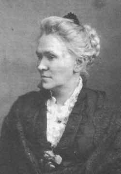

[Intangible Textual Heritage](../../index)  [Women](../index.md) 

------------------------------------------------------------------------

<table width="100%">
<colgroup>
<col style="width: 50%" />
<col style="width: 50%" />
</colgroup>
<tbody>
<tr class="odd">
<td width="50%"></td>
<td width="50%"><h1 id="woman-church-and-state" data-align="CENTER">WOMAN, CHURCH AND STATE:</h1>
<h2 id="by-matilda-joslyn-gage." data-align="CENTER">By Matilda Joslyn Gage.</h2>
<h4 id="section" data-align="CENTER">[1893]</h4></td>
</tr>
</tbody>
</table>

[Jump to Index](#index)  [Start Reading](wcs00.md)

------------------------------------------------------------------------

During the second wave of feminism in the 1960s and 70s a popular slogan
was "not the church, not the state, women shall decide their fate".
Matilda Joslyn Gage would have approved. Vehemently anti-clerical,
*Women, Church and State* was one of the first books to draw the
conclusion that Christianity is a primary impediment to the progress of
women, as well as civilization. Then, as now, religious doctrine was
used as a justification for the dehumanization of women, depriving them
of civil, human, economic and political rights, even denying them the
right to worship alongside men. Gage reviews extensive evidence of this
complex. From a 21st Century perspective it is both astounding how far
we have progressed, and dismaying how little has changed.

Gage was one of the first writers to emphasize the ancient Matriarchy
and the witch trials as key episodes of women's history. Her statement
that [nine million](wcs07.htm#page_247.md) people were killed during the
witch trials has been widely quoted; more recent estimates range from 50
to 100 thousand, which does not lessen the horror.

This book had numerous typographical errors. The etext has an extensive
[errata list](errata.md) of corrections, which appear in bold in the body
of the text.

------------------------------------------------------------------------

 [Title Page](wcs00.md)  
[Preface.](wcs01.md)  
[Contents.](wcs02.md)  
[Chapter I. The Matriarchate.](wcs03.md)  
[Chapter II. Celibacy.](wcs04.md)  
[Chapter III. Canon Law.](wcs05.md)  
[Chapter IV. Marquette.](wcs06.md)  
[Chapter V. Witchcraft.](wcs07.md)  
[Chapter VI. Wives.](wcs08.md)  
[Chapter VII. Polygamy.](wcs09.md)  
[Chapter VIII. Woman And Work.](wcs10.md)  
[Chapter IX. The Church Of To-day.](wcs11.md)  
[Chapter X. Past, Present, Future.](wcs12.md)  

[Errata](errata.md)
