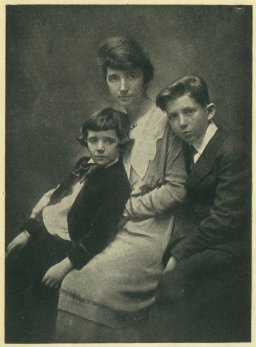

[Intangible Textual Heritage](../../index)  [Women](../index.md) 

------------------------------------------------------------------------

<table width="75%">
<colgroup>
<col style="width: 50%" />
<col style="width: 50%" />
</colgroup>
<tbody>
<tr class="odd">
<td data-valign="VCENTER"> 
The Author and her sons. 
(Compare the <a href="wnr00">dedication</a>)</td>
<td><h1 id="woman-and-the-new-race" data-align="CENTER">WOMAN AND THE NEW RACE</h1>
<h3 id="by" data-align="CENTER">BY</h3>
<h2 id="margaret-sanger" data-align="CENTER">MARGARET SANGER</h2>
<h4 id="section" data-align="CENTER">[1920]</h4></td>
</tr>
</tbody>
</table>

[Contents](#contents)          [Start Reading](wnr00.md)

------------------------------------------------------------------------

Margaret Sanger wrote this book in 1920 at the high water mark of the
first wave of feminism. Women in the United States could now vote, own
property, acquire higher education, and many other rights won through
hard struggle. Sanger saw a woman's right to control her own body
(specifically her reproductive system) as the next big goal. It took
more than forty years before a new wave of feminism, along with advances
in medical technology, made this attainable.

Of course, this is still the fault-line which runs through the topic of
women and religion. The themes which Sanger raises in this book still
arouse vehement debate, and pertain to contemporary issues which would
have seemed unimaginable to Sanger, such as human cloning and stem-cell
research.

Some of the language in this book may mystify or confuse contemporary
readers. When she speaks of a 'New Race' she means the improvement of
the human species in general. She occasionally uses arguments similar to
the Eugenics movement (which was later embraced by the Nazis). This has
been used as ammunition by some opposed to women's reproductive rights,
and several misleading quotes either taken out of context or completely
fabricated have been attributed to her in an attempt to demonize her.
This is a disservice and dishonors Sangers' legacy.

Sanger later denounced the Eugenics movement. Her books were among the
first burned by the Nazis. She also personally helped several Jewish
women and men escape Nazi Germany. Sanger was about as far from a
reactionary as could be imagined--note her opposition to militarism, her
ardent feminism and activism on behalf of working-class women, her
support for labor and the rights of immigrants, all of which she makes
clear in this book. She opened clinics in Harlem to bring health
services to the African American community, and worked closely with such
African American activists as W.E.B. DuBois and Adam Clayton Powell. In
1966, the year Sanger died, the Rev. Martin Luther King, Jr. said:

> There is a striking kinship between our movement and Margaret Sanger's
> early efforts. . . . Our sure beginning in the struggle for equality
> by nonviolent direct action may not have been so resolute without the
> tradition established by Margaret Sanger and people like her.

Sanger's opposition to abortion has to be considered in the light of the
reality of pre-Roe v. Wade 'back-alley' abortion, which often had fatal
or harmful side-effects. She states that she would not be opposed to
abortion if it could be performed safely.

Sangers' transcendent (and very spiritual) vision of women and humanity
in general free from the shackles of sexual repression and endless
child-bearing is impressive, and overwhelms the shortcomings of this
book. *-- jbh*

------------------------------------------------------------------------

[Title page](wnr00.md)  
[Preface](wnr01.md)  
[Contents](wnr02.md)  
[I. Woman's Error And Her Debt](wnr03.md)  
[II. Woman's Struggle For Freedom](wnr04.md)  
[III. The Material Of The New Race](wnr05.md)  
[IV. Two Classes Of Women](wnr06.md)  
[V. The Wickedness Of Creating Large Families](wnr07.md)  
[VI. Cries Of Despair](wnr08.md)  
[VII. When Should a Woman Avoid Having Children?](wnr09.md)  
[VIII. Birth Control--A Parents' Problem Or Woman's?](wnr10.md)  
[IX. Continence--Is It Practicable Or Desirable?](wnr11.md)  
[X. Contraceptives Or Abortion?](wnr12.md)  
[XI. Are Preventive Means Certain?](wnr13.md)  
[XII. Will Birth Control Help The Cause Of Labor?](wnr14.md)  
[XIII. Battalions Of Unwanted Babies The Cause Of War](wnr15.md)  
[XIV. Woman And The New Morality](wnr16.md)  
[XV. Legislating Woman's Morals](wnr17.md)  
[XVI. Why Not Birth Control Clinics in America?](wnr18.md)  
[XVII. Progress We Have Made](wnr19.md)  
[XVIII. The Goal](wnr20.md)  
[Advertisements from first edition](wnr21.md)  
