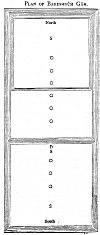

  
[Intangible Textual Heritage](../../index)  [Zoroastrianism](../index.md) 
[Index](index)  [Previous](sbe18125)  [Next](sbe18127.md) 

------------------------------------------------------------------------

[Buy this Book at
Amazon.com](https://www.amazon.com/exec/obidos/ASIN/1402156081/internetsacredte.md)

------------------------------------------------------------------------

*Pahlavi Texts, Part II (SBE18)*, E.W. West, tr. \[1882\], at Intangible
Textual Heritage

------------------------------------------------------------------------

p. 431

### IV. THE BARESHNÛM CEREMONY.

THE great ceremony of purification for any Parsi man or woman who has
become unclean by contact with the dead, or through any other serious
defilement, lasts for nine nights, and is called the Bareshnûm, which is
the Avesta name for the 'top' of the head, the first part of the body
appointed to be washed in the ceremony, after the hands. The description
of this ceremony, given in Pahl. Vend. IX, I-145, which does not differ
very materially from the rite still in use, is as follows [1](#fn_1596.md):--

Pahl. Vend. IX, 1. Zaratû*s*t enquired of Aûha*r*ma*zd* thus: 'O
Aûha*r*ma*zd*, propitious spirit! creator of the material world! who art
the righteous *one* \[of righteousness!' that is, Aûha*r*ma*zd* is the
righteous creator through invocation, *and* the rest through praise\].
2. 'How, when in the material existence they see a \[clean\] man
together with \[that which is polluted\], (3) how shall they purify him
clean who

p. 432

is with *that* fraught with corruption \[together with pollution\] owing
to that dead body? \[that is, how should they make *him* thoroughly
clean?\]'

4\. And Aûha*r*ma*zd* spoke thus: 'A righteous man, O Zaratû*s*t the
Spîtamân! \[a purifier\], (5) who is a speaker \[that is, it is possible
for him to speak\], a true-speaker \[that is, falsehood is little spoken
by him\], an enquirer of the liturgy \[that is, the ritual is performed
by him\], *and* righteous, (6) he who specially understands the
purification of the religion of the Ma*zd*a-worshippers \[that is, he
knows the rite\], (7) such a one shall cut up the plants on the fruitful
earth, (8) *for* a length of nine separate reeds [1](#fn_1597.md) in every one of the four directions,
(9) *at a place* on this earth which is most devoid of water, most
devoid of trees, land most purified \[from bodily refuse\] [2](#fn_1598.md), *and* with the driest ground \[that
is, there is no damp in that extent of it\]. to. Even *where* least upon
the paths do cattle and beasts of burden step forth, and the fire of
Aûha*r*ma*zd*, the sacred twigs [3](#fn_1599.md)
spread forth with righteousness, and the righteous man [4](#fn_1600.md) *do least exist*.'

11\. 'Creator of the material world! *thou* righteous *one*! how far
from the fire? how far from the water? how far from the sacred twigs
spread forth

p. 433

with righteousness? how far from a man of the righteous?'

12\. And Aûha*r*ma*zd* spoke thus: 'Thirty steps [1](#fn_1601.md) from the fire, thirty steps from the
water, thirty steps from the sacred twigs spread forth with
righteousness, and three steps [2](#fn_1602.md)
from the men of the righteous. 13. The cutting out for the first hole
\[for bull's urine\] [3](#fn_1603.md), after the
coming on of summer, is two finger-*breadths* in excavation; after the
coming on of hail-fraught (sôngagân-hômand) winter *it* is as *it were*
a cup of four finger-*breadths* [4](#fn_1604.md).
14. *So also* for the second hole, for the third hole, for the fourth
hole, the fifth, *and* the sixth.'

'How much is *one* such hole from another hole [5](#fn_1605.md)?'

'As much as one step onwards.'

p. 434

15\. 'What kind of one step?'

'Just like three feet.'

6\. 'The rutting out of the three other holes \[which are for water,
(17) after the coming on of summer, is as much as two finger-*breadths*
in excavation; after the coming on of hail-fraught winter *it* is as
much as four finger-*breadths*.'

18\. 'How much from those former *ones* \[for bull's urine\]?'

'As much as three steps.'

19\. 'What kind of three steps?'

'As much as the steps *one* plants in walking with the steps he would
take.'

20\. 'What kind of walking with steps?'

'Just like nine feet.'

21\. Thou shalt also plough up a furrow with the blade due to
Shat*r*yŏvair [1](#fn_1606.md).'

22\. 'How much from the holes?'

'As much as three steps.'

'What kind of three steps?'

'As much as *in* walking with the steps *one* would take and plant.'

23\. 'How much is the walking with steps?'

'As much as nine feet.'

24\. 'Then, afterwards, is the ploughing up of the twelve furrows. 25.
*By* the ploughing up of three from among *them* three holes are
separated within *them*. 26. Thou shalt plough up three from among *them
with* six holes separated within. 27. Thou shalt plough up three from
among *them with* nine holes separated within. 28. *And* thou shalt
plough

p. 435

 

[  
Click to enlarge](img/43500.jpg.md)  
PLAN OF BARESHNÛM GÂH.  

O, O, O, O, O, O, six northern holes, for bull's urine, one step
apart.  
O, O, O, three southern holes, for water, one step apart and three steps
from the others.  
S, S, S, three loads of stones on the three spaces of three steps.  
D, place for collecting fifteen handfuls of dust for drying the body.

 

p. 436

up three, within which are the \[three\] holes that are apart, \[which
are for water, and\] beyond \[*those* within, which are for bull's
urine\] [1](#fn_1607.md).

29\. 'Thou shalt carry three loads of stones on to those spaces of nine
feet [2](#fn_1608.md), *as* an approach *to* the
holes; (30) *or* potsherds, or knotty *and* massive *blocks*, or a *clod
of the* earth of Vi*s*tâsp, or \[a pot *or* something of\] any hard
earth whatever.

31\. 'Afterwards, he who *has been* by the dead shall come to that
approach, which is the approach to the holes. 32. Thereupon thou, O
Zaratû*s*t! hast to stand up more aside, by the furrows [3](#fn_1609.md).

p. 437

\[paragraph continues\] 33. Then these
words are to be murmured \[*by thee*, that is\]: "Praise to
Spenda*r*ma*d* [1](#fn_1610.md), the propitious!"
34. *And* he who *has been* by the dead shall speak in reply to it thus:
"Praise to Spenda*r*ma*d*, the propitious!" 35. Then the fiend becomes
disabled by every word \[of each repetition\]; (36) the smiting of the
evil spirit, the wicked *one*, is owing to it; (37) the smiting of
Aeshm [2](#fn_1611.md), the impetuous assailant,
is owing to it; (38) the smiting of the Mâzînîkân demons [3](#fn_1612) is owing to it; (39.md) the smiting of
all the demons is owing to it.

40\. 'Afterwards, thou shalt sprinkle bull's urine upon *him* with an
iron, or with a leaden, *ladle*. 41. *If* thou shalt sprinkle upon *him
with a leaden one* [4](#fn_1613.md), thou shalt
strongly demand, O Zaratû*s*t! the stem of a reed whose nine customary
parts (pî*s*ak) you have mentioned [5](#fn_1614) \[*as* nine knots\]; (42.md) *and one*
should tie that leaden *ladle* strongly on *its* foremost part [6](#fn_1615.md).

43\. 'He shall first wash over his hands \[even to the elbows\]. 44.
When he does not wash over his hands, (45) he then makes all his own
body impure \[*and* polluted\]. 46. When he shall have washed over his
hands for three times, (47) then, when *thy* hands

p. 438

shall have been washed over, (48) thou shalt sprinkle him on the front
of the top of his head, \[as far as the hair has grown.\] 49. Then the
fiend of corruption [1](#fn_1616.md) rushes in
front, upon *some* of the space between the brows of that man.

50\. 'Thou shalt sprinkle in front, on *some* of the space between the
brows of that man, \[from the place where the hair has grown, as far as
to the ears backwards, *and* both cheeks at the bottom.\] 51. Then the
fiend of corruption rushes upon the back of his heat).

52\. 'Thou shalt sprinkle on the back of his head, \[from the place
where the hair has grown, casting (stunak) one-fourth to the spine.\]
53. Then the fiend of corruption rushes in front upon his jaws.

54\. 'Thou shalt sprinkle in front, on his jaws, \[both cheeks as far as
to the ears backwards, casting one-fourth unto the throat.\] 55. Then
the fiend of corruption rushes upon his right ear.

56\. 'Thou shalt sprinkle on his right ear. 57. Then the fiend of
corruption rushes upon his left ear.

58\. 'Thou shalt sprinkle on his left ear, \[just as the ear is turned,
casting one-fourth to the liquid [2](#fn_1617.md).\]

p. 439

\[paragraph continues\] 59. Then the fiend
of corruption rushes upon his right shoulder.

60\. 'Thou shalt sprinkle on his right shoulder. 61. Then the fiend of
corruption rushes upon his left shoulder.

62\. 'Thou shalt sprinkle on his left shoulder, \[*on* the side in
front, just as it is turned, even unto the elbow.\] 63. Then the fiend
of corruption rushes upon his right armpit.

64\. 'Thou shalt sprinkle on his right armpit. 65. Then the fiend of
corruption rushes upon his left armpit.

66\. 'Thou shalt sprinkle on his left armpit, \[as far as the hair has
grown.\] 67. Then the fiend of corruption rushes in front upon his
chest.

68\. 'Thou shalt sprinkle in front on his chest, \[half the liquid to
the shoulders, *and* half to the region of the throat, within three
finger-*breadths* of the face [1](#fn_1618.md).\]
69. Then the fiend of corruption rushes upon his back.

70\. 'Thou shalt sprinkle on his back, \[from the slender *part* of the
spine unto the anus.\] 71. Then the fiend of corruption rushes upon his
right nipple.

72\. 'Thou shalt sprinkle on his right nipple. 73. Then the fiend of
corruption rushes upon his left nipple.

74\. 'Thou shalt sprinkle on his left nipple, \[just as the nipple shall
be turned; *and* those of women (zanagânŏ) are to be held up.\] 75. Then
the fiend of corruption rushes upon his right side.

76\. 'Thou shalt sprinkle on his right side. 77. Then the fiend of
corruption rushes upon his left side.

p. 440

78\. 'Thou shalt sprinkle on his left side; \[this, moreover, is because
one specially recites for ever on *that* side.\] 79. Then the fiend of
corruption rushes upon his right hip [1](#fn_1619.md).

80, 'Thou shalt sprinkle on his right hip. 81. Then the fiend of
corruption rushes upon his left hip.

82\. 'Thou shalt sprinkle on his left hip, \[just as it is turned, as
far as to the hollow [2](#fn_1620.md) of it
(gûyak-î valman) below the thigh.\] 83. Then the fiend of corruption
rushes upon his sexual part.

84\. 'Thou shalt sprinkle on his sexual part. 85. If it be a male, thou
shalt sprinkle behind it before-*hand* and in front of it afterwards;
(86) and if it be a female, thou shalt sprinkle in front of it
before-*hand*, *and* behind it afterwards; \[*on* this occasion half is
for the front *and* half for behind, and it is rubbed in in front.\] 87.
Then the fiend of corruption rushes upon his right thigh.

88\. 'Thou shalt sprinkle on his right thigh. 89. Then the fiend of
corruption rushes upon his left thigh.

90\. 'Thou shalt sprinkle on his left thigh, \[from the prominence
(gôhâk) below the thigh to the knee.\] 91. Then the fiend of corruption
rushes upon his right knee.

92\. 'Thou shalt sprinkle on his right knee. 93. Then the fiend of
corruption rushes upon his left knee.

p. 441

94\. 'Thou shalt sprinkle on his left knee, \[above just as it is
turned, *and* below the slender *part*; there are *some* who would say
thus: "As much above it as below."\] 95. Then the fiend of corruption
rushes upon his right shin.

96\. 'Thou shalt sprinkle on his right shin. 97. Then the fiend of
corruption rushes upon his left shin.

98\. 'Thou shalt sprinkle on his left shin, \[from the knee unto the
place where the leg *and* foot unite.\] 99. Then the fiend of corruption
rushes upon his right ankle [1](#fn_1621.md).

100\. 'Thou shalt sprinkle on his right ankle. 101. Then the fiend of
corruption rushes upon his left ankle.

102\. 'Thou shalt sprinkle on his left ankle, \[just as the leg *and*
foot unite, that is, while the ten toes are back to the ground.\] 103.
Then the fiend of corruption rushes upon his right instep.

104\. 'Thou shalt sprinkle on his right instep. 105. Then the fiend of
corruption rushes upon his left instep.

106\. 'Thou shalt sprinkle on his left instep, \[from the place where
the leg *and* foot unite, to the end of his toes.\] 107. Then the fiend
of corruption turns dejected under the sole *of the foot, and* its
likeness is as *it were* the wing of a fly's body.

108\. 'The toes *being* held quite in union with the ground, his heel is
held up from the ground. 109. Thou shalt sprinkle on his right sole.
110. Then the fiend of corruption rushes upon his left sole.

p. 442

111\. 'Thou shalt sprinkle on his left sole. 112. Then the fiend of
corruption turns dejected under the toes, *and* its likeness is as *it
were* the wing of a fly.

113\. 'The heel *being* held quite in union with the ground, his toes
are held up from the ground. 114. Thou shalt sprinkle on his right toes.
115. Then the fiend of corruption rushes upon his left toes.

116\. 'Thou shalt sprinkle on his left toes. 117. Then the fiend of
corruption returns dejected to the northern quarter in the shape of a
raging fly, bandy-legged, lean-hipped, illimitably spotted, so that spot
is joined to spot, like the most tawdry [1](#fn_1622.md) noxious creature, *and* most filthy.

118\. 'Then these words are to be murmured, which are most triumphant
*and* most healing [2](#fn_1623.md):--

'"As is the will of the patron spirit \[as is the will of
Aûha*r*ma*zd*\], so should be the *earthly* master \[so should be the
high priest\], owing to whatever are the duty *and* good works of
righteousness; \[that is, *he* is always to perform duty and good works
as authoritatively as the will of Aûha*r*ma*zd*\] That which is the gift
of good thought is the work of both existences \[and the work\] of
Aûha*r*ma*zd*; \[that is, the reward *and* recompense they give to good
thought, they give also to him; there are *some* who would say thus: 'It
is the possession of good thought.\]

p. 443

\[paragraph continues\] The sovereignty is
given to Aûha*r*ma*zd*, \[that is, Aûha*r*ma*zd* has made the ruler for
himself,\] who *has* given protection *and* nourishment to the poor,
\[that is, he would provide assistance *and* intercession for
them.\] [1](#fn_1624.md)

'"Who is given to me by thee, O Aûha*r*ma*zd*! *as* a protection?
\[when [2](#fn_1625.md) I shall do duty *and*
good works, who would provide me protection?\]--when I am in custody of
the malice of that wicked \[Aharman, that is, he retains malice with me
in *his* thoughts\]--other than thy fire *and* good thought? \[this I
know, that they would do *so* on account of you; but, apart from you,
who would provide me protection?\] When in their employ I invoke
righteousness, O Aûha*r*ma*zd*! \[that is, I shall do duty *and* good
works, who would provide me protection?\] That which thou shalt proclaim
to me *as* religion through a high-priest \[this I say, that is, preach
religion through a high-priest\] [3](#fn_1626.md).

'"Who is the smiter with triumph, through this thy teaching of
protection? \[that is, so *far* as is declared by the revelation of
scripture, who should inflict the punishment for sinners?\] With
clearness the superintendence (ra*d*îh) of the creation in both
existences is to be taught to me, \[that is, it is necessary for thee to
give unto me the high-priesthood here *and* there [4](#fn_1627.md).\] The arrival of virtuous obedience
(Srôsh), with good thought (Vohûman), is here,

p. 444

\[paragraph continues\] \[that is, it is
necessary for thee to give Vi*s*tâsp [1](#fn_1628.md) unto me as assistance.\] O
Aûha*r*ma*zd*! \[the arrival of\] that *one* \[is *according* to my
wish\], who is he *according* to the wish of every one, \[*that*
Sôshâns [2](#fn_1629.md) that shall be necessary
for every one, so that they *may* thereby convey away their misery, the
misery *it* is possible he should convey away from every one. [3](#fn_1630.md)

'"*Let us be* guarded from the most afflicting *one* \[here, *and* apart
from the sinners\], O Aûha*r*ma*zd* *and* Spenda*r*ma*d* [4](#fn_1631.md)! \[that is, keep us away from the harm
of the evil spirit!\] Perish, thou demon fiend! \[as I speak in front
*of thee*.\] Perish, thou race of the demons! \[that is, their race is
from that place.\] [5](#fn_1632.md) Perish, thou
*work* transformed by the demons \[for uselessness\]! Perish, thou
*work* produced by the demons \[*hereto*fore and *here*after! this
produced without the sacred beings, and produced by them (the demons)
even for uselessness\]. Perish utterly, thou fiend! \[that is, mayst
thou become invisible!\] Perish utterly, thou fiend! \[that is, rush
away from here, *and* mayst thou become invisible on any path!\] Perish
utterly and apart, thou fiend! \[that is, stand not again on any path!\]
Thou shalt perish again to the north! \[the path was mentioned thus: 'Go
*in* the direction of the north!'\] do not destroy the material world of
righteousness [6](#fn_1633.md)!"

p. 445

119\. 'At the first hole the man becomes freer from the *fiend of*
corruption, \[that is, it shall depart a little from his body, like a
flock when they disperse it.\]

120\. '*Then these words are to be murmured by thee, &c.* \[*as in* §
33-118. *At*\] *the second* \[*hole, &c., as in* § 119. *And the same
routine is to be followed at*\] *the third, fourth, fifth, and sixth*
\[*holes*\] [1](#fn_1634.md).

'Afterwards he shall sit--he who *has been* by the dead--within the
precinct (sit*r*â.) of the holes [2](#fn_1635.md)
apart from those holes \[which are for bull's urine\]. 121. So much from
that \[of the previous *ones* for bull's urine\] as four
finger-*breadths* [3](#fn_1636.md). 12 2. They
shall also dig up those full diggings up of this earth, \[they should
accomplish this well.\] 123. They shall scrape together fifteen handfuls
of the earth, \[so that they shall quite dislodge the damp
purely.\] [4](#fn_1637.md) 124. And they shall
remain about it the whole *period* from that *time* until *the time*
when the hair on his head shall become dry, (125) *and* until *the time*
when the wet earth on his body shall become dry.

126\. 'Then he who *has been* by the dead shall come to that approach to
those other holes \[which are for water\]. 127. At, the first hole he
shall then purify over his own body once with water. 128. At the second
hole he shall then purify over his own

p. 446

body twice with water. 129. At the third hole he shall then purify over
his own body thrice with water.

130\. 'Afterwards, he who is perfumed with sandarac (râsnŏ) [1](#fn_1638.md), or benzoin, or aloes [2](#fn_1639.md), or any other of the most odoriferous
of plants, (131) shall then put on *his* clothes. 132. Then he who *has
been* by the dead shall come to that approach, the approach to *his*
abode [3](#fn_1640.md).'

\[*a*. The clothing is always *cleansed* by the Khshvash-m*a*unghô ("the
six-months’ *process*") [4](#fn_1641.md).

*b*. Afarg [5](#fn_1642.md) said two purifiers
are requisite [6](#fn_1643.md), and of the two he
is suitable who has performed the ritual; thus they have been very
unanimous; when he scores the furrow, washes that *unclean person* in
the customary *places, and* utters the Avesta he has performed it; the
other, when he has not performed it,

p. 447

is unsuitable; when *there* shall also be one who is suitable [1](#fn_1644.md) he fully solemnizes a Vendidâ*d*
*service*, for this purpose, with a dedication (shnumanŏ) *to* Srôsh.

*c*. For every single. person, at the least, one cup, alike of water and
bull's urine, is to be set down *in* that place [2](#fn_1645.md), and at the beginning of its
consecration *it* is to be thoroughly inspected, and at the Vendidâ*d*
*it* is to be thoroughly inspected [3](#fn_1646.md); afterwards, when it is covered, *it*
is also well; the pebbles cast into *it* [4](#fn_1647.md) they should carry back to the
holy-water, there is no use *for them*; when thoroughly consecrated it
is always suitable, until it becomes quite fetid [5](#fn_1648.md).

*d*. For the avoidance of an unsecluded (agûbâl) menstruous *woman* nava
vîbâzva drâ*g*ô ('the length of nine fathoms') [6](#fn_1649.md) from her is necessary, when she stands
nearest; in a wild spot the herbage is to be dug up [7](#fn_1650.md); when they shall make *the purifying
place* in the town, and a path, or a stream, or a wall does not extend
into it, it is suitable; and the cleanly plucking up of its small trees,
extracting *them* in the daytime with *recitation* of the Avesta of
Zaratû*s*t [8](#fn_1651.md)--those which are
thick not existing among the holes--is proper.

*e*. And every one who digs the holes, with whatever he digs, *and*
whenever he digs, is suitable; four finger-*breadths* and two
finger-*breadths* [9](#fn_1652.md) is no matter;

p. 448

each hole is at a minimum *distance* of three feet [1](#fn_1653.md), at a maximum as much as *one*
thoroughly purifies his body in; and *they* are to be formed in it from
the north, and are to. be dug in the direction towards its more southern
side.

*f*. In the day*time* is the purifier's scoring of the furrows and with
a blade *they* are to be scored; with *the recital of* the Avesta [2](#fn_1654.md) *they* are to be scored; in the day
*they* are to be scored [3](#fn_1655.md); in that
day *they* are to be scored, when a furrow is scored, three
Ashemvohûs [4](#fn_1656.md), the Fravarânê [5](#fn_1657.md), whatever period *of the day one*
considers *it to be*, the dedication *to* Srôsh [6](#fn_1658.md), and its *inward* prayer [7](#fn_1659.md) are to be taken up *inwardly*.

*g*. *It* is also to be done inside it from the north, and its end is to
be passed back at the end; *for* every single furrow *there* is one
Yathâ-ahû-vairyô [8](#fn_1660.md) at the least,
and at the most as many as are possible for it; a furrow is not to be
scored again for a furrow, until *it* is to be put into use; whenever
*it* is fully disturbed it is to be scored again with *the recital of*
its Avesta; when prepared for use *and one* scores *it* again it is no
matter.

p. 449

*h*. Once the outside of the body is to be made quite clean from the
bodily refuse [1](#fn_1661.md) of the world;
*and* the hair *being* tied up--it is no use to cut the pubes
(nihânŏ)--*he* is also to be brought into it (the precinct) from the
north to the holes.

*i*. The purifier stands up on the right-hand side, and when he retains
the *inward* prayer from scoring the furrows [2](#fn_1662.md) it is proper; when not, the prayer to
be taken *inwardly* by him--which is his utterance of Nemas*k*â yâ
ârmaiti*s* î*z*â*k*â ('and the homage which is devotion and
nourishment') [3](#fn_1663.md)--is also that
which is to be uttered *by the unclean person;* and when *he* is not
able to speak, *it* is both times to be uttered for *him*.

*j*. And his hands are to be thoroughly washed three times, not in the
inside; *as to* the other customary *parts* (pî*s*ak) Afarg *has* said
three times, not in the inside, *but* Mê*d*ôk-mâh [4](#fn_1664.md) one time; also the water *and* bull's
urine, such as are necessary for him, are to be conveyed on to him; and
a portion (bahrak) is to be preserved for him *away* from the body,
*and*, when anything comes upon him, a little bull's urine is to be
dropped down upon him; likewise,

p. 450

*any* customary *part*, while *being* washed by him, is to be preserved
from that which is not washed; when it comes upon it, it is improper.

*k*. When a drop of water (â*v* yû*g*akŏ-1) shall remain upon *him, his*
hand is to be thoroughly rubbed over it; when at the same hole and he
becomes doubtful as to a customary *part* [1](#fn_1665.md), when he knows *which, it* is to be
washed by him again, and from that onwards *they* are always to be
washed again by him; when he does not know *which*, the beginning of
*the washing at* the hole is to be done again by him, and when he comes
unto that which *he did* before, when he knows *it, he* is also to go
again to that after it, from his doing again of the beginning of *the
washing at* the hole; when he becomes doubtful as to the hole, he is to
go back to that which is not doubtful.

*l*. And when they go from hole to hole, the dog [2](#fn_1666.md) is to be held once, the Avesta [3](#fn_1667.md) of the purifier is to be spoken, and
it is to be done by him thus:--When he arrives at the place, *it* is
done by him; when not, the head is to be done thoroughly--there are
*some* who would say thus: 'In the same hole the head is to be done
thoroughly'--and all four feet of the dog are to be put by him into the
hole; he is also to sit down within four finger-*breadths* [4](#fn_1668.md), and the Pa*nk*adasa zemŏ ha*n*kanayen
('fifteen *times* of earth they shall

p. 451

scrape together') [1](#fn_1669.md) are to be well
completed by him, *it* is also to be thoroughly done by him, and *he* is
to be fully guarded while he properly *and* thoroughly well perseveres.

*m*. And, after it, he is to go unto the holes for water; the different
times with water are just like the different holes for bull's urine,
except holding the dog; the dog, too, works for *him* inside.

*n*. When he seeks for it, *it* [2](#fn_1670.md)
is to be thoroughly warmed *for* him; when he hungers for it, bread is
to be given to him; when *the necessity of* making water arises,
something is to be held unto him; when, on account of his imperfect
strength (vad zôrîh), *he* is quite unable to wash, some one is to sit
down inside with him; when *he* is only just [3](#fn_1671.md) washed, *he* is to come into his
position therein before, the *inward* prayer is to be spoken out by him,
and the *inward* prayer is to be again offered by him, his customary
*parts* are also washed, and are to be considered as washed.

*o*. When he shall keep on for three washings [4](#fn_1672.md), though not clean, it is not improper;
when he does not attain three washings, it is not proper; when the
enclosure is not to be formed to the north [5](#fn_1673.md), it is not proper; when *one* shall
not solemnize the Vendidâ*d* *service* [6](#fn_1674.md), it is not proper.

*p*. When the purifier shall not have performed the ritual, it is not
proper; when the purifier is not a man, it is not proper.

p. 452

*q*. When he shall not wash on the customary *parts*, it is not proper;
when he does not utter the Avesta, it is not proper; and when the
dog [1](#fn_1675.md) is not held, it is not
proper; when *there* is no digging of the holes, it is not proper; when
he does not perform the Pa*nk*adasa zemô ha*n*kanayen (fifteen *times*
of earth they shall scrape together') [2](#fn_1676.md), it is not proper.

*r*. When *it* is not the purifier *who* scores the furrows, *and* he
does not score *them* with a blade [3](#fn_1677.md), nor does he score *them* with *the
recitation of* the Avesta, nor does he score *them* in the day*time*, it
is not proper.

*s*. When he shall see *anything* impure in the hole, it is not proper;
when they shall cause rain *to come* within a hole for bull's urine, it
is not proper; when night shall come in upon him, it is not proper; when
in everything *there* is suitableness, but as to one thing doubt arises,
through that suitableness it is not proper.\]

133\. '*He* [4](#fn_1678.md) is to sit down in
the place of the secluded (armê*s*tânŏ) [5](#fn_1679), within the precinct (sit*r*â.md) of
*his* abode, apart from the other Ma*zd*a-worshippers. 134. He shall not
come with authorization to fire, nor to water, nor to earth, nor to
animals, nor to plants, nor to a righteous man, nor to a righteous

p. 453

woman, (135) at all from that *time*, until *the time* when his three
nights shall fully elapse.

136\. 'After those three nights he shall wash over *his* body, and *his*
clothes are purified over in such a way as with bull's urine and also
with water. 137. He shall sit in the place of the secluded, within the
precinct of *his* abode, apart from the other Ma*zd*a-worshippers. 138.
He shall not come with authorization to fire, *&c.* \[just as *has been*
written *in* § 134\], (139) at all from that *time*, until *the time*
when his six nights shall fully elapse.

140\. '*After those six nights* [1](#fn_1680.md)
he shall wash over *his* body, and *his* clothes *are purified* over *in
such a way as* with bull's urine and also with water. 141-143. He shall
sit in the place of the secluded \[just as *has been* written *in* §§
133-135\] *until the time when his nine nights shall fully elapse*.

144\. 'Then, after the nine nights, he shall wash over *his* body, *and
his* clothes *are purified over in such a way as with bull's urine and
also with water*. 145. Then he shall come with authorization unto fire,
unto water, unto earth, unto animals, unto plants, unto. a righteous
man, unto a righteous woman.

Besides. the above fully detailed description of the Bareshnûm ceremony
we find two other accounts of the rite, in the Vendidâ*d*, Of these the
most detailed is contained in Vend. VII I, 117-228, which mentions the
use of the dog [2](#fn_1681.md), the nine holes,
the washing with bull's urine and water, and all the

p. 454

detail of driving the fiend of corruption from one part of the body to
another (by sprinkling with 'the good waters') till it flies away to the
north as in Vend. IX, 117. But it omits the description of the purifier,
the dimensions of the purifying place, the scoring of the furrows, the
placing of the stones, the exorcism [1](#fn_1682.md), the seclusion for nine nights, and
all the washings after the first day.

The other account, which is much shorter., is given in Vend. XI X,
67-84. It specifies that the urine must be that of a young bull, and
that the purifier must score a furrow; it mentions the recitation of a
hundred Ashem-vohûs and two hundred Yathâ-ahû-vairyôs, four washings
with bull's urine and two with water, nine nights' exposure, followed by
attention to the fire and fumigation, when the man clothes himself while
paying homage to the sacred beings, and is clean; but no other details
are given.

------------------------------------------------------------------------

### Footnotes

[431:1](sbe18126.htm#fr_1602.md) Observing that
the passages in brackets do not occur in the Avesta text, but are added
by the Pahlavi translators; and that the sections are numbered to
correspond with the alternating Avesta and Pahlavi sections in the MSS.,
which is the division adopted in Spiegel's edition of the texts. The
readings adopted are those of L4, wherever they are not defective; this
MS. was written about A.D. 1324, and differs occasionally from Spiegel's
printed text; it begins the ninth fargar*d* with the following
heading:--'May it be fortunate! may it destroy the corruption (nasû*s*)
which rushes on from a dead dog and men on to the living! May the pure,
good religion of the Ma*zd*a-worshippers be triumphant!'

[432:1](sbe18126.htm#fr_1603.md) Which would be
42 feet (see Dd. XLIII, 5 n); but the phrase gvî*d* nâî (which, in Pahl.
Vend. VII, 90, has become gvî*d* hanâ by misreading gvî*d*ŏ-aê, and then
substituting Huz. hanâ for Piz. aê) is merely an attempted translation
of Av. vîbâzu, which latter appears to mean the 'two arms' outstretched,
or a fathom. So the 'separate reed' should be understood as a longer
kind of reed, equal to a fathom, instead of 4 feet 8 inches.

[432:2](sbe18126.htm#fr_1604.md) See Dd. XLVIII,
19 n. L4 omits this clause altogether.

[432:3](sbe18126.htm#fr_1605.md) See Dd. XLIII, 5
n.

[432:4](sbe18126.htm#fr_1606.md) Any priest not
engaged in the purification.

[433:1](sbe18126.htm#fr_1607.md) As the step is
three feet (see § 15), and the foot, being fourteen finger-breadths (see
Bd. XXVI, 3 n), may be taken as 10½ inches, these thirty steps would be
nearly 79 English feet.

[433:2](sbe18126.htm#fr_1608.md) That is, 7 feet
10½ inches. This diminution of distance enables a purifying priest to
stand near enough to an unclean person to hand him the purifying liquid
in a ladle tied to a stick (see §§ 40-42), without going within the
furrows traced around the holes or ablution seats at the same distance
of three steps (see §§ 21-23).

[433:3](sbe18126.htm#fr_1609.md) That is, at
which the unclean person is sprinkled with the urine (see §§ 48-116).
The urine should he that of a bull, according to Vend. XIX, 70; but
Vend. VIII, 35, 36 state that it mat be that of cattle or draught oxen,
generally, or even that of those who perform Khvêtûk-das (see [p.
391](sbe18125.htm#page_391).md). At the present time the term magh, which
means 'a hole' in the Avesta, is applied to the stones which are used as
ablution seats for squatting upon.

[433:4](sbe18126.htm#fr_1610.md) The greater
depth of the hole for catching the ablution droppings in the winter,
would provide for the larger quantity of liquid that could not sink into
the soil, or evaporate, during the tedious washing, owing to the soil
and air being damper than in summer.

[433:5](sbe18126.htm#fr_1611.md) The probable
positions of these holes, and of the furrows enclosing them, are shown
upon the [plan of the Bareshnûm Gâh](#img_43500) on [p. 435](#page_435.md).
which differs but little from the plan still in use.

[434:1](sbe18126.htm#fr_1612.md) That is, made of
metal, which is under the special protection of the archangel
Shat*r*yŏvair or Shatvaî*r*ô (see Dd. XLVIII, 17 n).

[436:1](sbe18126.htm#fr_1613.md) The arrangement,
here described, is that of six holes in a row, one step apart; then an
interval of three steps, followed by three more holes, one step apart,
in the same line. This row of nine holes, from north to south (see §
232, *e*), is surrounded by three furrows, the first six holes and the
last three are both surrounded by a second series of three furrows, and
the first three holes are surrounded by a third series of three furrows.
And these furrows are not less than three steps from the holes in any
place, except where they separate the three series of holes from each
other. The object of the furrows, which are scored during the recitation
of certain formulas (see § 132, *f*, *g*), is to prevent the fiend of
corruption from forcing its way from the unclean person within the
furrows to any other person outside them. And, as the fiend is supposed
to be strongest at first, and to become gradually weakened by the
progress of the purification (see § 119), the first three holes are
surrounded by the strongest barrier of nine furrows.

[436:2](sbe18126.htm#fr_1614.md) There were three
such spaces, one between the furrows and the first hole, one between the
sixth and seventh holes, and one between the last hole and the furrows
(see the plan). It is not distinctly stated that these stones were to be
distributed, as ablution seats, to each of the nine stations, as at
present; but this was probably intended. At the present time an
additional group of stones is placed outside the furrows, at the
entrance to the north, as a station for the preliminary washing.

[436:3](sbe18126.htm#fr_1615.md) That is, the
priest is to stand outside, to the right (see § 132, *i*), but close to
the furrows.

[437:1](sbe18126.htm#fr_1616.md) See [p.
393](sbe18125.htm#page_393.md), note 2. This exclamation is a Pahlavi
version of a quotation from the Gâthas (Yas. XLVIII, 10, *c*)

[437:2](sbe18126.htm#fr_1617.md) The demon of
wrath (see Dd. XXXVII, 44).

[437:3](sbe18126.htm#fr_1618.md) See Dd. XXXVII,
81, This passage (§§ 36-39) is quoted from Yas. XXVII, 2, LVI, xii, 5.

[437:4](sbe18126.htm#fr_1619.md) These words are
omitted in the Pahlavi text, but occur in the Avesta.

[437:5](sbe18126.htm#fr_1620.md) Or, perhaps,
'murmured over' with prayers.

[437:6](sbe18126.htm#fr_1621.md) This
nine-knotted reed, or stick, must be so long that the ladle, tied to its
end, can easily reach the unclean person at the holes, when the stick is
held by the priest who stands outside the furrows.

[438:1](sbe18126.htm#fr_1622.md) The Nasû*s*
fiend (see Dd. XVII, 7).

[438:2](sbe18126.htm#fr_1623.md) The word, both
here and in § 68, must be Av. ifs, 'water,' and not a Pâzand term for
any part of the body, as any such term would be inadmissible in § 68. It
would seem as if a smaller supply of liquid were requisite for the ears
than for the other customary parts, so that a quarter of the supply is
directed to be returned to the vessel holding the liquid. The remarks
made by the Pahlavi translator, upon the sprinkling of the left-hand
members of the body, are evidently intended also to apply, in nearly all
cases, to the sprinkling of the right-hand members.

[439:1](sbe18126.htm#fr_1624.md) Reading dîmak,
but it may be gâmak (compare Pers. gâm, jaw'). L4 has gîmak.

[440:1](sbe18126.htm#fr_1625.md) Reading srînak,
as in Pahl. Vend. VIII, 178-182; but here the word is four times written
sînak.

[440:2](sbe18126.htm#fr_1626.md) Or, perhaps,
'prominence' is meant, as in § 90; although the two words gûyak and
gôhâk are written differently, they refer Probably to the same part.

[441:1](sbe18126.htm#fr_1627.md) The word zang
means rather 'the lower part of the leg.'

[442:1](sbe18126.htm#fr_1628.md) Reading
bô*g*-âkîntûm, 'most stuffed with ostentation,' as in L4. In AV. XVII,
12 the word can be read ba*z*ak-âyîntûm, 'most sin-accustomed.'

[442:2](sbe18126.htm#fr_1629.md) Only the initial
and final words of the Avesta of the following passages are given in the
MSS. here, but they are given at length, with their Pahlavi translation,
in Vend. VIII, 49-62, whence the Pahlavi version is here taken.

[443:1](sbe18126.htm#fr_1630.md) This paragraph
is the Pahlavi version of the Ahunavar, or Yathâ-ahû-vairyô formula (see
[p. 385](sbe18124.htm#page_385).md).

[443:2](sbe18126.htm#fr_1631.md) Reading amat,
instead of mûn, 'who,' (see Dd. LXII, 4 n.)

[443:3](sbe18126.htm#fr_1632.md) This paragraph
is the Pahlavi version of the K*e*m-nâ-mazdâ stanza of the Gâthas (Yas.
XLV, 7).

[443:4](sbe18126.htm#fr_1633.md) Both in this
world and the next.

[444:1](sbe18126.htm#fr_1634.md) The king in the
time of Zaratû*s*t (see Dd. XXXVII, 36).

[444:2](sbe18126.htm#fr_1635.md) The last of the
future apostles (see Dd. II, 10).

[444:3](sbe18126.htm#fr_1636.md) This paragraph
is the Pahlavi version of a passage in the Gâthas (Yas. XLIII, 16, b-e).

[444:4](sbe18126.htm#fr_1637.md) See [p.
393](sbe18125.htm#page_393.md), note 2.

[444:5](sbe18126.htm#fr_1638.md) From hell, the
place of the demons.

[444:6](sbe18126.htm#fr_1639.md) It appears from
what follows, in § 120, that the whole of the sprinklings and exorcisms,
detailed in §§ 33-118, are to be repeated at each of the first six
holes.

[445:1](sbe18126.htm#fr_1640.md) This paragraph
is omitted in the Pahlavi text, being merely given in the Avesta (for
the sake of brevity) so far as the words are not included in the
brackets.

[445:2](sbe18126.htm#fr_1641.md) The three holes
for washing with water.

[445:3](sbe18126.htm#fr_1642.md) That is, three
English inches south of the six furrows which separate the first six
holes from the last three, at the point D on the plan.

[445:4](sbe18126.htm#fr_1643.md) That is, the
person undergoing purification shall be rubbed with dust until he is
quite dry.

[446:1](sbe18126.htm#fr_1644.md) Av. urvâsna
(which is translated by Pahl. râsnŏ) is supposed, in India, to mean
sandal-wood.

[446:2](sbe18126.htm#fr_1645.md) These are
supposed, in India, to be the two substances meant by the Av. vohû-gaona
and vohû-kereti, which are merely transcribed by the Pahl. hû-gôn and
hû-keret. The Avesta text adds a fourth perfume, named hadhâ naêpata,
which is understood to mean the pomegranate bush, although that plant
seem s. to yield no perfume.

[446:3](sbe18126.htm#fr_1646.md) For the
continuation of the instructions see § 133; the text being here
interrupted by a long Pahlavi commentary on the whole of the foregoing
description of the ceremony.

[446:4](sbe18126.htm#fr_1647.md) This sentence is
evidently incomplete in the Pahlavi text. The process is thus described
in Pahl. Vend. VII, 36: If it be that it is woven, they shall wash *it*
over six times with bull's urine, they shall scrape together six times
on the earth *with it* \[so that they quite dislodge its moisture
purely\], they shall wash *it* over six times with water, *and* they
shall perfume over *it* six months at a window in the house.' For the
Avesta version of this description, which is nearly the same, see Sls.
II, 95 n.

[446:5](sbe18126.htm#fr_1648.md) See Ep. I, v, 1.

[446:6](sbe18126.htm#fr_1649.md) See Ep. I, vi,
4, II, ii, 7.

[447:1](sbe18126.htm#fr_1650.md) See Ep. I, vi,
7.

[447:2](sbe18126.htm#fr_1651.md) See Ep. I, vii,
1.

[447:3](sbe18126.htm#fr_1652.md) L4 has '*it* is
to be taken up,' by omitting the first letter of nikîri*s*nŏ.

[447:4](sbe18126.htm#fr_1653.md) See Ep. I, vii,
16, II, iii, 12.

[447:5](sbe18126.htm#fr_1654.md) See Ep. I, viii,
r-6.

[447:6](sbe18126.htm#fr_1655.md) See § 8.

[447:7](sbe18126.htm#fr_1656.md) See § 9.

[447:8](sbe18126.htm#fr_1657.md) These twelve
words do not occur in L4.

[447:9](sbe18126.htm#fr_1658.md) See § 13.

[448:1](sbe18126.htm#fr_1659.md) See §§ 14, 15.

[448:2](sbe18126.htm#fr_1660.md) The Ahunavar or
Yathâ-ahû-vairyô (see § *g*).

[448:3](sbe18126.htm#fr_1661.md) So in L4.

[448:4](sbe18126.htm#fr_1662.md) See Dd. LXXIX,
1, note.

[448:5](sbe18126.htm#fr_1663.md) That is, the
profession of faith (Yas. I, 65), which is as follows:--'I will profess
myself a Zarathu*s*trian Ma*zd*a-worshipper, opposed to the demons *and*
of the Ahura faith.' This is followed by the dedication to the period of
the day, which is given for the first period only in Yas. I, 66, 67; the
dedications for the other periods will be found in Gâh II-V, 1.

[448:6](sbe18126.htm#fr_1664.md) Sir. I, 17.

[448:7](sbe18126.htm#fr_1665.md) See Dd. XL, 5,
note. All the prayers here detailed are to be murmured merely as a
preliminary spell, but while each furrow is being scored a further
formula is to be recited (see § *g*).

[448:8](sbe18126.htm#fr_1666.md) See pp.
[385](sbe18124.htm#page_385.md)-386.

[449:1](sbe18126.htm#fr_1667.md) See Dd. XLVIII,
19 n.

[449:2](sbe18126.htm#fr_1668.md) That is, when he
has not broken its spell by talking, since he began the scoring.

[449:3](sbe18126.htm#fr_1669.md) These are the
Avesta words from Yas. XLVIII, 10, c, of which the Pahlavi version is
given in §§ 33, 34.

[449:4](sbe18126.htm#fr_1670.md) Written
Mê*d*yôk-mâh in Ep. I, v, 1. The statement here attributed to
Mê*d*ôk-mâh is ascribed to Afarg in Ep. I, vi, 7, 9, II, ii, 6, but
Afarg is there said to be 'the prior deponent,' as he is here; we
should, therefore, probably transpose the 'three times' and 'one time'
in our text; the blunder having originated from the frequent
substitution of liana for aê in Pahlavi, both meaning 'this,' while aê
also means 'one' and is the cipher for '3.'

[450:1](sbe18126.htm#fr_1671.md) That is, when he
is doubtful which he washed last.

[450:2](sbe18126.htm#fr_1672.md) The dog is not
mentioned in the Avesta account of the Bareshnûm in Vend. IX, but it is
ordered to be brought before the unclean person in another such account
in Vend. VIII, 120, 123. The use of the dog is that its sight or touch
is supposed to destroy or drive away the Nasû*s*, or fiend of
corruption.

[450:3](sbe18126.htm#fr_1673.md) The exorcism in
§ 118.

[450:4](sbe18126.htm#fr_1674.md) See §121.

[451:1](sbe18126.htm#fr_1675.md) The Avesta
version of § 123.

[451:2](sbe18126.htm#fr_1676.md) The. water,
apparently.

[451:3](sbe18126.htm#fr_1677.md) Perhaps it
should be *k*and tâk, 'several times,' instead of *k*îgûn tâk, 'only
just.'

[451:4](sbe18126.htm#fr_1678.md) See §§ 136, 140,
144.

[451:5](sbe18126.htm#fr_1679.md) See § *e*.

[451:6](sbe18126.htm#fr_1680.md) See § *b*.

[452:1](sbe18126.htm#fr_1681.md) See § *l*.

[452:2](sbe18126.htm#fr_1682.md) See § 123.

[452:3](sbe18126.htm#fr_1683.md) See § *f*.

[452:4](sbe18126.htm#fr_1684.md) He who has been
by the dead, as stated in § 132, in connection with which this sentence
is to be read; the foregoing §§ *a*-*s* being interpolated by the
Pahlavi translators.

[452:5](sbe18126.htm#fr_1685.md) The original
meaning of armê*s*t was probably 'most stationary,' as it is a term
applied to water in tanks, helpless cripples, and insane people, as well
as to unclean persons who have to remain apart from their friends (see
Sls. II, 98 n).

[453:1](sbe18126.htm#fr_1686.md) The MSS. omit
several words, when sentences are repeated, for the sake of brevity.

[453:2](sbe18126.htm#fr_1687.md) See .§ *l*
above.

[454:1](sbe18126.htm#fr_1688.md) That is, the
exorcism is not found in the Pahlavi version, but is introduced in the
Vendidâ*d* sâdah in an abbreviated form, possibly copied from Vend. IX,
118.

------------------------------------------------------------------------

[Next: V. Finding A Corpse In The Wilderness](sbe18127.md)
