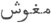

  
[Intangible Textual Heritage](../../index)  [Zoroastrianism](../index) 
[Index](index)  [Previous](sbe2303)  [Next](sbe2305) 

------------------------------------------------------------------------

[Buy this Book at
Amazon.com](https://www.amazon.com/exec/obidos/ASIN/1402185898/internetsacredte)

------------------------------------------------------------------------

*The Zend Avesta, Part II (SBE23)*, James Darmesteter, tr. \[1882\], at
Intangible Textual Heritage

------------------------------------------------------------------------

### SÎRÔZAH I.

#### 1. Ormazd.

To Ahura Mazda, bright and glorious [2](#fn_5),
and to the Amesha-Spe*ñ*tas [3](#fn_6).

p. 4

#### 2. Bahman.

To Vohu-Manô [1](#fn_7); to Peace [2](#fn_8), whose breath is friendly [3](#fn_9), and who is more powerful to destroy than
all other creatures [4](#fn_10); to the heavenly
Wisdom [5](#fn_11), made by Mazda; and to the
Wisdom acquired through the ear [5](#fn_11),
made by Mazda.

#### 3. Ardibehe*s*t.

To Asha-Vahi*s*ta, the fairest [6](#fn_12); to
the much-desired Airyaman, made by Mazda [7](#fn_13); to the instrument made by Mazda [8](#fn_14); and to the good Saoka [9](#fn_15), with eyes of love [10](#fn_16), made by Mazda and holy.

p. 5

#### 4. Shahrêvar.

To Khshathra-vairya; to the metals [1](#fn_17);
to Mercy and Charity.

#### 5. Sapendârmad.

To the good Spe*n*ta-Ârmaiti [2](#fn_18), and to
the good Râta [3](#fn_19), with eyes of love,
made by Mazda and holy.

To Haurvatâ*t* [4](#fn_20), the master; to the
prosperity of the seasons and to the years, the masters of holiness.

#### 7. Murdâd.

To Ameretâ*t* [5](#fn_21), the master; to
fatness and flocks; to the plenty of corn; and to the powerful
Gaokerena [6](#fn_22), made by Mazda.

(At the gâh [7](#fn_23) Hâvan): to Mithra [8](#fn_24), the lord of wide pastures and to Râma
*Hv*âstra [9](#fn_25).

(At the gâh Rapithwin): to Asha-Vahi*s*ta and to Âtar [10](#fn_26), the son of Ahura Mazda [11](#fn_27)

p. 6

(At the gâh Uzîren): to Apãm Napâ*t* [1](#fn_28), the tall lord, and to the water made by
Mazda [2](#fn_29).

(At the gâh Aiwisrûthrem): to the Fravashis [3](#fn_30) of the faithful, and to the females that
bring forth flocks of males [4](#fn_31); to the
prosperity of the seasons; to the well-shapen and tall-formed Strength,
to Verethraghna [5](#fn_32), made by Ahura, and
to the crushing Ascendant [6](#fn_33).

(At the gâh Ushahin): to the holy, devout, fiend-smiting Sraosha [7](#fn_34), who makes the world grow; to Rashnu
Razi*s*ta [8](#fn_35), and to Ar*s*tâ*t* [9](#fn_36), who makes the world grow, who makes the
world increase [10](#fn_37).

#### 8. Dai pa Âdar [11](#fn_38).

To the Maker Ahura Mazda, bright and glorious, and to the
Amesha-Spe*n*tas.

p. 7

#### 9. Âdar.

To Âtar, the son of Ahura Mazda; to the Glory and to the Weal, made by
Mazda; to the Glory of the Aryas [1](#fn_39),
made by Mazda; to the awful Glory of the Kavis [2](#fn_40), made by Mazda.

To Âtar, the son of Ahura Mazda; to king Husravah [3](#fn_41); to the lake of Husravah [4](#fn_42); to Mount Âsnava*nt* [5](#fn_43), made by Mazda; to Lake *K*aê*k*asta [6](#fn_44), made by Mazda; to the Glory of the Kavis,
made by Mazda [7](#fn_45).

p. 8

To Âtar, the son of Ahura Mazda; to Mount Raêva*nt* [1](#fn_46), made by Mazda; to the Glory of the Kavis,
made by Mazda [2](#fn_47).

To Âtar, the beneficent, the warrior; the God who is a full source of
Glory, the God who is a full source of healing.

To Âtar, the son of Ahura Mazda, with all Âtars [3](#fn_48); to the God Nairyô-Sangha [4](#fn_49), who dwells in the navel of kings [5](#fn_50).

#### 10. Âbân.

To the good Waters, made by Mazda; to the holy water-spring Ardvi
Anâhita [6](#fn_51); to all waters made by
Mazda; to all plants made by Mazda.

#### 11. Khorshêd.

To the undying, shining, swift-horsed Sun [7](#fn_52).

#### 12. Mâh.

To the Moon that keeps in it the seed of the Bull [8](#fn_53); to the only-created Bull [9](#fn_54); to the Bull of many species [10](#fn_55).

p. 9

#### 13. Tîr.

To Ti*s*trya [1](#fn_56), the bright and
glorious star; to the powerful Satavaêsa [2](#fn_57), made by Mazda, who pushes waters forward;
to the stars, made by Mazda, that have in them the seed of the waters,
the seed of the earth, the seed of the plants [3](#fn_58); to the star Vana*nt* [4](#fn_59), made by Mazda; to those stars that are
seven in number, the Haptôiri*n*gas [6](#fn_61),
made by Mazda, glorious and healing.

#### 14. Gô*s*.

To the body of the Cow, to the soul of the Cow, to the powerful
Drvâspa [5](#fn_60), made by Mazda and holy.

#### 15. Dai pa Mihir.

To the Maker Ahura Mazda, bright and glorious, and to the
Amesha-Spe*n*tas.

#### 16. Mihir.

To Mithra [6](#fn_61), the lord of wide
pastures, who has a thousand ears and ten thousand eyes, a God invoked
by his own name; to Râma *Hv*âstra [7](#fn_62).

#### 17. Srôsh.

To the holy, strong Sraosha [8](#fn_63), who is
the incarnate Word, a mighty-speared and lordly God.

#### 18. Rashn.

To Rashnu Razi*s*ta [9](#fn_64); to
Ar*s*tâ*t* [10](#fn_65), who makes the

p. 10

world grow, who makes the world increase; to the true-spoken speech,
that makes the world grow.

#### 19. Farvardîn.

To the awful, overpowering Fravashis of the holy ones [1](#fn_66).

#### 20. Bahrâm.

To the well-shapen, tall-formed Strength; to Verethraghna [2](#fn_67), made by Ahura; to the crushing Ascendant.

#### 21. Râm.

To Râma *Hv*âstra [3](#fn_68); to Vayu [3](#fn_68), who works highly [4](#fn_69) and is more powerful to destroy than all
other creatures: to that part of thee, O Vayu, that belongs to
Spe*n*ta-Mainyu [5](#fn_70); to the sovereign
Sky, to the Boundless Time [6](#fn_71), to the
sovereign Time of the long Period s.

#### 22. Bâd.

To the bounteous Wind, that blows below, above, before, and behind; to
the manly Courage.

#### 23. Dai pa Dîn.

To the Maker, Ahura Mazda, bright and glorious; to the Amesha-Spe*n*tas.

#### 24. Dîn.

To the most right *K*ista [7](#fn_72), made by
Mazda and holy; to the good Law [7](#fn_72) of
the worshippers of Mazda.

p. 11

#### 25. Ard.

To Ashi Vanguhi [1](#fn_73); to the good
*K*isti [2](#fn_74); to the good Ereth*e* [3](#fn_75); to the good Rasãstâ*t* [4](#fn_76); to the Weal and Glory, made by Mazda; to
Pâre*n*di [5](#fn_77), of the light chariot; to
the Glory of the Aryas made by Mazda; to the kingly Glory made. by
Mazda; to that Glory that cannot be forcibly seized [6](#fn_78), made by Mazda; to the Glory of
Zarathu*s*tra, made by Mazda.

#### 26. Â*s*tâd.

To Ar*s*tâ*t* [7](#fn_79), who makes the world
grow; to Mount Ushi-darena [8](#fn_80), made by
Mazda, the seat of holy happiness.

#### 27. Âsmân.

To the high, powerful Heavens; to the bright, all-happy, blissful abode
of the holy ones.

#### 28. Zemyâd [9](#fn_81).

To the bounteous Earth; to these places, to these fields; to Mount
Ushi-darena [8](#fn_80), made by Mazda, the seat
of holy happiness; to all the mountains made by Mazda, that are seats of
holy happiness, of full happiness; to the kingly Glory made by Mazda;

p. 12

to that Glory that cannot be forcibly seized [1](#fn_82), made by Mazda.

#### 29. Mahraspand.

To the holy, righteousness-performing Mãthra Spe*n*ta [2](#fn_83); to the Law opposed to the Daêvas, the Law
of Zarathu*s*tra; to the long-traditional teaching [3](#fn_84); to the good Law of the worshippers of
Mazda; to the Devotion to the Mãthra Spe*n*ta; to the understanding that
keeps [4](#fn_85) the Law of the worshippers of
Mazda; to the knowledge of the Mãthra Spe*n*ta; to the heavenly Wisdom
made by Mazda; to the Wisdom acquired through the ear [5](#fn_86) and made by Mazda.

#### 30. Anêrân.

To the eternal [6](#fn_87) and sovereign
luminous space [7](#fn_88); to the bright
Garô-nmâna [8](#fn_89); to the sovereign place
of eternal Weal [9](#fn_90); to the
*K*inva*t*-bridge [10](#fn_91), made by Mazda;
to the tall lord Apãm Napâ*t* [11](#fn_92) and
to the water made by Mazda; to Haoma [12](#fn_93), of holy birth; to the pious and good
Blessing; to the awful cursing thought of the wise [13](#fn_94); to all the holy Gods of the

p. 13

heavenly world and of the material one; to the awful, overpowering
Fravashis of the faithful, to the Fravashis of the first men of the law,
to the Fravashis of the next-of-kin [1](#fn_95); to every God invoked by his own
name [2](#fn_96).

------------------------------------------------------------------------

### Footnotes

[3:1](sbe2303.htm#fr_4) J. Halévy, Revue des
Études Juives, 1881, October, p. 188.

[3:2](sbe2304.htm#fr_5) See Yt. I, 1-23.

[3:3](sbe2304.htm#fr_6) See Yt. II.

[4:1](sbe2304.htm#fr_7) See Yt. I, 24-33.

[4:2](sbe2304.htm#fr_8) Âkh*s*ti does not so much
mean Peace as the power that secures peace; see note 4.

[4:3](sbe2304.htm#fr_9) Hãm-vai*n*ti, from hãm-vâ
(Yt. X, 141); possibly from van, to strike: 'Peace that smites.'

[4:4](sbe2304.htm#fr_10) Taradhâtem anyâi*s*
dâmãn, interpreted: tarvînîtârtûm min zakî ân dâmân pun anâshtîh akár
kartan (Phl. Comm.), 'more destroying than other creatures, to make
Non-peace (Anâkh*s*ti) powerless.'

[4:5](sbe2304.htm#fr_12) Âsnya khratu, the
inborn intellect, intuition, contrasted with gaoshô-srûta khratu, the
knowledge acquired by hearing and learning. There is between the two
nearly the same relation as between the parâvidyâ and aparâvidyâ in
Brahmanism, the former reaching Brahma in se (parabrahma), the latter
*s*abdabrahma, the word-Brahma (Brahma as taught and revealed). The
Mobeds of later times interpreted their name Magû*s*,  , as meaning, 'men without
ears,'  , 'pour insinuer
que leur Docteur avait puisé toute sa science dans le ciel et qu’il ne
l’avait pas apprise par l’ouïe comme les autres hommes' (Chardin, III,
130; ed. Amsterdam).

[4:6](sbe2304.htm#fr_13) See Yt. III.

[4:7](sbe2304.htm#fr_14) See Vend. XXII.

[4:8](sbe2304.htm#fr_15) The 'golden instrument'
mentioned in Nyâyi*s* I, 8.

[4:9](sbe2304.htm#fr_16) A personification of
the Ormazdean weal; cf. Vend. XXII, 3 \[8\], and Yt. XIII, 42.

[4:10](sbe2304.htm#fr_17) Vouru-dôithra, kâmak
dôisr; she is 'the genius of the good p. 5 eye,
mînôî hu*k*a*s*mîh' (Vend. XIX, 36 \[523\]), the reverse of the evil eye
(Yasna LXVII, 62 \[LXVIII, 22\]; cf. Études Iraniennes, II, 182).

[5:1](sbe2304.htm#fr_18) Vend. Introd. IV, 33;
Ormazd et Ahriman, §§ 202-206.

[5:2](sbe2304.htm#fr_19) Ibid.

[5:3](sbe2304.htm#fr_20) Vend. Introd. IV, 30.

[5:4](sbe2304.htm#fr_21) See Yt. IV.

[5:5](sbe2304.htm#fr_22) See Vend. Introd. IV,
34.

[5:6](sbe2304.htm#fr_23) The white Hôm, or plant
of immortality; see Vend. Introd. IV, 28.

[5:7](sbe2304.htm#fr_24) See Gâhs.

[5:8](sbe2304.htm#fr_25) See Yt. X.

[5:9](sbe2304.htm#fr_26) See Yt. XV. Cf. Yasna
I, 3 (7-9), where Mithra and Râma are invoked in company with the genius
of the Hâvani period of the day.

[5:10](sbe2304.htm#fr_27) The Genius of Fire.

[5:11](sbe2304.htm#fr_28) Cf. Yasna I, 4
(10-12), where Asha-Vahi*s*ta and Âtar are invoked in company with the
genius of the Rapithwin period of the day.

[6:1](sbe2304.htm#fr_29) Literally 'the Son of
the Waters;' he was originally the Fire of lightning, as born in the
clouds (like the Vedic Apâm napât); he still appears in that character,
Yt. VIII, 34; he is for that reason 'the lord of the females' because
the waters were considered as females (cf. Yasna XXXVIII, 1 \[2\]). But,
as napâ*t* means also 'navel' (the same words having often the two
meanings of navel' and offspring;' cf. nâbhi in the Vedas and the Zend
nâfyô, 'offspring,' from nâfa 'navel'), Apãm Napâ*t* was interpreted as
'the spring of the waters, the navel of the waters,' which was supposed
to be at the source of the Arvand (the Tigris; Neriosengh ad Yasna I, 5
\[15\]); cf. Yt. V, 72.

[6:2](sbe2304.htm#fr_30) Cf. Yasna I, 5
\[13-15\].

[6:3](sbe2304.htm#fr_31) See Yt. XIII.

[6:4](sbe2304.htm#fr_32) Perhaps better: 'to the
flocks of Fravashis of the faithful, men and women.'

[6:5](sbe2304.htm#fr_33) The Genius of Victory;
see Yt. XIV.

[6:6](sbe2304.htm#fr_34) Cf. Yasna I, 6
\[16-19\].

[6:7](sbe2304.htm#fr_35) See Yt. XI and Vend.
Introd. IV, 31; Farg. XVIII, 14 seq.

[6:8](sbe2304.htm#fr_36) The Genius of Truth;
see Yt. XII.

[6:9](sbe2304.htm#fr_37) Truth; see Yt. XVIII.

[6:10](sbe2304.htm#fr_38) Cf. Yasna I, 7
\[20-23\].

[6:11](sbe2304.htm#fr_39) The day before Âdar
(Dai is the Persian ( ,
'yesterday,' which is the same word as the Sanskrit hyas, Latin heri).
The eighth, fifteenth, and twenty-third days of the month are under the
p. 7 rule of Ahura and the Amesha-Spe*n*tas,
like the first day; they have therefore no name of their own and are
named from the day that follows. The month was divided into four weeks,
the first two numbering seven days, the last two numbering eight.

[7:1](sbe2304.htm#fr_40) Or better the Glories
of the Aryas' (Eramde*s*a*s*rî*n*âm): the Glory or *Hv*arenô (Vend.
Introd. IV, II, p. lxiii, note 1) is threefold, according as it
illuminates the priest, the warrior, or the husbandman. Ya*s*t XIX is
devoted to the praise of the *Hv*arenô.

[7:2](sbe2304.htm#fr_41) Or 'the awful kingly
glory:' Kavi means a king, but it is particularly used of the kings
belonging to the second and most celebrated of the two mythical
dynasties of Iran. The Kavis succeeded the Paradhâta or Pêshdâdians, and
Darius Codomanes was supposed to be the last of them. For an enumeration
of the principal Kavis, see Yt. XIII, 132 seq. The *Hv*arenô alluded to
in this clause is the *Hv*arenô of the priest; 'it is the fire known as
Âdaraprâ \[Âdar Frobâ\]; or better Âdar Farnbag: see Études Iraniennes,
II, 84; its object is the science of the priests; by its help priests
become learned and clever' (Sanskrit transl. to the Âtash Nyâyish).

[7:3](sbe2304.htm#fr_42) See Yt. V, 41, note.

[7:4](sbe2304.htm#fr_43) See Yt. XIX, 56.

[7:5](sbe2304.htm#fr_44) A mountain in
Adarbai*g*ân (Bundahi*s* XII, 26), where king Husravah settled the fire
Gushasp.

[7:6](sbe2304.htm#fr_45) See Yt. V, 49.

[7:7](sbe2304.htm#fr_46) The glory of the
warriors, the fire known as Âdar Gushasp or Gushnasp; with its help king
Husravah destroyed the idol-temples near Lake *K*ê*k*ast, and he settled
it on Mount Âsnava*nt* (Bund. XVII, 7).

[8:1](sbe2304.htm#fr_47) A mountain in Khorâsân
on which the Burzîn fire is settled (Bund. XII, 18).

[8:2](sbe2304.htm#fr_48) 'The fire known as
Âdarabura*g*âmihira \[Âdar Burzîn Mihir\]; its object is the science of
husbandry.' King Gu*s*tâsp established it on Mount Raêva*nt* (Bund.
XVII, 8).

[8:3](sbe2304.htm#fr_49) All sorts of fires. See
another classification, Yasna XVII, II \[63-67\] and Bundahi*s* XVII, 1.

[8:4](sbe2304.htm#fr_50) See Vend. XXII, 7.

[8:5](sbe2304.htm#fr_51) The fire Nairyô-sangha,
as the messenger of Ahura, burns hereditarily in the bosom of his
earthly representative, the king.

[8:6](sbe2304.htm#fr_52) See Yt. V.

[8:7](sbe2304.htm#fr_53) See Yt. VI.

[8:8](sbe2304.htm#fr_54) See Yt. VII and Vend.
XXI, I, text and note.

[8:9](sbe2304.htm#fr_55) Aêvô-dâta gâu*s*; see
Vend. l. l. and Bundahi*s* IV.

[8:10](sbe2304.htm#fr_56) Pouru-saredha gâu*s*:
the couple born of the seed of the p. 9
only-created Bull, and from which arose two hundred and eighty species
(Bund. XI, 3).

[9:1](sbe2304.htm#fr_57) See Yt. VIII.

[9:2](sbe2304.htm#fr_58) See Yt. VIII, 9.

[9:3](sbe2304.htm#fr_59) See Yt. XII, 29-31.

[9:4](sbe2304.htm#fr_60) See Yt. VIII, 12.

[9:5](sbe2304.htm#fr_62) See Yt. IX.

[9:6](sbe2304.htm#fr_63) See Yt. X.

[9:7](sbe2304.htm#fr_64) See Yt. XV.

[9:8](sbe2304.htm#fr_65) See Yt. XI.

[9:9](sbe2304.htm#fr_66) See Yt. XII.

[9:10](sbe2304.htm#fr_67) See Yt. XVIII.

[10:1](sbe2304.htm#fr_68) See Yt. XIII.

[10:2](sbe2304.htm#fr_69) See Yt. XIV.

[10:3](sbe2304.htm#fr_71) See Yt. XV.

[10:4](sbe2304.htm#fr_72) Powerfully.

[10:5](sbe2304.htm#fr_73) See Yt. XV, 1.

[10:6](sbe2304.htm#fr_74) See Vend. Introd. IV,
39 and lxxxii, 1.

[10:7](sbe2304.htm#fr_76) See Yt. XVI.

[11:1](sbe2304.htm#fr_77) See Yt. XVII.

[11:2](sbe2304.htm#fr_78) Religious knowledge,
wisdom (far*g*ânak; nirvâna*gn*ânam).

[11:3](sbe2304.htm#fr_79) Thought (*k*ittam).

[11:4](sbe2304.htm#fr_80) Thoughtfulness
(*k*ittasthiti).

[11:5](sbe2304.htm#fr_81) The keeper of
treasures; cf. Vend. Introd. IV, 30.

[11:6](sbe2304.htm#fr_82) A*hv*aretem *hv*arenô:
'the *hv*arenô of the priests: that it cannot be forcibly seized means
that one must take possession of it through virtue and righteous
exertion' (Neriosengh and Pahl. Comm. to Yasna I and IV, 14 \[42\]).

[11:7](sbe2304.htm#fr_83) See Yt. XVIII.

[11:8](sbe2304.htm#fr_86) See Yt. I, 31, text
and note.

[11:9](sbe2304.htm#fr_85) See Yt. XIX.

[12:1](sbe2304.htm#fr_87) See [p. 11](#page_11),
note [6](#fn_78).

[12:2](sbe2304.htm#fr_88) The Holy Word.

[12:3](sbe2304.htm#fr_89) Daregha upayana: the
Genius of Teaching (*s*ixâm ad*ris*yarûpi*n*îm; Yasna I, 12 \[401).

[12:4](sbe2304.htm#fr_90) In memory.

[12:5](sbe2304.htm#fr_91) See above, § 2.

[12:6](sbe2304.htm#fr_92) Or boundless (anaghra;
the Parsi anêrân).

[12:7](sbe2304.htm#fr_93) Or Infinite Light; see
Vend. Introd. p. lxxxii and Bund. I. 2.

[12:8](sbe2304.htm#fr_94) The abode of Ahura
Mazda; see Vend. XIX, 32.

[12:9](sbe2304.htm#fr_95) See Vend. XIX, 36,
note 1.

[12:10](sbe2304.htm#fr_96) See Vend. XIX, 29,
note 3.

[12:11](sbe2304.htm#fr_97) See Sîrôzah II, 7,
note.

[12:12](sbe2304.htm#fr_98) See Vend. Introd. IV,
28.

[12:13](sbe2304.htm#fr_99) 'The blessing
(âfriti) is twofold: one by thought, one by words; the blessing by words
is the more powerful; the curse p. 13
(upamana) in thought is the more powerful' (Neriosengh ad Yasna I, 15
\[44\]). Upamana is the same as the Vedic manyu.

[13:1](sbe2304.htm#fr_100) See Yt. XIII, 0.

[13:2](sbe2304.htm#fr_101) In contradistinction
to general invocations.

------------------------------------------------------------------------

[Next: Sîrôzah II](sbe2305)
