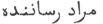
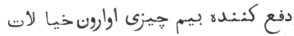
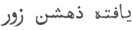
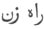
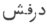
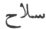

  
[Intangible Textual Heritage](../../index)  [Zoroastrianism](../index) 
[Index](index)  [Previous](sbe2305)  [Next](sbe2307) 

------------------------------------------------------------------------

[Buy this Book at
Amazon.com](https://www.amazon.com/exec/obidos/ASIN/1402185898/internetsacredte)

------------------------------------------------------------------------

*The Zend Avesta, Part II (SBE23)*, James Darmesteter, tr. \[1882\], at
Intangible Textual Heritage

------------------------------------------------------------------------

p. 21

### I. ORMAZD YA*S*T.

The Ormazd Ya*s*t, properly so called, ends with § 23. The rest of the
Ya*s*t, from § 24 to the end, is wanting in several manuscripts, and is
supposed by the Parsis to be a fragment of the Bahman Ya*s*t.

The Ormazd Ya*s*t is exclusively devoted to an enumeration of the names
of Ahura and to a laudation of their virtues and efficacy: the
recitation of these names is the best defence against all dangers.

§§ 1-6. The names of Ahura Mazda are the most powerful part of the Holy
Word.

§§ 7-8. The twenty names of Ahura Mazda are enumerated.

§§ 9-11. Efficacy of these names.

§§ 12-15. Another list of names.

§§ 16-19. Efficacy of Ahura's names.

§§ 20-23. Sundry formulas of invocation.

As may be seen from this summary, the subject has been treated twice
over, first in §§ 1-11, and then in §§ 12-19; yet it does not appear
that this Ya*s*t was formed out of two independent treatises, and it is
more likely that the vague and indefinite enumeration in §§ 12-15, which
interrupts so clumsily the train of ideas, is due either to an
interpolation or simply to the literary deficiency of the writer
himself.

The Ormazd Ya*s*t is recited every day at the Hâvan Gâh, after the
morning prayer (Anquetil, Zend-Avesta, II, 143): it is well also to
recite it when going to sleep and when changing one's residence (§ 17).

Speculations on the mystical powers of God's names have always been
common among Orientals. The number of these names went on increasing:
Dastûr Nôshîrvân wrote on the roc names of God; Dastûr Marzbân on his
125 names. With the Musulmans, Allah had 1001 names. On the names of God
among the Jews, see Zeitschrift der Deutschen Morgenländischen
Gesellschaft, XXXV, pp. 162, 532.

We have three native translations of this Ya*s*t; one in Pahlavi (East
India Office, XII, 39, and St. Petersburg, XCIX, 39; edited by Carl
Salemann), one in Persian (East India Office, XXII, 43), and one in
Sanskrit (Paris, fonds Burnouf, V, 66); the last two edited in our
Études Iraniennes, II, 255).

p. 22

The second part of the Ya*s*t, the so-called Bahman Ya*s*t fragment, is
in a state of the utmost corruption. It is difficult to trace any
connection in the ideas, yet §§ 28, 29, 30 seem to point rather clearly
to the final struggle between Ormazd and Ahriman and to the annihilation
of the Daêvas, and, thereby, some connection is established between this
fragment and the Pahlavi Bahman Ya*s*t [1](#fn_98), which deals with the same subject. If
that correspondence be real, § 26 might refer to the beginning of the
Pahlavi Bahman Ya*s*t, in which Zarathu*s*tra is shown by Ahura the
times to come and the end of the world.

Of this fragment we have only a bad Pahlavi translation in the St.
Petersburg manuscript mentioned above.

\_\_\_\_\_\_\_\_\_\_\_\_\_\_\_\_\_\_\_\_\_\_\_\_\_\_\_

0 [2](#fn_99). May Ahura Mazda be rejoiced! May
Angra Mainyu be destroyed! by those who do truly what is the foremost
wish (of God [3](#fn_100)).

I praise well-thought, well-spoken, and well-done thoughts, words, and
deeds. I embrace all good thoughts, good words, and good deeds; I reject
all evil thoughts, evil words, and evil deeds.

I give sacrifice and prayer unto you, O Amesha-Spe*n*tas! even with the
fulness of my thoughts, of my words, of my deeds, and of my heart: I
give unto you even my own life [4](#fn_101).

I recite the 'Praise of Holiness [5](#fn_102):'

'Ashem Vohû: Holiness is the best of all good. Well is it for it, well
is it for that holiness which is perfection of holiness!'

I confess myself a worshipper of Mazda, a follower of Zarathu*s*tra, one
who hates the Daêvas and obeys the laws of Ahura [6](#fn_103);

p. 23

For sacrifice [1](#fn_104), prayer,
propitiation, and glorification unto \[Hâvani\] [2](#fn_105), the holy and master of holiness;

For sacrifice, prayer, propitiation, and glorification unto \[Sâvanghi
and Vîsya\] [3](#fn_106), the holy and masters
of holiness;

For sacrifice, prayer, propitiation, and glorification unto the Masters
of the days, of the periods of the day, of the months, of the seasons,
and of the years [4](#fn_107);

Unto AHURA MAZDA, bright and glorious, be propitiation, with sacrifice,
prayer, propitiation, and glorification.

Yathâ ahû vairyô: The will of the Lord is the law of holiness: the
riches of Vohû-Manô shall be given to him who works in this world for
Mazda, and wields according to the will of Ahura the power he gave him
to relieve the poor.

1\. Zarathu*s*tra asked Ahura Mazda: 'O Ahura Mazda, most beneficent
Spirit, Maker of the material world, thou Holy One!

'What of the Holy Word is the strongest? What is the most victorious?
What is the most glorious? What is the most effective?

2\. 'What is the most fiend-smiting? What is the best-healing? What
destroyeth best the malice of Daêvas and Men? What maketh the material
world best come to the fulfilment of its wishes [5](#fn_108)? What freeth the material world best
from the anxieties of the heart [6](#fn_109)?'

p. 24

3\. Ahura Mazda answered: 'Our Name, O Spitama Zarathu*s*tra! who are
the Amesha-Spe*n*tas, that is the strongest part of the Holy Word; that
is the most victorious; that is the most glorious; that is the most
effective;

4\. 'That is the most fiend-smiting; that is the best-healing; that
destroyeth best the malice of Daêvas and Men; that maketh the material
world best come to the fulfilment of its wishes; that freeth the
material world best from the anxieties of the heart.'

5\. Then Zarathu*s*tra said: 'Reveal unto me that name of thine, O Ahura
Mazda! that is the greatest, the best, the fairest, the most effective,
the most fiend-smiting, the best-healing, that destroyeth best the
malice of Daêvas and Men;

6\. 'That I may afflict all Daêvas and Men; that I may afflict all Yâtus
and Pairikas [1](#fn_110); that neither Daêvas
nor Men may be able to afflict me; neither Yâtus nor Pairikas.'

7\. Ahura Mazda replied unto him: 'My name is the One of whom questions
are asked [2](#fn_111), O holy Zarathu*s*tra!

'My second name is the Herd-giver [3](#fn_112).

'My third name is the Strong One [4](#fn_113).

p. 25

'My fourth name is Perfect Holiness [1](#fn_114).

'My fifth name is All good things created by Mazda, the offspring of the
holy principle. 'My sixth name is Understanding [2](#fn_115);

'My seventh name is the One with understanding.

'My eighth name is Knowledge;

'My ninth name is the One with Knowledge.

8\. 'My tenth name is Weal;

'My eleventh name is He who produces weal.

'My twelfth name is AHURA (the Lord) [3](#fn_116).

'My thirteenth name is the most Beneficent.

'My fourteenth name is He in whom there is no harm [4](#fn_117).

'My fifteenth name is the unconquerable One.

'My sixteenth name is He who makes the true account [5](#fn_118).

'My seventeenth name is the All-seeing One.

'My eighteenth name is the healing One.

'My nineteenth name is the Creator.

My twentieth name is MAZDA (the All-knowing One).

9\. 'Worship me, O Zarathu*s*tra, by day and by

p. 26

night, with offerings of libations well accepted [1](#fn_119). I will come unto thee for help and joy,
I, Ahura Mazda; the good, holy Sraosha will come unto thee for help and
joy; the waters, the plants, and the Fravashis of the holy ones will
come unto thee for help and joy.

10\. 'If thou wantest, O Zarathu*s*tra, to destroy the malice of Daêvas
and Men, of the Yâtus and Pairikas, of the oppressors, of the blind and
of the deaf [2](#fn_120), of the two-legged
ruffians [3](#fn_121), of the two-legged
Ashemaoghas [4](#fn_122), of the four-legged
wolves;

And of the hordes with the wide front, with the many spears [5](#fn_123), with the straight spears, with the
spears uplifted, bearing the spear of havock; then, recite thou these my
names every day and every night.

p. 27

12\. 'I am the Keeper [1](#fn_124) I am the
Creator and the Maintainer [2](#fn_125); I am
the Discerner [3](#fn_126)s; I am the most
beneficent Spirit.

'My name is the bestower of health; my name is the best bestower of
health.

'My name is the Âthravan [4](#fn_127); my name
is the most Âthravan-like of all Âthravans.

'My name is Ahura (the Lord).

'My name is Mazd*a*u (the all-knowing).

'My name is the Holy; my name is the most Holy.

'My name is the Glorious; my name is the most Glorious.

'My name is the Full-seeing; my name is the Fullest-seeing.

'My name is the Far-seeing; my name is the Farthest-seeing.

13\. 'My name is the Protector; my name is the Well-wisher; my name is
the Creator; my name is the Keeper; my name is the Maintainer.

'My name is the Discerner; my name is the Best Discerner.

'My name is the Prosperity-producer [5](#fn_128); my name is the Word of Prosperity [6](#fn_129).

'My name is the King who rules at his will;

p. 28

my name is the King who rules most at his will.

'My name is the liberal King [1](#fn_130); my
name is the most liberal King.

14\. 'My name is He who does not deceive; my name is He who is not
deceived.

'My name is the good Keeper; my name is He who destroys malice; my name
is He who conquers at once; my name is He who conquers everything; my
name is He who has shaped everything [2](#fn_131).

'My name is All weal; my name is Full weal; my name is the Master of
weal.

15\. 'My name is He who can benefit at his wish; my name is He who can
best benefit at his wish.

'My name is the Beneficent One; my name is the Energetic One; my name is
the most Beneficent.

'My name is Holiness; my name is the Great One; my name is the good
Sovereign; my name is the Best of Sovereigns.

'My name is the Wise One; my name is the Wisest of the Wise; my name is
He who does good for a long time.

16\. 'These are my names.

'And he who in this material world, O Spitama Zarathu*s*tra! shall
recite and pronounce those names of mine [3](#fn_132) either by day or by night;

p. 29

17\. 'He who shall pronounce them, when he rises up or when he lays him
down; when he lays him down or when he rises up; when he binds on the
sacred girdle [1](#fn_133) or when he unbinds
the sacred girdle; when he goes out of his dwelling-place, or when he
goes out of his town, or when he goes out of his country and comes into
another country;

18\. 'That man, neither in that day nor in that night, shall be wounded
by the weapons of the foe who rushes Aêshma-like [2](#fn_134) and is Dru*g*-minded; not the knife, not
the cross-bow, not the arrow, not the sword, not the club, not the
sling-stone [3](#fn_135) shall reach and wound
him.

19\. 'But those names shall come in to keep him from behind and to keep
him in front [4](#fn_136), from the Dru*g*
unseen, from the female Varenya fiend [5](#fn_137), from the evil-doer [6](#fn_138) bent on mischief [7](#fn_139), and from that fiend who is all death,
Angra Mainyu. It will be as if there were a thousand men watching over
one man [8](#fn_140).

20\. ' "Who is he who will smite the fiend in order to maintain thy
ordinances? Teach me clearly thy

p. 30

rules for this world and for the next, that Sraosha may come with
Vohu-Manô and help whomsoever thou pleasest [1](#fn_141)."

21\. 'Hail to the Glory of the Kavis [2](#fn_142)! Hail to the Airyanem Vaê*g*ah [3](#fn_143)! Hail to the Saoka [4](#fn_144), made by Mazda! Hail to the waters of
the Dâitya [5](#fn_145)! Hail to Ardvi [6](#fn_146), the undefiled well! Hail to the whole
world of the holy Spirit!

'Yathâ ahû vairyô: The will of the Lord . . . . [7](#fn_147)

'Ashem Vohû: Holiness is the best of all good. . . . [8](#fn_148)

22\. 'We worship the Ahuna Vairya [9](#fn_149).
We worship Asha-Vahi*s*ta, most fair, undying, and beneficent [10](#fn_150). We worship Strength and Prosperity and
Might and Victory and Glory and Vigour [11](#fn_151). We worship Ahura Mazda, bright and
glorious.

'Yênghê hâtãm [12](#fn_152): All those
beings [13](#fn_153) of whom Ahura Mazda knows
the goodness [14](#fn_154) for a sacrifice

p. 31

\[paragraph continues\] \[performed\] in
holiness, all those beings, males [1](#fn_155)
and females [2](#fn_156), do we worship.

23\. 'Yathâ ahû vairyô: The will of the Lord is the law of holiness . .
. .

'I bless the sacrifice and the prayer unto Ahura Mazda, bright and
glorious, and his strength and vigour [3](#fn_157)

(Bahman Ya*s*t [4](#fn_158).)

24\. 'O Zarathu*s*tra! keep thou for ever that man who is friendly \[to
me\] from the foe unfriendly \[to me\]! Do not give up that friend unto
the stroke (of the foe), unto vexations to be borne; wish no harm unto
that man who would offer me a sacrifice, be it ever so great or ever so
small, if it has reached unto us, the Amesha-Spe*n*tas.

25\. 'Here is Vohu-Manô, my creature, O Zarathu*s*tra! here is
Asha-Vahi*s*ta, my creature, O Zarathu*s*tra! here is Kh*s*athra-Vairya,
my creature, O Zarathu*s*tra! here is Spe*n*ta-Ârmaiti, my creature, O
Zarathu*s*tra! here are Haurvatâ*t* and Ameretâ*t*, who are the reward
of the holy ones [5](#fn_159), when freed from
their bodies, my creatures, O Zarathu*s*tra!

26\. 'Thou knowest this, and how it is, O holy Zarathu*s*tra! from my
understanding and from my knowledge; namely, how the world first
began [6](#fn_160), and how it will end [7](#fn_161).

p. 32

'A thousand remedies, ten thousand remedies [1](#fn_162)!

'A thousand remedies, ten thousand remedies!

'A thousand remedies, ten thousand remedies!

27\. '\[We worship\] the well-shapen, tall-formed Strength;
Verethraghna, made by Ahura; the crushing Ascendant [2](#fn_163), and Spe*n*ta-Ârmaiti.

28\. 'And with the help of Spe*n*ta-Ârmaiti, break ye [3](#fn_164) asunder their [4](#fn_165) malice, turn their minds astray, bind
their hands, make their knees quake against one another, bind their
tongues [5](#fn_166).

'When, O Mazda! shall the faithful smite the wicked [6](#fn_167)? When shall the faithful smite the
Dru*g*? When shall the faithful smite the wicked?'

29\. Then Zarathu*s*tra said: 'I threw you back into the earth [7](#fn_168), and by the eyes of Spe*n*ta-Ârmaiti
 [8](#fn_169) the ruffian was made
powerless [9](#fn_170).

30\. 'We worship the powerful Gaokerena [10](#fn_171), made by Mazda; the powerful Gaokerena,
made by Mazda.

31\. 'We worship the memory of Ahura Mazda, to keep the Holy Word.

'We worship the understanding of Ahura Mazda, to study the Holy Word.

'We worship the tongue of Ahura Mazda, to speak forth the Holy Word.

p. 33

'We worship the mountain that gives understanding, that preserves
understanding [1](#fn_172); \[we worship it\]
by day and by night, with offerings of libations well-accepted [2](#fn_173).

32\. 'We worship that creation \[of Ahura's\], Spe*n*ta-Ârmaiti; and the
holy creations of that creature and of Asha \[Vahi*s*ta\], that are
foremost in holiness [3](#fn_174).

'Here I take as lord and master [4](#fn_175)
the greatest of all, Ahura Mazda; to smite the fiend Angra Mainyu to
smite Aê*s*ma of the wounding spear [5](#fn_176); to smite the Mâzainya fiends 6; to
smite all the Daêvas and the Varenya fiends [6](#fn_177); to increase Ahura Mazda,

p. 34

bright and glorious; to increase the Amesha-Spe*n*tas; to increase the
star Ti*s*trya [1](#fn_178), the bright and
glorious; to increase the faithful men; to increase all the holy
creatures of the Beneficent Spirit.

'Ashem Vohû: Holiness is the best of all good. . . . [2](#fn_179)

33\. '\[Give\] unto that man [3](#fn_180)
brightness and glory, give him health of body, give him sturdiness of
body, give him victorious strength of body, give him full welfare of
wealth, give him a virtuous [4](#fn_181)
offspring, give him long, long life, give him the bright, all-happy,
blissful abode of the holy Ones [5](#fn_182).

'May it come according to my blessing [6](#fn_183)!

'A thousand remedies, ten thousand remedies [7](#fn_184)! (three times.)

'Come to me for help, O Mazda!

'We worship the well-shapen, tall-formed Strength, and Verethraghna,
made by Mazda, and the crushing Ascendant [8](#fn_185).

'We worship Râma *Hv*âstra, and Vayu who works highly and is more
powerful to destroy than all other creatures. That part of thee do we
worship, O Vayu, that belongs to Spe*n*ta Mainyu. We worship the
sovereign Sky, the boundless Time, and the sovereign Time of the long
Period [9](#fn_186).

'Ashem Vohû: Holiness is the best of all good . . . .'

------------------------------------------------------------------------

### Footnotes

[22:1](sbe2306.htm#fr_103) Translated by West
(Pahlavi Texts, I).

[22:2](sbe2306.htm#fr_104) The formulas of this
section serve as an introduction to all Ya*s*ts.

[22:3](sbe2306.htm#fr_105) The last clause of
this sentence is imitated from Yasna XLVI \[XLV\], 19: 'he who does
truly in holiness what was the foremost wish of Zarathu*s*tra' (that is,
what he ordered most earnestly; Pahl. Comm.).

[22:4](sbe2306.htm#fr_106) 'If I must give up
my life for the sake of my soul, I give it up' (Pahl. Comm.). The two
sentences, 'I praise . . . .,' 'I give unto you . . . .,' are taken from
Yasna XI, 17, 18 \[XII\].

[22:5](sbe2306.htm#fr_107) The Ashem Vohû, one
of the holiest and most frequently recited prayers.

[22:6](sbe2306.htm#fr_108) The Fravarânê or
profession of faith of the Zoroastrian (Yasna L 23 \[65-68\]).

[23:1](sbe2306.htm#fr_109) He shows himself a
Zoroastrian by offering sacrifice . . . .

[23:2](sbe2306.htm#fr_110) The actual Gâh
during which the Ya*s*t is being recited must be mentioned here. Hâvani
is the first Gâh (see Gâhs).

[23:3](sbe2306.htm#fr_111) The Genii who
co-operate with Hâvani, his hamkârs; for each Gâh the names of its
proper hamkârs should be mentioned (see Gâh s).

[23:4](sbe2306.htm#fr_112) See Vendîdâd VIII,
19, text and notes.

[23:5](sbe2306.htm#fr_113) Pun mînishn ît barâ
matârtûm, mandûm frârûn (Phl. tr.); manasas asti prâpakatarâ (Sansk.
tr.);   (Pers. tr.).

[23:6](sbe2306.htm#fr_114) Pun akhû it barâ
mûshîtârtûm: pîm(î) u mandûm î apârûn p. 24
(Phl. tr.); vitarkâ*n*âm asti mûshakatarâ (Sansk. tr.);   (Pers. tr.).

[24:1](sbe2306.htm#fr_115) See Vendîdâd,
Introd. IV, 20-21.

[24:2](sbe2306.htm#fr_116) As the revealer of
the law, which is generally expounded by a process of questions from
Zarathu*s*tra and answers from Ahura. The revelation itself is called
spe*n*tô frasna, the holy questions' (Vendîdâd XXII, 19).

[24:3](sbe2306.htm#fr_117) 'That is, I give
herds of men and cattle' (Phl. tr.).

[24:4](sbe2306.htm#fr_118) 'Strong, that is, I
have strength for the works of the law' (Phl. tr.); the Sanskrit
translation has, 'powerful, that is, I have power to create.'

[25:1](sbe2306.htm#fr_119) Asha-Vahi*s*ta,
which is the name of the second Amesha-Spe*n*ta too. The commentary has:
'That is, my own being is all holiness.'

[25:2](sbe2306.htm#fr_120) Literally: 'My sixth
name is that I am Understanding.' The same construction is used with
regard to the eighth, the tenth, and the nineteenth names.

[25:3](sbe2306.htm#fr_121) 'It follows from
this passage that a man is not fit to be a king, unless he possesses
twelve virtues' (Phl. tr.).

[25:4](sbe2306.htm#fr_122) 'Some say: I keep
harm from man' (Phl. tr.).

[25:5](sbe2306.htm#fr_123) 'That is, I make the
account of good works and sins' (Phl. tr.); praka*t*am ga*n*anâkaras
kila pu*n*yapâpayos saṅkhyâm aham karomi (Sansk. tr.). Cf. Yasna XXXII,
6, b.

[26:1](sbe2306.htm#fr_124) Yasô-bereta:
prâptena dânena;  

[26:2](sbe2306.htm#fr_125) The Kavis and the
Karapans, the blind and the deaf, are those 'who cannot see nor hear
anything of God.' Those terms were current in the theological language
of the Sassanian times to designate the unbelievers. An edict,
promulgated by king Yazdgard III (fifth century A.C.) to make
Zoroastrism the state religion in Armenia, had the following words: 'You
must know that any man who does not follow the religion of Mazda is
deaf, blind, and deceived by Ahriman's devs' (Elisaeus, The War of
Vartan).

[26:3](sbe2306.htm#fr_126) Or murderers
(mairya); according to the Parsis highwaymen ( ).

[26:4](sbe2306.htm#fr_127) The heretics.
Casuists distinguish three kinds of Ashemaogha: the deceiver (frîftâr),
the self-willed (khôt dôshak), and the deceived (frîftak). The first and
worst is one who knowingly leads people astray, making forbidden what is
lawful, and lawful what is forbidden; the second is one who follows his
own will and reason, instead of applying to a Dastûr (a spiritual guide)
for direction; the third is one who has been led astray by another.

[26:5](sbe2306.htm#fr_128) Draf*s*a means also
banner: the Persian  ,
derived from draf*s*a, has preserved the two meanings. The Sanskrit
translation has *s*astra, the Persian has 
.

[27:1](sbe2306.htm#fr_129) 'I keep the
creation' (Phl. tr.).

[27:2](sbe2306.htm#fr_130) 'I created the world
and I maintain it' (ibid.).

[27:3](sbe2306.htm#fr_131) I can know what is
useful and what is hurtful' (ibid.).

[27:4](sbe2306.htm#fr_132) 'The priest.'

[27:5](sbe2306.htm#fr_133) 'I impart increase
to the righteous' (Phl. tr.).

[27:6](sbe2306.htm#fr_134) Doubtful.
F*s*û*s*ô-mãthrô is used in several passages as the name of a part of
the Avesta, Yasna LVIII \[LVII\], which appears to be called so from the
presence in it of the words f*s*û*s*a, f*s*ûma*nt*, 'thriving, causing
to thrive,' which aptly express its contents.

[28:1](sbe2306.htm#fr_135) Nâma, translated
âpât, and interpreted Khutâi rât. The Sanskrit translator has misread
âzât for âpât, and translated svatantra, independent.

[28:2](sbe2306.htm#fr_136) The commentator
observes orthodoxly, 'everything good.'

[28:3](sbe2306.htm#fr_137) That is to say, who
will recite this Ya*s*t.

[29:1](sbe2306.htm#fr_138) The aiwyâonghanem or
kôsti (see Vendîdâd XVIII, p. 191, note 4).

[29:2](sbe2306.htm#fr_139) Or 'with anger.'

[29:3](sbe2306.htm#fr_140) Akavô, *k*akavô,
ishavô, kareta, vazra, translated kartari, *k*akra, *s*ara, *s*astrikâ,
va*g*ra.

[29:4](sbe2306.htm#fr_141) Min akhar u lûîn
(Phl. tr.); p*ri*sh*th*a\[ta\]s purata*sk*a (Sansk. tr.).

[29:5](sbe2306.htm#fr_142) Interpreted as the
demon of lust and envy. Cf. Vendîdâd, Introd. IV, 23.

[29:6](sbe2306.htm#fr_143) Kayadha, translated
kâstâr (Phl.), 'the impairer;' kadarthaka (Sansk.), 'he who holds for
nothing, who makes slight of.'

[29:7](sbe2306.htm#fr_144) Doubtful. The Phl.
tr. has 'who impairs living creatures,' etc.

[29:8](sbe2306.htm#fr_145) Cf. Yt. XIII, 71.

[30:1](sbe2306.htm#fr_146) From Yasna XLIV, 16;
cf. Vendîdâd VIII, 20.

[30:2](sbe2306.htm#fr_147) See Sîrôzah I, 9,
[p. 7](sbe2304.htm#page_7), note [2](sbe2304.htm#fn_40).

[30:3](sbe2306.htm#fr_148) Irân Vê*g*; see
Vendîdâd, p. 3.

[30:4](sbe2306.htm#fr_149) Saoka; see Sîrôzah
I, 3.

[30:5](sbe2306.htm#fr_150) See Vendîdâd, p. 5,
note 2.

[30:6](sbe2306.htm#fr_151) Ardvi Sûra Anâhita,
the great goddess of the waters; see Yt. V.

[30:7](sbe2306.htm#fr_152) See above, [p.
23](#page_23).

[30:8](sbe2306.htm#fr_153) See above, [p.
22](#page_22).

[30:9](sbe2306.htm#fr_154) The prayer yathâ ahû
vairyô, known as Ahuna vairya (Honover), from the first words in it: ahû
vairyô. See above, [p. 23](#page_23).

[30:10](sbe2306.htm#fr_155) Or 'the fairest
Amesha-Spe*n*ta;' cf. Vend. Introd. IV, 7.

[30:11](sbe2306.htm#fr_156) Impersonated as
gods, to obtain from them the benefits of which they are the
impersonations.

[30:12](sbe2306.htm#fr_157) A formula found at
the end of most chapters of the Yasna and imitated from Yasna LI \[L\],
22.

[30:13](sbe2306.htm#fr_158) The
Amesha-Spe*n*tas (Pahl. Comm. ad Yasna XXVII, fin.).

[30:14](sbe2306.htm#fr_159) The benefits of
which they dispose, and which they impart as rewards to the righteous.

[31:1](sbe2306.htm#fr_160) The first three.

[31:2](sbe2306.htm#fr_161) The last three,
whose names are feminine.

[31:3](sbe2306.htm#fr_162) Which he will impart
in return to his worshippers.

[31:4](sbe2306.htm#fr_163) See above, [p.
21](#page_21).

[31:5](sbe2306.htm#fr_164) As the Genii who
preside over plants and waters, they are very likely entrusted with the
care of feeding the righteous in Paradise. Cf. Yt. XXII, 18.

[31:6](sbe2306.htm#fr_165) From Yasna XXVIII,
12.

[31:7](sbe2306.htm#fr_166) Cf. Yasna XXX, 4.

[32:1](sbe2306.htm#fr_167) Yasna LXVIII, 15
(LXVII, 50).

[32:2](sbe2306.htm#fr_168) See Sîrôzah I, 20.

[32:3](sbe2306.htm#fr_169) Refers probably to
the Izeds mentioned in the preceding paragraph.

[32:4](sbe2306.htm#fr_170) Of the foes alluded
to § 24.

[32:5](sbe2306.htm#fr_171) Derezvan; see Yt.
XI, 2.

[32:6](sbe2306.htm#fr_172) Cf. Yasna XLVIII
\[XLVII\], 2.

[32:7](sbe2306.htm#fr_173) I follow the reading
zamerena, which is followed by the Pahlavi translation too. In the Yasna
IX, 15 (46) Zarathu*s*tra is said to have obliged the Daêvas to hide
themselves in the earth.

[32:8](sbe2306.htm#fr_174) Cf. Yt. XIX, 94.

[32:9](sbe2306.htm#fr_175) Cf. Vend. IX, 12-13.

[32:10](sbe2306.htm#fr_176) See Sîrôzah I, 7.

[33:1](sbe2306.htm#fr_177) That mount is called
in later literature Mount Ô*s*dâ*s*târ (the Pahlavi translation of
ushi-darena, the keeper of understanding). According to the Bundahi*s*
(XII, 15), it stands in Seistan. High mountains, being nearer heaven,
are apt to become in the spirit of mythology the seat of heavenly beings
or treasures. It was on the top of a mountain that Ahura revealed the
law (see Vd. XXII, 19 \[531); the first man and king, Gayomarth, ruled
on a mountain and was called Gar-shâh, the king of the mountain. When
the Kayanian family failed, the Iranians went to Mount Alborz and found
there Kai Kobâd waiting for his fate.

[33:2](sbe2306.htm#fr_178) The order of the
text differs in one series of manuscripts, in which it begins with § 31;
then comes § 29 with the following additional words:

'A thousand remedies, ten thousand remedies! (three times; cf. above, §
26.)

We worship the Fravashi of the man whose name is Asmô-*hv*anva*nt*; then
I will worship the Fravashis of the other holy ones who were strong of
faith' (Yt. XXII, 37).

\[paragraph continues\] Asmô-*hv*anva*nt*
was one of the first followers of Zarathu*s*tra, and with his name
begins the enumeration of the Fravashis (Yt. XIII, 96).

Then follows § 30, and then again § 31 with the Ashem Vohû: and then the
additional passage, 'We worship . . . .,' is repeated twice.

[33:3](sbe2306.htm#fr_179) Vispêrad XIX, 2.

[33:4](sbe2306.htm#fr_180) As ahu and ratu,
that is, as temporal chief and spiritual guide.

[33:5](sbe2306.htm#fr_181) See Vend. Introd.
IV, 22.

[33:6](sbe2306.htm#fr_182) Ibid. 23.

[34:1](sbe2306.htm#fr_183) See Ya*s*t VIII.

[34:2](sbe2306.htm#fr_184) As above, [p.
22](#page_22).

[34:3](sbe2306.htm#fr_185) Who shall offer thee
a sacrifice. This paragraph is taken from Yasna LXVIII, 11 (LXVII, 32),
where it is addressed to the Waters: 'Ye, good waters, give unto that
man who will offer you a sacrifice . . . .'

[34:4](sbe2306.htm#fr_186) Su*s*îla (Sansk. tr.
ad Yasna LXI, 13).

[34:5](sbe2306.htm#fr_187) This clause serves
as a conclusion to all Ya*s*ts.

[34:6](sbe2306.htm#fr_188) From Yasna LXVIII,
20 (LXVII, 52).

[34:7](sbe2306.htm#fr_189) Cf. above, § 26.

[34:8](sbe2306.htm#fr_190) Cf. Sîrôzah I, 90

[34:9](sbe2306.htm#fr_191) Ibid. 21.

------------------------------------------------------------------------

[Next: II. Haptân Ya*s*t](sbe2307)
