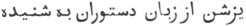

  
[Intangible Textual Heritage](../../index)  [Zoroastrianism](../index) 
[Index](index)  [Previous](sbe2307)  [Next](sbe2309) 

------------------------------------------------------------------------

[Buy this Book at
Amazon.com](https://www.amazon.com/exec/obidos/ASIN/1402185898/internetsacredte)

------------------------------------------------------------------------

*The Zend Avesta, Part II (SBE23)*, James Darmesteter, tr. \[1882\], at
Intangible Textual Heritage

------------------------------------------------------------------------

p. 41

### III. ARDIBEHI*S*T [1](#fn_214) YA*S*T.

This Ya*s*t is for a great part devoted to the praise of the Airyaman
prayer, which is described as driving away all the diseases and plagues
that have been brought upon the world by Angra Mainyu; and when the
writer passes from the glorification of Airyaman to that of
Asha-Vahi*s*ta, which is put into the mouth of Angra Mainyu himself (§§
13 seq.), he makes him speak of Asha-Vahi*s*ta just in the same way, and
ascribe him just the same powers, as he himself has done with regard to
Airyaman. This is owing to the fact of Airyaman being invoked in company
with Asha-Vahi*s*ta in the second formula of the Sîrôzah [2](#fn_215).

The powers ascribed to Asha-Vahi*s*ta have their origin in the twofold
nature of that Amesha-Spe*n*ta, who being, in his abstract character,
the impersonation of the highest element in Mazdeism, Divine Order and
Holiness [3](#fn_216), and in his concrete
character, the genius who presides over the mightiest of physical
elements, Fire [4](#fn_217), is one of the most
powerful and dreaded opponents of Angra Mainyu [5](#fn_218). On the other hand, Airyaman is the
genius to whom Ahura Mazda applied to heal the nine, and ninety, and
nine hundred and nine thousand diseases created by Angra Mainyu [6](#fn_219).

This Ya*s*t is recited every day at the Gâhs Hâvan, Rapithwin, and
Aiwisrûthrem (Anquetil).

\_\_\_\_\_\_\_\_\_\_\_\_\_\_

0\. May Ahura Mazda be rejoiced! . . . .

Ashem Vohû: Holiness is the best of all good . . . .

I confess myself a worshipper of Mazda, a follower of Zarathu*s*tra, one
who hates the Daêvas and obeys the laws of Ahura; For sacrifice, prayer,
propitiation, and glorification unto \[Hâvani\], the holy and master of
holiness [7](#fn_220) . . . .

p. 42

Unto Asha-Vahi*s*ta, the fairest; unto the much-desired Airyaman, made
by Mazda, and unto the good Saoka, with eyes of love, made by Mazda and
holy [1](#fn_221);

Be propitiation, with sacrifice, prayer, propitiation, and
glorification.

Yathâ ahû vairyô: The will of the Lord is the law of holiness [2](#fn_222). . . .

#### I.

1\. Ahura Mazda spake unto Spitama Zarathu*s*tra, saying: 'That thou
mayest increase Asha-Vahi*s*ta, O Spitama Zarathu*s*tra! with hymns of
praise, with performance of the office, with invocations, holy words,
sacrifice, blessings, and adoration—once to abide in the shining
luminous space, in the beautiful abodes [3](#fn_223)—for the sacrifice and invocation of us,
the Amesha-Spe*n*tas [4](#fn_224)' . . . .

2\. Zarathu*s*tra said: 'Say unto me the right words, such as they are,
O Ahura Mazda! that I may increase Asha-Vahi*s*ta, with hymns of praise,

p. 43

with performance of the office, with invocations, holy words, sacrifice,
blessings, and adoration,—once to abide in the shining luminous space,
in the beautiful abodes,—for the sacrifice and invocation of you, the
Amesha-Spe*n*tas.

3 [1](#fn_225). '. . . . I proclaim
Asha-Vahi*s*ta: if I proclaim Asha-Vahi*s*ta, then easy is the way to
the abode of the other Amesha-Spe*n*tas [2](#fn_226), which Ahura Mazda keeps with Good
Thoughts, which Ahura Mazda keeps with Good Words, which Ahura Mazda
keeps with Good Deeds [3](#fn_227);

4\. '(Easy is the way to the Garô-nmâna of Ahura Mazda): the Garô-nmâna
is for the holy souls, and no one of the wicked can enter the Garô-nmâna
and its bright, wide, holy ways; (no one of them can go) to Ahura Mazda.

#### II.

5\. 'The Airyaman prayer [4](#fn_228) smites
down the strength of all the creatures of Angra Mainyu, of the Yâtus and
Pairikas [5](#fn_229). It is the greatest of
spells, the best of spells, the very best of all spells; the

p. 44

fairest of spells, the very fairest of all spells; the fearful one
amongst spells, the most fearful of all spells; the firm one amongst
spells, the firmest of all spells; the victorious one amongst spells,
the most victorious of all spells; the healing one amongst spells, the
best-healing of all spells.

6\. 'One may heal with Holiness, one may heal with the Law, one may heal
with the knife, one may heal with herbs, one may heal with the Holy
Word: amongst all remedies this one is the healing one that heals with
the Holy Word; this one it is that will best drive away sickness from
the body of the faithful: for this one is the best-healing of all
remedies [1](#fn_230).

7\. 'Sickness fled away \[before it\], Death fled away; the Daêva fled
away, the Daêva's counter-work [2](#fn_231)
fled away; the unholy Ashemaogha [3](#fn_232)
fled away, the oppressor of men fled away.

8\. 'The brood of the Snake fled away; the brood of the Wolf fled away;
the brood of the Two-legged [4](#fn_233) fled
away. Pride fled away; Scorn fled away; Hot Fever fled away; Slander
fled away; Discord fled away; the Evil Eye fled away.

9\. 'The most lying words of falsehood fled away; the *G*ahi [5](#fn_234), addicted to the Yâtu, fled away; the

p. 45

\[paragraph continues\] *G*ahi, who makes
one pine [1](#fn_235), fled away; the wind that
blows from the North [2](#fn_236) fled away;
the wind that blows from the North vanished away.

10\. 'He it is who smites me that brood of the Snake, and who might
smite those Daêvas by thousands of thousands, by ten thousands of ten
thousands; he smites sickness, he smites death, he smites the Daêvas, he
smites the Daêva's counter-work, he smites the unholy Ashemaogha, he
smites the oppressor of men.

11\. 'He smites the brood of the Snake; he smites the brood of the Wolf;
he smites the brood of the Two-legged. He smites Pride; he smites Scorn;
he smites Hot Fever; he smites Slander; he smites Discord; he smites the
Evil Eye.

12\. 'He smites the most lying words of falsehood; he smites the *G*ahi,
addicted to the Yâtu; he smites the *G*ahi, who makes one pine. He
smites the wind that blows from the North; the wind that blows from the
North vanished away.

13\. 'He it is who smites me that brood of the Two-legged, and who might
smite those Daêvas, by thousands of thousands, by ten thousands of ten
thousands. Angra Mainyu, who is all death, the worst-lying of all
Daêvas, rushed from before him

14\. 'He exclaimed, did Angra Mainyu: "Woe is me! Here is the god
Asha-Vahi*s*ta, who will smite the sickliest of all sicknesses, who will
afflict the sickliest of all sicknesses;

p. 46

' "He will smite the deadliest of all deaths, he will afflict the
deadliest of all deaths;

' "He will smite the most fiendish of all fiends, he will afflict the
most fiendish of all fiends;

' "He will smite the most counter-working of all counter-works, he will
afflict the most counter-working of all counter-works;

' "He will smite the unholy Ashemaogha, he will afflict the unholy
Ashemaogha;

' "He will smite the most oppressive of the oppressors of men, he will
afflict the most oppressive of the oppressors of men.

15\. ' "He will smite the snakiest of the Snake's brood, he will afflict
the snakiest of the Snake's brood;

' "He will smite the most wolfish of the Wolf's brood, he will afflict
the most wolfish of the Wolf's brood;

' "He will smite the worst of the two-legged brood, he will afflict the
worst of the two-legged brood;

' "He will smite Pride, he will afflict Pride;

' "He will smite Scorn, he will afflict Scorn;

' "He will smite the hottest of hot fevers, he will afflict the hottest
of hot fevers;

' "He will smite the most slanderous of slanders, he will afflict the
most slanderous of slanders;

' "He will smite the most discordant of discords, he will afflict the
most discordant of discords;

' "He will smite the worst of the Evil Eye, he will afflict the worst of
the Evil Eye.

16\. ' "He will smite the most lying words of falsehood, he will afflict
the most lying words of falsehood;

p. 47

' "He will smite the *G*ahi, addicted to the Yâtu, he will afflict the
*G*ahi, addicted to the Yâtu;

' "He will smite the *G*ahi, who makes one pine, he will afflict the
*G*ahi, who makes one pine;

' "He will smite the wind that blows from the North, he will afflict the
wind that blows from the North."

17 [1](#fn_237). 'The Dru*g* will perish away,
the Dru*g* will perish; the Dru*g* will rush, the Dru*g* will vanish.
Thou perishest away to the regions of the North, never more to give unto
death the living world of the holy spirit [2](#fn_238).

18\. 'For his brightness and glory I will offer unto him a sacrifice
worth being heard [3](#fn_239), namely, unto
Asha-Vahi*s*ta, the fairest, the Amesha-Spe*n*ta. Unto Asha-Vahi*s*ta,
the fairest, the Amesha-Spe*n*ta, we offer up the libations, the Haoma
and meat [4](#fn_240), the baresma [5](#fn_241), the wisdom of the tongue [6](#fn_242), the holy spells [7](#fn_243), the speech, the deeds [8](#fn_244), the libations, and the rightly-spoken
words.

'Yê*n*hê hâtãm: All those beings of whom Ahura Mazda knows the
goodness [9](#fn_245) . . . .

19\. 'Yathâ ahû vairyô: The will of the Lord is the law of holiness . .
. .

p. 48

'I bless the sacrifice and prayer and the strength and vigour of
Asha-Vahi*s*ta, the fairest; of the much-desired Airyaman, made by
Mazda; and of the good Saoka, with eyes of love, made by Mazda and
holy [1](#fn_246).

'Ashem Vohû: Holiness is the best of all good [2](#fn_247) . . . .

'\[Give\] unto that man [3](#fn_248) brightness
and glory, give him health of body; . . . . give him the bright,
all-happy, blissful abode of the holy Ones.'

------------------------------------------------------------------------

### Footnotes

[41:1](sbe2308.htm#fr_227) Ard-î-behi*s*t is
the Parsi form for Asha vahi*s*ta, ard being derived from arta, the
Persian form corresponding to the Zend asha.

[41:2](sbe2308.htm#fr_228) See Sîrôzah I, 3,
and below the introductory formula.

[41:3](sbe2308.htm#fr_229) See Vend. Introd.
IV, 30.

[41:4](sbe2308.htm#fr_230) Ibid. 33.

[41:5](sbe2308.htm#fr_231) See Yt. XVII, 18.

[41:6](sbe2308.htm#fr_232) Fargard XXII and
Introd.

[41:7](sbe2308.htm#fr_233) As above, Yt. I, 0.

[42:1](sbe2308.htm#fr_234) Sîrôzah I, 3.

[42:2](sbe2308.htm#fr_235) Several manuscripts
add here the full invocation of the greater Sîrôzah:

'We sacrifice unto Asha-Vahi*s*ta, the fairest, the Amesha-Spe*n*ta;  
We sacrifice unto the much-desired Airyaman;  
We sacrifice unto the instrument, made by Mazda;  
We sacrifice unto the good Saoka, with eyes of love, made by Mazda and
holy.'

[42:3](sbe2308.htm#fr_236) The Garô-nmânem or
Paradise; see Yasna XVI, 7 \[XVII, 42\], Phl. tr.

[42:4](sbe2308.htm#fr_237) The principal clause
appears to be wanting, unless Zarathu*s*tra is supposed to interrupt
Ahura. One might also understand the sentence in an optative sense:
'Mayest thou increase . . .'

[43:1](sbe2308.htm#fr_238) Here again it seems
as if a paragraph had been lost: 'Ahura Mazda answered: Proclaim thou
Asha-Vahi*s*ta; if thou proclaimest Asha-Vahi*s*ta . . . .—Then
Zarathu*s*tra replied: I proclaim Asha-Vahi*s*ta . . .'

[43:2](sbe2308.htm#fr_239) The Garôthmân.

[43:3](sbe2308.htm#fr_240) An allusion to the
three Paradises of Humat, Hûkht, Hvar*s*t, through which the souls of
the blessed pass to Garôthmân (Yt. XXII, 15).

[43:4](sbe2308.htm#fr_241) The prayer known as
Airyama-ishyô; see Vendîdâd XXI, 11-12.

[43:5](sbe2308.htm#fr_242) See Vend. Introd.
IV, 20-21.

[44:1](sbe2308.htm#fr_243) Cf. Vendîdâd VII, 44
(118). That Airyaman made use of the Holy Word (of spells) to cure
diseases appears from Vend. XXII, 6 seq.

[44:2](sbe2308.htm#fr_244) Paityâra: every work
of Ahura was opposed and spoiled by a counter-work of Angra Mainyu. Cf.
Bundahi*s* I, 23 seq.; III, 23 seq.; Vend. I; see Ormazd et Ahriman, §§
195 seq.

[44:3](sbe2308.htm#fr_245) See Yt. I, 10 and
note 4.

[44:4](sbe2308.htm#fr_246) The Ahrimanian
creatures belonging to mankind, the Mairyas and Ashemaoghas (Yt. I, 10).

[44:5](sbe2308.htm#fr_247) The courtezan; cf.
Vend. XXI, 27 (35), and Introd. IV, 25.

[45:1](sbe2308.htm#fr_248) The Zend is
Kahvaredhaini, a synonym of which, Kahvaredha, Yasna LXI, 2 \[LX, 7\],
is translated impairer of Glory, which means very likely: he who makes
one 'dwindle, peak, and pine' (cf. Vend. XVIII, 62-64).

[45:2](sbe2308.htm#fr_249) From the country of
hell; cf. Vend. VII, 2; XIX, 1; Yt. XXII, 25.

[47:1](sbe2308.htm#fr_250) One set of
manuscripts insert: 'He will smite the wind that blows against the
North, he will afflict the wind that blows against the North; the wind
that blows against the North \[will perish\].' This is most likely an
interpolation, as the wind that blows against the North (if this is the
right meaning of aparô apâkhtara, as opposed to pourvô apâkhtara) blows
against Angra Mainyu.

[47:2](sbe2308.htm#fr_251) Cf. Vendîdâd VIII,
21.

[47:3](sbe2308.htm#fr_252) That is to say,
worth being accepted: cf. Yt. X, 32; the Parsis translate, 'a sacrifice
heard \[from the lips of the Dastûrs\]' (
; East India Office, XXV, 42).

[47:4](sbe2308.htm#fr_253) The Haoma and
Myazda.

[47:5](sbe2308.htm#fr_254) See Vend. III, 1,
note 2.

[47:6](sbe2308.htm#fr_255) Hizvô danghah:
huzvân dânâkîh (Phl. tr.) means 'the right formulas.'

[47:7](sbe2308.htm#fr_256) 'The Avesta' (Phl.
tr.).

[47:8](sbe2308.htm#fr_257) The several
operations of the sacrifice.

[47:9](sbe2308.htm#fr_258) As above, Yt. I, 22.

[48:1](sbe2308.htm#fr_259) Cf. Sîrôzah I, 2.

[48:2](sbe2308.htm#fr_260) As above, [p.
22](sbe2306.htm#page_22).

[48:3](sbe2308.htm#fr_261) Who shall offer a
sacrifice to Asha-Vahi*s*ta; cf. Yt. I, 33 and notes.

------------------------------------------------------------------------

[Next: IV. Khordâd Ya*s*t](sbe2309)
