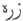
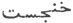
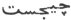
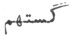
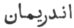
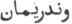
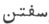

  
[Intangible Textual Heritage](../../index)  [Zoroastrianism](../index) 
[Index](index)  [Previous](sbe2309)  [Next](sbe2311) 

------------------------------------------------------------------------

[Buy this Book at
Amazon.com](https://www.amazon.com/exec/obidos/ASIN/1402185898/internetsacredte)

------------------------------------------------------------------------

*The Zend Avesta, Part II (SBE23)*, James Darmesteter, tr. \[1882\], at
Intangible Textual Heritage

------------------------------------------------------------------------

### V. ÂBÂN YA*S*T.

The Âbân Ya*s*t (or Ya*s*t of the Waters) is devoted to the great
goddess of the waters, the celebrated Ardvi Sûra Anâhita, the Ἀναῖτις of
the Greeks. Ardvi Sûra Anâhita ('the high, powerful, undefiled') is the
heavenly spring from which all waters on the earth flow down; her
fountains are on the top of the mythical mountain, the Hukairya, in the
star region. Her descent from the heavens is described in §§ 85 seq.; it
reminds one of the Indian legend of the celestial Gaṅgâ.

This Ya*s*t contains much valuable information about the historical
legends of Iran, as it enumerates the several heroes who worshipped
Ardvi Sûra and asked for her help. First of all is Ahura himself (§ 16);
then came Haoshyangha (§21), Yima (§ 25), A*z*i Dahâka (§ 29),
Thraêtaona (§ 33), Keresâspa (§ 37), Franghrasyan (§ 41), Kava Usa (§
45), Husravah (§ 49), Tusa (§ 53). Vaêsaka's sons (§ 57), Vafra Navâza
(§ 61), *G*âmâspa (§ 68), Ashavazdah, the son of Pourudhâkh*s*ti, and
Ashavazdah and Thrita, the sons of Sâyu*z*dri (§ 72), Vistauru (§ 76),
Yôi*s*ta (§ 81); the Hvôvas and the Naotaras (§ 98), Zarathu*s*tra (§
103), Kava Vî*s*tâspa (§ 107), Zairivairi (§ 112), Are*g*a*t*-aspa and
Vandaremaini (§ 116).

This enumeration is interrupted by a description of the descent of Ardvi
Sûra from the heavens (§§ 85-89), and of certain rules for her sacrifice
given by herself to Zarathu*s*tra (§§ 90-97). This interruption may have
been intentional, as it takes place just when

p. 53

the course of the enumeration brings us to the times of Zarathu*s*tra
and of the institution of the new religion.

The Ya*s*t is opened with a laudation of the benefits bestowed by Ardvi
Sûra (§§ 1-16), and it closes with a description of her garments and
apparel.

The first record of the worship of Ardvi Sûra is in a cuneiform
inscription by Artaxerxes Mnemon (404-361), in which her name is
corrupted into Anahata. Artaxerxes Mnemon appears to have been an eager
promoter of her worship, as he is said 'to have first erected the
statues of Venus-Anâhita (Ἀφροδίτης, Ἀναΐτιδος) in Babylon, Suza, and
Ecbatana, and to have taught her worship to the Persians, the Bactrians,
and the people of Damas and Sardes' (Clemens Alexandrinus, Protrept. 5,
on the authority of Berosus; about 260 B.C.). My friend M. Halévy
suggests to me that the detailed and circumstantial description of
Anâhita's appearance and costume (in §§ 126-131) shows that the writer
must have described her from a consecrated type of statuary.

The principal data of the Greek writers on Anâhita will be found in
Windischmann's Essay (Die persische Anahita oder Anaïtis, 1856). One
must be cautious in the use of the Greek sources, as the Greeks, with
the eclectic turn of their mind, were inclined to confound under the
name of Anâhita all the great female deities of Asia Minor, and her name
became a common appellation for the Aphrodites as well as for the
Artemides of the East.

\_\_\_\_\_\_\_\_\_\_\_\_\_\_\_\_\_\_\_\_

0\. May Ahura Mazda be rejoiced! . . . .

Ashem Vohû: Holiness is the best of all good . . . .

I confess myself a worshipper of Mazda, a follower of Zarathu*s*tra, one
who hates the Daêvas and obeys the laws of Ahura;

For sacrifice, prayer, propitiation, and glorification unto \[Hâvani\].
the holy and master of holiness . . .

Unto the good Waters, made by Mazda; unto the holy water-spring ARDVI
ANÂHITA; unto all waters, made by Mazda; unto all plants, made by
Mazda [1](#fn_273),

Be propitiation, with sacrifice, prayer, propitiation, and
glorification.

Yathâ ahû vairyô: The will of the Lord is the law of holiness. . . .

p. 54

#### I.

1\. Ahura Mazda spake unto Spitama Zarathu*s*tra, saying: 'Offer up a
sacrifice, O Spitama Zarathu*s*tra! unto this spring of mine, Ardvi Sûra
Anâhita, the wide-expanding [1](#fn_274) and
health-giving, who hates the Daêvas and obeys the laws of Ahura, who is
worthy of sacrifice in the material world, worthy of prayer in the
material world; the life-increasing [2](#fn_275) and holy, the herd-increasing and holy,
the fold-increasing and holy, the wealth-increasing and holy, the
country-increasing and holy;

2\. 'Who makes the seed of all males pure [3](#fn_276), who makes the womb of all females pure
for bringing forth [4](#fn_277), who makes all
females bring forth in safety, who puts milk into the breasts of all
females in the right measure and the right duality;

3\. 'The large river, known afar, that is as large as the whole of the
waters that run along the earth; that runs powerfully from the height
Hukairya [5](#fn_278) down to the sea
Vouru-Kasha [6](#fn_279).

4\. 'All the shores of the sea Vouru-Kasha are

p. 55

boiling over, all the middle of it is boiling over, when she runs down
there, when she streams down there, she, Ardvi Sûra Anâhita, who has a
thousand cells and a thousand channels [1](#fn_280): the extent of each of those cells, of
each of those channels is as much as a man can ride in forty days,
riding on a good horse.

5\. 'From this river of mine alone flow all the waters that spread all
over the seven Karshvares; this river of mine alone goes on bringing
waters, both in summer and in winter. This river of mine purifies the
seed in males, the womb in females, the milk in females' breasts.

6\. 'I, Ahura Mazda, brought it down with mighty vigour, for the
increase of the house, of the borough, of the town, of the country, to
keep them, to maintain them, to look over them, to keep and maintain
them close.

7\. 'Then Ardvi Sûra Anâhita, O Spitama Zarathu*s*tra! proceeded forth
from the Maker Mazda. Beautiful were her white arms, thick as a horse's
shoulder or still thicker; beautiful was her . . . .  [2](#fn_281), and thus came she, strong, with thick
arms, thinking thus in her heart:

8\. ' "Who will praise me? Who will offer me a sacrifice, with libations
cleanly prepared and well-strained, together with the Haoma and meat? To
whom shall I cleave, who cleaves unto me, and thinks with me, and
bestows gifts upon me, and is of good will unto me? [3](#fn_282)"

9\. 'For her brightness and glory, I will offer her

p. 56

a sacrifice worth being heard; I will offer up unto the holy Ardvi Sûra
Anâhita a good sacrifice with an offering of libations;—thus mayest thou
advise us when thou art appealed to! Mayest thou be most fully
worshipped, O Ardvi Sûra Anâhita! with the Haoma and meat, with the
baresma, with the wisdom of the tongue, with the holy spells, with the
words, with the deeds, with the libations, and with the rightly-spoken
words.

'Yê*n*hê hâtãm [1](#fn_283): All those beings
of whom Ahura Mazda . . . .

#### II.

10\. 'Offer up a sacrifice, O Spitama Zarathu*s*tra! unto this spring of
mine, Ardvi Sûra Anâhita, the wide-expanding and health-giving, who
hates the Daêvas and obeys the laws of Ahura, who is worthy of sacrifice
in the material world, worthy of prayer in the material world; the
life-increasing and holy, the herd-increasing and holy, the
fold-increasing and holy, the wealth-increasing and holy, the
country-increasing and holy [2](#fn_284);

11\. 'Who drives forwards on her chariot, holding the reins of the
chariot. She goes driving, on this chariot, longing for men [3](#fn_285) and thinking thus in her heart: "Who
will praise me? Who will offer me a sacrifice, with libations cleanly
prepared and well-strained, together with the Haoma and meat? To whom
shall I cleave, who cleaves unto me, and thinks with me, and bestows
gifts upon me, and is of good will unto me?"

'For her brightness and glory, I will offer her a sacrifice, worth being
heard [4](#fn_286) . . . .

p. 57

#### III.

12\. 'Offer up a sacrifice, O Spitama Zarathu*s*tra! unto this spring of
mine, Ardvi Sûra Anâhita [1](#fn_287). . . .

13\. 'Whom four horses carry, all white, of one and the same colour, of
the same blood, tall, crushing down the hates of all haters, of the
Daêvas and men, of the Yâtus and Pairikas, of the oppressors, of the
blind and of the deaf [2](#fn_288).

'For her brightness and glory, I will offer her a sacrifice . . . .

#### IV.

14\. 'Offer up a sacrifice, O Spitama Zarathu*s*tra! unto this spring of
mine, Ardvi Sûra Anâhita . . . .

15\. 'Strong and bright, tall and beautiful of form, who sends down by
day and by night a flow of motherly [3](#fn_289) waters as large as the whole of the
waters that run along the earth, and who runs powerfully [4](#fn_290).

'For her brightness and glory, I will offer her a sacrifice . . .

#### V.

16\. 'Offer up a sacrifice, O Spitama Zarathu*s*tra! unto this spring of
mine, Ardvi Sûra Anâhita . . . .

17\. 'To her did the Maker Ahura Mazda offer up a sacrifice [5](#fn_291) in the Airyana Vaê*g*ah, by the good
river Dâitya [6](#fn_292); with the Haoma and
meat, with the baresma, with the wisdom of the tongue, with the holy
spells, with the words, with the deeds, with the libations, and with the
rightly-spoken words [7](#fn_293).

p. 58

18\. 'He begged of her a boon, saying: "Grant me this, O good, most
beneficent Ardvi Sûra Anâhita! that I may bring the son of Pourushaspa,
the holy Zarathu*s*tra, to think after my law, to speak after my law, to
do after my law!"

19\. 'Ardvi Sûra Anâhita granted him that boon, as he was offering
libations, giving gifts, sacrificing, and begging that she would grant
him that boon.

'For her brightness and glory, I will offer her a sacrifice . . . .

#### VI.

20\. 'Offer up a sacrifice, O Spitama Zarathu*s*tra! unto this spring of
mine, Ardvi Sûra Anâhita . . . .

21\. 'To her did Haoshyangha, the Paradhâta [1](#fn_294), offer up a sacrifice on the
enclosure [2](#fn_295) of the Hara [3](#fn_296), with a hundred male horses, a thousand
oxen, and ten thousand lambs.

22\. 'He begged of her a boon, saying: "Grant me this, O good, most
beneficent Ardvi Sûra Anâhita! that I may become the sovereign lord of
all countries, of the Daêvas and men, of the

p. 59

\[paragraph continues\] Yâtus and
Pairikas, of the oppressors, the blind and the deaf; and that I may
smite down two thirds [1](#fn_297) of the
Daêvas of Mâzana [2](#fn_298) and of the fiends
of Varena [3](#fn_299)."

23\. Ardvi Sûra Anâhita granted him that boon, as he was offering
libations, giving gifts, sacrificing, and entreating that she would
grant him that boon.

'For her brightness and glory, I will offer her a sacrifice . . .

#### VII.

24\. 'Offer up a sacrifice, O Spitama Zarathu*s*tra! unto this spring of
mine, Ardvi Sûra Anâhita . . . .

25\. 'To her did Yima Khshaêta [4](#fn_300),
the good shepherd, offer up a sacrifice from the height Hukairya [5](#fn_301), with a hundred male horses, a thousand
oxen, ten thousand lambs.

26\. 'He begged of her a boon, saying: "Grant me this, O good, most
beneficent Ardvi Sûra Anâhita! that I may become the sovereign lord of
all countries, of the Daêvas and men, of the Yâtus and Pairikas, of the
oppressors, the blind and the deaf; and that I may take from the Daêvas
both

p. 60

riches and welfare, both fatness and flocks, both weal and Glory [1](#fn_302)."

27\. 'Ardvi Sûra Anâhita granted him that boon, as he was offering
libations, giving gifts, sacrificing, and entreating that she would
grant him that boon.

'For her brightness and glory, I will offer her a sacrifice . . . .

#### VIII.

28\. 'Offer up a sacrifice, O Spitama Zarathu*s*tra! unto this spring of
mine, Ardvi Sûra Anâhita . . . .

29\. 'To her did A*z*i Dahâka [2](#fn_303), the
three-mouthed, offer up a sacrifice in the land of Bawri [3](#fn_304), with a

p. 61

hundred male horses, a thousand oxen, and ten thousand lambs.

30\. 'He begged of her a boon, saying: "Grant me this boon, O good, most
beneficent Ardvi Sûra Anâhita! that I may make all the seven Karshvares
of the earth empty of men."

31\. 'Ardvi Sûra Anâhita did not grant him that boon, although he was
offering libations, giving gifts, sacrificing, and entreating her that
she would grant him that boon.

'For her brightness and glory, I will offer her a sacrifice . . . .

#### IX.

32\. 'Offer up a sacrifice, O Spitama Zarathu*s*tra! unto Ardvi Sûra
Anâhita . . . .

33\. 'To her did Thraêtaona [1](#fn_305), the
heir [2](#fn_306) of the valiant Âthwya clan,
offer up a sacrifice in the four-cornered Varena [3](#fn_307), with a hundred male horses, a thousand
oxen, ten thousand lambs.

34\. 'He begged of her a boon, saying: "Grant me this, O good, most
beneficent Ardvi Sûra Anâhita! that I may overcome A*z*i Dahâka, the
three-mouthed, the three-headed, the six-eyed, who has a thousand
senses [4](#fn_308), that most powerful,
fiendish Dru*g*,

p. 62

that demon, baleful to the world, the strongest Dru*g* that Angra Mainyu
created against the material world, to destroy the world of the good
principle [1](#fn_309); and that I may deliver
his two wives, Savanghavâ*k* and Erenavâ*k* [2](#fn_310), who are the fairest of body amongst
women, and the most wonderful creatures in the world [3](#fn_311)."

35\. Ardvi Sûra Anâhita granted him that boon, as he was offering
libations, giving gifts, sacrificing, and entreating that she would
grant him that boon.

'For her brightness and glory, I will offer her a sacrifice . . .

#### X.

36\. 'Offer up a sacrifice, O Spitama Zarathu*s*tra! unto Ardvi Sûra
Anâhita . . . .

37\. 'To her did Keresâspa [4](#fn_312), the
manly-hearted, offer up a sacrifice behind the Vairi Pisanah [5](#fn_313), with a

p. 63

hundred male horses, a thousand oxen, ten thousand lambs.

38\. 'He begged of her a boon, saying: "Grant me this, O good, most
beneficent Ardvi Sûra Anâhita! that I may overcome the golden-heeled
Ga*n*darewa [1](#fn_314), though all the shores
of the sea Vouru-Kasha are boiling over; and that I may run up to the
stronghold of the fiend on the wide, round earth, whose ends lie afar."

39\. 'Ardvi Sûra Anâhita granted him that boon, as he was offering
libations, giving gifts, sacrificing, and entreating that she would
grant him that boon.

'For her brightness and glory, I will offer her a sacrifice . . .

p. 64

#### XI.

40\. 'Offer up a sacrifice, O Spitama Zarathu*s*tra! unto this spring of
mine, Ardvi Sûra Anâhita . . . .

41\. 'To her did the Turanian murderer, Frangrasyan [1](#fn_315), offer up a sacrifice in his cave under
the earth [2](#fn_316), with a hundred male
horses, a thousand oxen, ten thousand lambs.

42\. 'He begged of her a boon, saying: "Grant me this, O good, most
beneficent Ardvi Sûra Anâhita! that I may seize hold of that Glory [3](#fn_317), that is waving in the middle of the sea
Vouru-Kasha [3](#fn_317) and

p. 65

that belongs to the Aryan people, to those born and to those not yet
born, and to the holy Zarathu*s*tra."

43\. 'Ardvi Sûra Anâhita did not grant him that boon.

'For her brightness and glory, I will offer her a sacrifice . . . .

#### XII.

44\. 'Offer up a sacrifice, O Spitama Zarathu*s*tra! unto this spring of
mine, Ardvi Sûra Anâhita . . . .

45\. 'To her did the great, most wise Kavi Usa [1](#fn_318) offer up a sacrifice from Mount
Erezifya [2](#fn_319), with a hundred male
horses, a thousand oxen, ten thousand lambs.

46\. 'He begged of her a boon, saying: "Grant me this, O good, most
beneficent Ardvi Sûra Anâhita! that I may become the sovereign lord of
all countries, of the Daêvas and men, of the Yâtus and Pairikas, of the
oppressors, the blind and the deaf."

47\. 'Ardvi Sûra Anâhita granted him that boon, as he was offering
libations, giving gifts, sacrificing, and entreating that she would
grant him that boon.

'For her brightness and glory, I will offer her a sacrifice . . . .

#### XIII.

48\. 'Offer up a sacrifice, O Spitama Zarathu*s*tra! unto this spring of
mine, Ardvi Sûra Anâhita . . . .

49\. 'To her did the gallant Husravah [3](#fn_320), he who

p. 66

united the Aryan nations into one kingdom [1](#fn_321), offer up a sacrifice behind the
*K*aê*k*asta lake [2](#fn_322), the deep lake,
of salt waters [3](#fn_323), with a hundred
male horses, a thousand oxen, ten thousand lambs.

50\. 'He begged of her a boon, saying: "Grant me this, O good, most
beneficent Ardvi Sûra Anâhita! that I may become the sovereign lord of
all countries, of Daêvas and men, of the Yâtus and Pairikas, of the
oppressors, the blind and the deaf; and that I may have the lead in
front of all the teams [4](#fn_324) and that he
may not pass through [5](#fn_325) the
forest [6](#fn_326), he, the murderer [7](#fn_327), who now is fiercely [8](#fn_328) striving against me [9](#fn_329) on horseback [10](#fn_330)."

51\. 'Ardvi Sûra Anâhita granted him that boon, as he was offering
libations, giving gifts, sacrificing, and entreating that she would
grant him that boon.

'For her brightness and glory, I will offer her a sacrifice . . . .

#### XIV.

52\. 'Offer up a sacrifice, O Spitama Zarathu*s*tra! unto this spring of
mine, Ardvi Sara Anâhita . . . .

53\. 'To her did the valiant warrior Tusa [11](#fn_331) offer

p. 67

worship on the back of his horse [1](#fn_332),
begging swiftness for his teams, health for his own body, and that he
might, watch with full success [2](#fn_333)
those who hated him, smite down his foes, and destroy at one stroke his
adversaries, his enemies, and those who hated him [3](#fn_334).

54\. 'He begged of her a boon, saying: "Grant me this, O good, most
beneficent Ardvi Sûra Anâhita! that I may overcome the gallant sons of
Vaêsaka [4](#fn_335), by the castle
Khshathrô-saoka, that stands high up on the lofty, holy Kangha [5](#fn_336); that I may smite of the Turanian people
their fifties and their hundreds, their hundreds and their thousands,
their thousands and their tens of thousands, their tens of thousands and
their myriads of myriads."

55\. 'Ardvi Sûra Anâhita granted him that boon [6](#fn_337), as he was offering libations, giving
gifts, sacrificing, and entreating that she would grant him that boon.

'For her brightness and glory, I will offer her a sacrifice . . . .

p. 68

#### XV.

56\. 'Offer up a sacrifice, O Spitama Zarathu*s*tra! unto this spring of
mine, Ardvi Sûra Anâhita . . . .

57\. 'To her did the gallant sons of Vaêsaka offer up a sacrifice in the
castle Khshathrô-saoka, that stands high up on the lofty, holy Kangha,
with a hundred male horses, a thousand oxen, ten thousand lambs.

58\. 'They begged of her a boon, saying: "Grant us this, O good, most
beneficent Ardvi Sûra Anâhita! that we may overcome the valiant warrior
Tusa, and that we may smite of the Aryan people their fifties and their
hundreds, their hundreds and their thousands, their thousands and their
tens of thousands, their tens of thousands and their myriads of
myriads [1](#fn_338)."

59\. 'Ardvi Sûra Anâhita did not grant them that boon.

'For her brightness and glory, I will offer her a sacrifice . . . .

#### XVI.

60\. 'Offer up a sacrifice, O Spitama Zarathu*s*tra! unto this spring of
mine, Ardvi Sûra Anâhita . . . .

61\. 'The old [2](#fn_339) Vafra Navâza
worshipped her, when the strong fiend-smiter, Thraêtaona, flung him up
in the air in the shape of a bird, of a vulture [3](#fn_340).

p. 69

62\. 'He went on flying, for three days and three nights, towards his
own house; but he could not, he could not turn down. At the end of the
third night, when the beneficent dawn came dawning up, then he prayed
unto Ardvi Sûra Anâhita, saying:

63\. ' "Ardvi Sûra Anâhita! do thou quickly hasten helpfully and bring
me assistance at once. I will offer thee a thousand libations, cleanly
prepared and well strained, along with Haomas and meat, by the brink of
the river Rangha, if I reach alive the earth made by Ahura and my own
house."

64\. 'Ardvi Sûra Anâhita hastened unto him in the shape of a maid, fair
of body, most strong, tall-formed, high-girded, pure, nobly born of a
glorious race, wearing shoes up to the ankle, wearing a golden . . .
. [1](#fn_341), and radiant [2](#fn_342).

65\. 'She seized him by the arm: quickly was it done, nor was it long
till, speeding, he arrived at the earth made by Mazda and at his own
house, safe, unhurt, unwounded, just as he was before.

\[66. 'Ardvi Sûra Anâhita granted him that boon, as he was offering up
libations, giving gifts, sacrificing, entreating that she would grant
him that boon [3](#fn_343).\]

'For her brightness and glory, I will offer her a sacrifice . . . .

p. 70

#### XVII.

67\. 'Offer up a sacrifice, O Spitama Zarathu*s*tra! unto this spring of
mine, Ardvi Sûra Anâhita . .

68\. 'To her did *G*âmâspa [1](#fn_344) offer
up a sacrifice, with a hundred horses, a thousand oxen, ten thousand
lambs, when he saw the army of the wicked, of the worshippers of the
Daêvas, coming from afar in battle array.

69\. 'He asked of her a boon, saying: "Grant me this, O good, most
beneficent Ardvi Sûra Anâhita! that I may be as constantly victorious as
any one of all the Aryans [2](#fn_345)."

70\. 'Ardvi Sûra Anâhita granted him that boon, as he was offering up
libations, giving gifts, sacrificing, and entreating that she would
grant him that boon.

'For her brightness and glory, I will offer her a sacrifice . . .

#### XVIII.

71\. 'Offer up a sacrifice, O Spitama Zarathu*s*tra! unto this spring of
mine, Ardvi Sûra Anâhita . . . .

72\. 'To her did Ashavazdah, the son of

p. 71

\[paragraph continues\]
Pourudhâkh*s*ti [1](#fn_346), and Ashavazdah
and Thrita, the sons of Sâyu*z*dri [2](#fn_347), offer up a sacrifice, with a hundred
horses, a thousand oxen, ten thousand lambs, by Apãm Napâ*t*, the tall
lord, the lord of the females, the bright and swift-horsed [3](#fn_348).

73\. 'They begged of her a boon, saying: "Grant us this, O good, most
beneficent Ardvi Sûra Anâhita! that we may overcome the assemblers of
the Turanian Dânus [4](#fn_349), Kara
Asabana [5](#fn_350), and Vara Asabana, and the
most mighty Dûraêkaêta, in the battles of this world [6](#fn_351).

74\. 'Ardvi Sûra Anâhita granted them that boon, as they were offering
up libations, giving gifts, sacrificing, and entreating that she would
grant them that boon.

'For her brightness and glory, I will offer her a sacrifice . . . .

#### XIX.

75\. 'Offer up a sacrifice, O Spitama Zarathu*s*tra! unto this spring of
mine, Ardvi Sûra Anâhita . . . .

76\. 'Vistauru, the son of Naotara [7](#fn_352), worshipped

p. 72

her by the brink of the river Vîtanghuhaiti [1](#fn_353), with well-spoken words, speaking thus:

77\. ' "This is true, this is truly spoken, that I have smitten as many
of the worshippers of the Daêvas as the hairs I bear on my head. Do thou
then, O Ardvi Sûra Anâhita! leave me a dry passage, to pass over the
good Vîtanghuhaiti."

78\. 'Ardvi Sûra Anâhita hastened unto him in the shape of a maid, fair
of body, most strong, tall-formed, high-girded, pure, nobly born of a
glorious race, wearing shoes up to the ankle, with all sorts of
ornaments and radiant [2](#fn_354). A part of
the waters she made stand still, a part of the waters she made flow
forward, and she left him a dry passage to pass over the good
Vîtanghuhaiti [3](#fn_355).

\[79. 'Ardvi Sûra Anâhita granted him that boon, as he was offering up
libations, giving gifts, sacrificing, and entreating that she would
grant him that boon [4](#fn_356).\]

'For her brightness and glory, I will offer her a sacrifice . . . .

#### XX.

80\. 'Offer up a sacrifice, O Spitama Zarathu*s*tra! unto this spring of
mine, Ardvi Sûra Anâhita . . . .'

81\. 'To her did Yôi*s*ta, one of the Fryanas [5](#fn_357),

p. 73

offer up a sacrifice with a hundred horses, a thousand oxen, ten
thousand lambs on the P*e*dvaêpa [1](#fn_358)
of the Rangha.

82\. 'He begged of her a boon, saying: "Grant me this, O good, most
beneficent Ardvi Sûra Anâhita! that I may overcome the evil-doing
Akhtya, the offspring of darkness, and that I may answer the ninety-nine
hard riddles that he asks me maliciously, the evil-doing Akhtya, the
offspring of darkness."

83\. 'Ardvi Sûra Anâhita granted him that boon, as he was offering up
libations, giving gifts, sacrificing, and entreating that she would
grant him that boon.

'For her brightness and glory, I will offer her a sacrifice . . . .

#### XXI.

84\. 'Offer up a sacrifice, O Spitama Zarathu*s*tra! unto this spring of
mine, Ardvi Sûra Anâhita . . . .

85\. 'Whom Ahura Mazda the merciful ordered thus, saying: "Come, O Ardvi
Sûra Anâhita, come from those stars [2](#fn_359) down to the earth made by Ahura,

p. 74

that the great lords may worship thee, the masters of the countries, and
their sons.

86\. ' "The men of strength [1](#fn_360) will
beg of thee swift horses and supremacy of Glory.

' "The Âthravans who read [2](#fn_361) and the
pupils of the Âthravans will beg of thee knowledge and prosperity, the
Victory made by Ahura, and the crushing Ascendant.

87\. ' "The maids of barren womb [3](#fn_362),
longing for a lord [3](#fn_362), will beg of
thee a strong husband;

' "Women, on the point of bringing forth, will beg of thee a good
delivery.

' "All this wilt thou grant unto them, as it lies in thy power, O Ardvi
Sûra Anâhita!"

88\. 'Then Ardvi Sûra Anâhita came forth, O Zarathu*s*tra! down from
those stars to the earth made by Mazda; and Ardvi Sûra Anâhita spake
thus:

89\. "O pure, holy Zarathu*s*tra! Ahura Mazda has established thee as
the master of the material world: Ahura Mazda has established me to keep
the whole of the holy creation.

' "Through my brightness and glory flocks and herds and two-legged men
go on, upon the earth: I, forsooth, keep all good things, made by Mazda,
the offspring of the holy principle, just as a shepherd keeps his
flock."

90\. 'Zarathu*s*tra asked Ardvi Sûra Anâhita: "O Ardvi Sûra Anâhita!
With what manner of sacrifice shall I worship thee? With what manner of
sacrifice shall I worship and forward thee? So that Mazda may make thee
run down (to the earth), that

p. 75

he may not make thee run up into the heavens, above the sun [1](#fn_363); and that the Serpent [2](#fn_364) may not injure thee with . . . . [3](#fn_365), with . . . . [4](#fn_366), with . . . . [5](#fn_367), and . . . . poisons [6](#fn_368)."

91\. 'Ardvi Sûra Anâhita answered: "O pure, holy Spitama! this is the
sacrifice wherewith thou shalt worship me, this is the sacrifice
wherewith thou shalt worship and forward me, from the time when the sun
is rising to the time when the sun is setting.

' "Of this libation of mine thou shalt drink, thou who art an Âthravan,
who hast asked and learnt the revealed law, who art wise, clever, and
the Word incarnate.

92\. ' "Of this libation of mine let no foe drink, no man fever-sick, no
liar, no coward, no jealous one, no woman, no faithful one who does not
sing the Gâthas, no leper to be confined [7](#fn_369).

93\. ' "I do not accept those libations that are drunk in my honour by
the blind, by the deaf, by the wicked, by the destroyers, by the
niggards, by the . . . . [8](#fn_370), nor any
of those stamped with those characters which have no strength for the
holy Word [9](#fn_371).

p. 76

' "Let no one drink of these my libations who is hump-backed or bulged
forward; no fiend with decayed teeth [1](#fn_372)."

94\. 'Then Zarathu*s*tra asked Ardvi Sûra Anâhita "O Ardvi Sûra Anâhita!
What becomes of those libations which the wicked worshippers of the
Daêvas bring unto thee after the sun has set [2](#fn_373)?"

95\. 'Ardvi Sûra Anâhita answered: "O pure, holy Spitama Zarathu*s*tra!
howling, clapping, hopping, and shouting [3](#fn_374), six hundred and a thousand Daêvas, who
ought not to receive that sacrifice [4](#fn_375), receive those libations [5](#fn_376) that men bring unto me after \[the sun
has set\] [6](#fn_377)."

96\. 'I will worship the height Hukairya, of the deep precipices [7](#fn_378), made of gold, wherefrom this mine Ardvi
Sûra Anâhita leaps, from a hundred times the height of a man [8](#fn_379), while she is possessed of as much Glory
as the whole of the waters that run along the earth, and she runs
powerfully [9](#fn_380).

'For her brightness and glory, I will offer her a sacrifice . . . .

#### XXII.

97\. Offer up a sacrifice, O Spitama Zarathu*s*tra! unto this spring of
mine, Ardvi Sara Anâhita . . . .

98\. 'Before whom the worshippers of Mazda

p. 77

stand with baresma in their hands: the Hvôvas did worship her, the
Naotaras did worship her [1](#fn_381); the
Hvôvas asked for riches, the Naotaras asked for swift horses. Quickly
was Hvôva blessed with riches and full prosperity; quickly became
Vî*s*tâspa, the Naotaride, the lord of the swiftest horses in these
countries [2](#fn_382)

99\. \['Ardvi Sûra Anâhita granted them that boon, as they were offering
up libations, giving gifts, sacrificing, and entreating that she would
grant them that boon [3](#fn_383).\]

'For her brightness and glory, I will offer her a sacrifice . . . .

#### XXIII.

100\. Offer up a sacrifice, O Spitama Zarathu*s*tra! unto this spring of
mine, Ardvi Sûra Anâhita . . . .

101\. 'Who has a thousand cells and a thousand channels: the extent of
each of those cells, of each of those channels, is as much as a man can
ride in forty days, riding on a good horse [4](#fn_384). In each channel there stands a palace,
well-founded, shining with a hundred windows, with a thousand columns,
well-built, with ten thousand balconies, and mighty.

102\. 'In each of those palaces there lies a well-laid, well-scented
bed, covered with pillows, and

p. 78

\[paragraph continues\] Ardvi Sûra
Anâhita, O Zarathu*s*tra! runs down there from a thousand times the
height of a man, and she is possessed of as much Glory as the whole of
the waters that run along the earth, and she runs powerfully [1](#fn_385).

#### XXIV.

103\. 'Offer up a sacrifice, O Spitama Zarathu*s*tra! unto this spring
of mine, Ardvi Sûra Anâhita . . . .

104\. 'Unto her did the holy Zarathu*s*tra offer up a sacrifice in the
Airyana Vaê*g*ah, by the good river Dâitya; with the Haoma and meat,
with the baresma, with the wisdom of the tongue, with the holy spells,
with the speech, with the deeds, with the libations, and with the
rightly-spoken words [2](#fn_386).

105\. 'He begged of her a boon, saying: "Grant me this, O good, most
beneficent Ardvi Sûra Anâhita! that I may bring the son of
Aurva*t*-aspa [3](#fn_387), the valiant Kavi
Vî*s*tâspa, to think according to the law, to speak according to the
law, to do according to the law [4](#fn_388)."

106\. 'Ardvi Sûra Anâhita granted him that boon, as he was offering up
libations, giving gifts, sacrificing, and entreating that she would
grant him that boon.

'For her brightness and glory, I will offer her a sacrifice . . . .

p. 79

#### XXV.

107\. 'Offer up a sacrifice, O Spitama Zarathu*s*tra! unto this spring
of mine, Ardvi Sûra Anâhita . . . .

108\. 'Unto her did the tall [1](#fn_389) Kavi
Vî*s*tâspa [2](#fn_390) offer up a sacrifice
behind Lake Frazdânava [3](#fn_391), with a
hundred male horses, a thousand oxen, ten thousand lambs.

109\. 'He begged of her a boon, saying: "Grant me this, O good, most
beneficent Ardvi Sûra Anâhita! that I may overcome Tãthrava*nt*, of the
bad law, and Peshana, the worshipper of the Daêvas, and the wicked
Are*g*a*t*-aspa [4](#fn_392), in the battles of
this world!"

110\. 'Ardvi Sûra Anâhita granted him that boon, as he was offering up
libations, giving gifts, sacrificing, and entreating that she would
grant him that boon.

'For her brightness and glory, I will offer her a sacrifice . . . .

p. 80

#### XXVI.

111\. 'Offer up a sacrifice, O Spitama Zarathu*s*tra! unto this spring
of mine, Ardvi Sûra Anâhita . . . .

112\. 'Unto her did Zairi-vairi [1](#fn_393),
who fought on horseback, offer up a sacrifice behind the river
Dâitya [2](#fn_394), with a hundred male
horses, a thousand oxen, ten thousand lambs.

113\. 'He begged of her a boon, saying: "Grant me this, O good, most
beneficent Ardvi Sûra Anâhita! that I may overcome Peshô-*K*angha the
corpse-burier [3](#fn_395), Humâyaka [4](#fn_396) the worshipper of the Daêvas, and the
wicked Are*g*a*t*-aspa [5](#fn_397), in the
battles of this world.

114\. Ardvi Sûra Anâhita granted him that boon [6](#fn_398), as he was offering up libations, giving
gifts, sacrificing, and entreating that she would grant him that boon.

'For her brightness and glory, I will offer her a sacrifice . . . .

#### XXVII.

115\. 'Offer up a sacrifice, O Spitama Zarathu*s*tra! unto this spring
of mine, Ardvi Sûra Anâhita . . . .

116\. 'Unto her did Are*g*a*t*-aspa and Va*n*daremaini [7](#fn_399)

p. 81

offer up a sacrifice by the sea Vouru-Kasha, with a hundred male horses,
a thousand oxen, ten thousand lambs.

117\. 'They [1](#fn_400) begged of her a boon,
saying: "Grant us this, O good, most beneficent Ardvi
[Sûra](errata.htm#0) Anâhita! that we may conquer the valiant Kavi
Vî*s*tâspa and Zairivairi who fights on horseback, and that we may smite
of the Aryan people their fifties and their hundreds, their hundreds and
their thousands, their thousands and their tens of thousands, their tens
of thousands and their myriads of myriads."

118\. 'Ardvi Sûra Anâhita did not grant them [2](#fn_401) that favour, though they were offering
up libations, giving gifts, sacrificing, and entreating that she should
grant them that favour.

'For her brightness and glory, I will offer her a sacrifice . . . .

#### XXVIII.

119\. 'Offer up a sacrifice, O Spitama Zarathu*s*tra! unto this spring
of mine, Ardvi Sûra Anâhita . . . .

120\. 'For whom Ahura Mazda has made four horses—the wind, the rain, the
cloud, and the sleet—and thus ever [3](#fn_402)
upon the earth it is raining, snowing, hailing, and sleeting; and whose
armies are so many and numbered by nine-hundreds and thousands.

121\. 'I will worship the height Hukairya, of the

p. 82

deep precipices, made of gold, wherefrom this mine Ardvi Sûra Anâhita
leaps, from a hundred times the height of a man, while she is possessed
of as much Glory as the whole of the waters that run along the earth,
and she runs powerfully [1](#fn_403).

'For her brightness and glory, I will offer her a sacrifice . . . .

#### XXIX.

122\. 'Offer up a sacrifice, O Spitama Zarathu*s*tra! unto this spring
of mine, Ardvi Sûra Anâhita . . . .

123\. 'She stands, the good Ardvi Sûra Anâhita, wearing a golden
mantle [2](#fn_404), waiting for a man who
shall offer her libations and prayers, and thinking thus in her heart:

124\. ' "Who will praise me? Who will offer me a sacrifice, with
libations cleanly prepared and well-strained, together with the Haoma
and meat? To whom shall I cleave, who cleaves unto me, and thinks with
me, and bestows gifts upon me, and is of good will unto me [3](#fn_405)?"

'For her brightness and glory, I will offer her a sacrifice . . . .

#### XXX.

325\. 'Offer up a sacrifice, O Spitama Zarathu*s*tra! unto this spring
of mine, Ardvi Sûra Anâhita . . . .

126\. 'Ardvi Sûra Anâhita, who stands carried forth in the shape of a
maid, fair of body, most strong, tall-formed, high-girded, pure, nobly
born of

p. 83

a glorious race [1](#fn_406), wearing along her
. . . . [2](#fn_407) a mantle fully embroidered
with gold;

127\. 'Ever holding the baresma in her hand, according to the rules, she
wears square golden earrings on her ears bored [3](#fn_408), and a golden necklace around her
beautiful neck, she, the nobly born Ardvi Sûra Anâhita; and she girded
her waist tightly, so that her breasts may be well-shaped, that they may
be tightly pressed [4](#fn_409).

128\. 'Upon her head Ardvi Sûra Anâhita bound a golden crown, with a
hundred stars [5](#fn_410), with eight rays, a
fine . . . .  [6](#fn_411), a well-made crown,
in the shape of a . . . . [7](#fn_412), with
fillets streaming down.

129\. 'She is clothed with garments of beaver [8](#fn_413), Ardvi Sûra Anâhita; with the skin of
thirty beavers of those that bear four young ones, that are the finest
kind of beavers; for the skin of the beaver that lives in water is the
finest-coloured of all skins, and when worked at the right time it
shines to the eye with full sheen of silver and gold.

130\. 'Here, O good, most beneficent Ardvi Sûra Anâhita! I beg of thee
this favour: that I, fully blessed, may conquer large kingdoms, rich in
horses [9](#fn_414), with high tributes, with
snorting horses, sounding chariots, flashing swords, rich in aliments,
with stores of food, with well-scented beds [10](#fn_415); that I may have

p. 84

at my wish the fulness of the good things of life and whatever makes a
kingdom thrive [1](#fn_416).

131\. 'Here, O good, most beneficent Ardvi Sûra Anâhita! I beg of thee
two gallant companions, one two-legged and one four-legged [2](#fn_417): one two-legged, who is swift, quickly
rushing, and clever in turning a chariot round in battle; and one
four-legged, who can quickly turn towards either wing of the host with a
wide front, towards the right wing or the left, towards the left wing or
the right.

132\. 'Through the strength of this sacrifice, of this invocation, O
Ardvi Sûra Anâhita! come down from those stars [3](#fn_418), towards the earth made by Ahura,
towards the sacrificing priest, towards the full boiling \[milk [4](#fn_419)\]; come to help him who is offering up
libations, giving gifts, sacrificing, and entreating that thou wouldst
grant him thy favours; that all those gallant warriors may be strong,
like king Vî*s*tâspa.

'For her brightness and glory, I will offer her a sacrifice . . . .

133\. 'Yathâ ahû vairyô: The will of the Lord is the law of holiness . .
. .

'I bless the sacrifice and prayer, and the strength and vigour of the
holy water-spring Anâhita.

'Ashem Vohû: Holiness is the best of all good . . . .

'\[Give\] unto that man brightness and glory, . . . . give him the
bright, all-happy, blissful abode of the holy Ones!'

------------------------------------------------------------------------

### Footnotes

[53:1](sbe2310.htm#fr_291) Sîrôzah I, 10.

[54:1](sbe2310.htm#fr_292) 'As she comes down
to all places' (Phl. tr. ad Yasna LXV, 1 \[LXVI, 2\]).

[54:2](sbe2310.htm#fr_293) Âdhu, translated
*g*ân; 'she makes life longer' (Aspendiârji). Perhaps âdhu will be
better translated springs, rivers (reading *g*ûy instead of *g*ân; cf.
Yt. VIII, 29).

[54:3](sbe2310.htm#fr_294) 'Pure and sound,
without blood and filth' (Phl. tr.).

[54:4](sbe2310.htm#fr_295) 'So that it may
conceive again' (Phl. tr.).

[54:5](sbe2310.htm#fr_296) 'Hûgar the lofty is
that from which the water of Arêdvîvsûr leaps down the height of a
thousand men' (Bundahi*s* XII, 5, tr. West); cf. infra, §§ 96, 121, 126;
Yt. XIII, 24. The Hukairya is mentioned again § 25 and Yt. IX, 8; Yt. X,
88; Yt. XV, 15; Yt. XVII, 28. It appears to be situated in the west
(Bundahi*s* XXIV, 17; II, 7; Minokhired XLIV, 12).

[54:6](sbe2310.htm#fr_297) The
earth-surrounding Ocean; cf. Vendîdâd V, 15 (49) seq., text and notes.

[55:1](sbe2310.htm#fr_298) See the description
§ 101 seq.

[55:2](sbe2310.htm#fr_299) Zao*s*a or zu*s*a,
an ἅπαξ λεγόμενον, seems to designate a part of the body; cf. § 126.

[55:3](sbe2310.htm#fr_300) Cf. §§ 11, 124.

[56:1](sbe2310.htm#fr_301) As above, [p.
30](sbe2306.htm#page_30); § 9 is repeated at the end of every chapter.

[56:2](sbe2310.htm#fr_302) § 10 = § 2.

[56:3](sbe2310.htm#fr_303) Viz. for their
worshipping; cf. Yasna XXIII, 2 \[5\], paiti*s*mare*ñ*ti = Phl.
hûmîtînît, they hope, they expect. Cf. § 123.

[56:4](sbe2310.htm#fr_304) As above, § 9.

[57:1](sbe2310.htm#fr_305) As above, § 10.

[57:2](sbe2310.htm#fr_306) Cf. [p.
26](sbe2306.htm#page_26), note [2](sbe2306.htm#fn_120).

[57:3](sbe2310.htm#fr_307) Doubtful; cf. Yt.
VIII, 47.

[57:4](sbe2310.htm#fr_308) Cf. above, § 3.

[57:5](sbe2310.htm#fr_309) Cf. Vend. Introd.
IV, 9, 40. This is the heavenly prototype of the Mazdean sacrifice as it
was later shown to men by Zarathu*s*tra; cf. § 101.

[57:6](sbe2310.htm#fr_310) Cf. Yt. I, 4 and
notes.

[57:7](sbe2310.htm#fr_311) Cf. Yt. III, 18.

[58:1](sbe2310.htm#fr_312) Haoshyangha was the
first king of the Paradhâta (Pêshdâdyan) dynasty (cf. above, [p.
7](sbe2304.htm#page_7), note [2](sbe2304.htm#fn_40), and Bundahi*s*
XXXI, 1). It is related in Firdausi's Shâh Nâmah that he was the
grandson of Gayomarth, the first man and king, and the son of Syâmak;
that his father having been killed by the black Dîv, he encountered him
at the head of an army of lions, tigers, birds, and Paris, and destroyed
him; he then succeeded his grandfather, and reigned supreme over the
seven Keshvars of the earth.

[58:2](sbe2310.htm#fr_313) Doubtful: upabda =
upabanda, as thribda (Yt. VIII, 55) = thribanda; it appears from Yt. XV,
7 that the place meant here is the Taêra which is said in the Bundahi*s*
(V, 7) to be surrounded by the Albôrz (the Hara).

[58:3](sbe2310.htm#fr_314) The Hara berezaiti
or Albôrz, in Mâzandarân, south of the Caspian Sea, was supposed to
surround the earth; cf. Yt. X, 56.

[59:1](sbe2310.htm#fr_315) A formula frequently
used, not only in the Avesta, but also in the Shâh Nâmah.

[59:2](sbe2310.htm#fr_316) The Daêvas in
Mâzandarân. Mâzandarân was held a place of resort for demons and
sorcerers, and was in the Iranian legend nearly the same as Ceylon is in
the Râmâya*n*a. The Damâvand mountain, to which A*z*i Dahâka was bound,
is the southern boundary of Mâzandarân.

[59:3](sbe2310.htm#fr_317) See Vend. Introd.
IV, 23; cf. this Ya*s*t, § 33.

[59:4](sbe2310.htm#fr_318) Yima Khshaêta
(*G*emshîd), as an earthly king, ruled over the world for a thousand
years, while he made immortality reign in it (Yt. IX, 8; XV, 15; cf.
Vendîdâd II, Introd.).

[59:5](sbe2310.htm#fr_319) See above, § 3.

[60:1](sbe2310.htm#fr_320) After his brother
Takhma Urupa, who reigned before him, had been killed and devoured by
Angra Mainyu (Yt. IV, 11, note).

[60:2](sbe2310.htm#fr_321) When Yima began to
sin and lost the *Hv*arenô (Glory), he was overthrown by A*z*i Dahâka
(Zohâk), who seized the power and reigned in his place for a thousand
years (cf. Yt. XIX, 33 seq.).

A*z*i Dahâka, literally 'the fiendish snake,' was first a mythical
personage; he was the 'snake' of the storm-cloud, and a counterpart of
the Vedic Ahi or V*ri*tra. He appears still in that character in Ya*s*t
XIX seq., where he is described struggling for the *Hv*arenô against
Âtar (Fire), in the sea Vourukasha (Vendîdâd, Introd. IV, 38; cf. this
Ya*s*t, § 90). His struggle with Yima Khshaêta bore at first the same
mythological character, 'the shining Yima' being originally, like the
Vedic Yama, a solar hero: when Yima was turned into an earthly king,
A*z*i underwent the same fate. In the Shâh Nâmah he is described as a
man with two snakes springing from his shoulders: they grew there
through a kiss of Ahriman's. For the myths referring to A*z*i, see
Ormazd et Ahriman, §§ 91-95.

[60:3](sbe2310.htm#fr_322) Babylon (cf. Yt. XV,
19). The usurper A*z*i, being a non-Aryan, was identified with the
hereditary foe, the Chaldæans: the name of Babylon united in it, at the
same time, a dim historical record of the old Assyrian oppression, then
shaken off and forgotten, and an actual expression of the national
antipathy of the Iranians for their Semitic neighbours in Chaldæa. After
the conquest of Persia by the Musulmans, A*z*i was turned at last into
an Arab. The original seat of the A*z*i myths was on the southern coast
of the Caspian Sea (Études Iraniennes, II, 210).

[61:1](sbe2310.htm#fr_323) Thraêtaona
(Ferîdûn), son of Âthwya, conquered A*z*i and bound him to Mount
Damâvand, where he is to stay till the end of the world, when he shall
be let loose and then killed by Keresâspa (Vendîdâd, Introd. IV, 12, 18;
Bauman Ya*s*t III, 55 seq.; Bund. XXIX, 8 seq.).

[61:2](sbe2310.htm#fr_324) Vîsô-puthra =
Pahlavi barbîtâ (see Études Iraniennes, II, 139).

[61:3](sbe2310.htm#fr_325) Cf. Vend. I, 18 and
Introd. IV, 12. Modern tradition supposes Varena to have been the region
of Ghilan (very likely on account of its proximity to Mâzandarân and
Mount Damavand).

[61:4](sbe2310.htm#fr_326) See Yt. X, 82, note.

[62:1](sbe2310.htm#fr_327) Cf. Yt. XIX, 37.

[62:2](sbe2310.htm#fr_328) The two daughters of
Yima, who had been ravished by A*z*i: they are called in the Shâh Nâmah
Shahrinâz and Arnavâz (see Études Iraniennes, II, 213, Savanghavâ*k* et
Erenavâ*k*). Thraêtaona delivered them, and then married them; he had a
son, Airyu, from Arnavâz, and two sons from Shahrinâz, Tura and Sairima;
Airyu, Tura, and Sairima became the kings of Irân, Tûrân, and Rûm.

[62:3](sbe2310.htm#fr_329) Cf. Yt. IX, 14; XV,
24; XVII, 34.

[62:4](sbe2310.htm#fr_330) Keresâspa
(Garshâsp), one of the greatest heroes in the Avestean romance, although
Firdausi has all but passed him over in silence. See his feats, Yt. XIX,
38 seq.; cf. Yt. V, 2 7 seq.; Yasna IX, 10 (29); Vend. I, 10 (36).

[62:5](sbe2310.htm#fr_331) The Pi*s*în valley,
south of Cabool. It was in the land of Cabool that the Keresâspa legend
had its rise, or at least it was localised there. It is in the plain
near the Pi*s*în valley that Keresâspa lies asleep, till the end of the
world comes (see Yt. XIII, 61, note).

[63:1](sbe2310.htm#fr_332) A Parsi poem, of a
very late date, gives further details about Ga*n*darewa. It was a
monster who lived 'in the sea, on the mountain, and in the valley;' he
was called Pâshnah zarah, because the sea did not go above his heel (a
misinterpretation of his Avestean epithet zairi pâshna, golden-heeled,
the Zend zairi being mistaken for the Persian zarah  , sea); his head would rise to
the sun and rub the sky; he could swallow up twelve men at once.
Keresâspa fought him for nine days and nine nights together; he drew him
at last from the bottom of the sea and smashed his head with his club:
when he fell on the ground, many countries were spoiled by his fall
(Spiegel, Die traditionnelle Literatur der Parsen, P. 339, and West,
Pahlavi Texts, II, pp. 369 seq.).

In the Vedic mythology the Gandharva is the keeper of Soma, and is
described now as a god, now as a fiend, according as he is a heavenly
Soma-priest or a jealous possessor who grudges it to man. What was the
original form of the myth in Mazdeism is not clear. In the Shâh Nâmah he
appears as the minister of A*z*i Dahâka. Cf. Yt. XV, 27 seq., and Ormazd
et Ahriman, pp. 99, note 5; 215, note 1.

[64:1](sbe2310.htm#fr_333) Frangrasyan
(Afrâsyâb) was king of Tûrân for two hundred years. The perpetual
struggle between Irân and Tûrân, which lasts to this day, was
represented in the legend by the deadly and endless wars between
Afrâsyâb and the Iranian kings from Mino*k*ihr down to Kai Khosrav (Kavi
Husravah). The chief cause of the feud was the murder of Syâvakhsh
(Syâvarshâna) by Afrâsyâb; Syâvakhsh, son of Kai Kaus (Kava Usa), having
been exiled by his father, at the instigation of his mother-in-law, took
refuge with Afrâsyâb, who received him with honour, and gave him his
daughter in marriage: but the fortune of Syâvakhsh raised the jealousy
of Afrâsyâb's brother, Karsîvaz (Keresavazda), who by means of
calumnious accusations extorted from Afrâsyâb an order for putting him
to death (see Yt. XIX, 77). Syâvakhsh was revenged by his son, Kai
Khosrav, the grandson of Afrâsyâb (Yt. IX, 22).

[64:2](sbe2310.htm#fr_334) Ha*n*kanê: Firdausi
speaks of a cave on the top of a mountain, near Barda (on the frontier
of Adarbai*g*ân), where Afrâsyâb, when defeated, took refuge, and was
discovered by Kai Khosrav; that cave was called 'the cave of Afrâsyâb'
(hang i Afrâsiâb; Shâh Nâmah, IV, 196). In an older form of the legend,
that cave was a palace built under-ground, with walls of iron and a
hundred columns: its height was a thousand times a man's size
(Aogemaidê, § 61; cf. Bund. XII, 20: see etudes Iraniennes, II, 225, Le
Hang d’Afrâsyâb).

[64:3](sbe2310.htm#fr_336) Yt. XIX, 56 seq.

[65:1](sbe2310.htm#fr_337) Kavi Usa (Kai Kaus),
the son of Kavi Kavâta (Kai Kobâd) and the father of Syâvakhsh (see [p.
64](#page_64), note [1](#fn_315)), was the second king of the Kayanian
dynasty.

[65:2](sbe2310.htm#fr_338) Mount Erezifya has
been supposed to be the same as the Sariphi Montes in Ptolemaeus, which
stretch between Margiana and Ariana (Burnouf, Commentaire sur le Yasna,
p. 436).

[65:3](sbe2310.htm#fr_339) Kai Khosrav; cf. [p.
64](#page_64), notes [1](#fn_315) and [2](#fn_316).

[66:1](sbe2310.htm#fr_340) Doubtful.

[66:2](sbe2310.htm#fr_341) A lake in
Adarbai*g*ân, with salt water: fish cannot live in it (Bundahi*s* XXII,
2). It is the same as Lake Urumiah. Its name is miswritten in Firdausi
(Khan*g*ast for Kê*g*ast, 
 for  ).

[66:3](sbe2310.htm#fr_342) Doubtful; see Études
Iraniennes, II, uruyâpa, p. 179.

[66:4](sbe2310.htm#fr_343) In pursuing his
adversary.

[66:5](sbe2310.htm#fr_344) Doubtful (cf. Yt.
XV, 32).

[66:6](sbe2310.htm#fr_345) The White Forest
(ibid.).

[66:7](sbe2310.htm#fr_346) Aurvasâra (ibid.).

[66:8](sbe2310.htm#fr_347) Doubtful.

[66:9](sbe2310.htm#fr_348) Trying to flee and
escape.

[66:10](sbe2310.htm#fr_349) Possibly, 'vieing
in horses' (for the swiftness of the race): cf. Yt. XIX, 77.

[66:11](sbe2310.htm#fr_350) Tusa, in the Shâh
Nâmah Tus; one of the most celebrated Pahlavans of Kai Khosrav; he was
the son of king Naotara. (Nôdar).

[67:1](sbe2310.htm#fr_351) He offers not a full
sacrifice, being on horseback.

[67:2](sbe2310.htm#fr_352) Not to be taken by
surprise.

[67:3](sbe2310.htm#fr_353) Cf. Yt. X, II, 94,
114.

[67:4](sbe2310.htm#fr_354) Vaêsaka was the head
of the Vîsah family, whose foremost member was Pîrân Vîsah, the clever
and upright minister of Afrâsyâb, the Turanian Nestor; but his counsels
were despised for the common ruin, and himself perished with all his
sons in the war against Irân.

[67:5](sbe2310.htm#fr_355) Kangha was a town
founded by Syâvarshâna, during his exile, in a part of the land of
Khvârizm, which is described as an earthly paradise. This city was built
on the top of a high mountain (A*n*tare-Kangha, Yt. XIX, 4). The
Khshathrô-saoka castle is called in the Shâh Nâmah Kang de*z*, 'the
fortress of Kangha;' and, possibly, Khshathrô-saoka is a mere epithet of
dvarem, 'the castle of kingly welfare.'

[67:6](sbe2310.htm#fr_356) According to the
Shâh Nâmah, Kang de*z* was stormed by Kai Khosrav himself.

[68:1](sbe2310.htm#fr_357) Cf. §§ 53-54.

[68:2](sbe2310.htm#fr_358) Doubtful (pourvô);
perhaps 'the man of the primitive faith' (the paoiryô-*t*kaêsha; cf. Yt.
XIII, 0, note): the sacrifice he offers is quite a Zoroastrian one (cf.
§§ 17, 104, and note 2 to the latter).

[68:3](sbe2310.htm#fr_359) An allusion is made
here to a myth, belonging to the Thraêtaona cyclus, of which no other
trace is found in the Avesta (except in Yt. XXIII, 4). It referred most
likely to the time when p. 69 Thraêtaona, on
his march to Bawri, the capital of A*z*i (cf. § 29), arrived at the
Tigris (the Rangha); an angel then came and taught him magic to enable
him to baffle the sortileges of A*z*i (Shah Nâmah). We have in this
passage an instance of his talents as a wizard, and one which helps us
to understand why Thraêtaona is considered as the inventor of magic, and
his name is invoked in spells and incantations (Hamzah Ispahanensis, p.
101; Anquetil, II, pp. 135 seq.). Cf. Yt. XIV, 40 and note.

[69:1](sbe2310.htm#fr_360) Urvîkh*s*na, a word
of doubtful meaning.

[69:2](sbe2310.htm#fr_361) Cf. Yt. V, 78, 126.

[69:3](sbe2310.htm#fr_362) This clause is no
doubt spurious here.

[70:1](sbe2310.htm#fr_363) *G*âmâspa, the prime
minister of Vî*s*tâspa (Kai Gû*s*tâsp), appears here in the character of
a warrior, though generally he is described as a sage and a prophet
(Yasna XLIX \[XLVIII\], 9; LI \[L\], 8; Zardû*s*t Nâmah; yet cf. Yt.
XXIII, 2). The Shâh Nâmah has an episode which recalls this one,
although very different in its spirit, and more in accordance with the
general character of *G*âmâspa. At the moment when the two armies meet
together, Gû*s*tâsp asks *G*âmâsp to reveal to him the issue of the
encounter: *G*âmâsp obeys reluctantly, as the issue is to be fatal to
the Iranians. *G*âmâsp belonged to the Hvôva family.

[70:2](sbe2310.htm#fr_364) Or, 'as all the rest
of the Aryans together.'

[71:1](sbe2310.htm#fr_365) Cf. Yt. XIII, 112.
Ashavazdah, the son of Pourudhâkh*s*ti, is one of the immortals who will
come forth to help Saoshya*nt* in the final struggle (Bundahi*s* XXIX,
6; Yt. XIX, 95).

[71:2](sbe2310.htm#fr_366) Cf. Yt. XIII, 113.

[71:3](sbe2310.htm#fr_367) Cf. above, [p.
6](sbe2304.htm#page_6), note [1](sbe2304.htm#fn_28).

[71:4](sbe2310.htm#fr_368) A Turanian tribe,
Yt. XIII, 37-38.

[71:5](sbe2310.htm#fr_369) Asabana is very
likely an epithet; possibly, 'who kills with a stone' (asan-ban); the
sling was, as it seems, the favourite weapon of the Dânus (Yt. XIII,
38).

[71:6](sbe2310.htm#fr_370) This section is the
only fragment left of the legend of Ashavazdah, which must have been an
important one, since Ashavazdah is one of the immortals (Yt. XIX, 95).

[71:7](sbe2310.htm#fr_371) Cf. Yt. XIII, 102.
Vistauru, being the son of Naotara, is the brother of Tusa, which
identifies him with the Gustahm (
) in the Shâh Nâmah: Nôdar had two sons, Tus and
Gustahm.

[72:1](sbe2310.htm#fr_372) A river not
mentioned elsewhere.

[72:2](sbe2310.htm#fr_373) Cf. §§ 64, 226.

[72:3](sbe2310.htm#fr_374) Firdausi has no
mention of this episode.

[72:4](sbe2310.htm#fr_375) Spurious.

[72:5](sbe2310.htm#fr_376) This legend is fully
told in the Pahlavi tale of Gô*s*ti Fryân (edited and translated by
West): a sorcerer, named Akht, comes with an immense army to the city of
the enigma-expounders, threatening to make it a beaten track for
elephants, if his enigmas are not solved. A Mazdayasnian, named Gô*s*ti
Fryân, guesses the p. 73 thirty-three riddles
proposed by Akht; then, in his turn, he proposes him three riddles which
the sorcerer is unable to guess, and, in the end, he destroys him by the
strength of a Nîrang. Cf. Yt. XIII, 220. This tale, which belongs to the
same widespread cycle as the myth of Oedipus and the Germanic legend of
the Wartburg battle, is found in the Zarathu*s*tra legend too (Vendîdâd
XIX, 4).

[73:1](sbe2310.htm#fr_377) Perhaps an affluent
of the Rangha (cf. Yt. XIII, 29, 29; XV, 27).

[73:2](sbe2310.htm#fr_378) Between the earth
and the region of infinite light there are three intermediate regions,
the star region, the moon region, and the sun region. The star region is
the nearest to the earth, and the sun region is the remotest from it.
Ardvi Sûra has her seat in the star region (Yasna LXV \[LXIV\], 1; Phl.
tr.); cf. Yt. V, 132.

[74:1](sbe2310.htm#fr_379) The warriors.

[74:2](sbe2310.htm#fr_380) To teach.

[74:3](sbe2310.htm#fr_382) Doubtful.

[75:1](sbe2310.htm#fr_383) When the beds of the
rivers are dry, the cause is that Ardvi Sûra sends up her waters to the
higher heavens (to the sun region) instead of sending them down to the
earth (cf. [p. 73](#page_73), note [2](#fn_359)).

[75:2](sbe2310.htm#fr_384) The serpent, A*z*i,
is here A*z*i in his original naturalistic character, the storm-fiend
(cf. Vend. Introd. IV, 38 and this Ya*s*t, § 29, note). The uncleanness
and unhealthiness of the rivers are ascribed to his poison.

[75:3](sbe2310.htm#fr_385) Arethna, an ἅπαξ
λεγόμενον.

[75:4](sbe2310.htm#fr_386) Vaw*z*aka, idem.

[75:5](sbe2310.htm#fr_387) Varenva, idem.

[75:6](sbe2310.htm#fr_388) Varenva poisons.

[75:7](sbe2310.htm#fr_389) Cf. Vend. II, 29.

[75:8](sbe2310.htm#fr_390) ? Rangh*au*.

[75:9](sbe2310.htm#fr_391) Which incapacitate
one for religious works.

[76:1](sbe2310.htm#fr_392) Cf. Vend. II, 29.

[76:2](sbe2310.htm#fr_393) Cf. Vend. VII, 79
and note 2; cf. above, § 91.

[76:3](sbe2310.htm#fr_394) For joy. The
translations of those several words are not certain.

[76:4](sbe2310.htm#fr_395) Doubtful.

[76:5](sbe2310.htm#fr_396) Perhaps, those cups
(yam*au*).

[76:6](sbe2310.htm#fr_397) Filled up from § 94.

[76:7](sbe2310.htm#fr_398) The text here has
vîspô-vahmem, 'worthy of all prayer;' the reading vîspô-vaêmem from Yt.
XII, 24 seems to be better.

[76:8](sbe2310.htm#fr_399) Cf. §§ 102, 121.

[76:9](sbe2310.htm#fr_400) Cf. §§ 4, 102, 121.

[77:1](sbe2310.htm#fr_401) The Hvôva or Hvôgva
family plays as great a part in the religious legend, as the Naotara
family in the heroic one. Two of the Hvôvas, Frashao*s*tra and
*G*âmâspa, were among the first disciples of Zarathu*s*tra and the
prophet married Frashao*s*tra's daughter, Hvôgvi (cf. Yt. XIII, 139).
For the Naotaras, see above, §§ 53, 76. According to the Bundahi*s*,
Vî*s*tâspa did not belong to the Naotara family (XXXI, 28): perhaps he
was considered a Naotaride on account of his wife Hutaosa, who was one
(Yt. XV, 35).

[77:2](sbe2310.htm#fr_402) His very name means
'He who has many horses.'

[77:3](sbe2310.htm#fr_403) Spurious.

[77:4](sbe2310.htm#fr_404) Cf. § 4.

[78:1](sbe2310.htm#fr_405) Cf. § 96.

[78:2](sbe2310.htm#fr_406) Cf. § 17. It is to
be noticed that only Ahura and Zarathu*s*tra (and perhaps Vafra Navâza;
see [p. 68](#page_68), note [2](#fn_339)) offer the pure Zoroastrian
sacrifice.

[78:3](sbe2310.htm#fr_407) Called Lôhrâsp in
Parsi tradition.

[78:4](sbe2310.htm#fr_408) Cf. § 18. The
conversion of Vî*s*tâspa by Zarathu*s*tra is the turning-point in the
earthly history of Mazdeism, as the conversion of Zarathu*s*tra by Ahura
himself is in its heavenly history. Cf. Yt. XXIV and IX, 26.

[79:1](sbe2310.htm#fr_409) Berezaidhi,
translated buland (Yasna LVII, 11 \[LVI, 5, 2\]).

[79:2](sbe2310.htm#fr_410) See Yt. XIII, 99; V,
98, 105.

[79:3](sbe2310.htm#fr_411) A lake in Seistan
(Bundahi*s* XXII, 5); from that lake will rise Hôshêdar Bâmî
(Ukhshya*t*-ereta), the first of the three sons of Zarathu*s*tra, not
yet born (Bahman Ya*s*t III, 13; cf. Yt. XIII, 98).

[79:4](sbe2310.htm#fr_412) Of these three,
Are*g*a*t*-aspa alone is known to Firdausi; he is the celebrated
Ar*g*âsp, who waged a deadly war against Gû*s*tâsp to suppress the new
religion: he stormed Balkh, slaughtered Lôhrâsp and Zartû*s*t
(Zarathu*s*tra), and was at last defeated and killed by Gû*s*tâsp's son,
Isfendyâr. He is the Afrâsyâb of the Zoroastrian period. In the Avesta
he is not called a Turanian (Tura), but a *Hv*yaona; see Yt. IX, 30.

[80:1](sbe2310.htm#fr_413) Zarîr in Firdausi,
the brother of Vî*s*tâspa; cf. Yt. V, 117; XIII, 101.

[80:2](sbe2310.htm#fr_414) The Araxes (Vendîdâd
I, 3).

[80:3](sbe2310.htm#fr_415) Doubtful (cf. Vend.
III, 36 seq.).

[80:4](sbe2310.htm#fr_416) This is perhaps an
epithet to Peshô-Kangha, 'the most malicious.'

[80:5](sbe2310.htm#fr_417) See [p.
79](#page_79), note [4](#fn_392).

[80:6](sbe2310.htm#fr_418) If we may trust the
Shâh Nâmah, she did not grant her favour to the last, as Zarîr was
killed by one of the generals of Ar*g*âsp, Bîdirafsh.

[80:7](sbe2310.htm#fr_419) A brother of
Ar*g*âsp's: his name is slightly altered in Firdausi (Andarîmân
miswritten for Vandarîmân, 
 for 
.); see Études Iraniennes, p. 228).

[81:1](sbe2310.htm#fr_420) The text has the
singular here and in the rest of the sentence: the names of the two
brothers form a sort of singular dvandva; cf. Franghrasyanem
Keresavazdem (Yt. XIX, 77); Ashavazdanghô Thritahê (Yt. XIII, 113; and
same Ya*s*t, 115), and in the present passage Vî*s*tâspô Zairivairi*s*
(see Études Iraniennes, II, 229).

[81:2](sbe2310.htm#fr_421) Both were killed by
Isfendyâr (Shâh Nâmah).

[81:3](sbe2310.htm#fr_422) Mî*s*ti translated
hamê*s*ak, sadâ (Yt. VII, 4).

[82:1](sbe2310.htm#fr_423) § 121 = §§ 96, 102.

[82:2](sbe2310.htm#fr_424) Paitidâna, a mantle,
a tunic (Vend. XIV, 9 \[28\]).

[82:3](sbe2310.htm#fr_425) See §§ 8, 11.

[83:1](sbe2310.htm#fr_426) Cf. §§. 64, 78.

[83:2](sbe2310.htm#fr_427) Zao*s*a; cf. § 7,
note 2.

[83:3](sbe2310.htm#fr_428) Doubtful (sispemna,
from  ).

[83:4](sbe2310.htm#fr_429) Doubtful.

[83:5](sbe2310.htm#fr_430) Gems.

[83:6](sbe2310.htm#fr_431) ? Anupôithwaitim.

[83:7](sbe2310.htm#fr_432) ? Ratha; the usual
meaning of ratha is 'a chariot;' perhaps the round shape of the chest of
a chariot is meant.

[83:8](sbe2310.htm#fr_433) Possibly otter,
Vend. XIV.

[83:9](sbe2310.htm#fr_434) Doubtful.

[83:10](sbe2310.htm#fr_435) Cf. Yt. XVII, 7.

[84:1](sbe2310.htm#fr_436) The translation of
the last clause is doubtful.

[84:2](sbe2310.htm#fr_437) A good horse and a
good driver.

[84:3](sbe2310.htm#fr_438) Cf. §§ 85, 88.

[84:4](sbe2310.htm#fr_439) Aspendiârji ad Vend.
XIX, 40 \[133\]

------------------------------------------------------------------------

[Next: VI. Khôrshê*d* Ya*s*t](sbe2311)
