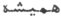

  
[Intangible Textual Heritage](../../index)  [Zoroastrianism](../index) 
[Index](index)  [Previous](sbe2311)  [Next](sbe2313) 

------------------------------------------------------------------------

[Buy this Book at
Amazon.com](https://www.amazon.com/exec/obidos/ASIN/1402185898/internetsacredte)

------------------------------------------------------------------------

*The Zend Avesta, Part II (SBE23)*, James Darmesteter, tr. \[1882\], at
Intangible Textual Heritage

------------------------------------------------------------------------

p. 88

### VII. MÂH YA*S*T.

This Ya*s*t to the Moon is recited on the day of the Moon, and on those
of Bahman, Gô*s*, and Râm [1](#fn_430)
(Anquetil, II, 185). Bah-man and Gô*s* are so far connected with the
Moon that all three are gao*k*ithra: 'Bahman [2](#fn_431), the Moon, and Gô*s* [3](#fn_432), all three, are having in them the seed
of the bull; Bahman can neither be seen nor seized with the hand; the
Moon proceeded from Bahman [4](#fn_433) and can
be seen, but cannot be seized with the hand; Gô*s* proceeded from the
Moon [5](#fn_434) and can both be seen and
seized with the hand [6](#fn_435).' Râm is
referred to here as being *hv*âstra, 'lord of good pastures [7](#fn_436).'

Of this Ya*s*t we have translations in Pahlavi, Persian, and Sanskrit
(edited in Études Iraniennes, II).

\_\_\_\_\_\_\_\_\_\_\_\_\_\_\_\_\_\_\_\_\_\_\_

0\. May Ahura Mazda be rejoiced! . . . .

Ashem Vohû: Holiness is the best of all good . . . .

I confess myself a worshipper of Mazda, a follower of Zarathu*s*tra, one
who hates the Daêvas and obeys the laws of Ahura; For sacrifice, prayer,
propitiation, and glorification unto \[Hâvani\], the holy and master of
holiness . . . .

Unto the Moon that keeps in it the seed of the

p. 89

\[paragraph continues\] Bull; unto the
only-created Bull and unto the Bull [1](#fn_437) of many species;

Be propitiation, with sacrifice, prayer, propitiation, and
glorification.

Yathâ ahû vairyô: The will of the Lord is the law of holiness . . . .

1\. Hail to Ahura Mazda! Hail to the Amesha-Spe*n*tas! Hail to the Moon
that keeps in it the seed of the Bull [2](#fn_438)! Hail to thee when we look at thee! Hail
to thee when thou lookest at us [3](#fn_439)!

2\. How does the moon wax? How does the moon wane?

For fifteen days does the moon wax [4](#fn_440); for fifteen days does the moon wane. As
long as her waxing, so long is the waning [5](#fn_441); as long as her waning, so long is the
waxing.

'Who is there but thee [6](#fn_442) who makes
the moon wax and wane [7](#fn_443)?'

p. 90

3\. We sacrifice unto the Moon that keeps in it the seed of the Bull,
the holy and master of holiness.

Here I look at the moon, here I perceive the moon; here I look at the
light of the moon, here I perceive the light of the moon. The
Amesha-Spe*n*tas stand up [1](#fn_444), holding
its glory; the Amesha-Spe*n*tas stand up, pouring its glory upon the
earth, made by Mazda [2](#fn_445).

4\. And when the light of the moon waxes warmer, golden-hued plants grow
on [3](#fn_446) from the earth during the
spring [4](#fn_447).

We sacrifice unto the new moons, the full moons, and the
Vîshaptathas [5](#fn_448).

We sacrifice unto the new moon, the holy and master of holiness;

We sacrifice unto the full moon, the holy and master of holiness;

We sacrifice unto the Vîshaptatha, the holy and master of holiness.

; it has the same meaning in Vend. XVIII, 9 \[23\]; cf. Yt. XXII, 18.}

p. 91

5\. I will sacrifice unto the Moon, that keeps in it the seed of the
Bull, the liberal, bright, glorious, water-giving [1](#fn_449), warmth-giving, wisdom-giving [2](#fn_450), wealth-giving [3](#fn_451), riches-giving,
thoughtfulness-giving [4](#fn_452),
weal-giving, freshness-giving [5](#fn_453),
prosperity-giving [6](#fn_454), the liberal,
the healing.

6\. For its brightness and glory, I will offer unto it a sacrifice worth
being heard, namely, unto the Moon that keeps in it the seed of the
Bull.

Unto the Moon that keeps in it the seed of the Bull, we offer up the
libations, the Haoma and meat, the baresma, the wisdom of the tongue,
the holy spells, the speech, the deeds, the libations, and the
rightly-spoken words.

Yê*n*hê Ham: All those beings of whom Ahura Mazda . . . .

7\. Yathâ ahû vairyô: The will of the Lord is the law of holiness . . .
.

I bless the sacrifice and prayer, and the strength and vigour of the
Moon, that keeps in it the seed of the Bull, and of the only-created
Bull, and of the Bull of many species.

Ashem Vohû: Holiness is the best of all good.

Give unto that man brightness and glory, give him health of body, . . .
. give him the bright, all-happy, blissful abode of the holy Ones.

------------------------------------------------------------------------

### Footnotes

[88:1](sbe2312.htm#fr_451) The 12th, 2nd, 14th,
and 21st days of the month.

[88:2](sbe2312.htm#fr_452) The Amshaspand
Bahman is entrusted with the care of cattle (Vend. XIX, 20, note 8).

[88:3](sbe2312.htm#fr_453) The Genius of
Cattle; see Yt. IX.

[88:4](sbe2312.htm#fr_454) Bahman is 'good
thought, good mind,' Vohu-Manô; in the Vedas the moon is said to have
been made out of the mind (manas) of Puru*s*a. For an explanation of
that old mystical myth, see Ormazd et Ahriman, p. 74, note 3.

[88:5](sbe2312.htm#fr_455) See Vend. XXI, 9
\[51\], note 4.

[88:6](sbe2312.htm#fr_456) Pahlavi commentary
to this Ya*s*t, I.

[88:7](sbe2312.htm#fr_457) Vend. Introd. IV,
16, and Études Iraniennes, II, 187 seq.

[89:1](sbe2312.htm#fr_458) Sîrôzah I, 12.

[89:2](sbe2312.htm#fr_459) See Vend. XXI, 1,
text and note.

[89:3](sbe2312.htm#fr_460) When the moon allows
itself to be perceived.

[89:4](sbe2312.htm#fr_461) The Pahlavi
translation has the following interesting details: 'For fifteen days
they take good deeds from the earthly creatures and the rewards for
virtue from the heavens; for fifteen days they make the rewards pass to
the earth and the good deeds pass to the heavens.' The moon is thus a
sort of moral clearing-house between earth and heaven.

[89:5](sbe2312.htm#fr_462) According to the
Parsis this waning does not refer to the moon, but to the constellations
that help it in the struggle against the planets, which are supposed to
belong to the Ahrimanian world (see Ormazd et Ahriman, §§ 223-226):
'while it waxes—namely, the moon—they wane,—namely, those that are
opposed to the planets, to the bad stars; for instance, Haftôiring,
Vana*nd*, Ti*s*tar, Satvês; . . . . while it wanes—namely, the moon—they
wax, that is to say, they are strong for doing good.' Thus the moon and
the stars relieve each other in the battle against Ahriman.

[89:6](sbe2312.htm#fr_463) Ahura.

[89:7](sbe2312.htm#fr_464) Quoted from Yasna
XLIV \[XLIII\], 3.

[90:1](sbe2312.htm#fr_465) As soon as the moon
appears.

[90:2](sbe2312.htm#fr_466) Cf. Yt. VI, 2.

[90:3](sbe2312.htm#fr_467) Mi*s*ti, meaning
sadâ,   cf. mi-*s*â*k*i.

[90:4](sbe2312.htm#fr_468) Zaremaêm, meaning
vasantamâse, 09001

[90:5](sbe2312.htm#fr_469) New moon and full
moon are not used here in the English meaning: the month was divided
into six parts, of five days each (the Norse fimt or five days’ week;
see Vigfusson, Icelandic Dictionary, s. v.): the first five days
(pan*k*ak fartûm) formed the new moon or a*n*tare-m*au*ngha, literally
'the moon within;' the next five days (pan*k*ak datîgar) formed the
perenô-m*au*ngha, literally 'the moon full,' which in fact partly
answered to our first quarter; the next five days (pan*k*ak sitîgar),
belonging to the full moon, were called the Vîshaptatha; no mention is
made of the last three pan*k*ak, forming the second half of the month.
It may be they were not mentioned, as belonging to the waning period,
when the powers of the moon are suffering an eclipse. Cf. Neriosengh to
Yasna I, (23.)

[91:1](sbe2312.htm#fr_470) Or possessing:
giving may be replaced by possessing in this word as in the following.

[91:2](sbe2312.htm#fr_471) Vare*k*angha*n*tem:
dânâk (Phl.); *gñ*ânitaram (Sansk.).

[91:3](sbe2312.htm#fr_472) Kh*s*tâva*n*tem:
lakshmîvantam (Sansk.).

[91:4](sbe2312.htm#fr_473) Yaokh*s*tiva*n*tem,
'pondering on what good is to be done' (vi*k*âryavantam kâryanyâyânâm;
 ).

[91:5](sbe2312.htm#fr_474) Zairimyâva*n*tem:
haritavar*n*avantam, kila p*ri*thivî(m) sârdratarâm karoti (Sansk.).

[91:6](sbe2312.htm#fr_475) Vohvâva*n*tern:
uttamasam.iddhimantam (Sansk.).

------------------------------------------------------------------------

[Next: VIII. Tîr Ya*s*t](sbe2313)
