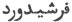
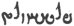
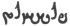
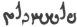
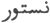
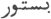
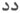
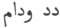

  
[Intangible Textual Heritage](../../index)  [Zoroastrianism](../index.md) 
[Index](index)  [Previous](sbe2317)  [Next](sbe2319.md) 

------------------------------------------------------------------------

[Buy this Book at
Amazon.com](https://www.amazon.com/exec/obidos/ASIN/1402185898/internetsacredte.md)

------------------------------------------------------------------------

*The Zend Avesta, Part II (SBE23)*, James Darmesteter, tr. \[1882\], at
Intangible Textual Heritage

------------------------------------------------------------------------

p. 179

### XIII. FARVARDÎN YA*S*T.

The Fravashi is the inner power in every being that maintains it and
makes it grow and subsist. Originally the Fravashis were the same as the
Pit*ri*s of the Hindus or the Manes of the Latins, that is to say, the
everlasting and deified souls of the dead (see §§ 49-52); but in course
of time they gained a wider domain, and not only men, but gods and even
physical objects, like the sky and the earth, &c. (§§ 85-86), had each a
Fravashi (see Ormazd et Ahriman, §§ 111-113).

This Ya*s*t is to be divided into two parts. The former part (§§ 1-84)
is a glorification of the powers and attributes of the Fravashis in
general; the latter part (§§ 85–158) is an enumeration of the Fravashis
of the most celebrated heroes of Mazdeism, from the first man, Gaya
Maretan, down to the last, Saoshya*nt*.

This latter part is like a Homer's catalogue of Mazdeism. The greatest
part of the historical legends of Iran lies here condensed into a
register of proper names. This enumeration is divided into seven
chapters:

The first (XXIV, §§ 85-95) contains the names of several gods, of the
first man, Gaya Maretan, the first law-giver, Zarathu*s*tra, and his
first disciple, Maidhyô-m*a*ungha;

The second part (XXV, §§ 96-110) contains the names of the disciples of
Zarathu*s*tra, most of them belonging to the epical cyclus of Vî*s*tâspa
(Gu*s*tâsp);

The third part (XXVI, §§ 111-117) is of uncertain character, and no name
contained in it is found in the epical legends;

The fourth part (XXVII, §§ 118-128) seems to be devoted to the heroes of
the other Karshvares and to mythical beings, born or unborn (cf. §§ 121,
122, 127, 128);

The fifth part (XXVIII, § 129) is devoted to Saoshya*nt* alone; The
sixth part (XXIX, §§ 130-138) is devoted to the heroes before the time
of Zarathu*s*tra;

The seventh part (XXX, §§ 139-142) is devoted to the holy women of
Mazdeism from Hvôvi, Zarathu*s*tra's wife, down to Srûta*t*-fedhri,
Vanghu-fedhri, and Ereda*t*-fedhri, the future mothers of his three
unborn sons.

The second, third, and fourth enumerations all end with the

p. 180

name of Astva*t*-ereta (that is to say, Saoshya*nt*), which shows that
they do not refer to successive generations, but to three independent
branches, which are each developed apart down to the time of the
Saviour.

\_\_\_\_\_\_\_\_\_\_\_\_\_\_\_\_\_\_\_\_\_\_\_\_\_\_\_\_

0\. May Ahura Mazda be rejoiced! . . . .

Ashem Vohû: Holiness is the best of all good . . . .

I confess myself a worshipper of Mazda, a follower of Zarathu*s*tra, one
who hates the Daêvas and obeys the laws of Ahura;

For sacrifice, prayer, propitiation, and glorification unto \[Hâvani\],
the holy and master of holiness.

Unto the awful, overpowering Fravashis of the faithful; unto the
Fravashis of the men of the primitive law [1](#fn_810.md); unto the Fravashis of the next-of-kin,

Be propitiation, with sacrifice, prayer, propitiation, and
glorification.

Yathâ ahû vairyô: The will of the Lord is the law of holiness. . . .

#### I.

1\. Ahura Mazda spake unto Spitama Zarathu*s*tra, saying: 'Do thou
proclaim, O pure Zarathu*s*tra! the vigour and strength, the glory, the
help and the joy that are in the Fravashis of the faithful, the awful
and overpowering Fravashis; do thou tell how they come to help me, how
they bring assistance unto me, the awful Fravashis of the faithful [2](#fn_811.md).

2\. 'Through their brightness and glory, O Zarathu*s*tra! I maintain
that sky, there above, shining and seen afar, and encompassing this
earth all around.

3\. 'It looks like a palace, that stands built of a

p. 181

heavenly substance [1](#fn_812.md), firmly
established, with ends that lie afar, shining in its body of ruby over
the three-thirds (of the earth) [2](#fn_813.md);
it is like a garment inlaid with stars, made of a heavenly substance,
that Mazda puts on, along with Mithra and Rashnu and Spe*n*ta-Ârmaiti,
and on no side can the eye perceive the end of it.

4\. 'Through their brightness and glory, O Zarathu*s*tra! I maintain
Ardvi Sara Anâhita, the wide-expanding and health-giving, who hates the
Daêvas and obeys the laws of Ahura, who is worthy of sacrifice in the
material world, worthy of prayer in the material world; the
life-increasing and holy, the flocks-increasing and holy, the
fold-increasing and holy, the wealth-increasing and holy, the
country-increasing and holy [3](#fn_814.md);

5 [4](#fn_815.md). 'Who makes the seed of all
males pure, who makes the womb of all females pure for bringing forth,
who makes all females bring forth in safety, who puts milk in the
breasts of all females in the right measure and the right quality;

6\. 'The large river, known afar, that is as large as the whole of all
the waters that run along the earth; that runs powerfully from the
height Hukairya down to the sea Vouru-Kasha.

7\. 'All the shores of the sea Vouru-Kasha are boiling over, all the
middle of it is boiling over,

p. 182

when she runs down there, when she streams down there, she, Ardvi Sûra
Anâhita, who has a thousand cells and a thousand channels; the extent of
each of those cells, of each of those channels, is as much as a man can
ride in forty days, riding on a good horse.

8\. 'From this river of mine alone flow all the waters that spread all
over the seven Karshvares; this river of mine alone goes on bringing
waters, both in summer and in winter. This river of mine purifies the
seed in males, the womb in females, the milk in females’ breasts [1](#fn_816.md).

9\. 'Through their brightness and glory, O Zarathu*s*tra! I maintain the
wide earth made by Ahura, the large and broad earth, that bears so much
that is fine, that bears all the bodily world, the live and the dead,
and the high mountains, rich in pastures and waters;

10\. 'Upon which run the many streams and rivers; upon which the many
kinds of plants grow up from the ground, to nourish animals and men, to
nourish the Aryan nations, to nourish the five kinds of animals [2](#fn_817.md), and to help the faithful.

11\. 'Through their brightness and glory, O Zarathu*s*tra! I maintain in
the womb the child that has been conceived, so that it does not die from
the

p. 183

assaults of Vîdôtu [1](#fn_818.md), and I develop
in it [2](#fn_819.md) the bones, the hair, the . .
. .  [3](#fn_820.md), the entrails, the feet, and
the sexual organs.

12\. 'Had not the awful Fravashis of the faithful given help unto me,
those animals and men of mine, of which there are such excellent kinds,
would not subsist; strength would belong to the Dru*g*, the dominion
would belong to the Dru*g*, the material world would belong to the
Dru*g*.

13\. 'Between the earth and the sky the immaterial creatures would be
harassed by the Dru*g*; between the earth and the sky the immaterial
creatures would be smitten by the Dru*g*; and never afterwards would
Angra-Mainyu give way to the blows of Spe*n*ta-Mainyu.

14\. 'Through their brightness and glory the waters run and flow forward
from the never-failing springs; through their brightness and glory the
plants grow up from the earth, by the never-failing springs; through
their brightness and glory the winds blow, driving down the clouds
towards the never-failing springs.

15\. 'Through their brightness and glory the females conceive offspring;
through their brightness and glory they bring forth in safety; it is
through their brightness and glory when they become blessed with
children.

16\. 'Through their brightness and glory a man is born who is a chief in
assemblies and meetings [4](#fn_821.md), who
listens well [5](#fn_822) to the (holy.md) words,
whom Wisdom

p. 184

holds dear [1](#fn_823.md), and who returns a
victor from discussions with Gaotema, the heretic [2](#fn_824.md).

'Through their brightness and glory the sun goes his way; through their
brightness and glory the moon goes her way; through their brightness and
glory the stars go their way.

17\. 'In fearful battles they are the wisest for help, the Fravashis of
the faithful.

'The most powerful amongst the Fravashis of the faithful, O Spitama! are
those of the men of the primitive law [3](#fn_825.md) or those of the Saoshya*nt*s [4](#fn_826.md) not yet born, who are to restore the
world. Of the Others, the Fravashis of the living faithful are more
powerful, O Zarathu*s*tra! than those of the dead, O Spitama!

18\. 'And the man who in life shall treat the Fravashis of the faithful
well, will become a ruler of the country with full power, and a chief
most strong; so shall any man of you become, who shall treat Mithra
well, the lord of wide pastures, and Ar*s*tâ*t*, who makes the world
grow, who makes the world increase.

19\. 'Thus do I proclaim unto thee, O pure Spitama! the vigour and
strength, the glory, the help, and the joy that are in the Fravashis of
the faithful,

p. 185

the awful and overpowering Fravashis; and how they come to help me, how
they bring assistance unto me, the awful Fravashis of the faithful [1](#fn_827.md).'

#### II.

20\. Ahura Mazda spake unto Spitama Zarathu*s*tra, saying: 'If in this
material world, O Spitama Zarathu*s*tra! thou happenest to come upon
frightful roads, full of dangers and fears, O Zarathu*s*tra! and thou
fearest for thyself, then do thou recite these words, then proclaim
these fiend-smiting words, O Zarathu*s*tra!

21\. ' "I praise, I invoke, I meditate upon, and we sacrifice unto the
good, strong, beneficent Fravashis of the faithful. We worship the
Fravashis of the masters of the houses, those of the lords of the
boroughs, those of the lords of the towns, those of the lords of the
countries, those of the Zarathu*s*trôtemas [2](#fn_828.md); the Fravashis of those that are, the
Fravashis of those that have been, the Fravashis of those that will be;
all the Fravashis of all nations [3](#fn_829.md),
and most friendly the Fravashis of the friendly nations;

22\. ' "Who maintain the sky, who maintain the waters, who maintain the
earth, who maintain the cattle, who maintain in the womb the child that
has been conceived, so that it does not die from the assaults of Vîdôtu,
and develop in it the bones, the hair, the . . . ., the entrails, the
feet, and the sexual organs [4](#fn_830.md);

23\. ' "Who are much-bringing, who move with

p. 186

awfulness, well-moving, swiftly moving, quickly moving, who move when
invoked; who are to be invoked in the conquest of good, who are to be
invoked in fights against foes, who are to be invoked in battles;

24\. ' "Who give victory to their invoker, who give boons to their
lover, who give health to the sick man, who give good Glory to the
faithful man that brings libations and invokes them with a sacrifice and
words of propitiation [1](#fn_831.md);

25\. ' "Who turn to that side where are faithful men, most devoted to
holiness, and where is the greatest piety [2](#fn_832.md), where the faithful man is
rejoiced [3](#fn_833.md), and where the faithful
man is not ill-treated [4](#fn_834.md)." '

#### III.

26\. We worship the good, strong, beneficent Fravashis of the faithful,
who are the mightiest of drivers, the lightest of those driving
forwards, the slowest of the retiring [5](#fn_835.md), the safest [5](#fn_835.md) of all bridges, the least-erring [5](#fn_835.md) of all weapons and arms [6](#fn_836.md), and who never turn their backs [7](#fn_837.md).

27\. At once, wherever they come, we worship them, the good ones, the
excellent ones, the good, the strong, the beneficent Fravashis of the
faithful. They are to be invoked when the bundles of baresma are tied;
they are to be invoked in fights against foes, in battles [8](#fn_838.md), and there where gallant men strive to
conquer foes.

p. 187

28\. Mazda invoked them for help, when he fixed the sky and the waters
and the earth and the plants; when Spe*n*ta-Mainyu fixed the sky, when
he fixed the waters, when the earth, when the cattle, when the plants,
when the child conceived in the womb, so that it should not die from the
assaults of Vîdôtu, and developed in it the bones, the hair, the . . .
., the entrails, the feet, and the sexual organs [1](#fn_839.md).

29\. Spe*n*ta-Mainyu maintained the sky, and they sustained it from
below, they, the strong Fravashis, who sit in silence, gazing with sharp
looks; whose eyes and ears are powerful, who bring long joy, high and
high-girded; well-moving and moving afar, loud-snorting [2](#fn_840.md), possessing riches and a high renown.

#### IV.

30\. We worship the good, strong, beneficent Fravashis of the faithful;
whose friendship is good, and who know how to benefit; whose friendship
lasts long; who like to stay in the abode where they are not harmed by
its dwellers; who are good, beautiful afar [3](#fn_841.md), health-giving, of high renown,
conquering in battle, and who never do harm first.

#### V.

31\. We worship the good, strong, beneficent Fravashis of the faithful;
whose will is dreadful unto those who vex them; powerfully working and
most beneficent; who in battle break the dread arms of their foes and
haters.

p. 188

#### VI.

32\. We worship the good, strong, beneficent Fravashis of the faithful;
liberal, valiant, and full of strength, not to be seized by thought,
welfare-giving, kind, and health-giving, following with Ashi's remedies,
as far as the earth extends, as the rivers stretch, as the sun
rises [1](#fn_842.md).

#### VII.

33\. We worship the good, strong, beneficent Fravashis of the faithful,
who gallantly and bravely fight, causing havoc, wounding [2](#fn_843.md), breaking to pieces all the malice of
the malicious, Daêvas and men, and smiting powerfully in battle, at
their wish and will.

34\. You kindly deliver the Victory made by Ahura, and the crushing
Ascendant, most beneficently, to those countries where you, the good
ones, unharmed and rejoiced, unoppressed and unoffended, have been held
worthy of sacrifice and prayer, and proceed the way of your wish.

#### VIII.

35\. We worship the good, strong, beneficent Fravashis of the faithful,
of high renown, smiting in battle, most strong, shield-bearing and
harmless to those who are true, whom both the pursuing and the fleeing
invoke for help: the pursuer invokes

p. 189

them for a swift race, and for a swift race does the fleer invoke them;

36\. Who turn to that side where are faithful men, most devoted to
holiness, and where is the greatest piety, where the faithful man is
rejoiced, and where the faithful man is not ill-treated [1](#fn_844.md).

#### IX.

37\. We worship the good, strong, beneficent Fravashis of the faithful,
who form many battalions, girded with weapons [2](#fn_845.md), lifting up spears, and full of sheen;
who in fearful battles come rushing along where the gallant heroes [3](#fn_846.md) go and assail the Dânus [4](#fn_847.md).

38\. There you destroy the victorious strength of the Turanian Dânus;
there you destroy the malice of the Turanian Dânus; through you the
chiefs [5](#fn_848.md) are of high intellect [6](#fn_849.md) and most successful; they, the gallant
heroes the gallant Saoshya*nt*s [7](#fn_850.md),
the gallant conquerors of the offspring of the Dânus chiefs of myriads,
who wound with stones [8](#fn_851.md).

#### X.

39\. We worship the good, strong, beneficent Fravashis of the faithful,
who rout the two wings of an army standing in battle array, who make the
centre swerve, and swiftly pursue onwards, to help the faithful and to
distress the doers of evil deeds.

#### XI.

40\. We worship the good, strong, beneficent

p. 190

\[paragraph continues\] Fravashis of the
faithful; awful, overpowering, and victorious, smiting in battle, sorely
wounding, blowing away (the foes), moving along to and fro, of good
renown, fair of body, godly of soul, and holy; who give victory to their
invoker, who give boons to their lover, who give health to the sick
man [1](#fn_852.md);

41\. Who give good glory to him who worships them with a sacrifice, as
that man did worship them, the holy Zarathu*s*tra, the chief of the
material world, the head of the two-footed race, in whatever struggle he
had to enter, in whatever distress he did fear;

42\. Who, when well invoked, enjoy bliss in the heavens; who, when well
invoked, come forward from the heavens, who are the heads [2](#fn_853.md) of that sky above, possessing the
well-shapen Strength, the Victory made by Ahura, the crushing Ascendant,
and Welfare [3](#fn_854.md), the wealth-bringing,
boon-bringing, holy, well fed, worthy of sacrifice and prayer in the
perfection of holiness.

43\. They shed Satavaêsa [4](#fn_855.md) between
the earth and the sky, him to whom the waters belong [5](#fn_856.md), who listens to appeals and makes the
waters flow and the plants grow up, to nourish animals and men, to
nourish the Aryan nations, to nourish the five kinds of animals [6](#fn_857.md), and to help the faithful [7](#fn_858.md).

44\. Satavaêsa comes down and flows between the earth and the sky, he to
whom the waters belong, who listens to appeals and makes the waters and
the plants grow up, fair, radiant, and full of

p. 191

light, to nourish animals and men, to nourish the Aryan nations, to
nourish the five kinds of animals, and to help the faithful.

#### XII.

45\. We worship the good, strong, beneficent Fravashis of the faithful;
with helms of brass, with weapons of brass, with armour [1](#fn_859.md) of brass; who struggle in the fights for
victory in garments of light, arraying the battles and bringing them
forwards, to kill thousands of Daêvas.

When the wind blows from behind them [2](#fn_860.md) and brings their breath unto men,

46\. Then men know where blows the breath of victory: and they pay pious
homage unto the good, strong, beneficent Fravashis of the faithful, with
their hearts prepared and their arms uplifted.

47\. Whichever side they have been first worshipped in the fulness of
faith of a devoted heart [3](#fn_861.md), to that
side turn the awful Fravashis of the faithful, along with Mithra and
Rashnu and the awful cursing thought [4](#fn_862.md) of the wise and the victorious wind.

48\. And those nations are smitten at one stroke by their fifties and
their hundreds, by their hundreds and their thousands, by their
thousands and their tens of thousands, by their tens of thousands and
their myriads of myriads, against which turn the awful Fravashis of the
faithful, along with Mithra and Rashnu, and the awful cursing thought of
the wise and the victorious wind.

p. 192

#### XIII.

49\. We worship the good, strong, beneficent Fravashis of the faithful,
who come and go through the borough at the time of the
Hamaspathmaêdha [1](#fn_863.md); they go along
there for ten nights, asking thus [2](#fn_864.md):

50\. 'Who will praise us? Who will offer us a sacrifice? Who will
meditate upon us? Who will bless us [3](#fn_865.md)? Who will receive us with meat and
clothes in his hand [4](#fn_866.md) and with a
prayer worthy of bliss [5](#fn_867.md)? Of which
of us will the name be taken for invocation [6](#fn_868.md)? Of which of you will the soul be
worshipped by you with a sacrifice [7](#fn_869.md)? To whom will this gift of ours be
given, that he may have never-failing food for ever and ever?'

51\. And the man who offers them up a sacrifice,

p. 193

with meat and clothes in his hand, with a prayer worthy of bliss, the
awful Fravashis of the faithful, satisfied, unharmed, and unoffended,
bless thus:

52\. 'May there be in this house flocks of animals and men! May there be
a swift horse and a solid chariot! May there be a man who knows how to
praise God [1](#fn_870.md) and rule in an
assembly, who will offer us sacrifices with meat and clothes in his
hand, and with a prayer worthy of bliss [2](#fn_871.md).'

#### XIV.

53\. We worship the good, strong, beneficent Fravashis of the faithful,
who show beautiful paths to the waters, made by Mazda, which had stood
before for a long time in the same place without flowing [3](#fn_872.md):

54\. And now they flow along the path made by Mazda, along the way made
by the gods, the watery way appointed to them, at the wish of Ahura
Mazda, at the wish of the Amesha-Spe*n*tas.

#### XV.

55\. We worship the good, strong, beneficent Fravashis of the faithful,
who show a beautiful growth to the fertile [4](#fn_873.md) plants, which had stood before for a
long time in the same place without growing:

56\. And now they grow up along the path made

p. 194

by Mazda, along the way made by the gods, in the time appointed to them,
at the wish of Ahura Mazda, at the wish of the Amesha-Spe*n*tas.

#### XVI.

57\. We worship the good, strong, beneficent Fravashis of the faithful,
who showed their paths to the stars, the moon, the sun, and the endless
lights, that had stood before for a long time in the same place, without
moving forwards, through the oppression of the Daêvas and the assaults
of the Daêvas [1](#fn_874.md).

58\. And now they move around in their far-revolving circle for ever,
till they come to the time of the good restoration of the world.

#### XVII.

59\. We worship the good, strong, beneficent Fravashis of the faithful,
who watch over the bright sea Vouru-Kasha [2](#fn_875.md), to the number of ninety thousand, and
nine thousand, and nine hundred, and ninety-nine.

#### XVIII.

60\. We worship the good, strong, beneficent Fravashis of the faithful,
who watch over the stars Haptôiri*n*ga [3](#fn_876.md), to the number of ninety thousand, and
nine thousand, and nine hundred, and ninety-nine.

#### XIX.

61\. We worship the good, strong, beneficent Fravashis of the faithful,
who watch over the body

p. 195

of Keresâspa, the son of Sâma [1](#fn_877.md), the
club-bearer with plaited hair, to the number of ninety thousand, and
nine thousand, and nine hundred, and ninety-nine.

#### XX.

62\. We worship the good, strong, beneficent Fravashis of the faithful,
who watch over the seed of the holy Zarathu*s*tra [2](#fn_878.md), to the number of ninety thousand, and
nine thousand, and nine hundred, and ninety-nine.

#### XXI.

63\. We worship the good, strong, beneficent Fravashis of the faithful,
who fight at the right hand of the reigning lord, if he rejoices the
faithful [3](#fn_879.md) and if the awful
Fravashis of the faithful are not hurt by him, if they are rejoiced by
him, unharmed and unoffended.

#### XXII.

64\. We worship the good, strong, beneficent Fravashis of the faithful,
who are greater, who are

p. 196

stronger, who are swifter, who are more powerful, who are more
victorious, who are more healing, who are more effective than can be
expressed by words; who run by tens of thousands into the midst of the
Myazdas.

65\. And when the waters come up from the sea Vouru-Kasha, O Spitama
Zarathu*s*tra! along with the Glory made by Mazda [1](#fn_880.md), then forwards come the awful Fravashis
of the faithful, many and many hundreds, many and many thousands, many
and many tens of thousands,

66\. Seeking water for their own kindred, for their own borough, for
their own town, for their own country, and saying thus: 'May our own
country have a good store and full joy!'

67\. They fight in the battles that are fought in their own place and
land, each according to the place and house where he dwelt (of
yore) [2](#fn_881.md): they look like a gallant
warrior who, girded up and watchful, fights for the hoard he has
treasured up.

68\. And those of them who win bring waters to their own kindred, to
their own borough, to their own town, to their own country, saying thus:
'May my country grow and increase!'

69\. And when the all-powerful sovereign of a country has been surprised
by his foes and haters, he invokes them, the awful Fravashis of the
faithful.

70\. And they come to his help, if they have not been hurt by him, if
they have been rejoiced by him, if they have not been harmed nor
offended, the awful Fravashis of the faithful: they come flying unto
him, it seems as if they were well-winged birds.

p. 197

71\. They come in as a weapon and as a shield, to keep him behind and to
keep him in front, from the Dru*g* unseen, from the female Varenya
fiend, from the evil-doer bent on mischief, and from that fiend who is
all death, Angra Mainyu. It will be as if there were a thousand men
watching over one man [1](#fn_882.md);

72\. So that neither the sword well-thrust, neither the club
well-falling, nor the arrow well-shot, nor the spear well-darted, nor
the stones flung from the arm shall destroy him.

73\. They come on this side, they come on that side, never resting, the
good, powerful, beneficent Fravashis of the faithful, asking for help
thus: 'Who will praise us? Who will offer us a sacrifice? Who will
meditate upon us? Who will bless us? Who will receive us with meat and
clothes in his hand and with a prayer worthy of bliss? Of which of us
will the name be taken for invocation? Of which of you will the soul be
worshipped by you with a sacrifice? To whom will that gift of ours be
given, that he may have never-failing food for ever and ever [2](#fn_883.md)?'

74\. We worship the perception [3](#fn_884.md); we
worship the intellect; we worship the conscience; we worship those of
the Saoshya*nt*s [4](#fn_885.md);

We worship the souls; those of the tame animals; those of the wild
animals; those of the animals that live in the waters; those of the
animals that live under the ground; those of the flying ones; those of
the running ones; those of the grazing ones [5](#fn_886.md).

p. 198

We worship their Fravashis [1](#fn_887.md).

75\. We worship the Fravashis.

We worship them, the liberal;

We worship them, the valiant; we worship them, the most valiant;

We worship them, the beneficent; we worship them, the most beneficent;

We worship them, the powerful;

We worship them, the most strong;

We worship them, the light; we worship them, the most light;

We worship them, the effective; we worship them, the most effective.

76\. They are the most effective amongst the creatures of the two
Spirits, they the good, strong, beneficent Fravashis of the faithful,
who stood holding fast when the two Spirits created the world, the Good
Spirit and the Evil One [2](#fn_888.md).

77\. When Angra Mainyu broke into the creation of the good holiness,
then came in across [Vohû](errata.htm#2.md) Manô and Âtar [3](#fn_889.md).

78\. They destroyed the malice of the fiend Angra Mainyu, so that the
waters did not stop flowing nor did the plants stop growing; but at once
the most beneficent waters of the creator and

p. 199

ruler, Ahura Mazda, flowed forward and his plants went on growing.

79\. We worship all the waters;

We worship all the plants;

We worship all the good, strong, beneficent Fravashis of the faithful.

We worship the waters by their names [1](#fn_890.md);

We worship the plants by their names [2](#fn_891.md);

We worship the good, strong, beneficent Fravashis of the faithful by
their names.

80\. Of all those ancient Fravashis, we worship the Fravashi of Ahura
Mazda; who is the greatest, the best, the fairest, the most solid, the
wisest, the finest of body and supreme in holiness [3](#fn_892.md);

81\. Whose soul is the Mãthra Spe*n*ta, who is white, shining, seen
afar; and we worship the beautiful forms, the active forms wherewith he
clothes the Amesha-Spe*n*tas; we worship the swift-horsed sun.

#### XXIII.

82\. We worship the good, strong, beneficent Fravashis of the
Amesha-Spe*n*tas, the bright ones, whose looks perform what they wish,
the tall, quickly coming to do, strong, and lordly, who are undecaying
and holy;

83\. Who are all seven of one thought, who are all seven of one speech,
who are all seven of one deed; whose thought is the same, whose speech
is the same, whose deed is the same, whose father and

p. 200

commander is the same, namely, the Maker, Ahura Mazda;

84\. Who see one another's soul thinking of good thoughts, thinking of
good words, thinking of good deeds, thinking of Garô-nmâna, and whose
ways [1](#fn_893.md) are shining as they go down
towards the libations [2](#fn_894.md).

#### XXIV.

85\. We worship the good, strong, beneficent Fravashis: that of the most
rejoicing [3](#fn_895.md) fire, the beneficent and
assembly-making [4](#fn_896.md); and that of the
holy, strong Sraosha [5](#fn_897.md), who is the
incarnate Word, a mighty-speared and lordly god; and that of
Nairyô-sangha [6](#fn_898.md).

86\. And that of Rashnu Razi*s*ta [7](#fn_899.md);

That of Mithra [8](#fn_900.md), the lord of wide
pastures;

That of the Mãthra-Spe*n*ta [9](#fn_901.md);

That of the sky;

That of the waters;

That of the earth;

That of the plants;

That of the Bull [10](#fn_902.md);

That of the living man [11](#fn_903.md);

That of the holy creation [12](#fn_904.md).

87\. We worship the Fravashi of Gaya Maretan [13](#fn_905.md),

p. 201

who first listened unto the thought and teaching of Ahura Mazda; of whom
Ahura formed the race of the Aryan nations, the seed of the Aryan
nations.

We worship the piety and the Fravashi of the holy Zarathu*s*tra;

88\. Who first thought what is good, who first spoke what is good, who
first did what is good; who was the first Priest, the first Warrior, the
first Plougher of the ground [1](#fn_906.md); who
first knew and first taught; who first possessed [2](#fn_907.md) and first took possession of the
Bull [3](#fn_908.md), of Holiness [4](#fn_909.md), of the Word, the obedience to the Word,
and dominion, and all the good things made by Mazda, that are the
offspring of the good Principle;

89\. Who was the first Priest, the first Warrior, the first Plougher of
the ground; who first took the turning of the wheel [5](#fn_910.md) from the hands of the Daêva and of the
cold-hearted man; who first in the material world pronounced the praise
of Asha [6](#fn_911.md), thus bringing the Daêvas
to naught, and confessed himself a worshipper of Mazda, a follower of
Zarathu*s*tra, one who hates the Daêvas, and obeys the laws of Ahura.

90\. Who first in the material world said the word that destroys the
Daêvas, the law of Ahura; who first in the material world proclaimed the
word that destroys the Daêvas, the law of Ahura; who

p. 202

first in the material world declared all the creation of the Daêvas
unworthy of sacrifice and prayer; who was strong, giving all the good
things of life, the first bearer of the Law amongst the nations;

91\. In whom was heard the whole Mãthra, the word of holiness; who was
the lord and master of the world [1](#fn_912.md),
the praiser of the most great, most good and most fair Asha [2](#fn_913.md); who had a revelation of the Law, that
most excellent of all beings;

92\. For whom the Amesha-Spe*n*tas longed, in one accord with the sun,
in the fulness of faith of a devoted heart; they longed for him, as the
lord and master of the world, as the praiser of the most great, most
good, and most fair Asha, as having a revelation of the Law, that most
excellent of all beings;

93\. In whose birth and growth the waters and the plants rejoiced; in
whose birth and growth the waters and the plants grew; in whose birth
and growth all the creatures of the good creations cried out, Hail [3](#fn_914.md)!

94\. 'Hail to us! for he is born, the Âthravan, Spitama Zarathu*s*tra.
Zarathu*s*tra will offer us sacrifices with libations and bundles of
baresma; and there will the good Law of the worshippers of Mazda come
and spread through all the seven Karshvares of the earth.

95\. 'There will Mithra, the lord of wide pastures, increase all the
excellences of our countries, and allay their troubles; there will the
powerful Apãm-Napâ*t* [4](#fn_915.md) increase all
the excellences of our countries, and allay their troubles.'

p. 203

We worship the piety and Fravashi of Maidhyô-m*a*ungha, the son of
Arâsti [1](#fn_916.md), who first listened unto
the word and teaching of Zarathu*s*tra.

#### XXV.

96\. We worship the Fravashi of the holy Asmô-*hv*anva*nt* [2](#fn_917.md);

We worship the Fravashi of the holy Asan-*hv*anva*nt*.

We worship the Fravashi of the holy Gavayan.

We worship the Fravashi of the holy Parsha*t*-g*a*u*s* [3](#fn_918.md), the son of Frâta;

We worship the Fravashi of the holy Vohvasti, the son of Snaoya;

We worship the Fravashi of the holy Isva*t*, the son of Varâza.

97\. We worship the Fravashi of the holy Saêna, the son of
Ahûm-stu*t* [4](#fn_919.md), who first appeared
upon this earth with a hundred pupils [5](#fn_920.md).

We worship the Fravashi of the holy Fradhidaya.

We worship the Fravashi of the holy Usmânara, the son of Paêshata.

p. 204

We worship the Fravashi of the holy Vohu-rao*k*ah, the son of Frânya;

We worship the Fravashi of the holy Ashô-rao*k*ah, the son of Frânya;

We worship the Fravashi of the holy Varesmô-rao*k*ah, the son of Frânya.

98\. We worship the Fravashi of the holy Isa*t*-vâstra, the son of
Zarathu*s*tra;

We worship the Fravashi of the holy Urvata*t*-nara, the son of
Zarathu*s*tra;

We worship the Fravashi of the holy *Hv*are-*k*ithra, the son of
Zarathu*s*tra [1](#fn_921.md).

We worship the Fravashi of the holy Daêvô-*t*bi*s*, the son of Takhma.

We worship the Fravashi of the holy Thrimithwa*nt*, the son of
Spitâma [2](#fn_922.md).

We worship the Fravashi of the holy D*a*ungha, the son of Zairita.

99\. We worship the Fravashi of the holy king Vî*s*tâspa [3](#fn_923.md); the gallant one, who was the incarnate

p. 205

\[paragraph continues\] Word, the
mighty-speared, and lordly one; who, driving the Dru*g* [1](#fn_924.md) before him, sought wide room for the
holy religion; who, driving the Dru*g* [1](#fn_924.md) before him, made wide room for the holy
religion, who made himself the arm and support of this law of Ahura, of
this law of Zarathu*s*tra.

100\. Who took her [2](#fn_925.md), standing
bound [3](#fn_926.md), from the hands of the
Hunus [4](#fn_927.md), and established her to sit
in the middle \[of the world\], high ruling, never falling back, holy,
nourished with plenty of cattle and pastures, blessed with plenty of
cattle and pastures [4](#fn_927.md).

101\. We worship the Fravashi of the holy Zairivairi [5](#fn_928.md);

We worship the Fravashi of the holy Yukhtavairi;

We worship the Fravashi of the holy Srîraokhshan;

We worship the Fravashi of the holy Keresaokhshan;

We worship the Fravashi of the holy Vanâra;

We worship the Fravashi of the holy Varâza;

We worship the Fravashi of the holy Bû*g*i-sravah [6](#fn_929.md).

p. 206

We worship the Fravashi of the holy Berezy-ar*s*ti;

We worship the Fravashi of the holy Tî*z*yar*s*ti;

We worship the Fravashi of the holy Perethu-ar*s*ti;

We worship the Fravashi of the holy Vî*z*yar*s*ti.

102\. We worship the Fravashi of the holy Naptya;

We worship the Fravashi of the holy Va*z*âspa;

We worship the Fravashi of the holy Habâspa.

We worship the Fravashi of the holy Vistauru [1](#fn_930.md), the son of Naotara.

We worship the Fravashi of the holy Fra*s*-hãm-vareta [2](#fn_931.md);

We worship the Fravashi of the holy Frashôkareta.

We worship the Fravashi of the holy Âtare-vanu;

We worship the Fravashi of the holy Âtare-pâta;

We worship the Fravashi of the holy Âtare-dâta;

We worship the Fravashi of the holy Âtare-*k*ithra;

p. 207

We worship the Fravashi of the holy Âtare-*hv*arenah;

We worship the Fravashi of the holy Âtare-savah;

We worship the Fravashi of the holy Âtare-za*n*tu;

We worship the Fravashi of the holy Âtare-danghu.

103\. We worship the Fravashi of the holy Hu*s*kyaothna;

We worship the Fravashi of the holy Pi*s*kyaothna;

We worship the Fravashi of the holy and gallant Spe*n*tô-dâta [1](#fn_932.md).

We worship the Fravashi of the holy Bastavairi [2](#fn_933.md);

We worship the Fravashi of the holy Kavârazem [3](#fn_934.md).

We worship the Fravashi of the holy Frashao*s*tra [4](#fn_935.md), the son of Hvôva;

We worship the Fravashi of the holy *G*âmâspa [5](#fn_936.md), the son of Hvôva;

p. 208

We worship the Fravashi of the holy Avârao*s*tri [1](#fn_937.md).

104\. We worship the Fravashi of the holy Hu*s*kyaothna, the son of
Frashao*s*tra;

We worship the Fravashi of the holy *Hv*âdaêna, the son of
Frashao*s*tra.

We worship the Fravashi of the holy Hanghaurv*a*ungh, the son of
*G*âmâspa [2](#fn_938.md);

We worship the Fravashi of the holy Vareshna, the son of
Hanghaurv*a*ungh.

We worship the Fravashi of the holy Vohu-nemah, the son of Avârao*s*tri,

To withstand evil dreams, to withstand evil visions, to withstand evil .
. . . [3](#fn_939.md), to withstand the evil
Pairikas.

105\. We worship the Fravashi of the holy Mãthravâka, the son of
Sîmaê*z*i, the Aêthrapati, the Hamidhpati [4](#fn_940.md), who was able to smite down most of the
evil, unfaithful Ashemaoghas, that shout the hymns [5](#fn_941.md), and acknowledge no lord and no
master [6](#fn_942.md), the dreadful ones whose
Fravashis are to be broken [7](#fn_943.md); to
withstand the evil done by the faithful [8](#fn_944.md).

p. 209

106\. We worship the Fravashi of the holy Ashastu, the son of
Maidhyô-m*a*ungha [1](#fn_945.md).

We worship the Fravashi of the holy Avarethrabah, the son of
Râstare-vagha*nt*.

We worship the Fravashi of the holy Bû*g*ra, the son of Dâzgarâspa.

We worship the Fravashi of the holy Zbaurva*nt*;

We worship the Fravashi of the holy and gallant Karesna [2](#fn_946.md), the son of Zbaurva*nt*; who was the
incarnate Word, mighty-speared and lordly;

107\. In whose house did walk the good, beautiful, shining Ashi Vanguhi,
in the shape of a maid fair of body, most strong, tall-formed, high-up
girded, pure, nobly born of a glorious seed [3](#fn_947.md); who, rushing to the battle, knew how to
make room for himself with his own arms; who, rushing to the battle,
knew how to fight the foe with his own arms [4](#fn_948.md).

108\. We worship the Fravashi of the holy Vîrâspa, the son of Karesna;

We worship the Fravashi of the holy Âzâta, the son of Karesna:

We worship the Fravashi of the holy Frâyaodha, the son of Karesna.

We worship the Fravashi of the holy and good Arshya; Arshya, the chief
in assemblies, the most energetic of the worshippers of Mazda.

p. 210

We worship the Fravashi of the holy Dâraya*t*-ratha;

We worship the Fravashi of the holy Frâya*t*-ratha;

We worship the Fravashi of the holy Skâraya*t*-ratha.

109\. We worship the Fravashi of the holy Ar*s*va*nt*;

We worship the Fravashi of the holy Vyar*s*va*nt*;

We worship the Fravashi of the holy Paityar*s*va*nt*.

We worship the Fravashi of the holy Amru [1](#fn_949.md);

We worship the Fravashi of the holy *K*amru [1](#fn_949.md).

We worship the Fravashi of the holy Drâtha;

We worship the Fravashi of the holy Paitidrâtha;

We worship the Fravashi of the holy Paitivangha.

We worship the Fravashi of the holy Frashâvakhsha.

We worship the Fravashi of the holy Nemôvanghu, the son of Vaêdhayangha.

110\. We worship the Fravashi of the holy Vîsadha.

We worship the Fravashi of the holy Ashâvanghu, the son of
Biva*n*dangha [2](#fn_950.md);

We worship the Fravashi of the holy *G*arô-danghu, the son of
Pairi*s*tîra [2](#fn_950.md);

p. 211

We worship the Fravashi of the holy Neremyazdana, the son of Âthwyôza.

We worship the Fravashi of the holy Berezi*s*nu, the son of Ara;

We worship the Fravashi of the holy Kasupatu, the son of Ara.

We worship the Fravashi of the holy Frya.

We worship the Fravashi of the holy ASTVA*T*-ERETA [1](#fn_951.md).

#### XXVI.

111\. We worship the Fravashi of the holy Gaopi-vanghu.

We worship the Fravashi of the holy and gallant Hãm-baretar
vanghvãm [2](#fn_952.md).

We worship the Fravashi of the holy Staotar-Vahi*s*tahê-Ashyêhê [3](#fn_953.md).

We worship the Fravashi of the holy Pourudhâkh*s*ti, the son of
Kh*s*tâvaênya;

We worship the Fravashi of the holy Khshoiwrâspa, the son of
Kh*s*tâvaênya.

112\. We worship the Fravashi of the holy Ayôasti, the son of
Pouru-dhâkh*s*ti [4](#fn_954.md);

We worship the Fravashi of the holy Vohv-asti, the son of
Pouru-dhâkh*s*ti;

p. 212

We worship the Fravashi of the holy Gayadhâsti, the son of
Pouru-dhâkh*s*ti;

We worship the Fravashi of the holy Asha-vazdah, the son of
Pouru-dhâkh*s*ti [1](#fn_955.md);

We worship the Fravashi of the holy Urûdhu, the son of Pouru-dhâkh*s*ti.

We worship the Fravashi of the holy Khshathrô-*k*inah, the son of
Khshvôiwrâspa [2](#fn_956.md).

113\. We worship the Fravashi of the holy Ashâhura, the son of
*G*î*s*ti.

We worship the Fravashi of the holy Frâyaza*n*ta;

We worship the Fravashi of the holy Fr*e*nah, the son of Frâyaza*n*ta;

We worship the Fravashi of the holy Garô-vanghu, the son of
Frâyaza*n*ta.

We worship the Fravashis of the holy Ashavazdah and Thrita, the sons of
Sâyu*z*dri [3](#fn_957.md).

We worship the Fravashi of the holy Vohu-rao*k*ah, the son of Varakasa.

We worship the Fravashi of the holy Are*g*angha*nt*, the Turanian [4](#fn_958.md).

We worship the Fravashi of the holy Usinemah.

114\. We worship the Fravashi of the holy Yukhtâspa.

We worship the Fravashi of the holy Ashaskyaothna, the son of
Gayadhâsti [5](#fn_959.md).

p. 213

We worship the Fravashi of the holy Vohu-nemah, the son of Katu;

We worship the Fravashi of the holy Vohu-vazdah, the son of Katu.

We worship the Fravashi of the holy Ashasaredha, the son of
Asha-sairyã*k*;

We worship the Fravashi of the holy Ashasaredha, the son of Zairyã*k*.

We worship the Fravashi of the holy *K*âkhshni.

We worship the Fravashi of the holy Syâvâspi.

We worship the Fravashi of the holy Pouru*s*ti, the son of Kavi.

115\. We worship the Fravashi of the holy Varesmapa, the son of
*G*anara.

We worship the Fravashi of the holy Nanârâsti, the son of Paêshatah;

We worship the Fravashi of the holy Zarazdâti, the son of Paêshatah.

We worship the Fravashi of the holy Gaêvani, the son of Vohu-nemah [1](#fn_960.md).

We worship the Fravashis of the holy Arezva and Srûta-spâdha.

We worship the Fravashis [2](#fn_961.md) of the
holy Zrayah and Spe*n*tô-khratu.

We worship the Fravashi of the holy Var*s*ni, the son of Vâgereza.

We worship the Fravashi of the holy Frâ*k*ya, the son of Taurvâti.

We worship the Fravashi of the holy Vahmaêdâta, the son of
Mãthravâka [3](#fn_962.md).

p. 214

We worship the Fravashi of the holy U*s*tra, the son of Sadhanah.

116\. We worship the Fravashi of the holy Danghu-srûta;

We worship the Fravashi of the holy Danghu-frâdhah.

We worship the Fravashi of the holy Aspô-padhô-makh*s*ti;

We worship the Fravashi of the holy Payanghrô-makh*s*ti.

We worship the Fravashi of the holy U*s*tâza*n*ta.

We worship the Fravashi of the holy Ashasavah;

We worship the Fravashi of the holy Ashô-urvatha.

We worship the Fravashi of the holy Haomô-*hv*arenah.

117\. We worship the Fravashi of the holy Fraya.

We worship the Fravashi of the holy Usnâka.

We worship the Fravashi of the holy *Hv*anva*nt*.

We worship the Fravashi of the holy Daênô-vazah.

We worship the Fravashi of the holy Are*g*aona.

We worship the Fravashi of the holy Aiwi*hv*arenah.

We worship the Fravashi of the holy Huyazata.

We worship the Fravashi of the holy Haredhaspa.

We worship the Fravashi of the holy Pâzinah.

We worship the Fravashi of the holy *Hv*âkhshathra.

We worship the Fravashi of the holy Ashô-paoirya.

p. 215

We worship the Fravashi of the holy ASTVA*T*-ERETA [1](#fn_963.md).

#### XXVII.

118\. We worship the Fravashi of the holy Hug*a*u.

We worship the Fravashi of the holy Anghuyu.

We worship the Fravashi of the holy Gâuri;

We worship the Fravashi of the holy Yû*s*ta, the son of Gâuri.

We worship the Fravashi of the holy Mãzdrâvanghu;

We worship the Fravashi of the holy Srîrâvanghu.

We worship the Fravashi of the holy Âyûta.

We worship the Fravashi of the holy Sûrôyazata.

119\. We worship the Fravashi of the holy Eredhwa.

We worship the Fravashi of the holy Ravi.

We worship the Fravashi of the holy Ukhshan, the son of the great
Vîdi-sravah, known afar [2](#fn_964.md).

We worship the Fravashi of the holy Vanghu-dhâta, the son of *Hv*adhâta;

We worship the Fravashi of the holy Uzya, the son of Vanghu-dhâta;

We worship the Fravashi of the holy Frya.

120\. We worship the Fravashi of the holy one whose name is
Ashem-yêNhê-rao*ka*u;

We worship the Fravashi of the holy one whose name is
Ashem-yêNhê-vereza;

p. 216

We worship the Fravashi of the holy one whose name is
Ashem-yahmâi-u*s*tâ [1](#fn_965.md).

We worship the Fravashi of the holy Yôi*s*ta [2](#fn_966.md), of the Fryâna house.

We worship the Fravashi of the holy Usmânara, the son of Paêshatah
Paitisrîra [3](#fn_967.md), to withstand the evil
done by one's kindred [4](#fn_968.md).

121\. We worship the Fravashi of the holy Spiti [5](#fn_969.md), the son of Uspãsnu;

We worship the Fravashi of the holy Erezrâspa, the son of Uspãsnu [6](#fn_970.md).

We worship the Fravashi of the holy Usadhan, the son of Mazdayasna.

We worship the Fravashi of the holy Frâda*t*-vanghu, the son of
Stiva*nt*.

We worship the Fravashi of the holy Rao*k*as-*k*aêshman [7](#fn_971.md);

We worship the Fravashi of the holy *Hv*are-*k*aêshman [7](#fn_971.md).

We worship the Fravashi of the holy Frasrûtâra;

We worship the Fravashi of the holy Vîsrûtâra.

We worship the Fravashi of the holy Baremna.

p. 217

We worship the Fravashi of the holy Visrûta.

122\. We worship the Fravashi of the holy *Hv*aspa [1](#fn_972.md);

We worship the Fravashi of the holy *K*athwaraspa [2](#fn_973.md).

We worship the Fravashi of the holy Dawrâmaêshi.

We worship the Fravashi of the holy Fraoraostra, the son of Kaosha.

We worship the Fravashi of the holy Frînâspa, the son of Kaêva.

We worship the Fravashi of the holy Frâda*t*-nara, the son of Gravâratu.

We worship the Fravashi of the holy Vohu-u*s*tra, the son of Ãkhnangha.

We worship the Fravashi of the holy Vîvareshva*nt*, the son of Ainyu.

123\. We worship the Fravashi of the holy Frârâzi, the son of Tûra [3](#fn_974.md).

We worship the Fravashi of the holy Stipi, the son of Rava*nt*.

We worship the Fravashi of the holy Parsha*n*ta, the son of Ga*n*darewa.

We worship the Fravashi of the holy Avahya, the son of Spe*n*ta.

We worship the Fravashi of the holy Aêta, the son of Mâyu;

p. 218

We worship the Fravashi of the holy Yaêtu*s*-g*a*u, the son of Vyâtana.

We worship the Fravashi of the holy Gar*s*ta, the son of Kavi.

124\. We worship the Fravashi of the holy Pouru-bangha, the son of
Zaosha.

We worship the Fravashi of the holy Vohudâta, the son of Kâta.

We worship the Fravashi of the holy B*a*ungha, the son of S*a*ungha.

We worship the Fravashis [1](#fn_975.md) of the
holy Hvareza and A*n*kasa.

We worship the Fravashi of the holy Aravao*s*tra, the son of
Erezva*t*-danghu.

We worship the Fravashi of the holy Frâ*k*ithra, the son of Berezva*nt*.

We worship the Fravashi of the holy Vohu-peresa, the son of Ainyu.

125\. We worship the Fravashi of the holy Parôdasma, the son of
Dâ*s*tâghni, a Mî*z*a man of the Mî*z*a land.

We worship the Fravashis of the holy Fratîra and Baêshatastîra.

We worship the Fravashi of the holy and pure Avare-g*a*u, the son of
Aoighimatastîra.

We worship the Fravashi of the holy Gaoma*nt*, the son of Zavan, a
Rao*z*dya man of the Rao*z*dya land.

We worship the Fravashi of the holy Thri*t*, the son of
Aêvo-saredha-fyaê*s*ta, a Tanya man of the Tanya land.

p. 219

126\. We worship the Fravashi of the holy Tîrô-nakathwa, of the
Uspaê*s*ta-Saêna house [1](#fn_976.md).

We worship the Fravashi of the holy Utayuti Vi*t*-kavi, the son of
Zighri, of the Saêna house [1](#fn_976.md);

We worship the Fravashi of the holy Frôhakafra, the son of Merezîshmya,
of the Saêna house [1](#fn_976.md).

We worship the Fravashi of the holy Varesmô-rao*k*ah, the son of
Perethu-afzem.

127\. We worship the Fravashis [2](#fn_977.md) of
the holy Asha-nemah and Vîda*t*-g*a*u, of this country.

We worship the Fravashis [2](#fn_977.md) of the
holy Parisha*t*-g*a*u and Dâzgara-g*a*u, of the Apakhshîra country.

We worship the Fravashi of the holy Hufravâkh*s*, of the Kahrkana
house [1](#fn_976.md).

We worship the Fravashi of the holy Akayadha, of the Pîdha house [1](#fn_976.md).

We worship the Fravashi of the holy *G*âmâspa, the younger [3](#fn_978.md).

We worship the Fravashi of the holy Maidhyô-m*a*ungha, the younger [4](#fn_979.md).

We worship the Fravashi of the holy Urvata*t*-nara, the younger [5](#fn_980.md).

128\. We worship the Fravashi of the holy Rao*k*as-*k*aê*s*man;

We worship the Fravashi of the holy *Hv*are-*k*aê*s*man;

We worship the Fravashi of the holy Frâda*t*-*hv*arenah;

p. 220

We worship the Fravashi of the holy Vareda*t*-*hv*arenah;

We worship the Fravashi of the holy Vouru-nemah;

We worship the Fravashi of the holy Vouru-savah [1](#fn_981.md);

We worship the Fravashi of the holy Ukhshya*t*-ereta [2](#fn_982.md);

We worship the Fravashi of the holy Ukhshya*t*-nemah [3](#fn_983.md);

We worship the Fravashi of the holy ASTVA*T*-ERETA [4](#fn_984.md);

#### XXVIII.

129\. Whose name will be the victorious SAOSHYA*NT* and whose name will
be Astva*t*-ereta. He will be SAOSHYA*NT* (the Beneficent One), because
he will benefit the whole bodily world; he will be ASTVA*T*-ERETA (he
who makes the bodily creatures

p. 221

rise up), because as a bodily creature and as a living creature he will
stand against the destruction of the bodily creatures, to withstand the
Dru*g* of the two-footed brood, to withstand the evil done by the
faithful [1](#fn_985.md).

#### XXIX.

130\. We worship the Fravashi of the holy Yima [2](#fn_986.md), the son of Vîvangha*nt*; the valiant
Yima, who had flocks at his wish [3](#fn_987.md);
to stand against the oppression caused by the Daêvas, against the
drought that destroys pastures, and against death that creeps
unseen [4](#fn_988.md).

131\. We worship the Fravashi of the holy Thraêtaona, of the Âthwya
house [5](#fn_989.md); to stand against itch, hot
fever, humours, cold fever, and incontinency [6](#fn_990.md), to stand against the evil done by the
Serpent [7](#fn_991.md).

We worship the Fravashi of the holy Aoshnara, the son of
Pouru-*g*îra [8](#fn_992.md).

We worship the Fravashi of the holy Uzava, the son of Tûmâspa [9](#fn_993.md).

p. 222

We worship the Fravashi of the holy Aghraêratha, the demi-man [1](#fn_994.md).

We worship the Fravashi of the holy Manu*s*-*k*ithra, the son of
Airyu [2](#fn_995.md).

132\. We worship the Fravashi of the holy king Kavâta [3](#fn_996.md);

We worship the Fravashi of the holy king Aipivanghu [4](#fn_997.md);

We worship the Fravashi of the holy king Usadhan [5](#fn_998.md);

We worship the Fravashi of the holy king Arshan [5](#fn_998.md);

We worship the Fravashi of the holy king Pisanah [5](#fn_998.md);

We worship the Fravashi of the holy king Byârshan [5](#fn_998.md);

We worship the Fravashi of the holy king Syâvarshan [6](#fn_999.md);

We worship the Fravashi of the holy king Husravah [6](#fn_999.md);

133\. For the well-shapened Strength [7](#fn_1000.md), for the Victory made by Ahura, for
the crushing Ascendant; for the righteousness of the law, for the
innocence of

p. 223

the law, for the unconquerable power of the law; for the extermination
of the enemies at one stroke;

134\. And for the vigour of health, for the Glory made by Mazda, for the
health of the body, and for a good, virtuous offspring, wise, chief in
assemblies, bright, and clear-eyed, that frees \[their father\] from the
pangs \[of hell\], of good intellect; and for that part in the blessed
world that falls to wisdom and to those who do not follow impiety;

135\. For a dominion full of splendour, for a long, long life, and for
all boons and remedies; to withstand the Yâtus and Pairikas, the
oppressors, the blind, and the deaf; to withstand the evil done by
oppressors [1](#fn_1001.md).

136\. We worship the Fravashi of the holy Keresâspa [2](#fn_1002.md), the Sâma [3](#fn_1003.md), the club-bearer with plaited hair; to
withstand the dreadful arm and the hordes with the wide battle array,
with the many spears, with the straight spears, with the spears
uplifted, bearing the spears of havoc; to withstand the dreadful brigand
who works destruction [4](#fn_1004.md), the
man-slayer who has no mercy; to withstand the evil done by the brigand.

137\. We worship the Fravashi of the holy Âkhrûra [5](#fn_1005.md), the son of Husravah;

To withstand the wicked one that deceives his friend and the niggard
that causes the destruction of the world [6](#fn_1006.md).

p. 224

We worship the Fravashi of the holy and gallant Haoshyangha;

To withstand the Mâzainya Daêvas and the Varenya fiends; to withstand
the evil done by the Daêvas [1](#fn_1007.md).

138\. We worship the Fravashi of the holy Fradhâkh*s*ti, the son of the
jar [2](#fn_1008.md),

To withstand Aêshma, the fiend of the wounding spear, and the Daêvas
that grow through Aêshma; to withstand the evil done by Aêshma.

#### XXX.

139\. We worship the Fravashi of the holy Hvôvi [3](#fn_1009.md).

We worship the Fravashi of the holy Fr*e*ni;

We worship the Fravashi of the holy Thriti;

We worship the Fravashi of the holy Pouru-*k*ista [4](#fn_1010.md).

We worship the Fravashi of the holy Hutaosa [5](#fn_1011.md);

We worship the Fravashi of the holy Huma [6](#fn_1012.md).

We worship the Fravashi of the holy Zairi*k*i.

p. 225

We worship the Fravashi of the holy Vîspa-taurvashi.

We worship the Fravashi of the holy U*s*tavaiti.

We worship the Fravashi of the holy Tu*s*nâmaiti.

140\. We worship the Fravashi of the holy Fr*e*ni, the wife of
Usenemah [1](#fn_1013.md);

We worship the Fravashi of the holy Fr*e*ni, the wife of the son of
Frâyaza*n*ta [2](#fn_1014.md);

We worship the Fravashi of the holy Fr*e*ni, the wife of the son of
Khshôiwrâspa [3](#fn_1015.md);

We worship the Fravashi of the holy Fr*e*ni, the wife of
Gayadhâsti [4](#fn_1016.md).

We worship the Fravashi of the holy Asabani, the wife of
Pourudhâkh*s*ti [5](#fn_1017.md).

We worship the Fravashi of the holy Ukhshyei*n*ti, the wife of
Staotar-Vahi*s*tahê-Ashyêhê [6](#fn_1018.md).

141\. We worship the Fravashi of the holy maid Vadhû*t*.

We worship the Fravashi of the holy maid *G*aghrûdh.

We worship the Fravashi of the holy maid Franghâdh.

We worship the Fravashi of the holy maid Urûdhaya*nt*.

We worship the Fravashi of the holy maid Paêsanghanu.

We worship the Fravashi of the holy *Hv*aredhi.

We worship the Fravashi of the holy Hu*k*ithra.

We worship the Fravashi of the holy Kanuka.

p. 226

We worship the Fravashi of the holy maid Srûta*t*-fedhri [1](#fn_1019.md).

142\. We worship the Fravashi of the holy maid Vanghu-fedhri [2](#fn_1020.md);

We worship the Fravashi of the holy maid Ereda*t*-fedhri [3](#fn_1021.md), who is called Vîspa-taurvairi. She is
Vîspa-taurvairi (the all-destroying) because she will bring him forth,
who will destroy the malice of Daêvas and men, to withstand the evil
done by the *G*ahi [4](#fn_1022.md).

143\. We worship the Fravashis of the holy men in the Aryan countries;

We worship the Fravashis of the holy women in the Aryan countries.

We worship the Fravashis of the holy men in the Turanian countries [5](#fn_1023.md);

We worship the Fravashis of the holy women in the Turanian countries.

We worship the Fravashis of the holy men in the Sairimyan
countries [6](#fn_1024.md);

p. 227

We worship the Fravashis of the holy women in the Sairimyan countries.

144\. We worship the Fravashis of the holy men in the Sâini
countries [1](#fn_1025.md);

We worship the Fravashis of the holy women in the Sâini countries.

We worship the Fravashis of the holy men in the Dâhi countries [2](#fn_1026.md);

We worship the Fravashis of the holy women in the Dâhi countries.

We worship the Fravashis of the holy men in all countries;

We worship the Fravashis of the holy women in all countries.

145\. We worship all the good, awful, beneficent Fravashis of the
faithful, from Gaya Maretan down to the victorious Saoshya*nt* [3](#fn_1027.md). May the Fravashis of the faithful
come quickly to us! May they come to our help!

146\. They protect us when in distress with manifest assistance, with
the assistance of Ahura Mazda and of the holy, powerful Sraosha, and
with the Mãthra-Spe*n*ta, the all-knowing, who hates the Daêvas with a
mighty hate, a friend of Ahura Mazda, whom Zarathu*s*tra worshipped so
greatly in the material world.

147\. May the good waters and the plants and

p. 228

the Fravashis of the faithful abide down here! May you be rejoiced and
well received in this house! Here are the Âthravans of the
countries [1](#fn_1028.md), thinking of good
holiness. Our hands are lifted up for asking help, and for offering a
sacrifice unto you, O most beneficent Fravashis!

148\. We worship the Fravashis of all the holy men and holy women whose
souls are worthy of sacrifice [2](#fn_1029.md),
whose Fravashis are worthy of invocation.

We worship the Fravashis of all the holy men and holy women, our
sacrificing to whom makes us good in the eyes of Ahura Mazda: of all of
those we have heard that Zarathu*s*tra is the first and best, as a
follower of Ahura and as a performer of the law.

149\. We worship the spirit, conscience, perception, soul, and
Fravashi [3](#fn_1030.md) of men of the primitive
law [4](#fn_1031.md), of the first who listened
to the teaching (of Ahura), holy men and holy women, who struggled for
holiness [5](#fn_1032.md); we worship the spirit,
conscience, perception, soul, and Fravashi of our next-of-kin, holy men
and holy women, who struggled for holiness [5](#fn_1032.md).

150\. We worship the men of the primitive law who will be in these
houses, boroughs, towns, and countries;

We worship the men of the primitive law who have been in these houses,
boroughs, towns, and countries;

We worship the men of the primitive law who are in these houses,
boroughs, towns, and countries.

151\. We worship the men of the primitive law

p. 229

in all houses, boroughs, towns, and countries, who obtained these
houses, who obtained these boroughs, who obtained these towns, who
obtained these countries, who obtained holiness, who obtained the
Mãthra, who obtained the \[blessedness of the\] soul, who obtained all
the perfections of goodness.

152\. We worship Zarathu*s*tra, the lord and master of all the material
world, the man of the primitive law; the wisest of all beings, the
best-ruling of all beings, the brightest of all beings, the most
glorious of all beings, the most worthy of sacrifice amongst all beings,
the most worthy of prayer amongst all beings, the most worthy of
propitiation amongst all beings, the most worthy of glorification
amongst all beings, whom we call well-desired and worthy of sacrifice
and prayer as much as any being can be, in the perfection of his
holiness.

153\. We worship this earth;

We worship those heavens;

We worship those good things that stand between (the earth and the
heavens) and that are worthy of sacrifice and prayer and are to be
worshipped by the faithful man.

154\. We worship the souls of the wild beasts and of the tame [1](#fn_1033.md).

We worship the souls of the holy men and women, born at any time, whose
consciences struggle, or will struggle, or have struggled, for the good.

p. 230

155\. We worship the spirit, conscience, perception, soul, and Fravashi
of the holy men and holy women who struggle, will struggle, or have
struggled, and teach the Law, and who have struggled for holiness.

Yê*n*hê hâtãm: All those beings to whom Ahura Mazda . . .

Yathâ ahû vairyô: The will of the Lord is the law of holiness . . . .

156\. The Fravashis of the faithful, awful and overpowering, awful and
victorious; the Fravashis of the men of the primitive law; the Fravashis
of the next-of-kin; may these Fravashis come satisfied into this house;
may they walk satisfied through this house!

157\. May they, being satisfied, bless this house with the presence of
the kind Ashi Vanguhi! May they leave this house satisfied! May they
carry back from here hymns and worship to the Maker, Ahura Mazda, and
the Amesha-Spe*n*tas! May they not leave this house of us, the
worshippers of Mazda, complaining!

158\. Yathâ ahû vairyô: The will of the Lord is the law of holiness . .
. .

I bless the sacrifice and prayer, and the strength and vigour of the
awful, overpowering Fravashis of the faithful; of the Fravashis of the
men of the primitive law; of the Fravashis of the next-of-kin.

Ashem Vohû.: Holiness is the best of all good. . . .

\[Give\] unto that man [1](#fn_1034.md)
brightness and glory, . . . . give him the bright, all-happy, blissful
abode of the holy Ones.

------------------------------------------------------------------------

### Footnotes

[180:1](sbe2318.htm#fr_851.md) The so-called
paoiryô-*t*kaêsha: the primitive law is what 'is considered as the true
Mazdayasnian religion in all ages, both before and after the time of
Zaratû*s*t' (West, Pahlavi Texts, I, 242, note 1); cf. § 150.

[180:2](sbe2318.htm#fr_852.md) Cf. § 19.

[181:1](sbe2318.htm#fr_853.md) Reading
mainyu-tâ*s*tô; cf. Yt. X, 90,143, and in this very paragraph vanghanem
mainyu-tâ*s*tem.

[181:2](sbe2318.htm#fr_854.md) A division of the
earth different from and older than the division into seven Karshvares;
cf. Yasna XI, 7 \[21\]; this division was derived by analogy from the
tripartite division of the universe (earth, atmosphere, and heaven).

[181:3](sbe2318.htm#fr_855.md) Yt. V, 1.

[181:4](sbe2318.htm#fr_856.md) §§ 5-8 = Yt. V,
2-5.

[182:1](sbe2318.htm#fr_857.md) §§ 4-8 = Yt. V,
1-5.

[182:2](sbe2318.htm#fr_858.md) There are five
classes of animals: those living in waters (upâpa), those living under
the ground (upasma = upa-zema), the flying ones (fraptar*g*at), the
running ones (ravas*k*arant), the grazing ones (*k*angranghâ*k*);
Vispêrad I, 1 seq.; Yt. XIII, 74. The representatives of those several
classes are the kar mâhî fish, the ermine, the kar*s*ipt, the hare, and
the ass-goat (Pahl. Comm. ad Visp. l. l.).

[183:1](sbe2318.htm#fr_859.md) See Vend. IV, 40
\[137\].

[183:2](sbe2318.htm#fr_860.md) Doubtful.

[183:3](sbe2318.htm#fr_861.md) ? Derewda.

[183:4](sbe2318.htm#fr_862.md) A ποιμὴν λαῶν.

[183:5](sbe2318.htm#fr_863.md) Who learns well,
who has the gaoshô-srûta khratu.

[184:1](sbe2318.htm#fr_864.md) Or, 'who wishes for
wisdom' (lore; khratukâta = khratu*k*inah).

[184:2](sbe2318.htm#fr_865.md) Yô nâidhyanghô
gaotemahê parô ay*a*u par*s*tôi*t* avâiti. This seems to be an allusion
to controversies with the Buddhists or Gotama's disciples, whose
religion had obtained a footing in the western parts of Iran as early as
the second century before Christ. Nâidhyanghô means a heretic, an
Ashemaogha (see Pahl. Comm. ad Yasna XXXIV, 8).

[184:3](sbe2318.htm#fr_866.md) See above, [p.
180](#page_180), note [1](#fn_810.md).

[184:4](sbe2318.htm#fr_867.md) See above, [p.
165](sbe2316.htm#page_165), note [1](sbe2316.htm#fn_769.md).

[185:1](sbe2318.htm#fr_868.md) Cf. § 1.

[185:2](sbe2318.htm#fr_869.md) See Yt. X, 115,
note.

[185:3](sbe2318.htm#fr_870.md) See § 143, text and
note.

[185:4](sbe2318.htm#fr_871.md) See § 11.

[186:1](sbe2318.htm#fr_872.md) Cf. § 40.

[186:2](sbe2318.htm#fr_873.md) Frérit*a*u: cf.
fréreti = farnâmi*s*n, âde*s*a (Yasna VIII, 2 \[4\]).

[186:3](sbe2318.htm#fr_874.md) With alms
(ashô-dâd).

[186:4](sbe2318.htm#fr_875.md) Cf. § 36.

[186:5](sbe2318.htm#fr_878.md) Doubtful.

[186:6](sbe2318.htm#fr_879.md) Defensive arms.

[186:7](sbe2318.htm#fr_880.md) To flee.

[186:8](sbe2318.htm#fr_881.md) Cf. § 23.

[187:1](sbe2318.htm#fr_882.md) Cf. §§ 11, 22.

[187:2](sbe2318.htm#fr_883.md) They are compared
to horses; cf. Yt. VIII, 2.

[187:3](sbe2318.htm#fr_884.md) Their beauty is
seen afar. One manuscript has 'known afar;' another, 'whose eyesight
reaches far.'

[188:1](sbe2318.htm#fr_885.md) All the beneficent
powers hidden in the earth, in the waters, and in the sun, and which
Ashi Vanguhi (Yt. XVII) imparts to man.

[188:2](sbe2318.htm#fr_886.md) Doubtful:
urvaênaitî*s*.

[189:1](sbe2318.htm#fr_887.md) Cf. § 25.

[189:2](sbe2318.htm#fr_888.md) Yâstô-zay*a*u.

[189:3](sbe2318.htm#fr_889.md) Doubtful.

[189:4](sbe2318.htm#fr_890.md) Yt. V, 72.

[189:5](sbe2318.htm#fr_891.md) Doubtful.

[189:6](sbe2318.htm#fr_892.md) Hvîra; see Études
Iraniennes, II, 183.

[189:7](sbe2318.htm#fr_893.md) Cf. [p.
165](sbe2316.htm#page_165), note [1](sbe2316.htm#fn_769.md).

[189:8](sbe2318.htm#fr_894) Doubtful (asabana.md).

[190:1](sbe2318.htm#fr_895.md) Cf. § 24

[190:2](sbe2318.htm#fr_896.md) 'The chief
creatures;' cf. Gâh II, 8.

[190:3](sbe2318.htm#fr_897.md) Saoka; cf. Sîrôzah
I, 3, note.

[190:4](sbe2318.htm#fr_898.md) Cf. Yt. VIII, 9,
and 34, note.

[190:5](sbe2318.htm#fr_899.md) Ta*t*-âpem.

[190:6](sbe2318.htm#fr_900.md) See above, [p.
182](#page_182), note [2](#fn_817.md).

[190:7](sbe2318.htm#fr_901.md) Cf. § 10.

[191:1](sbe2318.htm#fr_902.md) Doubtful.

[191:2](sbe2318.htm#fr_903.md) Literally, blows
them within.

[191:3](sbe2318.htm#fr_904.md) Cf. Yt. X, 9.

[191:4](sbe2318.htm#fr_905.md) See above, [p.
12](sbe2304.htm#page_12), note [12](sbe2304.htm#fn_93.md).

[192:1](sbe2318.htm#fr_906.md) The sixth and last
Gâhambâr (see Âfrîgân Gâhambâr), or the last ten days of the year
(10th-20th March), including the last five days of the last month,
Sapendârmad, and the five complementary days. These last ten days should
be spent in deeds of charity, religious banquets (*g*a*s*an), and
ceremonies in memory of the dead. It was also at the approach of the
spring that the Romans and the Athenians used to offer annual sacrifices
to the dead; the Romans in February 'qui tunc extremus anni mensis erat'
(Cicero, De Legibus, II, 21), the Athenians on the third day of the
Anthesterion feast (in the same month). The souls of the dead were
supposed to partake of the new life then beginning to circulate through
nature, that had also been dead during the long months of winter.

[192:2](sbe2318.htm#fr_907.md) Perhaps: asking for
help, thus.

[192:3](sbe2318.htm#fr_908.md) Frînâ*t*: who will
pronounce the Âfrîn?

[192:4](sbe2318.htm#fr_909.md) To be given in alms
to poor Mazdayasnians (ashô-dâd).

[192:5](sbe2318.htm#fr_910.md) Asha-nasa: that
makes him reach the condition of one of the blessed (ahlâyîh arzânîk,
Vend. XVIII, 6 \[17\]): the Sanskrit translation has, 'that is to say,
that makes him worthy of a great reward.'

[192:6](sbe2318.htm#fr_911.md) As in the
invocations from § 87 to the end.

[192:7](sbe2318.htm#fr_912.md) An allusion to the
formula: 'I sacrifice to the Fravashi of my own soul,' Yasna XXIII, 4
\[6\].

[193:1](sbe2318.htm#fr_913.md) Stâhyô: stutikaro
(Sansk. tr.; cf. Âtash Nyâyi*s*, 10).

[193:2](sbe2318.htm#fr_914.md) §§ 49-52 are a part
of the so-called Âfrîgân Dahmân (a prayer recited in honour of the
dead); a Sanskrit translation of that Âfrîgân has been published by
Burnouf in his Études zendes.

[193:3](sbe2318.htm#fr_915.md) In winter.

[193:4](sbe2318.htm#fr_916.md) Doubtful. The word
is *hv*awrîra, which Aspendiârji makes synonymous with *hv*âpara, kind,
merciful (Vispêrad XXI \[XXIV\], 1).

[194:1](sbe2318.htm#fr_917.md) Bundahi*s* VI, 3.

[194:2](sbe2318.htm#fr_918.md) To keep the white
Hôm there from the evil beings that try to destroy it (Minokhirad LXII,
28).

[194:3](sbe2318.htm#fr_919.md) See above, [p.
97](sbe2313.htm#page_97), note [4](sbe2313.htm#fn_479.md).

[195:1](sbe2318.htm#fr_920.md) Keresâspa lies
asleep in the plain of Pê*s*yânsâi; 'the glory (far) of heaven stands
over him for the purpose that, when A*z*-i-Dahâk becomes unfettered, he
may arise and slay him; and a myriad guardian spirits of the righteous
are as a protection to him' (Bundahi*s* XXIX, 8; tr. West).

[195:2](sbe2318.htm#fr_921.md) 'Zaratû*s*t went
near unto Hvôv (Hvôgvi, his wife) three times, and each time the seed
went to the ground; the angel Nêryôsang received the brilliance and
strength of that seed, delivered it with care to the angel Anâhî*d*, and
in time will blend it with a mother' (Bundahi*s* XXXII, 8). A maid,
Ereda*t*-fedhri, bathing in Lake Kãsava, will conceive by that seed and
bring forth the Saviour Saoshya*nt*; his two fore-runners,
Ukhshya*t*-ereta and Ukhshya*t*-nemah, will be born in the same way of
Srûta*t*-fedhri and Vanghu-fedhri (Yt. XIII, 141-142).

[195:3](sbe2318.htm#fr_922.md) With alms.

[196:1](sbe2318.htm#fr_923.md) Cf. Yt. XIX, 56
seq.; VIII, 34.

[196:2](sbe2318.htm#fr_924.md) Doubtful.

[197:1](sbe2318.htm#fr_925.md) Cf. Yt. I, 19.

[197:2](sbe2318.htm#fr_926.md) Cf. § 50.

[197:3](sbe2318.htm#fr_927) Âsna = âzana (?.md).

[197:4](sbe2318.htm#fr_928.md) Cf. [p.
165](sbe2316.htm#page_165), note [1](sbe2316.htm#fn_769.md).

[197:5](sbe2318.htm#fr_929.md) Cf. Yt. XIII, 10.

[198:1](sbe2318.htm#fr_930.md) There seems to be
in this paragraph a distinction of five faculties of the soul, âsna,
mana, daêna, urvan, fravashi. The usual classification, as given in this
Ya*s*t, § 149, and in later Parsism (Spiegel, Die traditionelle
Literatur der Parsen, p. 172), is: ahu, spirit of life (?); daêna,
conscience; baodhô, perception; urvan, the soul; fravashi.

[198:2](sbe2318.htm#fr_931.md) The Fravashis, 'on
war horses and spear in hand, were around the sky . . . . and no passage
was found by the evil spirit, who rushed back' (Bund. VI, 3-4; tr.
West).

[198:3](sbe2318.htm#fr_932.md) Cf. Ormazd et
Ahriman, § 107.

[199:1](sbe2318.htm#fr_933.md) That is to say,
after their different kinds (described in Yasna XXXVIII, 3, 5 \[7-9,
13-14\]; LXVIII, 8 \[LXVII, 15\]; and Bund. XXI).

[199:2](sbe2318.htm#fr_934.md) After their kinds
(Bund. XXVII).

[199:3](sbe2318.htm#fr_935.md) Cf. Yasna I, 1.

[200:1](sbe2318.htm#fr_936.md) The Vedic devayâna.

[200:2](sbe2318.htm#fr_937.md) Cf. Yt. XIX, 15,
17.

[200:3](sbe2318.htm#fr_938.md) Urvâzi*s*ta. As a
proper name Urvâzi*s*ta is the name of the fire in plants (Yasna XVII,
11 \[65\], and Bund. XVII, 1).

[200:4](sbe2318.htm#fr_939.md) At the hearth and
the altar.

[200:5](sbe2318.htm#fr_940.md) See Yt. XI.

[200:6](sbe2318.htm#fr_941.md) See Vend. XXII, 7.

[200:7](sbe2318.htm#fr_942.md) See Yt. XII.

[200:8](sbe2318.htm#fr_943.md) See Yt. X.

[200:9](sbe2318.htm#fr_944.md) The Holy Word.

[200:10](sbe2318.htm#fr_945.md) See Sîrôzah I, 12.

[200:11](sbe2318.htm#fr_946.md) Of mankind;
possibly, of Gaya (Maretan).

[200:12](sbe2318.htm#fr_947.md) Doubtful.

[200:13](sbe2318.htm#fr_948.md) The first man. On
the myths of Gaya Maretan, see Ormazd et Ahriman, §§ 129-135.

[201:1](sbe2318.htm#fr_949.md) As having
established those three classes. His three earthly sons, Isa*t*-vâstra,
Urvata*t*-nara, and *Hv*are-*k*ithra (§ 98), were the chiefs of the
three classes. Cf. Vend. Introd. III, 15, note 3.

[201:2](sbe2318.htm#fr_950.md) Doubtful.

[201:3](sbe2318.htm#fr_951.md) Cf. Yasna XXIX, 8.

[201:4](sbe2318.htm#fr_952.md) The divine Order,
Asha.

[201:5](sbe2318.htm#fr_953.md) The wheel of
sovereignty (?); cf. Yt. X, 67; this expression smacks of Buddhism.

[201:6](sbe2318.htm#fr_954.md) Who first
pronounced the Ashem Vohû; cf. Yt. XXI.

[202:1](sbe2318.htm#fr_955.md) Material lord and
spiritual master.

[202:2](sbe2318.htm#fr_956.md) The reciter of the
Ashem Vohû.

[202:3](sbe2318.htm#fr_957.md) Cf. Vend. XIX, 46
\[143\].

[202:4](sbe2318.htm#fr_958.md) See Sîrôzah I, 9,
note.

[203:1](sbe2318.htm#fr_959.md) Maidhyô-m*a*ungha
was the cousin and first disciple of Zarathu*s*tra; Zarathu*s*tra's
father, Pourushaspa, and Ârâsti were brothers (Bund. XXXII, 3); cf.
Yasna LI \[L\], 19.

[203:2](sbe2318.htm#fr_960.md) Cf. [p.
33](sbe2306.htm#page_33), note [2](sbe2306.htm#fn_173.md); Yt. XXII, 37.

[203:3](sbe2318.htm#fr_961.md) Another
Par*s*a*t*-g*a*u*s* is mentioned § 126.

[203:4](sbe2318.htm#fr_962.md) Possibly, 'the holy
falcon, praiser of the lord;' thus the Law was brought to the Var of
Yima by the bird Kar*s*ipta (Vend. II, 42), who recites the Avesta in
the language of birds (Bund. XIX, 16): the Saêna-bird (Sîmurgh) became
in later literature a mythical incarnation of Supreme wisdom (see the
Mantik uttair and Dabistân I, 55).

[203:5](sbe2318.htm#fr_963.md) Who was the first
regular teacher, the first aêthrapaiti.

[204:1](sbe2318.htm#fr_964.md) 'By Zaratû*s*t were
begotten three sons and three daughters; one son was Isa*d*vâstar, one
Aûrvata*d*-nar, and one Khûrshê*d*-*k*îhar; as Isa*d*vâstar was chief of
the priests he became the Môbad of Môbads, and passed away in the
hundredth year of the religion; Aûrvata*d*-nar was an agriculturist, and
the chief of the enclosure formed by Yim, which is below the earth (see
Vend. II, 43 \[141\]); Khûrshê*d*-*k*îhar was a warrior, commander of
the army of Pêshyôtanû, son of Vi*s*tâsp (see Yt. XXIV, 4), and dwells
in Kangde*z*; and of the three daughters the name of one was Frên, of
one Srît, and of one Pôru*k*îst (see Yt. XIII, 139). Aûrvata*d*-nar and
Khûrshê*d*-*k*îhar were from a serving (*k*akar) wife, the rest were
from a privileged (pâ*d*akhshah) wife' (Bund. XXXII, 5-6; tr. West).

[204:2](sbe2318.htm#fr_965.md) According to
Anquetil, 'the threefold seed of Spitama Zarathu*s*tra;' cf. above, §
62.

[204:3](sbe2318.htm#fr_966.md) The king of Bactra,
the champion of Zoroastrism; cf. Yt. V, 98,108.

[205:1](sbe2318.htm#fr_968.md) Dru*g*a
paurva*nk*a, possibly, 'with the spear pushed forwards' (reading
dru*k*a).

[205:2](sbe2318.htm#fr_969.md) Daêna, the
religion.

[205:3](sbe2318.htm#fr_970.md) Cf. Yt. II, 15.

[205:4](sbe2318.htm#fr_972.md) A generic name of
the people called elsewhere Varedhakas (Yt. IX, 31; XVII, 51) or
*Hv*yaonas (ibid. and XIX, 87). The Hunus have been compared with the
Hunni; but it is not certain that this is a proper name; it may be a
disparaging denomination, meaning the brood (hunu = Sansk. sûnu; cf. Yt.
X, 113).

[205:5](sbe2318.htm#fr_973.md) Zarîr, the brother
of Vî*s*tâspa and son of Aurva*t*-aspa (see Yt. V, 112). The ten
following seem to be the names of the other sons of Aurva*t*-aspa (Bund.
XXXI, 29).

[205:6](sbe2318.htm#fr_974.md) Possibly the same
with Pât-Khosrav, a brother to Vî*s*tâspa in the Yâ*d*kâr-î Zarîrân, as
Mr. West informs me.

[206:1](sbe2318.htm#fr_975.md) Gustahm, the son of
Nodar; see Yt. V, 76. Strangely enough, Tusa is not mentioned here,
unless he is the same with one of the preceding names: possibly the
words 'the son of Naotara' (Naotairyâna) refer to all the four.

[206:2](sbe2318.htm#fr_976.md) Possibly
Frashîdvard   (misspelt
from a Pahlavi form Fra*s*ânvard 
 (?); the Yâ*d*kâr-î Zarîrân, as Mr. West informs me,
has   and  ). Frashîdvard was a son of
Gu*s*tâsp: he was killed by one of Ar*g*âsp's heroes and avenged by his
brother Isfendyâr (Spe*ñ*tô-dâta). The following names would belong to
his brothers: most of them contain the word Âtar, in honour of the
newly-adopted worship of fire.

[207:1](sbe2318.htm#fr_977.md) Isfendyâr, the
heroic son of Gû*s*tâsp, killed by Rustem.

[207:2](sbe2318.htm#fr_978.md) In the Yâ*d*kâr-î
Zarîrân, according to Mr. West, Bastvar, the son of Zairivairi, whose
death he avenges on his murderer Vîdraf*s*. This makes Bastavairi
identical with the Nastûr 
 of Firdausi (read Bastûr 
).

[207:3](sbe2318.htm#fr_979.md) Kavârazem is the
Gurezm of later tradition (
), 'the jealous brother of Isfendyâr, whom he
slandered to his father and caused to be thrown into prison' (Burhân
qâti’h). Firdausi (IV, 432) has only that he was a relation to
Gû*s*tâsp:  . See Études
Iraniennes, II, 230.

[207:4](sbe2318.htm#fr_980.md) Who gave his
daughter, Hvôvi, in marriage to Zarathu*s*tra (Yasna L \[XLIX\], 4, 17).

[207:5](sbe2318.htm#fr_981.md) See Yt. V, 68.

[208:1](sbe2318.htm#fr_982.md) Another brother to
Frashao*s*tra (?).

[208:2](sbe2318.htm#fr_983.md) The son of *G*âmâsp
in the Shâh Nâmah is called Girâmî and Garâmîk-kar*d* in the Yâ*d*kâr-î
Zarîrân.

[208:3](sbe2318.htm#fr_984.md) ? Aoiwra.

[208:4](sbe2318.htm#fr_985.md) Aêthrapati, in
Parsi hêrbad, a priest, whose special function is to teach; his pupils
were called aêthrya. Aêthrapati meant literally 'the master of the
hearth' (cf. hêrkodah, fire-temple). Hamidhpati is literally 'the master
of the sacrificial log.'

[208:5](sbe2318.htm#fr_986.md) Doubtful.

[208:6](sbe2318.htm#fr_987.md) No temporal lord
(ahu) and no spiritual master (ratu).

[208:7](sbe2318.htm#fr_988.md) Doubtful
(avas*k*asta-fravashinãm).

[208:8](sbe2318.htm#fr_989.md) The evil done by
Zoroastrians. This Mãthravâka ('Proclaimer p.
209 of the Holy Word') was apparently a great doctor and
confounder of heresies.

[209:1](sbe2318.htm#fr_990.md) See above, § 95.

[209:2](sbe2318.htm#fr_991.md) Possibly the eponym
of that great Kâren family, which played so great a part in the history
of the Sassanian times, and traced its origin to the time of Gû*s*tâsp
(Noeldeke, Geschichte der Perser zur Zeit der Sasaniden, p. 437).

[209:3](sbe2318.htm#fr_992.md) Cf. Yt. V, 64.

[209:4](sbe2318.htm#fr_993.md) Cf. Yt. XIII, 99.

[210:1](sbe2318.htm#fr_995.md) Amru and *K*amru
are apparently the two mythical birds mentioned above under the names of
Sîn-amru (the Amru-falcon) and *K*ãmrô*s* ([p.
173](sbe2317.htm#page_173), note [1](sbe2317.htm#fn_795).md).

[210:2](sbe2318.htm#fr_997.md) Mr. West compares
Ashâvanghu, the son of Biva*n*dangha, and *G*arôdanghu, the son of
Pairi*s*tîra, with the two high-priests of the Karshvares of Arezahi and
Savahi, whose names are, in the p. 211
Bundahi*s*, Ashâshagaha*d*-ê *Hv*a*n*d*k*ân and Hoazarôdathhri-ê
Parê*s*tyarô (Bund. XXIX, 1, notes 4 and 5).

[211:1](sbe2318.htm#fr_998.md) Saoshya*nt*; cf. §§
117, 128.

[211:2](sbe2318.htm#fr_999.md) Possibly, 'the holy
Hãm-baretar vanghvãm, the son of Takhma.' His name means, 'the gatherer
of good things.'

[211:3](sbe2318.htm#fr_1000.md) This name means,
'the praiser of excellent holiness' (the reciter of the Ashem Vohû).

[211:4](sbe2318.htm#fr_1001.md) See preceding
paragraph.

[212:1](sbe2318.htm#fr_1002.md) One of the seven
immortals, rulers in *Hv*aniratha; cf. Yt. V, 72, text and notes, and
Yt. XIII, 120, 124.

[212:2](sbe2318.htm#fr_1003.md) See preceding
paragraph.

[212:3](sbe2318.htm#fr_1004.md) See Yt. V, 72. The
text has 'the Fravashi;' cf. Yt. V, 116, note, and Yt. XIII, 115.

[212:4](sbe2318.htm#fr_1005.md) Cf. Yt. XIII, 143.
Possibly, the son of Tûra.

[212:5](sbe2318.htm#fr_1006.md) Cf. § 112.

[213:1](sbe2318.htm#fr_1007.md) There are two men
of this name; one is the son of Katu (§ 114), the other is the son of
Avârao*s*tri (§ 104).

[213:2](sbe2318.htm#fr_1008.md) The text has 'the
Fravashi;' cf. preceding page, note [3](#fn_957.md).

[213:3](sbe2318.htm#fr_1009.md) See § 105.

[215:1](sbe2318.htm#fr_1010.md) Saoshya*nt*; cf.
§§ 110, 128.

[215:2](sbe2318.htm#fr_1011.md) Perhaps, Ukhshan,
the conqueror of glory, known afar, son of Berezva*nt*.

[216:1](sbe2318.htm#fr_1012.md) One of the
immortals, rulers in *Hv*aniratha: he is said to belong to the Fryâna
family (Dâdistân XC, 3); he resides in the district of the river Nâîvtâk
(Bund. XXIX, 5).

[216:2](sbe2318.htm#fr_1013.md) See Yt. V, 81.

[216:3](sbe2318.htm#fr_1014.md) Paitisrîra is
perhaps an epithet (most beautiful?), added to distinguish Paêshatah
from the hero mentioned in § 115.

[216:4](sbe2318.htm#fr_1015.md) An allusion to
some legend of domestic feud of which Paêshatah was the hero.

[216:5](sbe2318.htm#fr_1016.md) The high-priest of
the Fradadhafshu Karshvare (Spîtoî*d*-i Aûspôsînân; Bund. XXIX, 1; tr.
West, note 6).

[216:6](sbe2318.htm#fr_1017.md) The high-priest of
the Vîdadhafshu Karshvare (Aîrî*z*-râsp Aûspôsînân; see ibid., note 7).

[216:7](sbe2318.htm#fr_1019.md) Cf. §128.

[217:1](sbe2318.htm#fr_1020.md) Probably the same
with Huvâsp, the high-priest in the Vourubare*s*ti Karshvare (Bund.
XXIX, 1; tr. West, note 8).

[217:2](sbe2318.htm#fr_1021.md) Possibly the same
with the high-priest in the Vouru-*g*are*s*ti karshvare, *K*akhravâk
(ibid., note 9). *K*akhravâk is the generic name of the bird Karshipta
(Pahl. Comm. ad II, 42 \[139\]); it must stand here by mistake for
*K*ahârâsp.

[217:3](sbe2318.htm#fr_1022.md) Or, 'the
Turanian;' cf. § 113.

[218:1](sbe2318.htm#fr_1023.md) The text has 'the
Fravashi;' cf. §§ 113, 127.

[219:1](sbe2318.htm#fr_1030.md) See Études
Iraniennes, II, 142.

[219:2](sbe2318.htm#fr_1028.md) The text has 'the
Fravashi;' cf. § 113.

[219:3](sbe2318.htm#fr_1031.md) Different from
*G*âmâspa, the son of Hvôva (§ 103).

[219:4](sbe2318.htm#fr_1032.md) Different from
Maidhyô-m*a*ungha, the son of Arâsti (§ 95).

[219:5](sbe2318.htm#fr_1033.md) Different from.
Urvata*t*-nara, the son of Zarathu*s*tra (§ 98).

[220:1](sbe2318.htm#fr_1034.md) The six foremost
helpers of Saoshya*nt*, each in one of the six Karshvares: 'It is said
that in the fifty-seven years, which are the period of the raising of
the dead, Rôshanô-*k*ashm in Arzâh, Khûr-*k*ashm in Savâh,
Frâda*d*-gadman (Frâda*t*-*hv*arenô, Increaser of Glory) in
Frada*d*âfsh, Vâreda*d*-gadman (Vareda*t*-*hv*arenô, Multiplier of
Glory) in Vîda*d*âfsh, Kâmak-vakhshi*s*n (Vouru-nemô, Prayer-loving) in
Vôrûbar*s*t, and Kâmak-sû*d* (Vouru-savô, Weal-loving) in
Vôrû-*g*ar*s*t, while Sôshâns in the illustrious and pure Khvanîras is
connected with them, are immortal. The completely good sense, perfect
hearing, and full glory of those seven producers of the renovation are
so miraculous that they converse from region unto region, every one
together with the six others' (Dâdistân XXXVI, 5-6; tr. West).

[220:2](sbe2318.htm#fr_1035.md) The first brother
and forerunner to Saoshya*nt*, the Oshedar mâh of later tradition (see
above, [p. 196](#page_196), note [2](#fn_881); cf. § 141, note.md).

[220:3](sbe2318.htm#fr_1036.md) The second brother
and forerunner to Saoshya*nt*, the Oshedar bâmî of later tradition
(ibid.; cf. § 142, note).

[220:4](sbe2318.htm#fr_1037.md) Saoshya*nt*; cf.
following paragraph and §§ 110; 117.

[221:1](sbe2318.htm#fr_1038.md) He will suppress
both the destructive power of the men of the Dru*g* (idolaters and the
like) and the errors of Mazdayasnians (?).

[221:2](sbe2318.htm#fr_1039.md) See above, [p.
25](sbe2306.htm#page_25), note [4](sbe2306.htm#fn_117.md).

[221:3](sbe2318.htm#fr_1040.md) Vouru-vãthwa; cf.
Études Iraniennes, II, 182.

[221:4](sbe2318.htm#fr_1041.md) As he made waters
and trees undrying, cattle and men undying.

[221:5](sbe2318.htm#fr_1042.md) See above, [p.
61](sbe2310.htm#page_61), note [1](sbe2310.htm#fn_305.md).

[221:6](sbe2318.htm#fr_1043.md) As the inventor of
medicine; see Vend. XX, Introd.

[221:7](sbe2318.htm#fr_1044.md) Disease, being a
poison, comes from the Serpent; see ibid.

[221:8](sbe2318.htm#fr_1045.md) Or 'Aoshnara, full
of wisdom;' cf. Yt. XXIII, 2, and West, Pahlavi Texts, II, 171, note 3.

[221:9](sbe2318.htm#fr_1046.md) Called in the Shah
Nâmah Zab, son of Tahmâsp, who appears to have been a son of Nodar
(Bund. XXXI, 23).

[222:1](sbe2318.htm#fr_1047.md) See above, [p.
114](sbe2314.htm#page_114), note [7](sbe2314.htm#fn_545) (Yt. IX, 18.md).

[222:2](sbe2318.htm#fr_1048.md) Airyu, the
youngest of the three sons of Thraêtaona (seep. 61, note i), was killed
by his brothers and avenged by his son Manu*s*-*k*ithra, who succeeded
Thraêtaona.

[222:3](sbe2318.htm#fr_1049.md) Kavâta, Kai Qobâd
in the Shâh Nâmah, an adoptive son to Uzava, according to Bund. XXXI,
24.

[222:4](sbe2318.htm#fr_1050.md) Kaî-Apîveh in the
Bundahi*s*; he was the son of Kai Qobâd.

[222:5](sbe2318.htm#fr_1054.md) Usadhan, Arshan,
Pisanah, and Byârshan were the four sons of Aipivanghu; they are called
in Firdausi Kai Kaus, Kai Arish, Kai Pashîn, and Kai Armin. Kai Kaus
alone came to the throne.

[222:6](sbe2318.htm#fr_1056.md) Syâvakhsh and
Khosrav; see above, [p. 64](sbe2310.htm#page_64.md), note
[1](sbe2310.htm#fn_315.md).

[222:7](sbe2318.htm#fr_1057.md) To become
possessed of Strength, Victory, &c., as Husravah did.

[223:1](sbe2318.htm#fr_1058.md) Like Frangrasyan;
cf. [p. 64](sbe2310.htm#page_64), note [1](sbe2310.htm#fn_315.md).

[223:2](sbe2318.htm#fr_1059.md) See Yt. V, 37;
XV, 27; XIX, 38.

[223:3](sbe2318.htm#fr_1060.md) Belonging to the
Sâma family (Yasna IX, 10).

[223:4](sbe2318.htm#fr_1061.md) Like the nine
highwaymen killed by Keresâspa, Yt. XIX, 41.

[223:5](sbe2318.htm#fr_1062.md) Not mentioned in
the Shâh Nâmah; Khosrav was succeeded by a distant relation, Lôhrasp.

[223:6](sbe2318.htm#fr_1063.md) An allusion to
the lost legend of Âkhrûra; see, however, West, Pahlavi Texts, II, 375.

[224:1](sbe2318.htm#fr_1064.md) See Yt. V, 21-23.

[224:2](sbe2318.htm#fr_1065.md) Khumbya, one of
the immortals in *Hv*aniratha; he resides in the Pê*s*yânsaî plain: 'he
is *Hv*embya for this reason, because they brought him up in a *hv*emb
(jar) for fear of Khashm' (Bund. XXIX, 5). He answers pretty well to the
Agastya and Vasish*th*a of the Vedic legend (see Ormazd et Ahriman, §
177).

[224:3](sbe2318.htm#fr_1066.md) One of the three
wives of Zarathu*s*tra, the daughter of Frashao*s*tra; she is the
supposed mother of Saoshya*nt* and his brothers (see [p.
195](#page_195), note [2](#fn_878).md).

[224:4](sbe2318.htm#fr_1067.md) The three
daughters of Zarathu*s*tra and sisters to Isa*d*vâstar (see [p.
204](#page_204), note [1](#fn_921).md).

[224:5](sbe2318.htm#fr_1068.md) Vî*s*tâspa's
wife; see Yt. IX, 26, and XVII, 46.

[224:6](sbe2318.htm#fr_1069.md) Vî*s*tâspa's
daughter, Humâi, in the Shah Nâmah.

[225:1](sbe2318.htm#fr_1070.md) See § 113.

[225:2](sbe2318.htm#fr_1071.md) Of Fr*e*nah or
Garô-vanghu, § 113.

[225:3](sbe2318.htm#fr_1072.md) Of
Khshathrô-*k*inah, § 112.

[225:4](sbe2318.htm#fr_1073.md) See § 112.

[225:5](sbe2318.htm#fr_1074.md) See § 111.

[225:6](sbe2318.htm#fr_1075.md) Ibid.

[226:1](sbe2318.htm#fr_1076.md)
Ukhshya*t*-ereta's mother (see above, § 126); the Saddar Bundahi*s*
(Études Iraniennes, II, 209) calls her Bad, from the last part of her
name (fedhri for padhri, and states that, bathing in Lake Kãsava, she
will become pregnant from the seed of Zarathu*s*tra, that is preserved
there (see above, [p. 195](#page_195), note [2](#fn_878).md), and she will
bring forth a son, Oshedar bâmî.

[226:2](sbe2318.htm#fr_1077.md)
Ukhshya*t*-nemah's mother, called Vah Bad in the Saddar; she will
conceive in the same way as Srûta*t*-fedhri.

[226:3](sbe2318.htm#fr_1078.md) Saoshya*nt*'s
mother.

[226:4](sbe2318.htm#fr_1079.md) Cf. Vend. XIX, 5,
and Introd. IV, 39-40.

[226:5](sbe2318.htm#fr_1080.md) Gôgô*s*asp (a
commentator to the Avesta) says, 'There are holy men in all religions,
as appears from the words tûiryanãm da*hv*yunãm \[We worship the
Fravashis of the holy men in the Turanian countries\],' (Pahl. Comm. ad
Vend. III, end; and Vend. V, 38 \[122\]); cf. above, §§ 113, 123.

[226:6](sbe2318.htm#fr_1081.md) The countries
inherited by Sairima (Seim), the third son of p.
227 Thraêtaona, as Turan and Iran were inherited by Tûra and
Airyu. Selm's heritage was Rûm, that is to say, Europa and Western Asia.

[227:1](sbe2318.htm#fr_1082.md) China (Bund. XV,
29).

[227:2](sbe2318.htm#fr_1083.md) Perhaps the Dahae
(Pliny VI, 17; Aeneis VIII, 728) or Δάαι (Strabo), called Ta-hia by
Chinese geographers, on the south of the Oxus.

[227:3](sbe2318.htm#fr_1084.md) From the first
man to the last.

[228:1](sbe2318.htm#fr_1085.md) Itinerant priests
are received here.

[228:2](sbe2318.htm#fr_1086.md) Doubtful.

[228:3](sbe2318.htm#fr_1087.md) Cf. [p.
198](#page_198), note [1](#fn_887.md).

[228:4](sbe2318.htm#fr_1088.md) The
Paoiryô-*t*kaê*s*as; see [p. 180](#page_180), note [1](#fn_810.md).

[228:5](sbe2318.htm#fr_1090.md) For the triumph
of the Zoroastrian law.

[229:1](sbe2318.htm#fr_1091.md) Daitika, Persian
 ; Neriosengh has 'that go
by herds,' paṅkti*k*ârin. Aidyu; the Pahlavi translation has ayyâr,
'that are of help' (domesticated?); Neriosengh has misread it as suvâr
and translated açvacârin. The expression daitika aidyu answers to the
Persian  , meaning all
sorts of animals (see Études Iraniennes, II, 150).

[230:1](sbe2318.htm#fr_1092.md) Who shall worship
the Fravashis.

------------------------------------------------------------------------

[Next: XIV. Bahrâm Ya*s*t](sbe2319.md)
