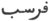
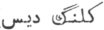
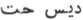
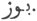

  
[Intangible Textual Heritage](../../index)  [Zoroastrianism](../index.md) 
[Index](index)  [Previous](sbe2319)  [Next](sbe2321.md) 

------------------------------------------------------------------------

[Buy this Book at
Amazon.com](https://www.amazon.com/exec/obidos/ASIN/1402185898/internetsacredte.md)

------------------------------------------------------------------------

*The Zend Avesta, Part II (SBE23)*, James Darmesteter, tr. \[1882\], at
Intangible Textual Heritage

------------------------------------------------------------------------

p. 249

### XV. RÂM YA*S*T.

This Ya*s*t bears the name of Râma *Hv*âstra, the Genius who presides
over the 21st day of the month (Sîrôzah, § 21), and is devoted to his
Hamkâr, Vayu.

Regarding Râma [*Hv*âstra](errata.htm#3.md), the Genius that gives good
abodes and good pastures, and his connection with Vayu, see Vend.
Introd. IV, and Études Iraniennes, II, 187.

This Ya*s*t can be divided into two parts. The first part (§§ 1-140)
contains an enumeration of worshippers who sacrificed to Vayu: Ahura
Mazda (§ 2), Haoshyangha (§ 7), Takhma Urupa (§ 11), Yima (§ 15), A*z*i
Dahâka (§ 19), Thraêtaona (§ 23), Keresâspa (§ 27), Aurvasâra (§ 31),
Hutaosa (§ 35), and Iranian maids (§ 39). The second part (§§ 42-58)
contains a special enumeration and glorification of the many names of
Vayu (§§ 42-50).

\_\_\_\_\_\_\_\_\_\_\_\_\_\_\_\_\_\_\_\_\_\_\_\_\_\_\_\_

0\. May Ahura Mazda be rejoiced! . . . .

Ashem Vohû: Holiness is the best of all good . . . .

I confess myself a worshipper of Mazda, a follower of Zarathu*s*tra, one
who hates the Daêvas, and obeys the laws of Ahura;

For sacrifice, prayer, propitiation, and glorification unto \[Hâvani\],
the holy and master of holiness . . . .

Unto Râma *Hv*âstra, unto Vayu who works highly and is more powerful to
afflict than all other creatures [1](#fn_1096.md),

Be propitiation from me, for sacrifice, prayer, propitiation, and
glorification.

Yathâ ahû vairyô: The will of the Lord is the law of holiness . . . .

#### I.

1\. I will sacrifice to the Waters and to Him who divides them [2](#fn_1097.md). I will sacrifice to Peace, whose
breath is friendly, and to Weal, both of them.

p. 250

To this Vayu do we sacrifice, this Vayu do we invoke, for this house,
for the master of this house, and for the man here who is offering
libations and giving gifts. To this excellent God do we sacrifice, that
he may accept our meat and our prayers, and grant us in return to crush
our enemies at one stroke.

2 [1](#fn_1098.md). To him did the Maker, Ahura
Mazda, offer up a sacrifice in the Airyana Vaê*g*ah 1, on a golden
throne, under golden beams [2](#fn_1099.md) and a
golden canopy, with bundles of baresma and offerings of full-boiling
\[milk\] [3](#fn_1100.md).

3\. He begged of him a boon, saying: 'Grant me this, O Vayu! who dost
work highly [4](#fn_1101.md), that I may smite
the creation of Angra Mainyu, and that nobody may smite this creation of
the Good Spirit!'

4\. Vayu, who works highly, granted him that boon, as the Maker, Ahura
Mazda, did pursue it.

5\. We sacrifice to the holy Vayu: we sacrifice to Vayu, who works
highly.

To this part of thee do we sacrifice, O Vayu! that belongs to Spe*n*ta
Mainyu [5](#fn_1102.md).

For his brightness and glory, I will offer unto him a sacrifice worth
being heard, namely, unto the awful Vayu, who works highly. We offer up
a sacrifice unto the awful Vayu, who works highly, with the libations,
with the Haoma and meat, with the baresma, with the wisdom of the
tongue, with the

p. 251

holy spells, the words, the deeds, the libations, and the well-spoken
words.

Yê*n*hê hâtãm: All those beings of whom Ahura Mazda . . . .

#### II.

6\. I will sacrifice to the Waters and to Him who divides them . . . .

To this Vayu do we sacrifice, this Vayu do we invoke . . . . [1](#fn_1103.md)

7\. To him did Haoshyangha, the Paradhâta, offer up a sacrifice on the
Taêra of the Hara, bound with iron [2](#fn_1104.md), on a golden throne, under golden
beams and a golden canopy, with bundles of baresma and offering of
full-boiling \[milk\].

8\. He begged of him a boon, saying: 'Grant me, O Vayu! who dost work
highly, that I may smite two-thirds of the Daêvas of Mâzana and of the
fiends of Varena [3](#fn_1105.md).'

9\. Vayu, who works highly, granted him that boon, as the Maker, Ahura
Mazda [4](#fn_1106.md), did pursue it.

We sacrifice to the holy Vayu . . . .

For his brightness and glory, I will offer unto him a sacrifice worth
being heard . . . .

#### III.

10\. I will sacrifice to the Waters and to Him who divides them . . . .

To this Vayu do we sacrifice, this Vayu do we invoke . . . .

p. 252

11\. To him did Takhma Urupa [1](#fn_1107.md),
the well-armed [2](#fn_1108.md), offer up a
sacrifice on a golden throne, under golden beams and a golden canopy,
with bundles of baresma and offerings of full-boiling \[milk\].

12\. He begged of him a boon, saying: 'Grant me this, O Vayu! who dost
work highly, that I may conquer all Daêvas and men, all the Yâtus and
Pairikas, and that I may ride Angra Mainyu, turned into the shape of a
horse, all around the earth from one end to the other, for thirty
years.'

13\. Vayu, who works highly, granted him that boon [3](#fn_1109.md), as the Maker, Ahura Mazda, did pursue
it.

We sacrifice to the holy Vayu . . . .

For his brightness and glory, I will offer unto him a sacrifice worth
being heard . . . .

#### IV.

14\. I will sacrifice to the Waters and to Him who divides them . . . .

To this Vayu do we sacrifice, this Vayu do we invoke . . . .

15\. Unto him did the bright Yima, the good shepherd,

p. 253

sacrifice from the height Hukairya, the all-shining and golden, on a
golden throne, under golden beams and a golden canopy, with bundles of
baresma and offerings of full-boiling \[milk\].

16\. He begged of him a boon, saying: 'Grant me this, O Vayu! who dost
work highly, that I may become the most glorious of the men born to
behold the sun: that I may make in my reign both animals and men
undying, waters and plants undrying, and the food for eating creatures
never-failing [1](#fn_1110.md).'

In the reign of the valiant Yima there was neither cold wind nor hot
wind, neither old age nor death, nor envy made by the Daêvas [2](#fn_1111.md).

17\. Vayu, who works highly, granted him that boon, as the Maker, Ahura
Mazda, did pursue it.

We sacrifice to the holy Vayu . . . .

For his brightness and glory, I will offer unto him a sacrifice worth
being heard . . . .

#### V.

18\. I will sacrifice to the Waters and to Him who divides them . . . .

To this Vayu do we sacrifice, this Vayu do we invoke . . . .

19\. Unto him did the three-mouthed A*z*i Dahâka offer up a sacrifice in
his accursed palace of Kviri*n*ta [3](#fn_1112.md),

p. 254

on a golden throne, under golden beams and a golden canopy, with bundles
of baresma and offerings of full-boiling \[milk\].

20\. He begged of him a boon, saying: 'Grant me this, O Vayu! who dost
work highly, that I may make all the seven Karshvares of the earth empty
of men [1](#fn_1113.md).'

21\. In vain did he sacrifice, in vain did he beg, in vain did he
invoke, in vain did he give gifts, in vain did he bring libations; Vayu
did not grant him that boon.

For his brightness and glory, I will offer unto him a sacrifice worth
being heard . . . .

#### VI.

22\. I will sacrifice to the Waters and to Him who divides them . . . .

To this Vayu do we sacrifice, this Vayu do we invoke . . . .

23\. Unto him did Thraêtaona, the heir of the valiant Âthwya clan, offer
up a sacrifice in the four-cornered Varena, on a golden throne, under
golden beams and a golden canopy, with bundles of baresma and offerings
of full-boiling \[milk\].

24\. He begged of him a boon, saying: 'Grant me this, O Vayu! who dost
work highly, that I may overcome A*z*i Dahâka, the three-mouthed, the
three-headed, the six-eyed, who has a thousand senses, that most
powerful, fiendish Dru*g*, that

p. 255

demon baleful to the world, the strongest Drum that Angra Mainyu created
against the material world, to destroy the world of the good principle;
and that I may deliver his two wives, Savanghavâ*k* and Erenavâ*k*, who
are the fairest of body amongst women, and the most wonderful creatures
in the world [1](#fn_1114.md).'

25\. Vayu, who works highly, granted him that boon, as the Maker, Ahura
Mazda, did pursue it.

We sacrifice to the holy Vayu . . . .

For his brightness and glory, I will offer unto him a sacrifice worth
being heard . . . .

#### VII.

26\. I will sacrifice to the Waters and to Him who divides them . . . .

To this Vayu do we sacrifice, this Vayu do we invoke . . . .

27\. To him did the manly-hearted Keresâspa [2](#fn_1115.md) offer up a sacrifice by the
Gudha [3](#fn_1116.md), a channel of the Rangha,
made by Mazda, upon a golden throne, under golden beams and a golden
canopy, with bundles of baresma and offerings of full-boiling \[milk\].

28\. He begged of him a boon, saying: 'Grant me this, O Vayu! who dost
work highly, that I may succeed in avenging my brother Urvâkhshaya [4](#fn_1117.md), that I may smite Hitâspa and yoke him
to my chariot.'

The Ga*n*darewa, who lives beneath the waters,

p. 256

is the son of Ahura in the deep, he is the only master of the deep [1](#fn_1118.md).

29\. Vayu, who works highly, granted him that boon, as the Maker, Ahura
Mazda, did pursue it.

We sacrifice to the holy Vayu . . . .

For his brightness and glory, I will offer unto him a sacrifice worth
being heard . . . .

#### VIII.

30\. I will sacrifice to the Waters and to Him who divides them . . . .

To this Vayu do we sacrifice, this Vayu do we invoke . . . .

31\. To him did Aurvasâra [2](#fn_1119.md), the
lord of the country, offer up a sacrifice, towards the White
Forest [3](#fn_1120.md), by the White Forest, on
the border of the White Forest, on a golden throne, under golden beams
and a golden canopy, with bundles of baresma and offerings of
full-boiling \[milk\].

32\. He begged of him a boon, saying: 'Grant me this, O Vayu! who dost
work highly, that the gallant Husravah, he who unites the Aryan nations
into one kingdom [4](#fn_1121.md), may not smite
us; that I may flee from king Husravah [5](#fn_1122.md); . . . .

p. 257

'That king Husravah and all the Aryans in the Forest may smite him [1](#fn_1123.md).'

33\. Vayu, who works highly, granted him that boon, as the Maker, Ahura
Mazda, did pursue it.

We sacrifice to the holy Vayu . . . .

For his brightness and glory, I will offer unto him a sacrifice worth
being heard . . . .

#### IX.

34\. I will sacrifice to the Waters and to Him who divides them . . . .

To this Vayu do we sacrifice, this Vayu do we invoke . . . .

35\. To him did Hutaosa, she of the many brothers [2](#fn_1124.md), of the Naotara house [3](#fn_1125.md), offer up a sacrifice, on a golden
throne, under golden beams and a golden canopy, with bundles of baresma
and offerings of boiling milk.

36\. She begged of him a boon, saying: 'Grant me this, O Vayu! who dost
work highly, that I may be dear and loved and well-received in the house
of king Vî*s*tâspa.'

37\. Vayu, who works highly, granted her that boon, as the Maker, Ahura
Mazda, did pursue it.

We sacrifice to the holy Vayu . . . .

For his brightness and glory, I will offer unto him a sacrifice worth
being heard . . . .

#### X.

38\. I will sacrifice to the Waters and to Him who divides them . . . .

p. 258

To this Vayu do we sacrifice, this Vayu do we invoke . . . .

39\. To him did [1](#fn_1126.md) the maids, whom
no man had known, offer up a sacrifice on a golden throne, under golden
beams and a golden canopy, with bundles of baresma and offerings of
boiling milk.

40\. They begged of him a boon, saying: 'Grant us this, O Vayu! who dost
work highly, that we may find a husband, young and beautiful of body,
who will treat us well, all life long, and give us offspring; a wise,
learned, ready-tongued husband.'

41\. Vayu, who works highly, granted them that boon, as the Maker, Ahura
Mazda, did pursue it.

We sacrifice to the holy Vayu . . . .

For his brightness and glory, I will offer unto him a sacrifice worth
being heard . . . .

#### XI.

42\. I will sacrifice to the Waters and to Him who divides them . . . .

To this Vayu do we sacrifice, this Vayu do we invoke . . . .

We sacrifice to that Vayu that belongs to the Good Spirit [2](#fn_1127.md), the bright and glorious Vayu.

43\. My name is Vayu, O holy Zarathu*s*tra! My name is Vayu, because I
go through (vyêmi) the two worlds [3](#fn_1128.md), the one which the Good Spirit has

p. 259

made and the one which the Evil Spirit has made.

My name is the Overtaker (apaêta), O holy Zarathu*s*tra! My name is the
Overtaker, because I can overtake the creatures of both worlds, the one
that the Good Spirit has made and the one that the Evil Spirit has made.

44\. My name is the All-smiting, O holy Zarathu*s*tra! My name is the
All-smiting, because I can smite the creatures of both worlds, the one
that the Good Spirit has made and the one that the Evil Spirit has made.

My name is the Worker of Good, O holy Zarathu*s*tra! My name is the
Worker of Good, because I work the good of the Maker, Ahura Mazda, and
of the Amesha-Spe*n*tas [1](#fn_1129.md).

45\. My name is He that goes forwards.

My name is He that goes backwards.

My name is He that bends backwards.

My name is He that hurls away.

My name is He that hurls down.

My name is He that destroys.

My name is He that takes away.

My name is He that finds out.

My name is He that finds out the Glory (*Hv*arenô).

46\. My name is the Valiant; my name is the Most Valiant.

My name is the Strong; my name is the Strongest.

My name is the Firm; my name is the Firmest.

My name is the Stout; my name is the Stoutest.

My name is He that crosses over easily.

My name is He that goes along hurling away.

p. 260

My name is He that crushes at one stroke.

My name is . . . . [1](#fn_1130.md)

My name is He that works against the Daêvas.

My name is . . . . [2](#fn_1131.md)

47\. My name is He that prevails over malice; my name is He that
destroys malice.

My name is He that unites; my name is He that re-unites; my name is He
that separates.

My name is the Burning; my name is the Quick of intelligence [3](#fn_1132.md).

My name is Deliverance; my name is Welfare [4](#fn_1133.md).

My name is the Burrows; my name is He who destroys the burrows [5](#fn_1134.md); my name is He who spits upon the
burrows [6](#fn_1135.md).

48\. My name is Sharpness of spear; my name is He of the sharp spear.

My name is Length of spear; my name is He of the long spear.

My name is Piercingness of spear; my name is He of the piercing spear.

My name is the Glorious; my name is the Over-glorious.

496\. Invoke these names of mine, O holy Zarathu*s*tra! in the midst of
the havocking hordes, in the midst of the columns moving forwards, in
the strife of the conflicting nations.

p. 261

50\. Invoke these names of mine, O holy Zarathu*s*tra! when the
all-powerful tyrant of a country falls upon thee, rushes upon thee,
deals wounds upon thee, or hurls his chariot against thee, to rob
thee [1](#fn_1136.md) of thy wealth, to rob thee
of thy health.

51\. Invoke these names of mine, O holy Zarathu*s*tra! when the unholy
Ashemaogha falls upon thee, rushes upon thee, deals wounds upon thee, or
hurls his chariot against thee, to rob thee of thy strength, to rob thee
of thy wealth, to rob thee of thy health.

52\. Invoke these names of mine, O holy Zarathu*s*tra! when a man stands
in bonds, when a man is being thrown into bonds, or when a man is being
dragged in bonds: thus the prisoners flee from the hands of those who
carry them, they flee away out of the prison [2](#fn_1137.md).

53\. O thou Vayu! who strikest fear upon all men and horses, who in all
creatures workest against the Daêvas, both into the lowest places and
into those a thousand times deep dost thou enter with equal power [3](#fn_1138.md).

54\. 'With what manner of sacrifice shall I worship thee? With what
manner of sacrifice shall I forward and worship thee? With what manner
of sacrifice will be achieved thy adoration, O great Vayu! thou who art
high-up girded, firm, swift-moving, high-footed, wide-breasted,
wide-thighed, with untrembling eyes, as powerful in sovereignty as any
absolute sovereign in the world?'

p. 262

55\. 'Take thou a baresma, O holy Zarathu*s*tra! turn it upwards or
downwards, according as it is full day or dawning; upwards during the
day, downwards at the dawn [1](#fn_1139.md).

56\. 'If thou makest me worshipped with a sacrifice, then I shall say
unto thee with my own voice things of health, made by Mazda and full of
glory, so that Angra Mainyu may never do harm unto thee, nor the Yâtus,
nor those addicted to the works of the Yâtu, whether Daêvas or men.'

57\. We sacrifice unto thee, O great Vayu! we sacrifice unto thee, O
strong Vayu!

We sacrifice unto Vayu, the greatest of the great;

we sacrifice unto Vayu, the strongest of the strong.

We sacrifice unto Vayu, of the golden helm.

We sacrifice unto Vayu, of the golden crown.

We sacrifice unto Vayu, of the golden necklace.

We sacrifice unto Vayu, of the golden chariot.

We sacrifice unto Vayu, of the golden wheel.

We sacrifice unto Vayu, of the golden weapons.

We sacrifice unto Vayu, of the golden garment.

We sacrifice unto Vayu, of the golden shoe.

We sacrifice unto Vayu, of the golden girdle.

We sacrifice unto the holy Vayu; we sacrifice unto Vayu, who works
highly.

To this part of thee do we sacrifice, O Vayu! that belongs to the Good
Spirit.

For his brightness and glory, I will offer unto him a sacrifice worth
being heard, namely, unto the awful Vayu, who works highly . . . .

58\. Yathâ ahû vairyô: The will of the Lord is the law of holiness . . .
.

I bless the sacrifice and invocation unto, and the

p. 263

strength and vigour of Râma *Hv*âstra, and Vayu, who works highly, more
powerful to afflict than all the other creatures: this part of thee that
belongs to the Good Spirit.

Ashem Vohû: Holiness is the best of all good . . . .

\[Give\] unto that man brightness and glory, . . . . give him the
bright, all-happy, blissful abode of the holy Ones.

------------------------------------------------------------------------

### Footnotes

[249:1](sbe2320.htm#fr_1158.md) Cf. Sîrôzah I,
22.

[249:2](sbe2320.htm#fr_1159.md) Apãm Napâ*t* (Yt.
VIII, 34) or Ti*s*trya (Yt. VIII, 1).

[250:1](sbe2320.htm#fr_1160.md) Cf. Yt. V, 17.

[250:2](sbe2320.htm#fr_1161.md) Fraspâ*t*,
Persian  .

[250:3](sbe2320.htm#fr_1162.md) Cf. [p.
169](sbe2317.htm#page_169), note [5](sbe2317.htm#fn_783.md).

[250:4](sbe2320.htm#fr_1163.md) See [p.
10](sbe2304.htm#page_10), note [4](sbe2304.htm#fn_69.md).

[250:5](sbe2320.htm#fr_1164.md) As Vayu, the
atmosphere, is the place in which the conflict of the two principles
takes place, one part of him belongs to the Evil Spirit (see Vend.
Introd. IV, 17).

[251:1](sbe2320.htm#fr_1165.md) The rest as in
clause 1.

[251:2](sbe2320.htm#fr_1166.md) Cf. Yt. V, 21,
[p. 58](sbe2310.htm#page_58), note [2](sbe2310.htm#fn_295.md).

[251:3](sbe2320.htm#fr_1167.md) Cf. Yt. V, 21-23.

[251:4](sbe2320.htm#fr_1168.md) Introduced from §
4 into this and all similar clauses, except the one relating to A*z*i
Dahâka (§ 21).

[252:1](sbe2320.htm#fr_1169.md) Takhma Urupa (in
later legend Tahmûrâf) was a brother to Yima. He reigned for thirty
years and rode Ahriman, turned into a horse. But at last his wife,
deceived by Ahriman, revealed to him the secret of her husband's power,
and Tahmûrâf was swallowed up by his horse. But Yima managed to take
back his brother's body from the body of Ahriman and recovered thereby
the arts and civilisation which had disappeared along with Tahmûrâf (see
Minokhired XXVII, 32; Ravâet apud Spiegel, Einleitung in die
traditionelle Literatur, pp. 317 seq.; Ormazd et Ahriman, § 137 seq.;
cf. above, [p. 60](sbe2310.htm#page_60), note [1](sbe2310.htm#fn_302).md).

[252:2](sbe2320.htm#fr_1170.md) Azinava*nt* or
zaênahva*nt*: he kept that epithet in later tradition: Zînavend, 'quod
cognomen virum significat armis probe instructum' (Hamza Ispahensis, p.
20, tr. Gottwaldt).

[252:3](sbe2320.htm#fr_1171.md) As told Yt. XIX,
29.

[253:1](sbe2320.htm#fr_1172.md) Cf. Yasna IX, 4-5
(11-20) and Yt. XIX, 31 seq.

[253:2](sbe2320.htm#fr_1173.md) This passage is
interpolated from Yasna IX, 5 (17-10.

[253:3](sbe2320.htm#fr_1174.md) Or, 'his accursed
palace of the Stork' (upa kviri*n*tem duzitem). 'A*z*i Dahâka,' says
Hamza (p. 32 in the text, p. 22 in the translation), 'used to live in
Babylon (cf. Yt. V, 29), where he had built a palace in the form of a
stork; he called it Kuleng Dîs (
), the fortress of the Stork; the inhabitants called
it Dis Het ( ).' Kuleng
Dîs was in Zend Kviri*n*ta daêza and Dis Het is nothing else than
Du*z*ita. One may doubt p. 254 whether
Kviri*n*ta is the name of a place or the Zend form of Kuleng, a stork:
in any case it was a palace in Bawri (Babylon). In the Shah Nâmah it is
called Di*z*ukht (du*z*-ukhta for du*z*-ita; see Études Iraniennes, II,
211).

[254:1](sbe2320.htm#fr_1175.md) Cf. Yt. V, 30
seq.

[255:1](sbe2320.htm#fr_1176.md) Yt. V, 34; IX,
14; XVII, 34.

[255:2](sbe2320.htm#fr_1177.md) Cf. Yt. V, 37
seq.

[255:3](sbe2320.htm#fr_1178.md) An unknown
affluent of the Rangha (Tigris).

[255:4](sbe2320.htm#fr_1179.md) Sâma had two
sons, Keresâspa, a warrior, and Urvâkhshaya, a judge and law-giver
(Yasna IX, 10 \[29 seq.\]). We have no further details about
Urvâkhshaya's legend than that he was killed by 'Hitâspa, the
golden-crowned' (cf. Yt. XIX, 4I), and avenged by Keresâspa.

[256:1](sbe2320.htm#fr_1180.md) A disconnected
allusion to the struggle of Keresâspa with the Ga*n*darewa (Yt. V, 38,
text and notes; XIX, 41). On the words 'the son of Ahura . . . .' cf.
Ormazd et Ahriman, p. 215, note 1.

[256:2](sbe2320.htm#fr_1181.md) No other mention
is made of Aurvasâra in the Avesta, unless he is alluded to in Yt. V,
50. He does not appear to have been. known to Firdausi.

[256:3](sbe2320.htm#fr_1182.md) Spaêtini*s*
razûra is called 'the chief of forests' (Bund. XXIV, 16). According to
the Bahman Ya*s*t (III, 9), it was the seat of the last and decisive
battle between Ar*g*âsp and Gû*s*tâsp.

[256:4](sbe2320.htm#fr_1183.md) Cf. Yt. V, 49;
IX, 21.

[256:5](sbe2320.htm#fr_1184.md) Cf. Yt. V, 50.

[257:1](sbe2320.htm#fr_1185.md) This line looks
as if it should belong to a counter-prayer by Husravah, which was heard
by Vayu, as appears from Yt. V, 50.

[257:2](sbe2320.htm#fr_1186.md) See Yt. IX, 26.

[257:3](sbe2320.htm#fr_1187.md) See [p.
77](sbe2310.htm#page_77), note [1](sbe2310.htm#fn_381.md).

[258:1](sbe2320.htm#fr_1188.md) It may be doubted
whether the allusion here is to a legend of marriage en masse, following
the marriage of Hutaosa with Vî*s*tâspa, or whether the aorist is used
with an indicative meaning: 'To him do the maids who have known no man .
. . . They beg of him a boon, saying . . . .' Cf. Yt. XVI, 17.

[258:2](sbe2320.htm#fr_1189.md) Cf. § 5, note 5.

[258:3](sbe2320.htm#fr_1190.md) An attempt to an
etymological explanation of the name Vayu. Cf. § 53.

[259:1](sbe2320.htm#fr_1191.md) He is their agent
and instrument.

[260:1](sbe2320.htm#fr_1192) Âiniva (?.md).

[260:2](sbe2320.htm#fr_1193.md) Keredhari*s*a
(?).

[260:3](sbe2320.htm#fr_1194.md) Doubtful;
bao*k*a, cf.  .

[260:4](sbe2320.htm#fr_1195.md) Reading sudhi*s*.

[260:5](sbe2320.htm#fr_1196.md) Geredha is the
burrow of an Ahrimanian creature (see Vend. III, to \[33\]; VII, 24
\[60: Vayu, in that half of him that belongs to the Evil Spirit, is the
seat (the burrow) of Ahriman; but with his better half, he struggles
against the fiend and destroys him.

[260:6](sbe2320.htm#fr_1197.md) Cf. Yt. I, 11,
16.

[261:1](sbe2320.htm#fr_1198.md) Literally,
coveting.

[261:2](sbe2320.htm#fr_1199.md) The translation
of this clause is doubtful; the text is corrupt.

[261:3](sbe2320.htm#fr_1200.md) Cf. § 42.

[262:1](sbe2320.htm#fr_1201.md) Études
Iraniennes, II, 110.

------------------------------------------------------------------------

[Next: XVI. Dîn Ya*s*t](sbe2321.md)
