  
[Intangible Textual Heritage](../../index)  [Zoroastrianism](../index.md) 
[Index](index)  [Previous](sbe37001)  [Next](sbe37003.md) 

------------------------------------------------------------------------

[Buy this Book at
Amazon.com](https://www.amazon.com/exec/obidos/ASIN/1402156081/internetsacredte.md)

------------------------------------------------------------------------

*Pahlavi Texts, Part IV (SBE37)*, E.W. West, tr. \[1892\], at Intangible
Textual Heritage

------------------------------------------------------------------------

p. xxviii p.
xxix

### INTRODUCTION.

ATTENTIVE readers of the Sacred Books of the East have had ample
opportunities of becoming acquainted with the Zoroastrian scriptures, so
far as these have been preserved by the Parsis. In vols. iv, xxiii, and
xxxi they have translations of all the texts extant in the original
language of the Avesta, excepting a few fragments which are not yet
collected. And in vols. v, xviii, and xxiv they have translations of
later Pahlavi texts, showing how faithfully the old doctrines and
legends were handed down by the priests of Sasanian times to their
immediate successors. But they will also have noticed that the
translators of these texts are well aware of the fact that the texts
themselves are mere fragments of the religious writings of the
Zoroastrians, which owe their preservation to the circumstance that they
were those portions most usually committed to memory by the priesthood,
such as the liturgy, sacred myths, and ceremonial laws. The object of
the present volume is to add to those fragments all the accessible
information, that can be collected from Irânian sources, regarding the
contents of the whole Zoroastrian literature in Sasanian times.

It has been long known that this literature was contained in twenty-one
Nasks, or treatises, named either from the nature of their contents, or
from their initial words, and each having one of the twenty-one words of
the Ahunavair attached to it as a kind of artificial reminder of their
proper order and number while enumerating them. Very brief statements of
the contents of each Nask have also been accessible in manuscripts of
the Persian Rivâyats, such as those translated in pp.
[419](sbe37126.htm#page_419)-[438](sbe37128.htm#page_438.md) of this
volume. And the existence of a much longer account of the Nasks in the
Dinka*rd* was ascertained by Haug, who published

p. xxx

some extracts from it in 1870, when describing several of the Nasks in
the Index to the Pahlavi-Pâzand Glossary. He was unable to do more, on
account of the defective state of all modern manuscripts of the
Dinka*rd*, in which a large portion of the text of the description of
the Nasks, in the eighth and ninth books, is missing in various places
without any hint of the omissions. These defects were owing to the
abstraction of 52 folios of this part of the Irânian manuscript of the
Dinka*rd*, after it was brought to India and before any copy of it had
been written; and, even now, two of these folios are still missing, as
stated in pp. 262, 270. The importance of recovering these 52 missing
folios was due to the fact that they contain the text of Dk. VIII,
Chaps. VII, 5-XIX, 36, XXXI, 31-XXXVIII, 19, XLIV, 34-XLVI, 5, and Dk.
IX, Chaps. I, 1-XI, II, XII, 15-XLVII, 17, or nearly half the text of
the two books.

Regarding the early history of the Dinka*rd* there exists a detailed
statement in the last chapter of its third book, which can now be
translated with greater precision than was possible in 1867, when Haug
published its Pahlavi text, with an English translation, in his
introduction to the Farhang-i Oîm-aêvak, or Zand-Pahlavi Glossary. In
this historical statement it is evident that §§ 1-8 refer to the
traditional history of the Zoroastrian scriptures generally, considered
as the original source of the information contained in the Dinka*rd*;
but §§ 9-13 may be accepted as the actual history of the compilation of
the work itself, the facts of which may, very possibly, have all been
within the personal knowledge of the writer of the statement. The
Pahlavi text of this statement, as preserved in the manuscripts B and K
(see pp. [xxxv](#page_xxxv)-[xxxviii](#page_xxxviii.md) and
[2](sbe37003.htm#page_2).md), may be translated as follows:—

‘1. About the Dinka*rd* scripture (nipîk), from the Exposition of the
Good Religion, there is *this:*—The Dinka*rd* scripture is a work which
is adorned with all wisdom, and a publication of the Ma*zd*a-worshipping
religion. 2. And, first, the work—which *was derived* from the good
religion *of* those of the primitive faith, *and* which *was* the
knowledge revealing the good religion of the

p. xxxi

prophet (vakhshvar) Spîtâmân Zaratû*s*t, *whose* guardian spirit is
reverenced, and *his* first disciple through asking and hearing the sane
reverenced guardian spirit—is information which is a similitude of
enlightenment on every subject from the original light. 3. And those
original questions and the decision of the exalted ruler Kaî-Vi*s*tâsp
to have *them* written *were its* origin, and he ordered *them* to
deliver the original to the treasury of Shapîgân [1](#fn_0.md), *and* to distribute copies provided. 4.
And, after that, he sends a copy to the fortress of documents, to keep
the information also there.

‘5. And during the ruin that happened to the country of Irân, and in the
monarchy, owing to the evil-destined villain Alexander, that which *was*
in the fortress of documents came to be burnt, and that in the treasury
of Shapîgân [2](#fn_1.md) into the hands of the
Arûmans, and *was* translated by him even into the Greek language, as
information which *was* connected with the ancients (min pê*s*înîgân
pa*d*vastakŏ).

‘6. And that A*r*takhshatar, king of kings, who *was* son of Pâpak, came
for the restoration of the monarchy of Irân, *and* the same scripture
*was* brought from a scattered state to one place. 7. The righteous
Tôsar of the primitive faith, who was the priest of priests [3](#fn_2.md), appeared with an exposition recovered from
the Avesta, and *was* ordered to complete *the scripture* from that
exposition. 8. He did so accordingly (ham-gûnakŏ), to preserve a
similitude of the splendour of the original enlightenment in the
treasury of Shapîgân [4](#fn_3.md), and was ordered
to distribute copies *of* the information provided.

‘9. And after the ruin and devastation that came from the Arabs, even to
the archives (dîvân) and treasures of the realm, the saintly [5](#fn_4.md) Âtû*r*-farnbag, son of Farukhŏ-zâ*d*, who
became the leader of the orthodox, brought those copies, which were
scattered on *all* sides, *and* new resources, back from dispersion into
union with the archives of his residence; *and*, through observance and
consideration for the Avesta and Zand of the good religion, he made the
sayings of those of the primitive faith again a similitude of the
illumination (fîrôkŏ) from that splendour.

p. xxxii

‘10. Through the awful displeasure (*or defect*) and ruin (*or injury*)
that happened to Zaratû*s*t, son of Âtû*r*-farnbag, who became the
leader of the orthodox, even those archives came to devastation, that
scripture to dilapidation and dispersion, and the statements (v*âk*îh)
also to obsoleteness, perversion, and corruption.

‘11. And, after that, I, Âtû*r*pâ*d*, son of Hêmê*d* *and* leader of the
orthodox, *have* likewise written, from their fragments (sûbâragânŏ), a
new means of giving assistance *to* the Ma*zd*a-worshipping religion,
with much prayer, investigation, and trouble. 12. From whatever *was*
recovered from those dilapidated (visândakŏ), decayed, worn out, and
dust-mingled (khâk-âmêg) archives—and these, too, brought back by taking
away, carrying *off*, and seizing—*it* is selected, owing to [1](#fn_5.md) the assistance of the counselling wisdom of
the mighty spirit, for the rediffusion of the words and deeds of the
ancients, and of the evidence *of* the Avesta, for those of the
primitive faith. 13. And the increase of knowledge from the good
religion, arranged and prescribed in its chapters, is a lustre from
encountering that splendour from the enlightenment of the original light
primarily composed for the exposition of the good religion, *and* this
which is named is a resemblance by adoption of the thousand chapters
*of* that great original Dinka*rd* [2](#fn_6.md).
14. It is perfected by the sacred beings, *and* transmits the powerful
effect which *has* come upon even that which is the perfect religion of
the sufferers [3](#fn_7.md) in *this* age, and also
the coming of the assistance of the soul to the knowledge [4](#fn_8.md) of the orthodox; and even reunion with [5](#fn_9.md) the rest of Irân is acquaintance *with* the
exposition of the Ma*zd*a-worshipping religion, and the reproviding of
more resources of a like origin, which *will be* also due to those whom
the Supreme *has* provided, the disciples of Aûshê*d*ar [6](#fn_10.md), son of Zaratû*s*t, for asking again a
declaration of [7](#fn_11.md) the good religion
from Aûshê*d*ar.’

From this statement it appears that the compilation of the Dinka*rd* was
commenced by Âtû*r*-farnbag, son of Farukhŏ-zâ*d*, one of the leaders or
supreme high-priests of the Ma*zd*a-worshippers, and was revised and
completed

p. xxxiii

by Âtû*r*pâ*d*, son of Hêmê*d*, one of his successors. From the
Mâ*d*îgân-î gu*g*astak Abâli*s* we learn that Âtû*r*-farnbag had a
religious disputation with Abâli*s* in the presence of the Khalîfah
Al-Mâmûn, who reigned A.D. 813-833; he must therefore have been
compiling the Dinka*rd* during the first half of the ninth century. In
the *S*ikand-gûmânîk Vi*g*âr, IV, 107, IX, 3, X, 55, he is also
mentioned as a compiler of the Dinka*rd*., but the details there quoted
must have been taken from its first two books which are still missing.
It is likewise stated at the beginning of both its fourth and fifth
books that their contents are derived from his statements, and a similar
acknowledgement is made with regard to some of the contents of Chap.
CXLII of the third book; so that the evidence of his authorship is very
complete. With regard to Âtû*r*pâ*d*, the completer of the Dinka*rd*, we
may safely identify him with the Âtû*r*pâ*d*, son of Hama, mentioned in
Bd. XXXIII, 11 as a contemporary of Zâ*d*-sparam, who flourished at the
latter end of the ninth century (see S.B.E., vol. xviii, p. xiv). We
have, therefore, every reason to be satisfied that the whole of the
Dinka*rd* was compiled during the ninth century.

The history of the transmission of the text of its last seven books,
through the last thousand years, down to the present manuscripts, is
equally satisfactory, owing to the preservation of a series of colophons
appended to the text, of which the first and most important may be
translated as follows

‘Completed in great joy and full of gratification this last portion of
the manuscript of the incomparable, priceless, and unequalled Dinka*rd*,
at the place where *it was* found *and* happily disinterred [1](#fn_12.md) by us in Asûristân, within the happily
prosperous, odoriferous, precious, well-thriving, *and* glorious
Bakdâ*d* of Good Rectitude [2](#fn_13.md); from a
copy which, as regards the religion, is *just* as the leaders of the
saintly and orthodox, who *were* of the family of the saintly
Âtû*r*pâ*d*, son of Mâraspend, (who re-explained knowledge, by five *or*
six well-destined *ones*, from the pure revelation

p. xxxiv

*which* is the all-embellished learning of learnings) *and* the
successive leaders of the orthodox (*who* again provided at different
times \[ahamvâr\] for its restoration, through manuscripts *at* various
places, to maintain reading *and* investigation *there*in) had written.

‘I, Mâh-vindâ*d*, *son* of Naremâhân, *son* of Vâhrâm, *son of*
Mit*r*ô-*â*pân, like an adopted son for his own possession, who wrote
*it, am* letting *it* forth *on* the day Dên of the month Tîr, the
victor, of the year 369 after the year 20 of that Ya*zd*aka*rd*, king of
kings, who *was* son of Shat*r*ô-*a*yâr \[2nd July, 1020\] [1](#fn_14.md); in reliance on the pure good religion of
the Ma*zd*a-worshippers, as regards remembrance of Zaratû*s*t, the
Spîtâmân with the righteous guardian spirit, *and of* the genuine
achievement of Âtû*r*pâ*d*, son of Mâ*r*aspend; and as regards
remembrance *of* the righteous utterance of blessings for the whole
embodied existence *by* the desirers of righteousness, who are thinkers
of good thoughts, speakers of good words, and doers of good deeds; in
the worldly *existence*, through completely-wishful kind regard of the
practices of righteousness, they shall unite with the union of the
renovation *of the universe*, and spiritually *their* pure souls *and*
guardian spirits *attain* to the supremely great position and eminence,
and complete acquirement of recompense, which are in the light that is
endless, constantly beneficial, *and* full of glory, which they shall
obtain. *This is* especially for those saintly *and* supremely learned
*men*, Âtû*r*-farnbag, son of Farukhŏ-zâ*d*, *and* Âtû*r*pâ*d*, son of
Hêmê*d*, by whom this priceless [2](#fn_15.md)
Dinka*rd* scripture *was* selected so learnedly and (with a pure
perception of the spiritual lord, in seizing the cream of the fortunate
commentary of [3](#fn_16) the good religion.md) so
truly amicably, and fully affectionately *for* the good creatures and
religion, with great advantage for us moderns, *and* concealed for me
who, through eagerness *for* righteousness, like an adopted son, *have*
happily disinterred this scripture; and even he who reads, and shall
make use of it, is reliant and free from doubt about it; and him who
shall take a copy from it, and preserves *it* with propriety, they shall
appropriately connect with it.’

p. xxxv

(This is followed by a long succession of aphorisms, and the colophon
winds up with some threats against those who shall misuse the
manuscript.)

As this colophon mentions only the 'last portion' of the Dinka*rd*, and
is appended to the text of Dk. III-IX, it is probable that the first
portion of the work, Dk. I, II, had already become separated from the
rest within 150 years of its revision and completion. And if
Mâh-vindâ*d* did not copy from the original manuscript of Âtû*r*pâ*d*,
he must certainly have done so from a very early transcript.

The second colophon was written by Shat*r*ô-*a*yâr, *son of* Êr*d*îshîr,
*son* of Aîr*îk*, *son* of Rûstâm, *son* of Aîr*îk*, *son* of Kubâ*d*,
*son of* Aîrân-shah, who completed his copy on the day Aûha*r*ma*zd* of
the month Spenda*r*ma*d* in the year 865 after the 10th year of
Ya*zd*aka*rd* \[3rd October, 1516\], having transcribed it from a copy
written by Mar’*z*apân, *son* of Spend-dâ*d*, *son* of Mar’*z*apân, *son
of* Mit*r*ô-*â*pân, *son* of Spend-dâ*d*, *son of* Mit*r*ô-*â*pân, *son*
of Mar’*z*apân, *son* of Dahi*s*n-aîyyâr, *son* of Rô*g*-vêh, *son* of
Shâh-ma*rd*. The date of Mar’*z*apân's copy may be approximately fixed
by observing that his father's first cousin wrote a copy of AV. and Gf.,
mentioned in K20, in the year 690 of Ya*zd*aka*rd*, while his
great great granduncle wrote a similar copy, mentioned in MH6, in the
Pârsî year 618. If this Pârsî year be reckoned from the era of the 10th
year of Ya*zd*aka*rd*, as seems probable [1](#fn_17.md), these dates give 52 years for three
generations; and Mar’*z*apân, living one generation later than the
writer of A.Y. 690, may perhaps have written his copy of the Dinka*rd*
about A.Y. 707 \[A.D. 1338\]; so that there was probably another
copyist, intermediate between him and Mâh-vindâ*d*-î Naremâhân, of whom
no record has been preserved. Shat*r*ô-*a*yâr concludes his colophon by
quoting a long passage from the first colophon, as already stated in [p.
xxxiv](#page_xxxiv), n. [1](#fn_14.md), and by acknowledging his
obligations to three other persons whom he names. This colophon is the
last that now remains attached to the manuscript B, but it was formerly
followed

p. xxxvi

by a third colophon, written by the actual writer of B, and preserved in
copies transcribed from B since its arrival in India.

This third colophon was written by Mâh-vindâ*d*, *son of* Vâhrâm, *son
of* Êr*d*îshîr of Tûrkâbâ*d*, who completed his copy, from that of
Shat*r*ô-*a*yâr, on the day *Âv*ân of the month Khû*r*dâ*d* in the Pârsi
year 1009 after the 20th year of Ya*zd*aka*rd* \[21st December, 1659, N.
S.\]. This copy, which constitutes the manuscript B, was afterwards
approved by Vâhrâm, *son* of Mâh-vindâ*d*, *son of* Rûstâm, *son of*
Anôshak-rûbân, *son of* Rûstâm of Tûrkâbâ*d*, who blesses the writer of
the second colophon, on the day Tî*s*tar of the month Vohûman in the
year 1038 of Ya*zd*aka*rd* \[18th August, 1669, N. S.\]. It was also
finally seen and approved by Rûstâm, *son* of Gû*s*tâsp, *son of*
Êr*d*îshîr, who likewise blesses the writer of the second colophon; and
the approximate date of this approval may be guessed from the fact that
Rûstâm Gû*s*tâsp is known to have copied one manuscript in A.D. 1706,
and another in 1741.

Regarding this manuscript B, written in 1659, it appears from Mullâ
Fîrûz's *Avî*g*êh Dîn* (Bombay, 1830) that Mullâ Bahman, son of Mullâ
Behrâm, a Parsi priest of Yazd, brought this manuscript of the Dinka*rd*
from Irân to Surat in 1783, and, having shown it to Aspandiârji
Ratanji-shâh, he lent it to Kâusji Rustamji, then Dastûr of Surat, and
allowed him to have it copied. Mullâ Bahman had great difficulty in
obtaining the return of his manuscript, and when it was returned many
folios were missing. It was after this loss of folios that Aspandiârji
had several other copies transcribed from the defective manuscript, to
be sent to various persons, and all these copies were therefore equally
defective.

This manuscript B, thus defective, afterwards came into the possession
of Mullâ Fîrûz, who was high-priest of the Kadmi Parsis in Bombay; and,
after his death in 1830, it descended to his successor. In 1875 it
belonged to Dastûr Sohrâbji Rustamji, high-priest of the Kadmis, through
whose courtesy, and that of Dastûr Dr. Jâmâspji Minochiharji, it was
then lent to me long enough to

p. xxxvii

enable me to copy and collate two-thirds of Dk. III and to collate Dk.
IV-IX; and Dastûr Jâmâspji, afterwards, kindly supplied me with a copy
of the remainder of Dk. III.

The manuscript has been bound in its defective state, and contains 322
folios, originally fourteen inches high and ten inches wide, written 20
to 22 lines to the page. When complete it appears to have consisted of
392 folios, all numbered in Persian words, but with several blunders,
including one of fifty folios, so that the last folio was really
numbered 442. Of the 70 folios not bound with the rest of the
manuscript, fourteen were lying loose in the volume; forty-three
belonged to Dastûr Rustamji Kaikobâdji of Nausâri, with a copy of which
I was kindly supplied by Dastûr Dr. Peshotanji Behramji of Bombay, who
also enabled me to collate it with the original folios; and seven folios
were lent to me by Dastûr Dr. Hoshangji Jâmâspji of Poona, for the
purpose of copying. The remaining six folios have not been discovered;
they comprise the first folio of the manuscript, containing the
commencement of Dk. III, which was probably lost before the manuscript
arrived in India; also one folio in Dk. VII, two in Dk. IX (see pp.
[262](sbe37082.htm#page_262), [270](sbe37085.htm#page_270.md) of this
volume), and the last two folios of the manuscript, containing the third
colophon and final approvals (see [p. xxxvi](#page_xxxvi).md).

I am likewise much indebted to the kindness of Professor Kielhorn, who
gave me a modern copy of Dk. IV-IX (with the text in its defective
state) which had been prepared at Poona, so that it was only necessary
to collate this copy with the original text of the manuscript B. With
the aid of all this liberal assistance I was enabled to obtain the whole
text of the Dinka*rd*, known to exist, in the course of a few months;
that it has since taken as much as sixteen years to find opportunities
for translating and publishing rather more than one-fourth of its
contents, will not surprise any one who is acquainted with the nature of
the work that had to be done.

The only known manuscript, independent of B, that contains any portion
of the Dinka*rd*, is the old codex K

p. xxxviii

brought from Persia by the late Professor Westergaard in 1843, and now
No. 43 of the Irânian manuscripts in the University Library at
Kopenhagen. This codex contains about one-fifth of the text of the
Dinka*rd* in two detached portions, together with other Pahlavi texts.
The first portion occupies fols. 177-261, and comprises Dk. VI, of which
one-eighth is missing, with Dk. III, Chaps. CLX and CCLXXXIII, and a
colophon, all written in the district of Tûrkâbâ*d* by Mit*r*ô-*â*pân,
*son* of Anôshak-rûbân, *son of* Rûstâm, *son of* Shat*r*ô-*a*yâr, *son
of* Mâh-vindâ*d*, *son of* Vâhrâm, *son of* Gûshi*s*n-*a*yâr, *son of*
Mit*r*ô-*â*pân, and completed on the day Gô*s* of the month Mit*r*ô in
the Pârsî year 943 after the 20th year of Ya*zd*aka*rd* \[10th May,
1,594, N. S.\]. This copyist appears to have been a great-uncle of the
writer who approved the manuscript B in 1669, ten years after it was
written; and the original from which he copied was, no doubt, descended
from Mâh-vindâ*d*-î Naremâhân's manuscript of 1020, as he appends to his
colophon all the latter part of Mâh-vindâ*d*'s colophon (see [p.
xxxiv](#page_xxxiv), n. [3](#fn_16).md). The second portion of the text of
the Dinka*rd*, contained in the manuscript K, is written by another hand
on 42 additional folios, and comprises the last two chapters of Dk. III,
the whole of Dk. V, and the first three-tenths of Dk. IX (as mentioned
in [p. 172](sbe37050.htm#page_172), n. [1](sbe37050.htm#fn_489.md), of this
volume). This manuscript supplies several short passages in the
Dinka*rd*, which are omitted by B, especially in the first portion of
the text described above. It has also afforded much assistance in the
translation of Dk. IX, Chaps. I, 1-XXXI, 17.

Regarding the authorship of the summary account of the Nasks, contained
in Dk. VIII, IX, it may be reasonably assumed, in default of any
positive information, that the compiler was Âtû*r*pâ*d*, son of Hêmê*d*,
the last editor of the Dinka*rd*. And, as nothing is said about any
previous treatise being consulted, it may be safely supposed that he had
access to the Avesta texts and Pahlavi versions of all the Nasks he
describes, fully three centuries after the Muhammadan conquest of
Persia. The only Nask he could not obtain was the Va*s*tag, and the
Pahlavi version

p. xxxix

of the Nâ*d*ar was also missing; under which circumstances, the fully
detailed accounts of these two Nasks, given in the Persian Rivâyats,
must be viewed with suspicion, until better evidence of their
authenticity has been discovered than is at present available.

The survival of so much of the sacred Zoroastrian literature, during
three centuries of Muhammadan rule, indicates that the final loss of
nearly all this literature was not so directly attributable to the Arabs
as the Parsis suppose. So long as a considerable number of the Persians
adhered to their ancient religion, they were able to preserve its
literature almost intact, even for centuries; but when, through
conversion and extermination, the Ma*zd*a-worshippers had become a mere
remnant, and then fell under the more barbarous rule of the Tartars,
they rapidly lost all their old literature that was not in daily
religious use. And the loss may have been as much due to their
neglecting the necessary copying of manuscripts, as to any
destructiveness on the part of their conquerors; because the durability
of a manuscript written on paper seldom exceeds five or six centuries.

The statements of the Dinka*rd*, about the classification and
subdivisions of the Nasks, are corroborated and supplemented by those of
Zâ*d*-sparam (see pp.
[401](sbe37120.htm#page_401)-[405](sbe37120.htm#page_405).md). The division
of all literature into three classes of knowledge, religious, worldly,
and intermediate, is one that would naturally suggest itself to any
classifier [1](#fn_18.md), but the names employed
(which are transcribed from the Avesta, and do not exactly correspond
with these three meanings) must have originated at a period when the
Avesta language was still spoken. That such a classification cannot be
very strictly carried out in practice is already admitted in Dk. VIII,
Chap. I, 13.

p. xl

The further division of the literature into twenty-one books, seven in
each of the three classes, is a much more artificial arrangement, and
can, perhaps, be best explained as an attempt to make the twenty-one
words of the Ahunavair serve the purpose of a reminder for enumerating
the Nasks in their proper order. This arrangement was probably made at
some period when the scattered Avesta literature was being collected and
re-arranged, the Pahlavi versions being then supplied, and the present
Pahlavi names of the Nasks appointed. This may possibly have been the
work of 'composition and preservation' attributed to Âtû*r*pâ*d*, son of
Mâ*r*aspend, in Dk. VIII, Chap. I, 22, when 'the Nasks were enumerated'
(see Dk. IV, 27, in p. 415), which occurred in the fourth century.

Why the established sequence of the Nasks, detailed in Dk. VIII, Chap.
I, 12, should differ from the successive sequences of their three
classes, given in §§ 9-11, is very imperfectly explained; but some of
the reasons for the difference may perhaps be guessed. If the notation
proposed in [p. 7](sbe37004.htm#page_7), n. [3](sbe37004.htm#fn_30.md), be
adopted, the established sequence is G2-4; H1-7; G5; L6; G7; L7, 1-5;
G6, 1; in which the only Nasks that are out of their order in the
classes are G1, 5-7 and L6, 7. The placing of G6, 1 next after L5 (that
is, the Hâ*d*ôkht and Stô*d*-ya*s*t next after the Vendîdâ*d*) may
perhaps have been owing to the constant use of these three Nasks in the
liturgy, in which either the Vendîdâ*d*, or the Hâ*d*ôkht [1](#fn_19.md), was frequently interpolated in the
recitation of the Stô*d*-ya*s*t which comprised by far the larger
portion of the present Yasna and Vîspêra*d*. But this position of the
Stô*d*-ya*s*t, at the end of the list of Nasks, was probably considered
derogatory to its sacred character by most of the writers of the Persian
Rivâyats, who have, therefore, restored it to its original place at the
head of the Gâthic Nasks. Dk. VIII, Chap. I, i5, states that G5 was
placed after 117 because the Va*s*tag was connected with the
Vi*s*tâsp-sâstô, probably by the nature of its contents. And, possibly,
the sequence L6, G7, L7 of the *K*itradâ*d*, Spend, and Bakân-ya*s*t,
between the Va*s*tag

p. xli

and Nîkâ*d*ûm, may indicate some similar resemblance of contents;
especially as the contents of the *K*itradâ*d* and Bakân-ya*s*t were so
far from being strictly legal that these Nasks were placed in a
sub-class by themselves, and the connection of the Spend with the Gâthas
appears to have been merely historical. The Persian Rivâyats place the
Spend next after the Va*s*tag, thereby bringing the two imperfectly
Gâthic Nasks together, as well as the two imperfectly legal ones; but
then they also transpose the Ganabâ-sar-ni*g*a*d* and the Hûspâram, for
which there seems to be no justification.

With regard to the names of the Nasks, it is evident that several of the
Persian names, used in the Rivâyats, are more or less irreconcileable
with the Pahlavi names in the Dinka*rd*, and some others are improbable
readings of the Pahlavi forms. In this translation the Pahlavi forms
have been followed, as clearly more authentic than the Persian
corruptions, and some few of the names have been read differently; while
in other cases the most probable readings have been merely suggested in
foot-notes, not on account of the Persian reading being justifiable, but
because the evidence for the suggested reading is less complete than
would be desirable.

In dealing with this account of the Nasks it is always necessary to
remember that the compiler of the Dinka*rd* relies entirely upon their
Pahlavi versions, as he states distinctly in Dk. VIII, Chap. I, 3; he
occasionally mentions the Avesta texts, as in Chaps. VI, 1, XII, 1, and
it is abundantly evident, to the practised translator, that Avesta
phrases often underlie the Pahlavi passages which seem to be quoted at
length from the original Nasks, especially in Dk. IX; but, for some of
the details mentioned, there may be no older authority than a Pahlavi
commentary, and this should ever be borne in mind by the sceptical
critic in search of anachronisms.

Owing to his complete reliance upon the Pahlavi versions, it is
impossible to ascertain with certainty whether any particular statement,
made by the compiler of the Dinka*rd*, was contained in the Avesta text;
his summary, therefore,

p. xlii

throws little or no satisfactory light upon the origin of that text. A
few of the details he mentions (such as those contained in Dk. VIII,
Chaps. XIII, 17-20, XLIII, 24 and Dk. IX, Chaps. XXXII, 17, XXXIX,
13-16, LIII, 3) evidently refer to Sasanian times, and may be reasonably
supposed to have originated in the Pahlavi versions of those times. But
vaguer prophecies of good or evil, such as are common in all religions
at all times, may have often occurred in the Avesta texts themselves.

It is evident, however, that all the Nasks have accumulated around the
Gâtha centre of the Stô*d*-ya*s*t, and that this Gâtha centre in the
earliest Sasanian times was neither more nor less extensive than it is
at present. The age of Gâthic composition had so long passed away in the
time of the earliest Sasanian monarchs, that the sages whom they
appointed to collect and re-arrange the sacred literature, were unable
to fully understand many of the stanzas they had to translate into
Pahlavi, much less could they have added to their number. How far they
may have been able to write ordinary Avesta text is more uncertain, but
any such writing was probably confined to a few phrases for uniting the
fragments of old Avesta which they discovered, or for interpolating
opinions of their own. All such compositions, however, would have been
hazardous, as forming no part of their duties, which seem to have been
confined to the arrangement of the fragmentary Avesta texts, and their
translation into Pahlavi with explanatory comments in that language. It
appears from the traditional statements, mentioned in [p.
415](sbe37124.htm#page_415.md), that this work was completed, and the Nasks
were fully arranged, by Âtû*r*pâ*d* son of Mâ*r*aspend, in the reign of
Shahpûhar II (A.D. 309379); but the Pahlavi versions were certainly
revised, and some further commentaries added, after the suppression of
the heresy of Mazdak, as late as the reign of Khûsrôî I (A.D. 531-579).

That the Avesta texts themselves were not written, to any great extent,
in Sasanian times, is shown by the quantity of Pahlavi commentary
necessary to adapt them to the altered circumstances of those times. The
Gâthic

p. xliii

\[paragraph continues\] Nasks, being
strictly religious, required only some explanations, with little
extended commentary; because the religion had to be maintained without
sensible modification. Of the Hadha-mãthric Nasks we know but little.
But the strictly Legal Nasks consisted chiefly of the commentary which
is always necessary to adapt ancient laws to modern ideas.

With regard to the mode of describing the Nasks, adopted in the
Dinka*rd*, it is evident that the compiler intended, in the first place,
to give merely a very short account of the general contents of each
Nask, to be followed by a detailed statement of the particular contents
of each chapter (see Dk. VIII, Chap. I, 23, 24). But, when he had fully
carried out this intention with respect to the first three Nasks, his
work came to a premature conclusion, which has deprived us of much
valuable information regarding the rest of the Nasks. The descriptions
of these other Nasks vary in extent, but may be roughly classified as
follows:—Of the Nâ*d*ar and Va*s*tag there is no description whatever.
Of the Dâmdâ*d*, Ra*d*ŏ-dâ*d*-aîtag, Ka*s*kîsrôbô, Vi*s*tâsp-sâstô,
Bakân-ya*s*t, and Stô*d*-ya*s*t the description is very short, averaging
80 Pahlavi words for each. Of the Pâ*g*ag, Bari*s*, *K*itradâ*d*, Spend,
and Hâ*d*ôkht the description is rather longer, averaging 358 Pahlavi
words for each; but, as such a description is still far too brief to be
satisfactory, the compiler must have intended to add a detailed account
of each chapter of all these Nasks. On coming to the strictly Legal
Nasks, however, he adopted a different plan, by giving a much more
voluminous statement of the contents of certain selected chapters; thus
the very long description of the Nîkâ*d*ûm, Ganabâ-sar-ni*g*a*d*,
Hûspâram, and Sakâ*d*ûm averages 3670 Pahlavi words for each. This
change of plan is somewhat modified in the case of the Vendîdâ*d*, where
the description of 1272 Pahlavi words is only moderately long. While the
first three Nasks, the Sû*d*kar, Var*s*tmânsar, and Bakŏ, after a very
short description averaging 65 Pahlavi words for each, are again
described in detail, as already mentioned, to the average extent of 8647
Pahlavi words for each.

p. xliv

From these descriptions, and their connection with certain Avesta texts
and Pahlavi writings, it is now possible to form a more or less adequate
conception of the contents of Nasks I-IV, X, XIII-XIX, XXI, and also
some idea of those of Nasks VI, XII; but the accounts of the remaining
six Nasks, most of which belonged to the Hadha-mãthric or scientific
class, are very unsatisfactory.

With reference to the total extent of the Nasks, when they were all
extant, it is obvious that the length of descriptions, drawn up on the
same plan, ought to bear approximately some definite proportion to the
lengths of text described; so that, if the extent of the text of one
Nask be known, and the proportion it bears to the length of its
description be ascertained, this proportion becomes a rough means of
estimating the probable extent of other Nasks, from the length of their
descriptions drawn up on the same plan. Three years ago an attempt was
made [1](#fn_20.md) to estimate the total extent of
the Nasks in this way, based upon the assumptions that the Nasks still
extant were three in number, that the length of the description of the
Vendîdâ*d* was a fair average one for estimating the extent of Pahlavi
version in all the lost Nasks, and that the proportion of Avesta text to
Pahlavi version in the Nîrangistân was also a fair average for
estimating the extent of their Avesta texts. These assumptions were
carefully made, as the least liable to objection, and the total extent
of the Nasks in Sasanian times, thus estimated, amounted to 133,000
words of Avesta text and 844,000 of Pahlavi version.

Since the completion of the translation of Dk. IX it has, however,
become possible to estimate the probable extent of the first three Nasks
from the proportion between the actual extent of the first three
fargar*d*s of the Bakŏ (Yas. XIX-XXI) and the length of their
description. It has also been thought no longer reasonable to neglect
the actual length of the Nîrangistân as a basis for estimating the
extent of the Pahlavi versions of the strictly Legal Nasks XV-XVIII;

p. xlv

and the Bakân-ya*s*t has been identified with the Ya*s*ts still
extant [1](#fn_21.md). These additional
considerations have led to a new estimate of the probable extent of each
Nask separately, based upon the best data available in each case, as
stated in detail in the foot-notes to the names of the Nasks in the
Extant Fragments (pp.
[451](sbe37130.htm#page_451)-[488](sbe37149.htm#page_488.md) of this
volume). These estimates are here collected, for the sake of convenient
reference, as follows:—

|     |      |      |                          |         |       |           |
|-----|------|------|--------------------------|---------|-------|-----------|
|     |      |      |                          | Avesta. |       | Pahlavi.  |
| G2: | Nask | 1\.  | Sû*d*kar                 | 4,700   | words | 10,500    |
| „ 3 | „    | 2\.  | Var*s*tmânsar            | 8,300   | „     | 18,500    |
| „ 4 | ,,   | 3\.  | Bakŏ                     | 9,500   | „     | 21,200    |
| H1  | „    | 4\.  | Dâmdâ*d*                 | 8,900   | „     | 29,300    |
| „ 2 | „    | 5\.  | Nâ*d*ar                  | 6,800   | „     | 22,200    |
| „ 3 | „    | 6\.  | Pâ*g*ag                  | 9,100   | „     | 29,800    |
| „ 4 | „    | 7\.  | Ra*d*ŏ-dâ*d*-aîtag       | 10,500  | „     | 34,300    |
| „ 5 | „    | 8\.  | Bari*s*                  | 4400    | „     | 14,600    |
| „ 6 | „    | 9\.  | Ka*s*kîsrôbô             | 5,500   | „     | 17,900    |
| „ 7 | „    | 10\. | Vi*s*tâsp-sâstô          | 2,200   | „     | 7,200     |
| G5  | „    | 11\. | Va*s*tag                 | 8,900   | „     | 18,400    |
| L6  | „    | 12\. | *K*itradâ*d*             | 2,600   | „     | 23,400    |
| G7  | „    | 13\. | Spend                    | 9,900   | „     | 20,500    |
| L7  | „    | 14\. | Bakân-ya*s*t             | 22,000  | „     | 44,000    |
| „ 1 | „    | 15\. | Nîkâ*d*ûm                | 62,600  | „     | 562,900   |
| „ 2 | „    | 16\. | Ganabâ-sar-ni*g*a*d*     | 28,000  | „     | 251,500   |
| „ 3 | „    | 17\. | Hûspâram                 | 44,900  | „     | 403,600   |
| „ 4 | „    | 18\. | Sakâ*d*ûm                | 53,000  | „     | 476,600   |
| „ 5 | „    | 19\. | Vendîdâ*d*               | 23,000  | „     | 48,000    |
| G6  | „    | 20\. | Hâ*d*ôkht                | 8,400   | „     | 17,400    |
| „ 1 | „    | 21\. | Stô*d*-ya*s*t            | 12,500  | „     | 22,400    |
|     |      |      | Total extent of 21 Nasks | 345,700 |       | 2,094,200 |

This total is about 2½ times as great as that of the former estimate,
but, as nearly the whole of this increase is in the four strictly Legal
Nasks, whose length is well attested by that of the extant Nîrangistân,
there is little probability that further investigation will lead to any
reduction

p. xlvi

of this estimate. No probable alteration of the estimate of the extent
of the Hadha-mãthric Nasks, which is the most uncertain, would
materially affect the total.

Another matter of interest to the readers of translations from the
Pahlavi, especially to those who are aware of the ambiguities of the
original text, is the degree of confidence they can place in the
correctness of the translation. In the case of the Dinka*rd* it is
fortunately possible to consult manuscripts written in Persia, and
descended through only four or five intermediate copies from the work of
the original writer, so that the text is remarkably free from copyists’
errors. The eighth and ninth books also contain very few of those
involved sentences, with long parenthetical clauses, which, owing to the
habitual absence or misplacement of stops, are very perplexing to a
translator. The chief difficulties of the text arise from its synoptical
character, and the consequent want of connection between its sentences;
there being often too little context to define the meaning of a doubtful
word. The number of words of doubtful meaning in Pahlavi is, however,
fast diminishing, in proportion to the advancing study of the texts; and
the certainty of a translator, as to the correctness of his work, is
increasing in a like proportion. At any rate, the reader may safely rely
upon the general accuracy of these translations, even if a few errors
should hereafter be discovered.

As an instance of such possible errors I will here correct one that
exists in my translation of the Epistles of Mânû*sk*îhar, which was
pointed out to me by Môbad Tehmuras Dinshawji Ankalesaria, in a letter
dated 28th October, 1.88. In Ep. II, ii, 9-11, there occurs an
illustration of what should be done when commentators differ, derived
from the use that can be made of different observations of the stars,
and containing three names that were difficult to identify. These names
were doubtfully read as corruptions of the names of three of the lunar
mansions, but it now appears that they were the names of three sets of
astronomical tables (zîk); so that Shat*r*o-ayârân, Hindûk, and
Ptolemêôs should be read, instead of *S*atvâharân, Avênak, and
Pa*d*ramgôs; both sets of readings expressing the same

p. xlvii

\[paragraph continues\] Pahlavi letters.
With these alterations the passage may be translated as follows:—

Ep. II, ii, 9. ‘And there may be a position of the stars, *settled* even
by computers of the stars, when they would take that of the sun and moon
from the tables of Shat*r*o-ayâr, that of Saturn from the Hindû tables,
and that of Mars from the tables of Ptolemy, *and* the position comes
*out* very good, *and they* are able to speak of the maturity of
strength undoubtedly brought on. 10. That this is to be seen as an
occurrence is a conjunction which is not possible; because, if the
tables of Shat*r*o-ayâr *be* exact, yet, since its Saturn *and* Mars are
not from the tables, the effect is not a good configuration; if the
Hindû tables be correct, yet, since its sun, moon, *and* Mars are not
from those tables, the effect is not good; *and* if the tables of
Ptolemy *be* correct, yet, since its sun, moon, and Saturn are not from
those tables, the effect is not good; on account of which the
conjunction is not correct in any way; they believe *it* possible,
however, for a firm mind to accomplish this auspicious labour. 11. But
they say the just and wise *are* making the decision that this would be
a very good position, because that which is in the tables of
Shat*r*o-ayâr is truly issuing from him, the great Shat*r*o-ayâr; *and*
that of Shat*r*o-ayâr, *being* better through the tables of Ptolemy,
remains that employed.’

In conclusion, it is desirable to make some remarks upon the
transliteration of Pahlavi, because it is necessary to express not only
the various sounds of the letters of a very deficient alphabet, but also
the mode of writing several abbreviated compounds which are quite as
essential to the correct orthography of Pahlavi as the forms of the
separate letters themselves. For this purpose italics are used to
indicate not only a few differences of sound from the usual English
pronunciation of consonants, but also different letters having the same
sound, and letters abbreviated in the writing of compounds. When the
abbreviated letter is already italicised, the preceding short vowel
(which is not expressed in Pahlavi writing) is also italicised to
indicate the abbreviation, or an apostrophe is introduced between the
two consonants when no short vowel sound intervenes. Hyphens are used
both to connect the components of compound words, which are often
written

p. xlviii

separately, and also to separate words that are written together in
Pahlavi. The application of these rules will be best understood by
reference to the following list of transliterations which have been
found necessary:—

ALPHABET.

 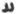 a (*initial*), â, h,
kh, *zd*.

 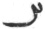 2, *a* (*privative*),
*aê*, *âê*, (*final*), *h* (*final*).

 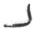 b.

 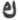 f, p, *v*

 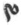 *d*, t.

 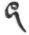 *g*, *k*, *z*.

  l, r.

  z.

 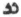 *or*   s,  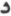 +  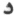.

 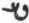 *s*, sh,  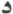 +  , g-a.

 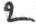 gh.

 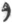 k.

 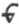 m

  *l*, n, ô, ŏ, *r*, û,
v.

 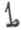 *l*, *r*.

  d, ê, g, *g*, *ga*, î,
y.

IRREGULAR COMPOUNDS.

 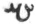 *a*yâ.

 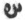 (  +  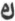, or  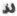 +  ). *aêk*, *a*f, *ag*, *a*p,
*av*, *az*, *â*f, *âg*, *âk*, *â*p, *âv*, *âz*, *h*af, *h*a*k*, *h*ap,
*h*a*z*, *kh*ef, *kh*e*k*, *khz*.

  âñ.

 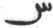 3, a*ê*, a*ê*
(*final*), ê*h* (*final*).

 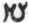 *a*dîn, dîdû (*better*
*b*îdû).

 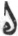 l*p*, r*ag*, r*az*,
r’*g*, r*p*, r’*z*.

 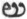 dî*f*, dî*p*, gî*f*,
sa*g*, *sak*, sa*p*, si*g*, si*p*, s*p*.

  *s*’*k*, y*â*f, y*âv*.

 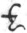 m-*ê*

  d*ag*, d-*k*, *êg*,
*êk*, g*ag*, g*ak*, g*ug*, *îk*, *îv*, *îz*, y*az*, y*ez*.

 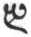 dên (*better* *b*ên),
yên.

p. xlix

ABBREVIATIONS USED IN THIS VOLUME.

A.D. for Anno Domini; âf. for Âfrîngân; Ar. for Arabic; AV. for
Ar*d*â-Vîrâf nâmak, ed. Hoshangji and Haug, 1872; Av. for Avesta; A.Y.
for Anno Ya*zd*aka*rd*i; B for Bombay MS. of Dinka*rd*, written in Irân,
A.D. 1659, see pp. [xxxv](#page_xxxv)-[xxxvii](#page_xxxvii.md); B29 for
MS. No. 29 in the University Library at Bombay; Bd. for Bundahi*s*, as
translated in vol. v of this series; Bk. for Book; B.P. for Bahman
Pûn*g*yah, see [p. 418](sbe37124.htm#page_418.md), n.
[3](sbe37125.htm#fn_1646.md); Byt. for Bahman Ya*s*t, as translated in vol.
v of this series; Ch. or Chald. for Chaldee; Chap. for chapter; Dd. for
Dâ*d*istân-î Dînîk, as translated in vol. xviii of this series; Dk. for
Dinka*rd*; Dv. for Dîn-vi*g*irgard; ed. for edited by or edition; Ep.
for Epistles of Mânû*sk*îhar, as translated in vol. xviii of this
series; Farh. Oîm. for Farhang-i Oîm-aêvak, or Zand-Pahlavi Glossary,
ed. Hoshangji and Haug, 1867; fol. for folio; G for gâthic; Gah. for
Gahanbâr or Gâhanbâr; Gen. for Genesis; gen. for genitive; Gesch. der
Sas. for Geschichte der Perser und Araber zur Zeit der Sasaniden, 1879;
Gf. for tale of Gô*s*t-î Fryânô, ed. West and Haug, 1872; Gld. for
Geldner; H for hadha-mãthric; Haug's Essays for Essays on the Sacred
Language, Writings, and Religion of the Parsis, by M. Haug, 2nd ed.; Hn.
for Hâ*d*ôkht Nask, ed. Haug, 1872; Ibid. for ibidem; J2 for Jâmâspji's
Yasna MS. with Pahlavi, now in the Bodleian Library, by the same copyist
as K5; K for Kopenhagen MS. No. 43, written A.D. 1594, see pp.
[xxxvii](#page_xxxvii)-[viii](sbe37001.htm#page_viii.md); K1, K5, K20, K35
for Iranian MSS. Nos. I, 5, 20, 35 in the University Library at
Kopenhagen; L for legal; l. for line; ll. for lines; Mf4 for the Mullâ
Fîrûz Library's Yasna MS. with Pahlavi, descended from an ancestor of
K5; MH6, MH10 for MSS. Nos. 6, 10 of Haug's Collection in the State
Library at Munich; Mkh. for Dînâ-î Maînôg-î Khira*d*, as translated in
vol. xxiv of this series; MS. for manuscript; n. for foot-note; N*S*.
for new style; Ny. for Nyâyi*s*; O225 for MS. No. 225 of Ouseley's
Collection in the Bodleian Library at Oxford; OM for Olshausen and
Mohl's Fragmens relatifs à la religion de Zoroastre; p. for page; Pahl.

p. l

for Pahlavi; Pâz. for Pâzand; Pers. for Persian; pp. for pages; Pt4 for
Peshotanji's Yasna MS. with Pahlavi, similar to Mf4; Riv. for Rivâyat;
S.B.E. for Sacred Books of the East; Sd. and Sg. for Sad-dar and
*S*ikand-gûmânîk Vi*g*âr, as translated in vol. xxiv of this series;
Sîr. for Sirôzah; Sls. for Shâyast-lâ-shâyast, as translated in vol. v
of this series; Sp. for Spiegel; Vend. for Vendîdâ*d*; Vi*g*. for
Vi*g*irkar*d*-i Dînîk, ed. Peshotan, Bombay, 1848; Vîsp. for Vîspêra*d*;
vol. for volume; W. or Westerg. for Westergaard; Yas. for Yasna; Yt. for
Ya*s*t; ZA. for Zend Avesta; Zs. for Selections of Zâ*d*-sparam, as
translated in vol. v of this series.

------------------------------------------------------------------------

### Footnotes

[xxxi:1](sbe37002.htm#fr_0.md) Both MSS. have
Shas*p*îgân here, but see p. 423, n. 4.

[xxxi:2](sbe37002.htm#fr_1.md) So in K, or perhaps
Sh*îz*îgân; B has Shas*p*îgân.

[xxxi:3](sbe37002.htm#fr_2.md) So in K.

[xxxi:4](sbe37002.htm#fr_3.md) So in K; B has
Shapân.

[xxxi:5](sbe37002.htm#fr_4.md) B has Âtû*r*pâ*d*
inserted here by mistake.

[xxxii:1](sbe37002.htm#fr_5.md) Assuming that m
stands for min.

[xxxii:2](sbe37002.htm#fr_6.md) Both MSS. have zak
rabâ bûn Denô-ka*rd*ŏ.

[xxxii:3](sbe37002.htm#fr_7.md) K has dênô-î
bûr*d*ârân.

[xxxii:4](sbe37002.htm#fr_8.md) B has 'arising.'

[xxxii:5](sbe37002.htm#fr_9.md) B has 'and the
reunited selection for.'

[xxxii:6](sbe37002.htm#fr_10.md) See Dk. VIII,
Chap. XIV, 12.

[xxxii:7](sbe37002.htm#fr_11.md) B omits 'a
declaration of.'

[xxxiii:1](sbe37002.htm#fr_12.md) Khû*s*-kand might
be the name of a place here, but cannot be so in the next paragraph.

[xxxiii:2](sbe37002.htm#fr_13.md) The angel
Aharî*s*vang (Av. ashi*s* vanguhi).

[xxxiv:1](sbe37002.htm#fr_14.md) The remainder of
this colophon, so far as it is here translated, is also quoted in the
second colophon.

[xxxiv:2](sbe37002.htm#fr_15.md) Here written
ar’*g*ŏ, but it is an-ar’*g*ŏ in the second colophon.

[xxxiv:3](sbe37002.htm#fr_16.md) Reading dên
farukhŏ zand shîr-h*âk*ŏ-î, but this is doubtful. From this point the
whole of the rest of this colophon, including the aphorisms, is also
found in K.

[xxxv:1](sbe37002.htm#fr_17.md) Observe the use of
the phrase 'Pârsî year' in the third colophon and in the manuscript K
(see [p. xxxviii](#page_xxxviii).md).

[xxxix:1](sbe37002.htm#fr_18.md) Professor
Darmesteter has suggested to me the very similar apportionment of the
old Hebrew literature, mentioned in Jeremiah xviii. 18, thus:—'For the
law shall not perish from the priest, nor counsel from the wise, nor the
word from the prophet.' And in Ezekiel vii. 26, thus:—'Then shall they
seek a vision of the prophet: but the law shall perish from the priest,
and counsel from the ancients.'

[xl:1](sbe37002.htm#fr_19.md) So long as it was
preserved.

[xliv:1](sbe37002.htm#fr_20.md) In the
Sitzungsberichte der philosophisch-philologischen and historischen
Classe der k. b. Akademie der Wissenschaften zu München, 1888, pp. 441,
442.

[xlv:1](sbe37002.htm#fr_21.md) This had been done,
long ago, in a Persian Rivâyat, quoted in B29, fol. 164, which states
that the following sixteen Ya*s*ts were in the Bayân-ya*s*t Nask,
namely, the Hôrmezd, Âbân, Mâh, Tîr, Gô*s*, Mihir, Srôsh, Rashn,
Fravardîn, Bahirâm, Râm, Dîn, Âshasang, Â*s*tâ*d*, Zamyâ*d*, and
Khurshê*d* Ya*s*ts.

------------------------------------------------------------------------

[Next: Observations](sbe37003.md)
