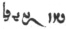

  
[Intangible Textual Heritage](../../index)  [Zoroastrianism](../index.md) 
[Index](index)  [Previous](sbe37022)  [Next](sbe37024.md) 

------------------------------------------------------------------------

[Buy this Book at
Amazon.com](https://www.amazon.com/exec/obidos/ASIN/1402156081/internetsacredte.md)

------------------------------------------------------------------------

*Pahlavi Texts, Part IV (SBE37)*, E.W. West, tr. \[1892\], at Intangible
Textual Heritage

------------------------------------------------------------------------

### CHAPTER XX.

*Nîkâ*d*ûm Nask*.

1\. *In* the fifth section are twenty-four particulars [1](#fn_172.md) about the standing up and going forth of
a man with a weapon and angry thoughts towards *another* man; and also
when he takes a beast *of burden*, saddles *it*, and sits upon *it*,
takes the rein [2](#fn_173) (ayôkham.md) in hand
and walks *away*; this, too, that, when he arrives there, he smites that
*man*, or some one else; and whatever is on the same subject. 2. About
what *one has* to do when the conversation of two men is *of* the
destruction of a righteous man, *of* highway robbery, and *of* the
cursing owing thereto; *and* whatever is on the same subject. About what
*one has* to do when, of two men who are *on* the same road, one slays a
righteous man; *and about* the other when *he is* fearless, *and* when
*he is* fearful. 4. About preserving one worthy of death when it is
requisite for medical purposes (be*z*ashkîh), though the plaintiff is
*of* a different opinion; and whatever is on the same subject.

5\. About the needlessness of plaintiffs *and* defendants speaking as to
the substance (min tanû) of

p. 54

the law, when the witness and judge is the supreme priest; the
confidence which they may place *in* the decision of the supreme priest,
due to his own knowledge *and* evidence, when, moreover, *they have* not
to atone in the body; *and* the want of confidence *in* another judge
when, moreover, *they have* to atone in the body, *and* the needfulness
of plaintiffs *and* defendants speaking on the substance (va*l* tanû) of
the law, even when the judge is aware of the law. 6. About unauthorised
combatants, become mutually sinful, when, to dissipate (sîkhtanŏ) a
wound of the one, *he* would make the *other* one worthy of death. 7.
About supplies (pishôn) [1](#fn_174.md) in
travelling together, *and* their renewal; and whatever is on the same
subject.

8\. About inflicting penalties *by* magistrates, the assistance *of* the
unmagisterial *given* to magistrates, the assistance of the magistrates,
*and* the exemption of these *latter* from atonement to those *former*;
likewise about conversation as to an assault, and whatever is on the
same subject. 9. About the evasion of penalty *by* men at the *time*
when a sin may be committed, and the arrest *of their* nearest relations
*being* important, in whatever measure implicated therein *and*
impossible to consider innocent; how to confine and make them really
coerced to seek a remedy, *and* whatever is on the same subject. 10.
About the powerfulness which comforts in sin where *there* is any
special worthiness, and the reason

p. 55

of any worthiness; the want of power where *there* is special
unworthiness, and the reason of any unworthiness; the production of the
good works of one towards another of the powerful, *and* of the sin of
one of those lacking power; *and* whatever is on the same subject.

11\. About the plaint which *one has* to argue, and for the defendant to
dispute; the time for making the statement (gôbŏ) when the defendant
does not come, or comes not to conduct the business; the several
peculiarities of plaintiff and defendant, the time for conducting
*being* on the day before yesterday, the firm *one* and the powerless,
the incrimination therein, the death-blow on the exhaustion of the
possessions of the plaintiff, and provisions for conducting the legal
proceedings; a privileged wife [1](#fn_175.md)
shall be capable of making a plaint *for her* husband, and *of*
informing the husband of the plaint; when her property is anything
whatever, and nothing is manifest as to that wealth, *she* is to be
admitted for evidence; *and* whatever is on the same subject.

12\. About the ordeal of those *who have* atoned, *of* those
*undergoing* the sacred-twig ordeal, *and of* those *undergoing* the
heat ordeal, *who are* pure; the freedom from falsehood of which, each
separately, which they, every one of them, request when the ordeal is
not that for their own station, but that for the station of others; and
whatever is on the sane subject. 13. About the object of any evidence,
and, on account of the reason of *its* propriety, the impropriety of any
one *being* without evidence; *and* whatever

p. 56

is on the same subject. 14. About the reality *of* a statement due to an
ordeal, and so many *having* gone to the ordeal place for the sake of
watching the first-comer *and* after-comer; the time *of* performance,
the statement, the ceremonial and the invulnerableness due to it; the
kinds *of* incrimination, how to protect the limbs by which the ordeal
is accomplished, *and* each one *of* the formulas (nîrang) of
protection; the superintendence for observing the ceremonial, *and* the
decision about the acquitted *or* convicted *one*. 15. This, too, that
is, whose going to the ordeal place is first, second, third, fourth,
fifth, sixth, seventh, eighth, ninth, and tenth; *and by* whom is the
command to be given. 16, About the business of the ordeal attendants
(var aûstîgânŏ). 17. About incrimination through confession, or *some*
other reason, the reliance restored thereby, *and* whatever is on the
same subject. 18. About a thief destroying life *and* escaping, the
suspicion owing thereto, about any one, as to assisting the thief, *and*
whatever is on the same subject. 19. About *there* being no ordeal for
those confessing, *and* so also as regards those of good repute;
accusation as to the existence of a limit *to* the good repute, even
that which is for the extent of a Yû*g*yâst, a Dashmest, an Agoyôst, a
Ta*k*ar, and a Hâsar [1](#fn_176.md) *at* the
least.

p. 57

20\. About litigation as to a costly article, when a witness of *its*
possession by the one *party* is *combined* with non-possession by the
*other* one with no witness, or *with its* possession by the *other* one
with a single witness; or the witness of one is with the sacred beings,
*and its* possession by the *other* one is likewise not manifest; when
both *parties* are related (khidyahîk), or both are unrelated
(anazdîhîk); and what kind *of* possession they say is most real. 21.
About annulling the decision of a judge, and the time *it* is done at
*the court of* a chief judge, and also owing to an ordeal for certainty;
and whatever is on the same subject. 22. About the litigation of three
persons as to property *it* is declared, so much is given to one *on*
the day Aûha*r*ma*zd* to the day Vohûman [1](#fn_177.md), to *another* one *on* the day
A*rd*avahi*s*t, *and* possession is not made *over to the third* one at
all.

23\. About selling property which is not one's own, *and* whatever is on
the same subject. 24. About controversy as to anything which ought not
to occur. 25. About any essential dispute *that* any one has, *when*
agreeing thus: 'I do not have it *as* my own, but owing to the other
person;' and whatever is on the same subject. 26. About the litigation
of an Irânian with a foreigner, *or* with foreigners, *of* a

p. 58

foreigner with an Irânian, *or* a slave with a man of the country, as to
a costly article; *and* whatever is on the same subject. 27. About a
much-clamouring plaintiff *having* summoned defendants to the judges
regarding a decision, and about the perverted wordiness *and* mixed
verbiage in the legal proceedings; *and* whatever is on the same
subject.

28\. About the time for a high-priest of property and possessions, what
is the specific necessity for a high-priest, and whatever is on the same
subject. 29. About the fitness of a woman for evidence and judgeship
when guardian over herself, *and* the unfitness of a privileged
*wife* [1](#fn_178.md) who is a foreigner and
worthy of death for only a single *offence*, even with the authority *of
her* husband; *and* whatever is on the same subject. 30. About the owner
of a pledge not depositing the pledge beforehand, *and* whatever is on
the same subject. 31. About giving up the property of partners, *and*
whatever is on the same subject. 32. About the property that any one
possesses, and is without any witness as to his ownership and possession
*of it*. 33. About the ordeal of excessive eating (pâûrû-khûrânŏ) for
escaping distress (mûst-kar *z*îh) *by* plaintiffs *and* defendants
before driving each other into legal proceedings, *and* whatever is on
the same subject.

34\. About the legal proceedings as to a female [2](#fn_179.md) they steal from some one, and she
becomes a suppliant of a thief; some one takes *her* by sequestration
(*h*a*k*î*d*akîh) [3](#fn_180.md), and they steal
*her* also from him;

p. 59

the original *possessor* (bûn) sees his own, not knowing *she is* back
alive, when they become disputing about her; *and* whatever is on the
same subject. 35. About property which is in the possession of any one,
when some one gives *it* up to some one else in his sight, *and* he does
not dispute *it*. 36. About a master teaching a disciple not to go back
to legal proceedings, *and* whatever is on the same subject. 37. About
controversy, with any one, as to special property in righteous gifts,
*and* whatever is on the same subject.

38\. About legal proceedings in which *one* accomplishes an ordeal three
times, and it comes *off* in one way; *and* whatever is on the same
subject. 39. About the existence of the many kinds of speaking with
wizard's spells [1](#fn_181.md), *and* those with
threats of danger; and about the usage in witchcraft as to the moderate
*and* justifiable production of mutual afflictiveness thereby. 40. About
which is the ordeal for *one* worthy of death, the greatness and
littleness of an ordeal, and also this, that is, which are the blessed
among twenty of those undergoing ordeals. 41. About the proportion of
firewood, and from which tree it ought *to be* good; and again, too, the
several appliances and formulas that are necessary in accomplishing the
ordeal. 42. And this, too, that when the man is aware of his own truth,
even though *he be* aware *of it*, the fire speaks in the words of men
thus: 'Walk not on to me! for I chastise during one's progress.' 43.
About *one* still mediating in legal proceedings as to a thief who *has*
acted faithfully about quitting confinement and fetters to

p. 60

cause a ceremonial [1](#fn_182.md), *and* whatever
is on the same subject.

44\. About the wealth of a priest who is not keeping his property in
edifices (aûzde*s*îkîh) or domains (matâ), *but* goes on with *his*
occupation; *and* when he passes away, to whom *and* how *it has* to
come. 45. About litigation as to property from the residuary *wealth* of
fathers, about keeping *it* together (vâham-dâr), and whatever is on the
same subject.

46\. About the amount *of* retribution, *in* confinement, fettering, and
punishment, for a lamb [2](#fn_183.md), a sheep,
*or* a beast *of burden*, which is stolen; *and* whatever is on the same
subject. 47. About a defendant regarding whom three plaintiffs complain,
all three as comrades, one as to a lamb, one *as to* a sheep, and one as
to a beast *of burden; and* whose answer is first given. 48. About the
litigation of three persons as to a costly article which remains apart
*from them*, he who deposited it *being* a strong person, *and* the
ownership of not even one of them *being* certain. 49. About the coming
of retribution to three persons who, all three as comrades, have stolen
a lamb from one, a sheep from *another* one, and a beast *of burden*
from *a third one*.

50\. About the reason of the justifiableness, *and* that also *of* the
unjustifiableness, *of* confining a *fellow*-countryman for his own
theft, *and* whatever is on the same subject. 51. About the extent of
continuance in hearing a defendant, *and* this, *too, as to* a
plaintiff; *also* about the time appointed for speaking, and its extent.
52. And about this,

p. 61

namely, when any one has made an accusation about any other, *and* goes
back at the time appointed, *and*, before a reply is given, he shall
make out another accusation about the same man, to which *of the two
accusations* a reply is to be first given. 53. About the reason of the
hardship of legal proceedings; about what man *it is* whose statement is
second, third, fourth, *and* last in conducting legal proceedings; and
about the twenty-two stratagems in conducting legal proceedings.

54\. About the cancelling (pâ*d*yârânîh) of an ordeal, even that which
is accomplished with three selected witnesses. 55. About the season of
the hot ordeal, and also that of the cold; *and* whatever is on the same
subject. 56. About one, in a procedure, demanding an ordeal, *the other*
one *having* appointed the time for the supreme priest, *and* whatever
is on the same subject. 57. About the benediction of the supreme priest
on making, *or* changing, a decision; also this, namely, which are the
blessings for changing, through *their* nature, a decision which is
made.

58\. About evidence of walking upon a water-skin (khîk) *and* putting
*something* inside *it, of* assault and wounds, *of* wealth which they
squander (nikizend) and a righteous gift, *of* a damaged and
sequestrated *thing*; and *of* rubbing up (pâ*d*ŏ-mâli*s*nŏ) and buying
*it* strengthened [1](#fn_184.md), and *at* a
price. 59. On litigation about the ownership of a wife, cattle, trees,
and land; *and* whatever is on the same subject. 60. About the certainty
*of* the statement of several leaders of an affair, as to that on which
their affair

p. 62

*depends, and of* the supreme priest, or three witnesses, in every legal
proceeding. 61. About incrimination (aîrikhtakîh) of several kinds as to
statements in legal proceedings, *and* whatever is on the same subject.
62. About the modes of action for eradicating the deceptions
(fr*êv*ôânŏ-fitâr) of apostates, *and* whatever is on the same subject.

63\. About *cases* where the virtuousness of the thoughts, words, *and*
deeds of mankind is all *derived* from the virtuousness of the
beneficent spirit, and mankind themselves shall render *it* their own,
and, in that way, *its* reward reaches them; and *their* viciousness is
all *derived* from the viciousness *of* the evil spirit, *and* mankind
themselves shall render *it* their own, and, in that way, *its* bridge
*penalty* [1](#fn_185.md) reaches them.

64\. About the injuriousness due to unrenounced sinfulness, that is,
what is injured by the first, second, third, fourth, *or* fifth
unrenounced Aredû*s* *sin* [2](#fn_186.md). 65.
About where *and* which is the speaking with threats of danger [3](#fn_187.md), *and* which is the taking up *of a
weapon* (âgêreptŏ), not the turning *it* down, that becomes a Tanâpûhar
*sin* [4](#fn_188.md)*; also* the sin which is
owing to such sin.

p. 63

66\. About *the case* where *one has* to atone, *and* who *does it; he*
who undergoes the sacred-twig ordeal *has* atoned best; and which is the
least heat ordeal. 67. About two men *having* seized property together,
and *having* together, at the time, demanded a judge and ordeal about
it; and when one seizes the property some time earlier, and the *other*
one demands the judge and ordeal earlier; and whatever is on the same
subject. 68. About some one carrying *off* the property *of* a person
from the custody of *another* person in sight of the same, and he who
kept it before is, within a Hâsar [1](#fn_189.md),
a witness before the judge as to *its* custody or possession; and also
when the witness of it has not come within the Hâsar; and whatever is on
the same subject.

69\. About *cases* where the decision of the judge is to be made from
the Avesta and Zand [2](#fn_190.md), or from the
common consent of the good [3](#fn_191.md), *and*
whatever is on the same subject. 70. About the justifiable selling of a
man, a sheep, *or* a beast *of burden*, as free from defect when its
defect is not obvious; also about the symptoms of their defects. 71.
About *the case* where *and* how far a decision, about which *one* is in
dispute, is a solitary statement, *or* more.

72\. About the object of the appointment of a judge, the eminence of an
appointed judge, and whatever is on the same subject. 73. About the
reasonableness of the severity and want of severity

p. 64

of judges. 74. And this, too, that the judgeship is to be given to him
*who* is acquainted with the law (âkâs-dâ*d*) [1](#fn_192.md); and the object of acquaintance with the
law. 75. About *the case* where *there* are a supreme judge of the law,
a plaint, a defence, an arrangement of legal proceedings, *and* an
award; *and* through what sin it becomes injustice. 76. And this, too,
that the justice of him who may therein commit falsehood, as regards so
many essential decisions, is injustice.

77\. About the many who may seize wealth, which is the property of some
one, with their own hands; *and*, when they litigate about it, he says
*it is* his own property, whereby *they* are convicted. 78. About
incrimination of five kinds as to whatever property is on the spot, *or*
at a distance (pavan hâsar); *and* whatever is on the same subject. 79.
About putting apart, keeping apart [2](#fn_193.md), and two apart before *being* put away;
*also* about litigation as to keeping apart, *and* whatever is on the
same subject. 80. And when some one *has* to deliver property *which* is
a person's own to some one else, in the

p. 65

sight of him whose own *it is*, and he who is seizing upon *it* disputes
about *it* as his own property; and whatever is on the same subject.

81\. About disputing the debts of fathers when one of *their* associates
is confessing *them*, and the rest have come, and it is possible for
them to dispute *them, but* they do not dispute. 82. *And* about the
progress of a dispute of one of the associates as to the whole debt of
*one's* fathers. 83. About the possibility of children *being* worthy of
death, for wizard's spells, when with their guardian; and *of* a woman
*being so* when guardian of herself. 84. About *a case* where the amount
of a lamb (midat-î as*p*erenŏ) is the lowest, and the amount of a human
being (vîrôk mozd) is the highest [1](#fn_194.md).
85. About theft and plunder as regards one's own property, when *one*
brings *it* away from the possession of some one without dispute. 86.
About the triumph *of* him who, falsely investigating, may act
judicially by illegally-issued incentives, when he institutes legal
proceedings for the sake of appearances [2](#fn_195.md); *as distinguished* from him who is
truly seeking and truly investigating.

87\. About the statements of a litigation of man *and* wife, which is
justifiably brought *on* [3](#fn_196.md). 88. And
also this, namely, when she sees *herself* injured, or defence is
possible by means of that which

p. 66

is discharged by two fingers [1](#fn_197.md), *it*
is justifiable when they shall institute no litigation but seizing. 89.
About *the person* who *has* become privileged to give away a daughter
to a husband, *her* father *having* passed *away*. 90. About the sin of
making a damsel (kanîk) weary of *her* husband. 91. About the sin as
regards property in this action, either produced where the action for
this purpose is really devoid of illiberality (adahi*s*nîh), or to
commit in order that they shall give me a wife even when they do not
give her on that account. 92. About the sin *of giving* a girl (kanîk)
for a girl, or other living thing, or *of* speaking thus: 'Do thou go in
unto my sister, *or* daughter, while I, too, *will* go in unto thine.'
93. And the sin as regards the person of my wife, too, which is owing to
that sin. 94. About *one* obtaining back the value which he gives away
for a girl, when the girl is not that value in wedlock. 95. About a girl
who, after fifteen years *of age*, is not given to a husband; and her
father, to satisfy *her* menstrual excitement (dashtân-mêyah
vi*g*âr*d*anŏ), and to sustain it, becomes sinful *and* harbours a
paramour; *and* whatever is on the same subject.

96\. About *having* given food, *and* anything except a wife, to any one
who praises the Ma*zd*a-worshippers’ religion of another, even though
*it be* through fear; also this, that *it is* only *he*, when *he has*
thereby become quite of the same tenets with the religion of the
Ma*zd*a-worshippers, to whom the gift of a wife worthy of a man (vîr
masâî) is then to be presented.

p. 67

\[paragraph continues\] 97. About
committing the sin of giving no food [1](#fn_198.md), which is *one* of those worthy of
death. 98. About the duty imposed of chastising a wizard for the
Tanâpûhar *sin* [2](#fn_199.md) of assisting a
demon [3](#fn_200.md), so that one's duty is
manifold, and to be accomplished during several years.

99\. About the day and night which are longest, medium, and shortest;
that is, how many Hâsars [4](#fn_201.md) *they
are*, each separately; and, *as to* their occurrence, in what control is
the appointed *time* which is really theirs, each one, as to period.
100. About the Para-sang [5](#fn_202.md) which is
the longest, medium, and shortest and whatever is owing to *their*
subdivision.

101\. About the work *and* fodder (vâsân) [6](#fn_203.md) of an injured beast *of burden*, by day
and night. 102. About a sheep which kills a person, and *whether* its
owner *be* innocent, or sinful, through not putting a tether (band) upon
*it*; and the reason of the sinfulness and innocence therein. 103. About
the period that *extends* from certainty to dubiousness, even though *it
be* for the supreme priest, or one provides three witnesses; and how
long it is. 104. About the multitude of witnesses who give no evidence,
*together* with the judge *who is* unjustly deciding.

105\. About the injuriousness (*âz*ârîkîh), for the

p. 68

priestly authorities, *of* anything *that* is given to the unworthy.
106. About what kind of gift, that is given, was accepted; that is, how,
when given by one when *another* claims *it*, it returns to him; how,
*and* in what proportion, when *the other* does not claim *it*, its
expediency does not arise; and whatever is on the same subject. 107.
About *a case* where there is property of several kinds which a man
*has* given away as a righteous gift, *and it* is allowable. 108. About
*the case* where whatever is given and reaches *some one*, when he gives
it and does not say how *it was* given, it becomes a righteous gift.
109. And about *its* not *having* become a gift, through fear of
whatever is its danger.

110\. About the theft and extortion *of* him who does not maintain the
wives and children of persons in *his* control, to preserve and nourish
*them*, through fear. 111. About the allotment of punishment for the
limbs of sinners, *and* upon which limbs is the allotment. 112. About
the atonement for sin where *it is* most irksome. 113. About the amount
of retribution for an assault (zatam) which may be committed upon *one*
worthy of death who is preserved through great judiciousness.

114\. About Aûha*r*ma*zd* *having* given all prosperity to Zaratû*s*t
and the disciples of Zaratû*s*t; the theft and extortion which have
arisen *in* a man when *he has* not given to a worthy *person any* of
the prosperity that has befallen him; and whatever is on the same
subject. 115. About how an animate *being* is situated who is in *a
place* apart (aham), and when he dies in innocence and keeping
apart [1](#fn_204.md), his

p. 69

wound *being* also through duty; and whatever is on the same subject.
116. About the advantage and pleasure of keeping a promise
(mit*r*o-dârîh), and the gravity, harm, and vexation owing to various
degrees of promise-breaking (mit*r*ôk-drû*g*îh); *also* how a promise is
kept. 117. About the grievous sinfulness of strife, insincerity
(avâkhîh), and slander, and the harm that proceeds therefrom; *also* the
frost (pazd) and punishment provided for them [1](#fn_205.md), *and* whatever is on the same subject.

118\. About *having* given frontier people [2](#fn_206) *as* hostages (garôbŏ.md) to foreigners
*who have* demanded a ransom (na*v*i*s*nŏ). 119. About taking up (lâlâ
gêrefstanŏ) anything whatever that is precious to a foreigner, and *has*
become of exceeding value, when they give *it* up as a ransom [3](#fn_207.md) *to* Irân; the extreme value of a youth
(tigil) when they shall carry *him* off as a hostage from the
foreigners, in place of ransom; *and* how *they* are to keep both. 120.
About the grievous sinfulness of a man stealing back *his* ransom from
foreigners, though *it be* his own son. 121. About the sinfulness of the
governor (sa*r*dâr) of a province through any harm that occurs in the
province owing to his elevation and evil commands.

122\. About the existence of so many thieves assisting a thief with
special ransom, and what kind of reward (na*v*i*s*nŏ) *one* is to use
with thieves, to

p. 70

deceive with great judiciousness. 123. About attaching to the neck of a
thief the *thing* which *was* stolen by him, for his personal
identification, and conducting *him* to the judges. 124. About the
non-atonement of thieves, by any amount of anything whatever, without
confession as regards their own sin. 125. About the assistance *to*
possession which is claimed by any one from the authorities (pa*d*ân),
when his property is stolen or extorted.

126\. About the grievous sinfulness *and* deceitfulness of many kinds
which *occur* when a woman who is given away with *her* concurrence,
*and her* acceptance is announced, is given to another man; *and*
whatever is on the same subject. 127. About the unjustifiableness of the
wisdom of a man, through which he took away property in dispute, from
him who *was* ignorant, before *there was* certainty *about it*. 128.
About making intercession in a dispute, for him who is ignorant, *with*
the judge *and* other authorities *and* chiefs, even including the king
of kings [1](#fn_208.md), when there is no
intercessor for him. 129. About the reason *of* the fitness of a man for
sovereignty, and the lodgment of Aûha*r*ma*zd* upon the limited (tang)
person of him who is a good ruler.

130\. About the five special ordinances (dâ*d*istân) that are certain;
these are without ordeal, because *they* are to be considered as
certain, *and* the penalties thereof are to be fully inflicted. 131.
About investigation after confession. 132. About squandering (nikizand)
wealth of which the custom (dastôbar) of maintaining is begging for
*it*. 133. About the progress (s*ak*i*s*nŏ) of legal proceedings not
*having*

p. 71

occurred, *which* is not demanded on account of the existence of want of
power, *and* the number of kinds *of* that want of power. 134. About a
woman without a guardian, when she takes a paramour, *and* whatever is
on the same subject.

135\. About bringing a written statement into judicial proceedings,
*and* whatever is on the same subject. 136. About the sin of frightening
any one from his place, when he shall move on account of that fright,
and the amount of movement and harm which will come upon him therefrom.
137. The delivery back of that which is extorted from *one's* hands or
keeping; that is, how *it* is to be considered as delivered.

138\. About the obviousness of a minor adjudication from that which is
greater. 139. About the extreme benefit *and* peace, even in *this*
world, through a wife and children *and* grandchildren, and also the
prosperity, as regards produce and even wealth thereby, taking away the
disputes that arise. 140. About the grievous sinfulness of wealth
*acquired* through unnatural intercourse [1](#fn_209.md), the annihilation of the spiritual
faculties (maînôgânŏ). 141. About a decree in which the decision is of
three descriptions, about three persons. 142. About a tree which, when
stolen away, is the death-blow (mât) of a hundred pure birds (vâê),
*and* a thousand birds arise.

143\. About a sin which, owing to deceiving previously, *has* to
increase (f*râz* mastanŏ) *its* extent, and to fully taste the extremest
crime of a dagger

p. 72

\[paragraph continues\] (dahrakŏ) of
several *of* the smallest finger [*breadths*](errata.htm#2.md). 144. About
the sin of defiling four-footed females. 145. About keeping back one of
the combatants from fighting, *and* whatever is on the same subject.
146. About counter-assaults of eight kinds, assault when an infidel
shall commit *it* upon *one* of the good religion, and whatever is on
the same subject. 147. About a counter-assault of a heretic (dû*s*-dênô)
when an arch-heretic (sarîtar-dênô) is slain.

148\. About not leaving any property in the keeping of *one* worthy of
death. 149. About such numbers of abettors of sin *being* with the
sinner, and whatever is on the same subjects. 150. About the injury of a
plaint and defence, and the dwelling, property, and feast *of* the good,
*by* that person who extols the presidentship which is given him, *but*
who is not fit for the presidentship. 151. About the sinfulness of a
judge when he shall make a decision for any one according to his origin.
152. About the grievous sinfulness of delivering the person of an
Irânian to a foreigner, *and* whatever is on the same subject.

153\. About the greatness of the gift of a righteous man, as compared
with (min) the gift of another, for Rashnû [1](#fn_210.md), the just, to proclaim among the
creatures *and* to accept. 154. This, too, that, when they encounter an
apostate *and* it is necessary to hold a controversy, though *there be*
danger for the hands or feet, *or* though even for the head, *there is
to be* no refraining from asserting that which is true.

p. 73

\[paragraph continues\] 155. This, too,
that he who does not assert, on account of fondness for wealth, or
dislike for his own *people*, vexes water and fire and the righteous
man, and disturbs even the reposing archangels from *their* thrones.

156\. About the grievous sinfulness of making the righteous dissevered
(aûsk*â*ftakŏ). 157. About the bad properties produced by the evil
spirit, adjudication attentive to lying evidence and false, in
opposition *to* Rashnû, the just, *and* through discontent *at* the
advantage due to Rashnû, owing to the impossibility of the occurrence of
those mischiefs *being* produced at Rashnû's *judgment* seat, there
where they do not give decisions for the wretched for the sake of the
aristocratic multitude (*âz*â*d* hâvandîh râî). 158. And about the
aristocratic multitude which comes *to* Rashnû owing to taking bribes,
and went with a complaint to Aûha*r*ma*zd*, and whatever is on the same
subject. 159. About a just judge who is appointed *one* of an assembly
for the opposition of thieves, oppressors, *and* destroyers of the
righteous.

160\. About the possibility of the coming of every one, through
diligence, to the best existence. 161. About the superiority (masîh) of
true justice over (min) other good works, *and* the grievous sinfulness
owing to false justice, and when they shall not deliver a sentence
*with* a full understanding of the true from the false.

162\. About solemnizing *and* learning by heart (narm ka*rd*anŏ) the
Gâthas, the Hâ*d*okht [1](#fn_211.md), and

p. 74

the Va*s*tag [1](#fn_212.md), through knowing the
foundations (pâyakân) thereof; the sin owing to not knowing *them, and*
whatever proceeds therefrom. 163. About the greatness of the law through
decrees and judgments from other discourses (srôbân).

164\. About property of seven kinds, of which *one* says that *it* is
not allowable to take *it* as security for other property. 165. About
ten friends with different assertions on the same subject.

166\. And about the apportionment of this discourse *there are* complete
decisions of several other kinds, and into those, too, it advances and
thereby introduces much adjudication which takes heed, in every one, of
words and deeds of many kinds, and is specifically *and* also
intelligibly apportioned.

167\. Perfect excellence is righteousness.

------------------------------------------------------------------------

### Footnotes

[53:1](sbe37023.htm#fr_173.md) It is not clear
whether these twenty-four particulars are to be sought in the details of
§ 1, or in the whole chapter, or some portion of it.

[53:2](sbe37023.htm#fr_174.md) Merely a guess.

[54:1](sbe37023.htm#fr_175.md) Compare Pers.
bi*s*ing, Av. fshaoni. In some cases it might perhaps be read pîkhvô,
and be traced to Av. pithwa. The word often occurs, as in § 11, Chaps.
XXIII, 3, 15, XXVI, 10, XXVII, 4, 6, XXXI, 25, 36, XXXVII, 5, 7, 22,
XLI, 19, 23, XLIII, 19, and its meaning, 'provision, or nourishment,' is
well ascertained.

[55:1](sbe37023.htm#fr_176.md) One married to her
husband with the parents’ consent, and never betrothed to another, so
that she and her children belong to him in both worlds (see Bd. XXXII, 6
n).

[56:1](sbe37023.htm#fr_177.md) The relative
lengths of these five measures of distance are stated in Farh. Oîm, p.
41, ll. 9-11, as follows:—'So much as two Dashmêst (Av. dakhshmaiti) is
as much as a Yû*g*yast (Av. yu*g*yasti); so much as two Agoyôhast is as
much as a Dashmêst; so much as two Ta*k*ar is as much as an Agoyôhast;
*and* so much as two Hâsar (Av. hâthra) is as much as a Ta*k*ar (Av.
ta*k*ara).' As the average Hâsar is a Roman mile (see Chap. XIX, 54 n),
the Ta*k*ar ('run?') is two, the Agoyôst or Agoyôhast ('cattle-run?'
p. 57 Av. gaoyaoiti?) is four, the Dashmêst
('distance-mark?') is eight, and the Yû*g*yâst ('stage?') is sixteen
miles. This series of distances is analogous to the Sanskrit series, but
more elaborate; the Hâsar is best compared with the Kro*s*a as the
commonest unit of moderate distance, though less than half its usual
length; the Agoyôst is nearly the same as the Gavyûta; and the Yû*g*yâst
is analogous to the Yo*g*ana, though nearly double its length.

[57:1](sbe37023.htm#fr_178.md) That is, on the
first or second day of the Parsi month; and to the other on the third
day.

[58:1](sbe37023.htm#fr_179.md) See § 11 n.

[58:2](sbe37023.htm#fr_180.md) A slave no doubt.

[58:3](sbe37023.htm#fr_181.md) This is the
technical term for legal seizure, or sequestration (see Chap. XXXIX).

[59:1](sbe37023.htm#fr_182.md) See Chap. XVII, 6.

[60:1](sbe37023.htm#fr_183.md) Or it may be 'to
provide supplies.'

[60:2](sbe37023.htm#fr_184.md) See Chap. XIX, 47.

[61:1](sbe37023.htm#fr_185.md) Pâz. aôganghen for
Av. aoganghem = ao*g*anghem (see also Chap. XLI, 17, 18).

[62:1](sbe37023.htm#fr_186.md) The decision
announced at the *K*înva*d* bridge (see Chap. XIV, 8), as to the fate of
the soul until the renovation of the universe, after the account of its
good works and sins has been accurately balanced.

[62:2](sbe37023.htm#fr_187.md) Farh. Oîm, p. 36,
ll. 6, 7, has 'when through sinfulness one lays a weapon upon a sinner,
the name is Aredû*s*.'

[62:3](sbe37023.htm#fr_188.md) See Chaps. XVII, 6,
XIX, 1.

[62:4](sbe37023.htm#fr_189.md) Whereby a person
becomes an outcast and worthy of death. According to Vend. IV, 67-72,
75-78, 81-84, this occurs on the eighth committal of an Âgêreptŏ, on the
seventh of an Avôîri*s*tŏ, and on the sixth of an Aredû*s*; or on the
first committal of any of the three, if the criminal refuses to atone
for it.

[63:1](sbe37023.htm#fr_190.md) Eighty minutes on
the average (see Chap. XIX, 54 n), but varying from one hour to two,
according to the duration of daylight.

[63:2](sbe37023.htm#fr_191.md) That is, from the
scriptural law and its commentary.

[63:3](sbe37023.htm#fr_192.md) That is, according
to precedents recorded by the priesthood.

[64:1](sbe37023.htm#fr_193.md) This term is
explained in an extract from some Nask (compare Chap. XLIII, 9) quoted
in Farh. Oîm, pp. 17, l. 9-18, l. 5, as follows:—'*Av*. kô asti
*d*kaêshô vivi*s*dâtô, which is the judge who is acquainted with the
law? *Av*. yô aêta pairi arethra frazânaiti, he who thoroughly
understands the adjudication from the statements \[even though he does
not easily understand many of the statements, and though *it be* not
easy as regards the statements which are not numerous, is an official
who is acquainted with the law (ka*rd*âr-î âkâs-dâ*d*); *and he* who
does not thoroughly understand the adjudication from the statements,
even though the statements are not numerous, and *it be* not easy *for
him* as regards *them*, is to be still considered as unacquainted with
the law (anâkâs-dâ*d*)\].'

[64:2](sbe37023.htm#fr_194.md) Compare § 115.

[65:1](sbe37023.htm#fr_195.md) The minimum and
maximum grades of value mentioned in Chap. XIX, 47. Here it is evident
that mîdat and mozd are synonyms, the former being, no doubt, the
Zvâri*s*, or Semitic, equivalent of the latter, compare Chald. ‏מִדַּה‎.

[65:2](sbe37023.htm#fr_196.md) Pahl. khâkûnîhâ,
literally 'through making a dust.'

[65:3](sbe37023.htm#fr_197.md) Or it may be 'of a
man *and* a woman who is domineeringly plundered.'

[66:1](sbe37023.htm#fr_198.md) That is, in some
very easy way. The intention was probably to discourage petty disputes
between man and wife, by not interfering with the stronger party when
aggrieved.

[67:1](sbe37023.htm#fr_199.md) See Chap. XVII, 6.

[67:2](sbe37023.htm#fr_200.md) See § 65.

[67:3](sbe37023.htm#fr_201.md) Reading dêv-vi*g*în
which is miswritten  .

[67:4](sbe37023.htm#fr_202.md) See Chap. XIX, 54
n.

[67:5](sbe37023.htm#fr_203.md) A distance of four
Hâsars (Bd. XVI, 7), or as far as a far-seeing man can distinguish a
black ox from a white one (Bd. XXVI, 2). It is usually from 3½ to 4
English miles, but in Pahlavi texts it often stands for a Hâsar, or
Roman mile, both being measures for long distances.

[67:6](sbe37023.htm#fr_204.md) Or 'rations'
(vâyagân).

[68:1](sbe37023.htm#fr_205.md) Compare § 79.

[69:1](sbe37023.htm#fr_206.md) In hell (compare
AV. XL, 7).

[69:2](sbe37023.htm#fr_207.md) Pahl. mar’*z*ânân,
which might be supposed to be a defective writing of margar’*g*ânân,
'those worthy of death' (the two letters equivalent to rga being
omitted), but see Chap. XXI, 13.

[69:3](sbe37023.htm#fr_208.md) The MS. pâk is
evidently a defective writing for na*v*âk which is written correctly in
the next clause of this section.

[70:1](sbe37023.htm#fr_209.md) The Persian
monarch.

[71:1](sbe37023.htm#fr_210.md) Vâmkûnîh, compare
Pers. bâmûn. It cannot be 'making loans, or money-lending,' because that
would be spelt *âv*âmkûnîh.

[72:1](sbe37023.htm#fr_211.md) The angel of
justice who weighs the good works of the departed soul against its sins,
in order to decide its fate till the end of time.

[73:1](sbe37023.htm#fr_212.md) Here written
Hâ*d*ôîtô; the name of the twentieth Nask (see Chap. XLV).

[74:1](sbe37023.htm#fr_213.md) The name of the
eleventh Nask (see Chap. XII).

------------------------------------------------------------------------

[Next: Chapter XXI](sbe37024.md)
