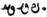

  
[Intangible Textual Heritage](../../index)  [Zoroastrianism](../index) 
[Index](index)  [Previous](sbe37024)  [Next](sbe37026) 

------------------------------------------------------------------------

[Buy this Book at
Amazon.com](https://www.amazon.com/exec/obidos/ASIN/1402156081/internetsacredte)

------------------------------------------------------------------------

*Pahlavi Texts, Part IV (SBE37)*, E.W. West, tr. \[1892\], at Intangible
Textual Heritage

------------------------------------------------------------------------

### CHAPTER XXII.

*Ganabâ-sar-ni*g*a*d *Nask*.

1\. The second section is miscellaneous (hamdâ*d*akŏ): about the
authority for the enquiry (khvâst-ra*d*akîh) of a father into the sin of
a grown-up son, when unaware of the sin of his son at the time it is
committed; that *of* a son into that of a father, *and of* others
grown-up, as to one another, when they are not abettors of the sin; and
that of a husband into the sin of a wife, when not *and* when [2](#fn_219) co-operating and unrestraining. 2. About
arrival *at* the period for the teaching of children by a guardian *or*
father, and the mode of his teaching; the period at which the sin of a
child *has* reached a beginning, the extent of the sin of childhood, the
retribution in childhood, and that also at maturity; the sin due to not
teaching a child who is to be taught, *and* whatever is on the same
subject.

3\. About the freedom from slaughter which is to

p. 78

keep away the destruction *of* the world; and what is the mode of
distributing the property of a man of the valiant after *his* slaughter.
4. About the sin of *having* given implements of slaughter to a woman, a
child, *or* a foreigner. 5. About a woman who, as regards two men worthy
of death, demands the head of the one, *and* is seeking a son in the
*other* one.

6\. About a warrior, without provisions (atû*s*akŏ), who, on the march,
*has* come upon pasture, corn, and sheep whose shepherd [1](#fn_220) is a stranger to him, *and* whatever is
on the same subject. 7. About considering property inexpedient, and the
decision thereon.

8\. About the amount of delay of a judge on *becoming* aware that the
plaintiff is falsely petitioning *and* the defendant is falsely
confessing. 9. About the amount of delay of the judge, and in the court
of justice (dâ*d* gas); and whatever is on the same

p. 79

subject. 10. About a decision regarding a judge who explained a doubtful
opinion as a certainty, *and* that *which* is certain as a doubtful
decision, *and* would make an undecided *matter* decided. 11. About the
opinion as to certainty and that as to doubtfulness, making a decision,
and whatever is on the same subject.

12\. About the business *of* commissioned judges, from him who is lowest
*to* him who is highest, one above the *other* one. 13. Decisions about
adjudication; that which is legal *when* two *judges* are together, that
which is legal with *either one* judge *or* two judges together, and
whatever is on the same subject. 14. About the statements of a decision
regarding interpretations (pâ*d*ŏ-khânânŏ) [1](#fn_221), *and* whatever is on the same subject.
15. About the proportion of the time of judges for decision, that for
summoning witnesses to the judges, *and* that for the proceedings
(s*ak*i*s*nŏ). 16. About the judge who is doubly satisfied [2](#fn_222), *and* him who is not doubly satisfied;
*also* the time from a judge's not *being* doubly satisfied till his
*being* doubly satisfied. 17. About a judge of four customs, and *his*
decision thereon; one who knows the decree *and* would act to effect
*it*, and one who knows *it* and would not act. 18. About the supremacy
of a judge as to adjudication so far as *there* is a false decision
therein; how it is when *he is* at a distance (pavan hâsar), and how it
is when he is on the spot; he who is at a

p. 80

distance becomes a superior therein, when he comes back to the *place
of* justice before the end of a Hâsar [1](#fn_223). 19. About other false teaching of a
judge which is manifest therefrom, *and* the retribution for the false
teaching; the false summoning, false investigation, and false evidence
*of* the complainant (mûst-hômŏnd) *having* been his own, and a separate
atonement unto the afflicted *one has* to atone for the affair; *it
having* been mitigated by no good work. 20. About the trouble of
adjudication to the priestly authorities (ra*d*ân). 21. About the
proficiency *of* a woman *or* child who is acquainted with the law [2](#fn_224), for a judgeship, *being* above *that
of* a full-grown man unacquainted with the law.

22\. About assisting the want of one's own disciple for a master for the
recited law, *and* the sin due to not assisting, such as that when,
wanting assistance, *it* is allowable *for* the afflicted *one* to beg
an assistant from foreigners, and according to his petition is the
bringing *of* a foreigner for assistance; *and* whatever is on the same
subject. 23. About the supremacy of Rashnû [3](#fn_225) the righteous.

24\. About several persons who are *engaged* in legal proceedings about
the keeping *and* non-division of property not their own, and the
decision as regards for whom *one* has in keeping that property which is
not his own. 25. About actions which are not inconsistent and those
which are inconsistent. 26. About the decision *of* a judge of
congregational actions.

27\. About the offence which accusers would commit, as regards the law,
by means of the law, *it being*

p. 81

not allowable to commit *it* with their own hands; also *as regards* any
one's property, about which *there* is a dispute, even though with a
certainty as to its ownership.

------------------------------------------------------------------------

### Footnotes

[77:2](sbe37025.htm#fr_220) Perhaps the
repetition of the word amat, '*and* when' is a blunder of the copyist.

[78:1](sbe37025.htm#fr_221) The Pahlavi word is
written   twenty-four
times, and   once, in this
Book, but its reading is not quite certain. It means 'shepherd'
throughout Chaps. XXIII, XXXIX, and in XXXI, 17, 31, XL, 3; but is used
for 'herdsman' in XXXIX, 3, and for 'follower' in XXXI, 2. This last
meaning is strongly in favour of the reading pasîg, for pasîk,
'following,' an adjectival form derived from pas, 'after,' which, when
used as a noun, would imply 'one who follows,' as drovers and shepherds
are accustomed to do, with a few local exceptions. The Pahlavi spelling
of the word is uniformly inconsistent with the reading pâs, 'guard,
protector;' and it seems hazardous to trace it to a possible Avesta
adjective pasvya, from pasu, 'a sheep,' because the latter word becomes
pâh in Pahlavi. The word also occurs in Pahl. Vend. XV, 116; it is a
transcript of Av. fsh*e*nghî and fsh*e*nghyô in Yas. XXXI, 10 b, XLIX, 9
a, and of fshê in Vend. XIII, 10, 11; so that it may perhaps be read
fsheg, or fshê, as a mere transcript from the Avesta.

[79:1](sbe37025.htm#fr_222) Pahl. pâ*d*ŏ-khân =
Pers. pâî‘*h*vân.

[79:2](sbe37025.htm#fr_223) Pâz. vayôzu*s*t,
Av. vayôzu*s*tô = dvayôzu*s*tô. Farh. Oîm, p. 43, ll. 10-12, has 'the
Vayôzu*s*tô, who is a judge, explains this, so that the petitioner who
is doubtful is a hearer of certainty; it is, as *one* says, deliberately
weighed.'

[80:1](sbe37025.htm#fr_224) See Chap. XX, 68.

[80:2](sbe37025.htm#fr_225) See Chap. XX, 74.

[80:3](sbe37025.htm#fr_226) See Chap. XX, 153.

------------------------------------------------------------------------

[Next: Chapter XXIII](sbe37026)
