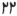
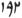
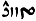
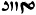
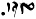

  
[Intangible Textual Heritage](../../index)  [Zoroastrianism](../index.md) 
[Index](index)  [Previous](sbe37046)  [Next](sbe37048.md) 

------------------------------------------------------------------------

[Buy this Book at
Amazon.com](https://www.amazon.com/exec/obidos/ASIN/1402156081/internetsacredte.md)

------------------------------------------------------------------------

*Pahlavi Texts, Part IV (SBE37)*, E.W. West, tr. \[1892\], at Intangible
Textual Heritage

------------------------------------------------------------------------

### CHAPTER XLIV.

1\. The Vendîdâ*d* [2](#fn_359.md) *contains*
particulars *of* Aûha*r*ma*zd* *having* produced the pleasure of mankind
by

p. 153

that place where they specially make a residence, and the advantage from
the same production [1](#fn_360.md). 2. About the
formation of sixteen perfect places specially enumerated, *and* also the
adversity which has happened to each separately [2](#fn_361.md).

3\. About Aûha*r*ma*zd*'s disclosing the religion first *among* mankind
to Yim [3](#fn_362.md); *its* non-acceptance by
Yim owing to attachment (asrûnŏîh) *to* the religion of the ancients;
*and* the acceptance *of* other *things* to develope, extend, and
improve the world thereby.  [4](#fn_363.md). About
the reason of the needfulness *of* making the enclosure that Yim made
(var-î Yim ka*rd*), the command *and* instruction by Aûha*r*ma*zd* to
Yim, the making by Yim just as Aûha*r*ma*zd* commanded *and* instructed,
*and* whatever is on the same subject [5](#fn_364.md).

5\. About what the comfort of the spirit of the earth is most owing to,
what *its* discomfort is more particularly owing to, and from what *its*
greatest gratification has arisen [6](#fn_365.md).

6\. About the sin of pollution owing to carrying a corpse by a single
person, *relating*, however, to that which a dog *has* not seen [7](#fn_366.md). 7. About the food,

p. 154

clothing, and place of *him* who becomes polluted and worthy of death
through a corpse, on account of carrying *it* alone (aêvakŏ-barîh
râî) [1](#fn_367.md). 8. About how the several
precautions of mankind *and* other pure creatures are *taken*, as
regards a corpse [2](#fn_368.md) which has become
polluted by another corpse [3](#fn_369.md).

9\. About the pleasure of the spirit of the earth owing to sowing *and*
tilling, *and its* vexation owing to not sowing *and* not tilling; the
blessing upon the sowers, *and* the advantage *and* merit owing to
sowing, on account of particulars about the nourishment and protection
*of* the religion thereby [4](#fn_370.md). 10.
About the destruction of the demons *which* arises from the sprouting,
growing, *and* ripening of corn; *and* the good success of mankind from
the eating *of it* [5](#fn_371.md).

11\. About the sin of burying a corpse through sinfulness, *and for* how
much time is the uselessness *of* the ground in which the burial may be
performed [6](#fn_372.md). 12. About the power of
the good religion for wiping away sin from human beings [7](#fn_373.md).

13\. About the sin of deceiving *by* an avaricious *person* (pa*s*tŏ) as
regards *what he has* consumed and given, and the grievousness of other
breaches of promise; the danger, even in the worldly *existence*, from
maintaining him, *and* the retribution *it is* important for him to
make [8](#fn_374.md).

p. 155

14\. About where *there is* steadfastness in the religion *there is*
also a manifestation of this: when *one* becomes liberal—as to every
benefit that exists for him—towards those of the same religion who come
forward with a request [1](#fn_375.md). 15. About
the extent of sleeping in the day and night, *and* other *matters* as to
occupation *which* occurs daily [2](#fn_376.md).

16\. About the grievous sinfulness *of having* taken a false oath, so
that, apart even from the testifying retribution of the property, the
oath taken thereon *has* also an efficacy very much for the accusers,
which, on account of Mit*r*ô [3](#fn_377.md),
Srôsh, and Rashnû, is an awful destroyer *and* adversary for one's own
person, wife, child, and property; *also* the grievous bridge*-judgment*
which is an appendage to one's own soul [4](#fn_378.md).

17\. About the sin of bringing firewood, with *which* dead matter [5](#fn_379.md) is mingled, to a fire; *and* this too,
that is, how *and* when one is innocent therein [6](#fn_380). 18. About a ditch (*g*ôi.md), which is not
always a stream (n*âv*ŏ), when the water *has* to pass through it, and
also that which is always a stream, when *one* wants to increase the
water therein, how often *and* how *one*

p. 156

*has* to inspect *them* for fear of dead matter *having* been
there [1](#fn_381.md).

19\. About death which is by reason of water *or* fire, *and* does not
occur through the supremacy of water *or* fire, but is owing to the
demons [2](#fn_382.md). 20. About the great
advantage owing to rain, *and connected* with raining on dead matter and
the bodily refuse [3](#fn_383.md) of depositories
*for the dead* [4](#fn_384.md). 21. About the
greatness and goodness of 'the law opposed to the demons' [5](#fn_385.md) for cleansing, as compared with other
utterances [6](#fn_386.md).

22\. About pollution owing to bodily contact (hamker*p*akîh) with a
corpse, and *to* bodily contact with him who is in bodily contact with a
corpse [7](#fn_387.md). 23. About the wicked
villain *who is* an unrighteous apostate alive, and abstaining from
association (*av*âkîh) *with him* [8](#fn_388.md).
24. About how long is the time *of* pollution *of* a house in which a
dog or human being passes away, the carrying away theretofore of
anything going thereto, *and* the avoidance of *it*; the place into
which any one goes out, the feeding, *and* other things in that house
within three steps, *and* whatever is on the same subject [9](#fn_389.md). 25. About a woman *whose* child dies in
the womb, *and* which becomes dead matter; *and* whatever is on the same
subject [10](#fn_390.md).

p. 157

26\. About useless and polluted clothing, that which is cleansed for six
months [1](#fn_391.md). 27. About the grievous
sinfulness of irregularly letting forth clothing, as much as a single
double hem [2](#fn_392.md), upon a corpse [3](#fn_393.md).

28\. About how long is the time *of* the uncultivated state of the
land—*free* from admitting water and *being* sown—on which a human being
or a dog passes away; the inspection of the whole land on account of the
risk of dead matter *having* been there, *and* afterwards admitting
water upon *it*; the sin when, *through* not exploring, dead matter is
*in* that place, and the water comes on to it; *and* whatever is on the
same subject [4](#fn_394.md).

29\. About how to bring a corpse out of the water, the extent of the
pollution of the water around the corpse, the purity after bringing away
the corpse from it, *and* whatever is on the same subject [5](#fn_395.md). 30. About where the bodies and bones of
the departed are deposited, *and* whatever is on the same subject [6](#fn_396.md).

31\. About how soon is the rushing of the fiend of corruption (nasû*s*
drû*g*ô) upon a human being *or* dog that has passed away at the
appointed *time*, and *upon* one who *has done so* before the appointed
*time* through the defectiveness (âhûgagîh) of the worldly *existence*;
where the clothing of this one is which is useless, *and* which *and*
how is the washing

p. 158

of that which is for washing [1](#fn_397.md). 32.
About the heinous pollution and grievous sinfulness *of* devouring dead
matter, *or of* bringing *it* to fire *or* water through
sinfulness [2](#fn_398.md). 33. About the winter,
the demon-produced terror, the spider and locust [3](#fn_399.md), sickness of many kinds, *and* much
other evil, *which* become threatening in the world owing to the
formation of dead matter [4](#fn_400.md). 34.
About how to cleanse wood, corn, *and* fodder from the dead matter
*which* comes upon *it* [5](#fn_401.md).

35\. About medical treatment with spells, the knife, and herbs; how to
test a medical man, the fee *for* curing, *and* whatever is on the same

p. 159

subject [1](#fn_402.md). 36. About the place on
which a corpse is fettered (garovî-aîtŏ), *and* also that in which it is
buried through sinfulness; *and* in how much time it becomes pure, *in*
each *case* separately [2](#fn_403.md). 37. About
the much lodgment *of* the demons there where a corpse is buried
(nikân), *and* the merit of laying open (â*s*kârînî*d*anŏ) the *place
of* burial (nikânîh) of a corpse [3](#fn_404.md).

38\. About the duration of not drinking *by* a woman who *has*
miscarried (visistakŏ); also *her* not feeding on the liquid of that
which is watery food [4](#fn_405.md). 39. About
the washing of a metallic, stony, *or* any other cup-like article, upon
which dead matter *has* come, *and which* is not pronounced
useless [5](#fn_406.md). 40. About the animal
(gôspend) that *has* eaten dead matter, *and* the plant with which dead
matter is mingled [6](#fn_407.md). 41. About the
sin of holy water *being* brought to water *which is tainted* with dead
matter [7](#fn_408.md).

42\. About the house (khânŏ) in which a dog or a human being passes
away [8](#fn_409.md). 43, About how large *and*
how *one has* to make the vault (ka*d*akŏ) for the sake of a corpse in a
dwelling (mân), carrying the corpse to it, when the time comes to expose
and avoid it, *and* whatever is on the same subject [9](#fn_410.md).

p. 160

44\. About the baseness (gara*s*) [1](#fn_411.md)
and grievous sinfulness of the decree (vi*g*îrîh) [1](#fn_411.md) of death, unnatural intercourse [2](#fn_412.md). 45. About a dry corpse which *has been*
dead throughout a year [3](#fn_413.md). 46. About
the merit of *having* brought unto purity a corpse-burning fire, a fire
burning bodily refuse, *or* of an encampment (sarây-*îk*ŏ) [4](#fn_414.md); also those *which* artificers, each
separately, keep in use *one has* to secure, *when* the work is done,
for the appointed *fire*place (dâd-gâs) [5](#fn_415.md).

47\. About washing the polluted who *have been* in bodily contact with a
corpse, *or* moving *it*; divers preferences *as to* the purifier, the
rite of washing, *and* the reward of purifiers, worldly and also
spiritual [6](#fn_416.md). 48. About the shining
of the sun, moon, and stars alike discontentedly upon the polluted [7](#fn_417.md). 49. About the gratification of all the
creatures of Aûha*r*ma*zd* *by* the purifier, when he produces
purification for the polluted *and* suchlike beings (ângunîaîtŏân); also
his reward [8](#fn_418.md). 50. About the strength
*and* aid which are given to the fiend of corruption (nasû*s* drû*g*ô)
*by* him who does not understand purifying, *and yet* would accomplish
*it; also* the sin thereof at the bridge *of judgment* [9](#fn_419.md). 51. About the triumph of the
Yathâ-ahû-vairyô [10](#fn_420.md) in smiting the
fiend and *in* healing [11](#fn_421.md).

p. 161

52\. About the species of dogs; the worthiness of the shepherd's dog,
the village dog, and others also; how to maintain *and* nourish
(srâyînî*d*anŏ) *them with* nourishment, *and* the sin owing to killing
*or* even improperly maintaining them, each separately; *and* whatever
is on the same subject [1](#fn_422.md). 53. And
this, too, when a dog becomes useless (abôn) *or* hurtful, what is to be
done with *it, and* how *it is* to be kept [2](#fn_423.md). 54. About authorisedly killing the
dog-wolf [3](#fn_424.md). 55. About the thirty-one
dispositions among dogs, which are just as among the three special
professions *and* divers others *of* five descriptions [4](#fn_425.md). 56. About the grievous sinfulness of
killing a water beaver, and statements (gôkân) of the penalty [5](#fn_426.md).

57\. About the sin which gave an Irânian to foreigners (an-Aîrânŏ) [6](#fn_427.md). 58. About the sin for those three [7](#fn_428.md) males *who have* debauched a woman}

p. 162

who is pregnant, *or* the wife *with* a child at the breast, *or* a
daughter *of* others; *and* the sin owing to similar sin [1](#fn_429.md). 59. About the guardianship and
nourishment which *it* is important to provide *for* a child that is
seen *to be* improperly protected, *or for* a dog when it is born
without a guardian; *and* whatever is on the same subject [2](#fn_430.md).

60\. About menstruation, the heinousness of its pollution, and how much
*one has* to abstain from it [3](#fn_431.md). 61.
The cleansing from the menses, the time *of* the cleansing, *and* the
nature of the cleansing of any person *or* thing polluted by the menses,
*or* that which becomes inefficient *thereby; and* whatever is on the
same subject [4](#fn_432.md). 62. And about the
grievous sinfulness of having sexual intercourse with a menstruous
woman [5](#fn_433.md).

63\. About the deadly bridge *penalty* of those *who have* not sustained
the judges [6](#fn_434.md). 64. About the care of
the hair and nails, *and* the sin owing to want of care [7](#fn_435.md).

65\. About the apostasy of *him* who is bringing a mouth-veil [8](#fn_436.md), a vermin-killer [9](#fn_437.md), various sacred twigs [10](#fn_438.md),

p. 163

*or* a goad *or* scourge [1](#fn_439.md) *which
is* exceptional, and maintains that *it* is that which is
necessary [2](#fn_440.md). 66. About the
disapproved *one*, and the bridge*-judgment* upon him, who sleeps on
*through* the whole night, *so as* not to accomplish *his* proper
duty [3](#fn_441.md). 67. And the approval *and*
reward of him who does not sleep over religious *observances, so as* to
accomplish *his* proper duty [4](#fn_442.md). 68.
About the progress of secretly-advancing ruin (sê*g*ŏ) through that
exhibitor of evil religion who wears no *sacred thread-*girdle, and his
not wearing *it* as *it were* by law [5](#fn_443.md).

69\. About the proper duty and great value of the Parôdarsh [6](#fn_444.md) bird, and the great good work *that*
gives *it* a morsel of meat which is the size of its body, the
liberalization of the primitive temperament [7](#fn_445.md) through righteousness for the righteous
man [8](#fn_446.md). 70. About the hurry of the
fire for kindling for the untroubled watching of the night, and the
merit owing to lawfully

p. 164

kindling *it; also* the blessing *of* the fire on mankind, when pleased
*and* untroubled [1](#fn_447.md).

71\. About the four special sins by which the fiend [2](#fn_448.md) receives vigorous pregnancy, *and* the
atonement for each separately [3](#fn_449.md). 72.
About the grievous sinfulness, trouble, lamentation (na*v*îkîh), and
harm *that* proceed from a courtezan; *also* the advantageousness of
*her* destruction [4](#fn_450.md). 73. About the
retribution for the sin of having sexual intercourse with a menstruous
woman [5](#fn_451.md).

74\. About the combat (kûshi*s*nŏ) of the evil spirit with Zaratû*s*t,
the victory of Zaratû*s*t therein, *and* whatever is on the same
subject [6](#fn_452.md). 75. About Zaratû*s*t
*having* enquired of Aûha*r*ma*zd* how, *and* by what means, *one has*
to confound the evil spirit *and* other demons, and his reply [7](#fn_453.md). 76. About the gratification of Vohûman,
the archangel, owing to the washing *and* bringing back to use of
polluted clothing; *also* praise unto Aûha*r*ma*zd* for his narrating
the care *of* the clothing [8](#fn_454.md).

77\. About the reward which they give up *to* a human soul for the sake
of kindness, *and* whereto *and* how is the attainment to exaltation of
him who is given *it* [9](#fn_455.md). 78. About
the going of Vohûman to meet the souls of the righteous, the
notification of their position, *their* announcement for reward, and the
contented progress of the souls of the righteous to their \[home\] [10](#fn_456.md), to the throne of Aûha*r*ma*zd* *and*

p. 165

the archangels, which is made of gold [1](#fn_457.md). 79. About the terror of the demons
owing to the scent of the righteous, and the fear that arose *among*
them owing to the birth of Zaratû*s*t [2](#fn_458.md).

80\. About the great powerfulness of plants of a poisonous
character [3](#fn_459.md) for the forcible [4](#fn_460.md) keeping away of much adversity; the
production of entire species (pûr sarâ*d*akŏ) *of* plants *by*
Aûha*r*ma*zd* for the curing of the creatures from disease (ayôyakîh);
the success of the Gôkerenô [5](#fn_461.md)
plant—which is the white Hôm—in curing, as compared with other plants;
and the diligence of Aîrmân [6](#fn_462.md) in the
medical treatment of the world [7](#fn_463.md).

81\. Information about the ritual (nîrang) through which the violence of
the fiend *was* minimized at the original creation; and the great
powerfulness of the Aîrmân supplication [8](#fn_464.md), the Ahunavair [9](#fn_465.md), and other

p. 166

\[paragraph continues\] Gâthic
Avesta [1](#fn_466.md), for restraining the demons
from destroying the world of righteousness [2](#fn_467.md).

82\. It is righteousness *that* is perfect excellence. It is the
excellence *of* righteousness *that* is perfect.

------------------------------------------------------------------------

### Footnotes

[152:2](sbe37047.htm#fr_361.md) Corresponding to
the nineteenth word, drigubyô, in the Ahunavair, according to B. P.
Riv.; but it is the twentieth Nask in other Rivâyats. In the Dinka*rd*
its name is semi-Zvâri*s*, either Gvî*d*-shêdâ-dâ*d* or Vîk-shêdâ-dâ*d*,
the Av. dâta vîdaêva, 'law opposed to the demons.' In the Rivâyats it is
called *G*ud-dêv-dâd, Vendîdâ*d*, or Vîndâd, and is stated to consist of
twenty-two kardah, or fargar*d*s, the number it still contains. It is
generally considered that the Vendîdâ*d* now extant is a collection of
fragments, p. 153 but it is evident, from the
close correspondence between the author's description and the present
contents, that this fragmentary state of the text existed in his time;
and there is every probability that any mutilation that exists in the
text occurred before Sasanian times. The author, however, sometimes
omits to mention subjects that are repeated, so it is just possible that
some of these repetitions are of later date. He also makes no allusion
to the twelfth fargar*d* (see § 51 n).

[153:1](sbe37047.htm#fr_362.md) Vend. I, 1, 2
(W.).

[153:2](sbe37047.htm#fr_363.md) Vend. I, 3-20.

[153:3](sbe37047.htm#fr_364.md) See Chap. XIII,
6-8.

[153:4](sbe37047.htm#fr_365.md) Vend. II, 1-19.

[153:5](sbe37047.htm#fr_366.md) Vend. II, 22-43.

[153:6](sbe37047.htm#fr_367.md) Vend. III, 1-13,
22, 23, 34.

[153:7](sbe37047.htm#fr_368.md) Vend. III, 14; the
latter clause referring to the commentary on Pahl. Vend. III, 48 (Sp.).

[154:1](sbe37047.htm#fr_369.md) Vend. III, 15-19.

[154:2](sbe37047.htm#fr_370.md) The person
polluted in this manner being considered as unclean as the corpse
itself.

[154:3](sbe37047.htm#fr_371.md) Vend. III, 20, 21
and perhaps some commentary on Pahl. Vend. III, 71 (Sp.) now lost.

[154:4](sbe37047.htm#fr_372.md) Vend. III, 23-31.

[154:5](sbe37047.htm#fr_373.md) Vend. III, 32, 33.

[154:6](sbe37047.htm#fr_374.md) Vend. III, 36-40.

[154:7](sbe37047.htm#fr_375.md) Vend. III, 41, 42.

[154:8](sbe37047.htm#fr_376.md) Vend. IV, 1-16.

[155:1](sbe37047.htm#fr_377.md) Vend. IV, 44.

[155:2](sbe37047.htm#fr_378.md) Vend. IV, 45.

[155:3](sbe37047.htm#fr_379.md) Av. Mithrô, the
angel of the sun's light, friendly to man, and, hence, insisting upon
the fulfilment of every promise (mithrô). He is supposed to keep an
account of all breaches of promise (see Dd. XIV, 3), and to mediate
between the departed soul and its accusers (see Mkh. II, 118); in doing
which he co-operates with the angels of obedience (Srôsh, see Chap. IX,
3 n) and justice (Rashnû, see Chap. XX, 153 n) who estimate and weigh
its good works and sins, and decide upon its fate at the bridge of
judgment.

[155:4](sbe37047.htm#fr_380.md) Vend. IV, 46,
50-55.

[155:5](sbe37047.htm#fr_381.md) See Chap. XXVII, 4
n.

[155:6](sbe37047.htm#fr_382.md) Vend. V, 1-4.

[156:1](sbe37047.htm#fr_383.md) Vend. V, 5-7; but
the last clause refers to a Pahlavi commentary found only in the
manuscripts.

[156:2](sbe37047.htm#fr_384.md) Vend. V, 8, 9.

[156:3](sbe37047.htm#fr_385.md) See Chap. XIX, 3.

[156:4](sbe37047.htm#fr_386.md) Vend. V, 15-20.

[156:5](sbe37047.htm#fr_387.md) The Vendîdâ*d*
itself, see § 1 n.

[156:6](sbe37047.htm#fr_388.md) Vend. V, 22-25.

[156:7](sbe37047.htm#fr_389.md) Vend. V, 27-34.

[156:8](sbe37047.htm#fr_390.md) Vend. V, 35-38.

[156:9](sbe37047.htm#fr_391.md) Vend. V, 39-44
(W.), and commentary on Pahl. Vend. V, 134 (Sp.).

[156:10](sbe37047.htm#fr_392.md) Vend. V, 45-56.

[157:1](sbe37047.htm#fr_393.md) Av. khshva*s*
m*a*unghô; Vend. V, 57-59 (W.), and commentary on Pahl. Vend. V, 167
(Sp.).

[157:2](sbe37047.htm#fr_394.md) Pâz. dhôvana which
is here assumed to be equivalent to Pers. dô bun. It is probably a
reading of the Pahlavi word 
 or   in
Pahl. Vend. V, 169; 172, which has been variously read as *g*û*g*an, 'a
dirham,' dûkŏ, 'a spindle,' or yûkŏ, 'a rag;' the last of which would
best suit the context here.

[157:3](sbe37047.htm#fr_395.md) Vend. V, 60-62.

[157:4](sbe37047.htm#fr_396.md) Vend. VI, 1-9.

[157:5](sbe37047.htm#fr_397.md) Vend. VI, 26-41.

[157:6](sbe37047.htm#fr_398.md) Vend. VI, 44-51.

[158:1](sbe37047.htm#fr_399.md) Vend. VII, 1-5,
10-16. Nothing is said about VII, 6-9, 17-22 (which passages are merely
a repetition of V, 27-30, 57-62), but this omission may be owing to the
fact that these passages are so abbreviated in the MSS. as to be easily
overlooked, especially by a reader of the Pahlavi version only.

[158:2](sbe37047.htm#fr_400.md) Vend. VII, 23-26.

[158:3](sbe37047.htm#fr_401.md) Pahl. tanand
va-mâk (= mêg), evidently equivalent to the Av. sûnô madhakhay*a*us*k*a
of Vend. VII, 26, which are rendered by tûn mêgŏ-*k* in the Pahlavi
version. The identity of Av. madhakha with Pahl. madag, or mêg, Pers.
maîg, mala‘*h* 'a locust,' has long been recognised (see Darmesteter's
Études Iranniennes, II, p. 199). But the meaning of Av. sûn = Pâz. tûn
has been merely guessed to be 'a mosquito;' the Avesta word having been
transcribed as sîn, or sin, in the prose Sad-dar, LXXII, 2, and
explained by the Persian gloss pa*s*ah, 'a gnat or fly,' by some
copyists, while others have read san (for sin) and have substituted its
synonym sâl, 'a year,' or have read bî*s*, 'a poisonous herb,' instead
of pa*s*ah. With regard to the word 
 tanand, 'spider,' in our text, it may be observed
that it has descended from a much older copy of the Pahlavi Vendîdâ*d*
than any that could have been consulted by the author of the Sad-dar,
and it is easy to see how an original Pahl. 
 could have been read 
 in Pâzand by later copyists of the Vendîdâ*d*.

[158:4](sbe37047.htm#fr_402.md) Vend. VII, 26, 27.

[158:5](sbe37047.htm#fr_403.md) Vend. VII, 28-35.

[159:1](sbe37047.htm#fr_404.md) Vend. VII, 36-44.

[159:2](sbe37047.htm#fr_405.md) Vend. VII, 45-50.

[159:3](sbe37047.htm#fr_406.md) Vend. VII, 51, 52,
55-59, which refers to tombs and mausoleums (uzdaêza uzdi*s*ta) and not
to the legal dakhmas, or depositories for the dead. §§ 51, 52 are
described after the others.

[159:4](sbe37047.htm#fr_407.md) Vend. VII, 60,
67-71. The contents of VII, 61-66 are not mentioned, being abbreviated
in the MSS. as a repetition of V, 46-51.

[159:5](sbe37047.htm#fr_408.md) Vend. VII, 73-75.

[159:6](sbe37047.htm#fr_409.md) Vend. VII, 76, 77,
where, however, plants are not mentioned.

[159:7](sbe37047.htm#fr_410.md) Vend. VII, 78, 79.

[159:8](sbe37047.htm#fr_411.md) Vend. VIII, 1-3.

[159:9](sbe37047.htm#fr_412.md) Vend. VIII, 4-25.

[160:1](sbe37047.htm#fr_414.md) Both these words
are blotted and doubtful in the original MS

[160:2](sbe37047.htm#fr_415.md) Vend. VIII, 31,
32.

[160:3](sbe37047.htm#fr_416.md) Vend. VIII, 33 34.

[160:4](sbe37047.htm#fr_417.md) Or it may be sar
as*p*ô, 'a troop of horse.'

[160:5](sbe37047.htm#fr_418.md) Vend. VIII, 73-96.

[160:6](sbe37047.htm#fr_419.md) Vend. VIII, 35-72,
97-107, IX, 1-39.

[160:7](sbe37047.htm#fr_420.md) Vend. IX, 41.

[160:8](sbe37047.htm#fr_421.md) Vend. IX, 42-44.

[160:9](sbe37047.htm#fr_422.md) Vend. IX, 47-57.

[160:10](sbe37047.htm#fr_423.md) The Ahunavair
formula is so called from its first three words (see Chap. I, 7 n).

[160:11](sbe37047.htm#fr_424.md) Vend. IX, 45, 46,
X, 1-20, XI, 1-20 may probably be all alluded to in these few words; but
nothing is said about the twelfth fargar*d*. This omission is singularly
in accordance with the fact p. 161that the
same fargar*d* is omitted in all very old copies of the Vendîdâ*d* with
Pahlavi version, in which, although the fargar*d*s are numbered, the
thirteenth immediately follows the eleventh. The Kopenhagen MS. No. 2,
in which the twelfth fargar*d* occurs with a Pahlavi version, is said to
be a revision of the Vendîdâ*d* text compiled in the last century, and
other copies of the Pahlavi twelfth fargar*d* have been derived from
this revised text. The omission of this fargar*d* in all the old MSS.
cannot be satisfactorily attributed to the loss of some folios in an
older copy, because no fargar*d* is likely to fill exactly a certain
number of folios; the loss must also have occurred very shortly after
the last revision of the Pahlavi text, to account for the author of the
Dinka*rd* not finding the Pahlavi of this fargar*d* in the ninth
century.

[161:1](sbe37047.htm#fr_425.md) Vend. XIII, 1-28.

[161:2](sbe37047.htm#fr_426.md) Vend. XIII, 29-38.

[161:3](sbe37047.htm#fr_427.md) Vend. XIII, 41-43.

[161:4](sbe37047.htm#fr_428.md) Vend. XIII, 44-48
which detail the thirty-one particulars in which dogs resemble people of
eight avocations, three of which are the professions of priests,
warriors, and husbandmen.

[161:5](sbe37047.htm#fr_429.md) Vend. XIII, 50-56,
XIV, 1-18.

[161:6](sbe37047.htm#fr_430.md) Vend. XV, 2.

[161:7](sbe37047.htm#fr_431.md) Reading va*l* zak
3, but it may be va*l* zak-aê, 'for the other.'

[162:1](sbe37047.htm#fr_432.md) Vend. XV, 8-16.

[162:2](sbe37047.htm#fr_433.md) Vend. XV, 17-45,
though the last clause may include the remainder of this fargar*d*.

[162:3](sbe37047.htm#fr_434.md) Vend. XVI, 1-7,
13-16, also XV, 7.

[162:4](sbe37047.htm#fr_435.md) Vend. XVI, 7-12.

[162:5](sbe37047.htm#fr_436.md) Vend. XVI, 17.

[162:6](sbe37047.htm#fr_437.md) Vend. XVI, 18 =
XVII, 11.

[162:7](sbe37047.htm#fr_438.md) Vend. XVII, 1-10.

[162:8](sbe37047.htm#fr_439.md) Pahl. padâm (Av.
paitidâna, Pâz. penôm). It 'consists of two pieces of white cotton
cloth, hanging loosely from the bridge of the nose to at least two
inches below the mouth, and tied with two strings at the back of the
head. It must be worn by a priest whenever he approaches the sacred
fire, so as to prevent his breath from contaminating the fire.' (Haug's
Essays, p. 243, note 1.)

[162:9](sbe37047.htm#fr_440.md) Av. khrafstraghna,
an implement for killing snakes and other noxious creatures; it may be
made of any material, but a leathern whip is recommended.

[162:10](sbe37047.htm#fr_441.md) Av. baresman, a
bundle of slender rods, formerly twigs of p.
163 particular trees, but now thin metal wires, usually from five
to thirty-three in number according to the nature of the ceremony. These
rods are tied together by a central girdle, passing three times round
them and knotted just like the sacred thread-girdle round the waist of a
Parsi; but this girdle is formed of six threadlike ribbons split out of
a leaflet of the date-palm and twisted together. The bundle, when
properly purified, is laid upon the crescent-shaped tops of two adjacent
metal stands, whence it is taken up by the officiating priest, to hold
in his left hand during certain recitations.

[163:1](sbe37047.htm#fr_442.md) Av. a*s*tra and
sraosha-*k*arana, implements for scourging and punishing sinners and
criminals.

[163:2](sbe37047.htm#fr_443.md) Vend. XVIII, 1-4.

[163:3](sbe37047.htm#fr_444.md) Vend. XVIII, 5.

[163:4](sbe37047.htm#fr_445.md) Vend. XVIII, 6.

[163:5](sbe37047.htm#fr_446.md) Vend. XVIII, 8-10.

[163:6](sbe37047.htm#fr_447.md) 'The foreseer' of
the dawn, an epithet of the domestic cock.

[163:7](sbe37047.htm#fr_448.md) Pahl.
râ*d*înî*d*anŏ-î mûnak-î kâdmon.

[163:8](sbe37047.htm#fr_449.md) Vend. XVIII,
13-17, 23-26, 28, 29.

[164:1](sbe37047.htm#fr_450.md) Vend. XVIII,
18-22, 26, 27.

[164:2](sbe37047.htm#fr_451.md) The Av. dru*g* is
feminine.

[164:3](sbe37047.htm#fr_452.md) Vend. XVIII,
30-59.

[164:4](sbe37047.htm#fr_453.md) Vend. XVIII,
60-65.

[164:5](sbe37047.htm#fr_454.md) Vend. XVIII,
66-76.

[164:6](sbe37047.htm#fr_455.md) Vend. XIX, 1-10.

[164:7](sbe37047.htm#fr_456.md) Vend. XIX, 11-34.

[164:8](sbe37047.htm#fr_457.md) Vend. XIX, 20-25.

[164:9](sbe37047.htm#fr_458.md) Vend. XIX, 27-30.

[164:10](sbe37047.htm#fr_459.md) This word, mêhan
(Av. maêthana), has been omitted by the p.
165 repairer of the manuscript, when noting, on his patch, the
words he had cut out.

[165:1](sbe37047.htm#fr_460.md) Vend. XIX, 31, 32.

[165:2](sbe37047.htm#fr_461.md) Vend. XIX, 33,
43-47; no notice being taken of the invocatory passage 34-42.

[165:3](sbe37047.htm#fr_462.md) Pahl.
bî*s*’*k*îhar, Av. vi*sk*ithra.

[165:4](sbe37047.htm#fr_463.md) Reading nîrûgîk
which suits the context better than nîrangîk, 'ritualistic.'

[165:5](sbe37047.htm#fr_464.md) Av. gaokerena, a
mythical tree, or plant, supposed to grow in the ocean, where it is
guarded by ten enormous fish, and, at the time of the renovation of the
universe, the elixir of immortality is expected to be prepared from its
twigs mingled with the fat of a mythical ox (see Bd. IX, 6, XVII, 1-6,
XXVII, 4, XXX, 25).

[165:6](sbe37047.htm#fr_465.md) Av. Airyaman, a
spirit whose powers of healing, chiefly by spells, are celebrated in
Vend. XXII; and who is invoked in Yas. LIV, a spell that concludes the
recitation of the Gâthas.

[165:7](sbe37047.htm#fr_466.md) Vend. XX, 1-12.

[165:8](sbe37047.htm#fr_467.md) The
Airyama-i*sh*yô (Yas. LIV), or invocation of Airyaman, quoted in Vend.
XX, 11, XXI, 20, XXII, 23.

[165:9](sbe37047.htm#fr_468.md) See Chap. I, 7 n.

[166:1](sbe37047.htm#fr_469.md) Yas. XLVI, 7 and
XLIV, 16 b-e which are quoted after the other spells in each of the last
three fargar*d*s of the Vendîdâ*d*.

[166:2](sbe37047.htm#fr_470.md) Vend. XXII, 1-25,
XX, 13-15, XXI, 18-23, and probably the rest of XXI.

------------------------------------------------------------------------

[Next: Chapter XLV](sbe37048.md)
