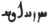
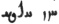

  
[Intangible Textual Heritage](../../index)  [Zoroastrianism](../index.md) 
[Index](index)  [Previous](sbe37079)  [Next](sbe37081.md) 

------------------------------------------------------------------------

[Buy this Book at
Amazon.com](https://www.amazon.com/exec/obidos/ASIN/1402156081/internetsacredte.md)

------------------------------------------------------------------------

*Pahlavi Texts, Part IV (SBE37)*, E.W. West, tr. \[1892\], at Intangible
Textual Heritage

------------------------------------------------------------------------

### CHAPTER XXXI.

*Var*s*tmânsar Nask*.

1\. The eighth fargar*d*, Tâ-v*e*-urvâtâ [1](#fn_835.md), is about advice as to reciting [2](#fn_836.md) the revelation, the information
therefrom for the faithful, about which *they have* to report to the
unfaithful, by mentioning conspicuous specimens *and* explanatory
knowledge, and *by* thinking *of* anything whatever which *they have* to
accept, *or* even which *they have* not to accept [3](#fn_837.md); *also*, for *one* called *to* the
religion, the advantage owing to the attraction of mankind to the
numerous actual disciple-hood of the religion, and the increasing
greatness materially, and further reward spiritually, owing to the
numerous disciplehood; and the progress of the religion of Aûha*r*ma*zd*
even among the irreligious (adênôân) [4](#fn_838.md) and actual apostates [5](#fn_839.md).

2\. This, too, that the life of the creatures of Aûha*r*ma*zd* and also
all other benefit are owing to Aûha*r*ma*zd* [6](#fn_840) and the inclination (kâmvar*ik*akŏ.md) of
Aûha*r*ma*zd* thereto; moreover, reward and recompense come from
Aûha*r*ma*zd*. 3. And the creatures of Aharman proceed from Aharman, all
misery is owing to Aharman, and Aharman becomes worse and more
oppressive and a further producer of misery when they worship him.

p. 246

4\. About the continuance and arranging of both spirits as to their own
creations (stî) and the self-acting of their own appliances; the
achievement of each one through his own natural resources and through
the trifling (ga*d*agânîk) operation of the other; the spiritual
lordship and priestly authority, true confession *and* the progress of
the good religion, *being from* Aûha*r*ma*zd*, *and*, through enmity
*to* the creatures of Aûha*r*ma*zd*, Aharman is contesting these. 5.
Aûha*r*ma*zd*, for setting aside that contester, is the producer of true
intelligence, *and* gave language and also the ritual of ordeal [1](#fn_841.md); the invocation of the sacred
beings [2](#fn_842.md) for assistance, and the
arrival of an angel for the assistance of the invokers; the overcoming
of their affliction, the production of their immunity and even
righteousness, and also *of* that good ruler [3](#fn_843.md) who is a reminder of Aûha*r*ma*zd*, and
the restoration of bodies, *which is* the hope of all good creations,
*are* through the sacred beings being invoked for assistance and *their*
arrival where the diffusion [4](#fn_844.md) is
that of virtuous knowledge through Vohûman [5](#fn_845.md), the good religion which is whatever
*may be* the knowledge [6](#fn_846.md) *of* all
those who are, *and* were, *and* will be.

6\. About the shouting of the demon Aresh [7](#fn_847.md) to

p. 247

\[paragraph continues\] Zaratû*s*t and the
reply of Zaratû*s*t as to the advice of Aûha*r*ma*zd* and whatever is on
the same subject, just as revelation (dênô) states it, that the demon
Aresh spoke to him thus: 'Then the Franâmam [1](#fn_848.md), *O* Zaratû*s*t! is *applicable* to the
assembly of demons who sit in the same place three nights and four days
on account of thee.' 7. Zaratû*s*t enquired of him thus: '*O* Aresh,
*thou* most deceitful to me! what recompense *would* there be for it
*to* me, if I *should* worship you in words?' 8. And Aresh, the most
deceitful of demons, spoke to him thus: 'Thou *wouldst* become
predominant among mankind, through producing at will among the
existences just as is requisite for thyself; and thou *wouldst* become
immortal, *O* Spîtâmân! 9. Zaratû*s*t also enquired of him thus: '*O*
Aresh, most deceitful of demons! *as to* the people by whom you are
worshipped, whether for the birth of a son, *or* even for a concubine
sought for enjoyment, so that *the favour* is considered by them as your
property, how can any one of them be immortal?' 10. And Aresh, the most
deceitful of demons, *could* not tell him who *had* the more
intelligence. 11. So Zaratû*s*t spoke thus: 'I am *for* that *being* and
I like him, that is, I am his

p. 248

own and would transact his affairs, and I *will* recite the law and the
benedictions of the sagacious Aûha*r*ma*zd*, the gratifier of desires.'

12\. About the deliverance of all creatures through the liturgy [1](#fn_849.md), and, so long as *it is* continued by
them, it is for the power through which the immortality of the separate
creations is prepared in the renovation *of the universe;* the increase
*of* the good creatures through the complete continuance *of* the
liturgy, *and* the existence of purity and development of goodness in
the world when he who is a good ruler arrives.

13\. The arising of the spiritual creation, the first thought of
Aûha*r*ma*zd*; *and, as to* the creatures of Aûha*r*ma*zd*, first the
spiritual achievement, and then the material formation and the mingling
of spirit with matter; \[the advancement of the creatures thereby,
through his wisdom *and* the righteousness of Vohûman being lodged [2](#fn_850.md) in the creatures,\] and all good
creatures being goaded (zakhamî-hastanŏ) thereby into purity and
joyfulness. 14. This, too, that a complete understanding of things
arises through Vohûman having made a home in *one's* reason (vârôm).

15\. About the great reward of him who shall produce benefit for
cattle [3](#fn_851.md); also the deceitfully and
seductively assuming of religion and colouring of thought, talking of
righteousness and adopting evil practices, through the recitation of
righteousness even hypocritically (davânsîhâ-*k*); *and* an instance
*of* the reward of an undutiful (avar’*z*î*d*âr)

p. 249

apostate [1](#fn_852.md). 16. About the work of
the creator; *and*, for the completion thereof, the most eminent is
understood *to be* when the world *and* religion *were* formed [2](#fn_853.md) by him, when life *was* given by him to
those possessing bodies [3](#fn_854.md), and [4](#fn_855.md) he provides instruction and
employment [5](#fn_856.md) for it, and when
spiritual life (hûkŏ) [6](#fn_857.md) *was* given
by him to the wishful *man*, so that he may more *fully* appropriate a
share of the worldly and spiritual *existences*.

17\. *He* who makes complete mindfulness [7](#fn_858.md) lodge in *his* body consults complete
mindfulness, and [8](#fn_859.md), through the much
investigation of *his* spiritual life (ahvô) and mind into the
attraction of both spirits—*that* which is good and also *that* which is
evil—each separately for its own appliances, and *into* the duties of
the religion of Aûha*r*ma*zd*, is explaining the inefficiency of
mankind, as regards the dissipation of their sin, because Aûha*r*ma*zd*
is aware of all they practise, that which is public and that, too, which
is concealed [9](#fn_860.md). 18. The great reward
of him who is liberal of gifts (dâsar) from his own property to a

p. 250

righteous man [1](#fn_861.md), and this, too, that
whoever gives him who is wicked [2](#fn_862.md) a
gift, for the sake of improper expectations, assists darkness and not
light.

19\. This, too, that the worst ruler is he of evil religion *and* evil
deeds, who even for a bribe [3](#fn_863.md) would
not occasion happiness; he who is a destroyer of an innocent *man;* also
the grievous state of punishment *of* that person, in hell, who shall
make that wicked *one* a ruler [4](#fn_864.md).
20. And advice to mankind as to providing a judge and guardian over
every dwelling, the probation of a man for appointment *to* that
important duty, *and* the development of all creations *in* the world
when its ruler is sagacious [5](#fn_865.md).

21\. Also causing the disturbance (va-*s*iklinî*d*anŏ) of the evil
spirit for satisfying a man who is rightly thinking, rightly speaking,
*and* rightly acting; the opposition *to* a righteous *man of* a wicked
*one belonging* to the evil spirit, who is an evil-reciting *and*
improperly-disputing apostate; the enticement (lûsinî*d*anŏ) of mankind
to devious *ways* (âvârîhâ), *by* an apostate, *being* more than that
which attracts to the true way for a righteous *man*; and afterwards
also, in the end, the defeat *of* the army of the fiend *by him* who is
beneficial *to* mankind. 22. Advice to mankind about abstaining from the
suite of him who is an apostate, not hearing and not solemnizing the
Avesta and Zand of the sacred beings from him [6](#fn_866.md); also the evil behaviour
(dû*s*-bari*s*nîh), slander, strife, death, and fear in the world owing
to apostates [7](#fn_867.md). 23. Advice to
upholders of the religion about the means of thoroughly understanding
apostates,

p. 251

and preparing *and* keeping a weapon for them [1](#fn_868.md), so that he who is authorised *and*
fearless *may be* more eager for truthful speaking; *and*, when the
religion of Aûha*r*ma*zd* is liked by him, his truthful speaking and
other righteousness have then allured (kâmakînî*d*ŏ) [2](#fn_869.md).

24\. Also *what* happens in the three *nights* [3](#fn_870.md), for the assistance and preservation of
the righteous, through *what is* accomplished *by* the propitious
fire [4](#fn_871.md); and the progress of his
lamentation who deceives and vexes a righteous man [5](#fn_872.md), *and* is leading the wicked *by* their
own befitting deeds to hell [6](#fn_873.md). 25.
This, too, that the complete worthiness which *exists* in Khû*r*da*d*
*and* Amû*r*da*d* [7](#fn_874.md) arises *in* him
who maintains the prerogative which is his [8](#fn_875.md) through virtuousness, who must become
such a friend of whatever is his own spirit, through *his* actions [9](#fn_876.md), as the creator is *of* his own
creatures. 26. This, too, that whatever is thus in the world is perfect,
when every one thinks, speaks, *and* shall act just like his spiritual
lord *and* high-priest [10](#fn_877.md); so that a
good ruler is he with whom virtuous speaking arises, as well as proper
action [11](#fn_878.md). 27. *And* this, too, that
the lodgment of Aûha*r*ma*zd* in the worldly *existence* is most in the
person of that ruler [12](#fn_879.md), and that
lodgment in him is manifest.

28\. The excellence *of* righteousness is perfect.

------------------------------------------------------------------------

### Footnotes

[245:1](sbe37080.htm#fr_841.md) See Chap. VIII, 1
n; it is here written tâg-va-ratŏ in Pahlavi in both MSS.

[245:2](sbe37080.htm#fr_842.md) See Pahl. Yas.
XXXI, 1 a.

[245:3](sbe37080.htm#fr_843.md) B omits these last
eight words

[245:4](sbe37080.htm#fr_844.md) K has akdênôân,
'infidels.'

[245:5](sbe37080.htm#fr_845.md) See Pahl. Yas.
XXXI, 1 c.

[245:6](sbe37080.htm#fr_846.md) Ibid. 2 c.

[246:1](sbe37080.htm#fr_847.md) See Pahl. Yas.
XXXI, 3 b, c.

[246:2](sbe37080.htm#fr_848.md) Ibid. 4 a, b.

[246:3](sbe37080.htm#fr_849.md) Ibid. 4 c.

[246:4](sbe37080.htm#fr_850.md) K has
'ceremonial.'

[246:5](sbe37080.htm#fr_851.md) See Pahl. Yas.
XXXI, 5 b.

[246:6](sbe37080.htm#fr_852.md) K has hû-dânâkîh,
'sagacity.'

[246:7](sbe37080.htm#fr_853.md) The demon of envy,
as in Chap. XXX, 4. The occurrence of his dialogue with Zaratû*s*t in
this place explains the word 
 which is found twice in Pahl. Yas. XXXI, 5 b, and has
been read hû-vârîh, 'good judgment,' or hû-vaharîh, 'good fortune.' In
the MSS. called Pt4 and Mf4, in Geldner's edition of the Avesta, this
Pahlavi word is both times separated into two thus:   which may be read avŏ Aresh,
'to Aresh,' and the whole p. 247 § 5 b may be
translated as follows:—'The gift of understanding through Good Thought
is that *which* thou shouldst give unto me (that is, that wisdom thou
shouldst proclaim to me as virtuousness), which is *to* me (through what
*pertains* to it) that which is for Aresh (that is, through that wisdom
which is virtuousness it shall become possible for me to give a reply to
Aresh).' The reply here mentioned appears to be that given in § 11 of
our text; and the name Aresh explains the word ereshi in the original
Avesta text as meaning 'envy' and being equivalent to araska.

[247:1](sbe37080.htm#fr_854.md) The
Ma*zd*a-worshipper's profession of faith, beginning with the word Av.
fravarânê (Yas. I, 23) = Pahl. franâmam.

[248:1](sbe37080.htm#fr_855.md) See Pahl. Yas.
XXXI, 6 b.

[248:2](sbe37080.htm#fr_856.md) Ibid. 6 c. The
passage in brackets occurs only in K.

[248:3](sbe37080.htm#fr_857.md) Ibid. 10 a, b.

[249:1](sbe37080.htm#fr_858.md) See Pahl. Yas.
XXXI, 10 c.

[249:2](sbe37080.htm#fr_859.md) Ibid. 11 a.

[249:3](sbe37080.htm#fr_860.md) Ibid. 11 b.

[249:4](sbe37080.htm#fr_861.md) So originally in
B, but altered into 'when,' by the repairer of the MS., so as to agree
with K.

[249:5](sbe37080.htm#fr_862.md) See Pahl. Yas.
XXXI, 11 C.

[249:6](sbe37080.htm#fr_863.md) B has kâmak,
'desire,' with 'the wishful' in the plural, and this might agree better
with Pahl. Yas. XXXI, 11 c, but not with the next clause in the sentence
here, where both nominative and verb are in the singular.

[249:7](sbe37080.htm#fr_864.md) See Pahl. Yas.
XXXI, 12 c. This term is the Pahl. equivalent of Av. ârmaiti which is
usually personified as the female archangel Spenda*r*ma*d*.

[249:8](sbe37080.htm#fr_865.md) The MS. K is left
unfinished at this point, merely adding the words expressed by 'into the
attraction of,' in this translation. For the remainder of Bk. IX the
only known MS. authority is B.

[249:9](sbe37080.htm#fr_866.md) See Pahl. Yas.
XXXI, 13 a.

[250:1](sbe37080.htm#fr_867.md) See Pahl. Yas.
XXXI, 14 b.

[250:2](sbe37080.htm#fr_868.md) Ibid. 14 c.

[250:3](sbe37080.htm#fr_869.md) Ibid. 15 b.

[250:4](sbe37080.htm#fr_870.md) Ibid. 15 a.

[250:5](sbe37080.htm#fr_871.md) Ibid. 16 a.

[250:6](sbe37080.htm#fr_872.md) Ibid. 18 a.

[250:7](sbe37080.htm#fr_873.md) Ibid. 18 b.

[251:1](sbe37080.htm#fr_874.md) Pahl. Yas. XXXI,
18 c.

[251:2](sbe37080.htm#fr_875.md) Ibid. 19 b.

[251:3](sbe37080.htm#fr_876.md) After death.

[251:4](sbe37080.htm#fr_877.md) See Pahl. Yas.
XXXI, 19 c and Chap. XII, 4.

[251:5](sbe37080.htm#fr_878.md) Ibid. 20 a.

[251:6](sbe37080.htm#fr_879.md) Ibid. 20 c.

[251:7](sbe37080.htm#fr_880.md) Ibid. 21 a and
Chap. XIX, 1.

[251:8](sbe37080.htm#fr_881.md) Ibid. 21 b.

[251:9](sbe37080.htm#fr_882.md) Ibid. 21 c.

[251:10](sbe37080.htm#fr_883.md) Ibid. 22 a.

[251:11](sbe37080.htm#fr_884.md) Ibid. 22 b.

[251:12](sbe37080.htm#fr_885.md) Ibid. 22 c.

------------------------------------------------------------------------

[Next: Chapter XXXII](sbe37081.md)
