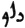
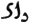

  
[Intangible Textual Heritage](../../index)  [Zoroastrianism](../index.md) 
[Index](index)  [Previous](sbe37095)  [Next](sbe37097.md) 

------------------------------------------------------------------------

[Buy this Book at
Amazon.com](https://www.amazon.com/exec/obidos/ASIN/1402156081/internetsacredte.md)

------------------------------------------------------------------------

*Pahlavi Texts, Part IV (SBE37)*, E.W. West, tr. \[1892\], at Intangible
Textual Heritage

------------------------------------------------------------------------

### CHAPTER XLVII.

*Bakŏ Nask*.

1\. Propitiation *for* the creator Aûha*r*ma*zd* and all angels.

2\. The first of the twenty-two fargar*d*s of the Bakŏ [1](#fn_1189.md) is the Ahunavair [2](#fn_1190.md) of the Bakân [3](#fn_1191.md), about the production *by*
Aûha*r*ma*zd*, before every creation apart from the archangel [4](#fn_1192.md), *and* on the solicitation of

p. 304

the archangel, of the form *of* words (rastakŏ mi*l*ayâ) which is the
innermost and most comprehensive encompassment (parvand) *and*
best-congregated embodiment (vêh-ramaktûm kerpŏ) of the intelligent
omniscience of the religion [1](#fn_1193.md).

3\. The divisions of *this* germ of germs, *and* the origin of the other
primitive sayings of the good religion, are the divisibility of the
portions (bakŏ) *of* the Ahunavair. 4. The Ahû of the Ahû-vairyô of the
Ahunavair is the first creature [2](#fn_1194.md)
which, as regards the first, is specially that creature which is really
*derived* from the creator Aûha*r*ma*zd*, and its adaptation is owing to
mankind. 5. The thought (mit) [3](#fn_1195.md)
that exists with the first is with the word that is Vairyô, his 'will,'
which is in the second created existence (dâmîh), which, as regards the
first, is specially the primitive secondary state (da*d*îgarîh) of those
who are specially characterised by it, who exist as *it were* with
*that* character, *and* have become, *in* that way, in association
*with* the second creature. 6. The conjunction of the first
creature—whose origin (yehevûni*s*nŏ), which is the liturgy, is a
co-existence whose origin *had* occurred—is the source for the saying;
and the distribution of the portions thereof is the whole saying of a
liturgical kind; also its name is Yathâ-ahû-vairyô, the spirit through
which it is set going is the lore *of* the religion, needful among the
creatures, the creations *arose* through wisdom for that purpose, and
they, too, *were* produced on the solicitation of

p. 305

the archangel [1](#fn_1196.md); besides this,
that archangels *are* wise in speaking, and through wisdom are they
archangels.

7\. And this, too, about the same words, that the statement is the
best-worded which is spoken, *or* to be spoken [2](#fn_1197.md); and the obscurity is not about the
sound of the word-elements, but about the manifold nature of the actual
meaning (kabedîh-i sang-î*k*ŏ), which is the character of the statement,
in the words of the epitome. 8. This, too, that mankind guard the soul
from hell by learning, reciting, and practising *it*, and the body from
death [3](#fn_1198.md) by likewise perpetually
persevering therein.

9\. This, too, that, *as to* the first apportionment of the Ahunavair,
whose name is the Bakân Ahunavair, when, thoroughly accomplishing *it*
(avavi*d*âr) unanxiously (asû*d*akîhâ), *one* chants *it* in a
ceremonial, the good work is as when *one* chants a hundred authorities
(ra*d*îh) of the Gâthas, thoroughly accomplishing *them*
unanxiously [4](#fn_1199.md); and when,
accomplishing *it* (vi*d*âr) anxiously, *one* chants *it*, such a
ceremonial amounts to *as much* as ten *with any other authority* [5](#fn_1200.md). 10. This, too, that, through the same
apportionment, while *one* solemnizes the summing up of the first
completion [6](#fn_1201.md), which is the
Stô*d*-ya*s*t, as it becomes the rite of *one* newly initiated
(navak-n*â*par) [7](#fn_1202.md), on that day

p. 306

they make the soul of the solemnizer pass three times into the supreme
heaven [1](#fn_1203.md).

11\. About the grievous sinfulness of imperfectly accomplishing
(avi*d*âr) the Bakân Ahunavair [2](#fn_1204.md).

12\. This, too, that it is made by him in subjection *to* Aûha*r*ma*zd*,
as the first creature made, who gives the body in service to him who is
the ruler, *and* in discipleship to him who is the high-priest of the
religion [3](#fn_1205.md); for this reason,
because they are suitable *for* lordship and mastership in the worldly
*existence*. 13. He who is the highest lord *and* master is the creator
Aûha*r*ma*zd*, and, owing to the same reason, when it made their
subjection that *to* the creator Aûha*r*ma*zd*, he has made *it* as the
first creature made.

14\. This, too, that it is taught by it to keep the body in the service
of the king of kings [4](#fn_1206.md), whose
origin Aûha*r*ma*zd* keeps in *his* possession; for this reason,
because, when *his* origin is kept in the possession *of* Aûha*r*ma*zd*,
Aûha*r*ma*zd* is over his own if a good ruler is made; him who is thus
prepared, when also the worldly existence is necessary *for*
Aûha*r*ma*zd*, he maintains as ruler when the creation is instructed.

15\. This, too, that the reward of Vohûman is appropriated
(khvêsinî*d*ŏ) by him who indicates anything which is virtuous, who also
utters virtuous recitation, *and* who likewise teaches perfect
abstinence from sin to mankind [5](#fn_1207.md).
16. For this reason, because the indication of anything virtuous, the
utterance of recitation wisely, *and* abstinence from

p. 307

sin are, as *it were*, a lodgment materially in good people owing
spiritually to the archangels, Vohûman *being* more particularly the
instigator therein; and, owing to the same reason, *he* in whom there is
a like proficiency is of like good works with Vohûman, and adapted to
the good works arises the like reward.

17\. This, too, that the dominion is given to Aûha*r*ma*zd* by him who
may perform those *works*, is manifest from *the phrase* Ta*d* mazdâ
tavâ khshathrem, &c. and its meaning, which is this: 'That, *O*
Aûha*r*ma*zd*! is this dominion of thine, *by* which benefits (vehagânŏ)
are given *to* him who is justly living *and* poor [1](#fn_1208.md).' 18. Which is a deliverance for this
reason, because Aûha*r*ma*zd* created no dominion for the more
particular preservation of the poor *and* the creatures of the worldly
*existence* from the destroyer; *but*, for the purpose of control over
the dominion of *him* whose strength of rule is the cause of
preservation for the poor—which is continually the wish of
Aûha*r*ma*zd*—the dominion is given to Aûha*r*ma*zd*.

19\. *And* this, too, that, through preservation from the adversary, he
has assisted his poor who have preserved friendship for the
Spîtâmân [2](#fn_1209.md); the adversity *of* the
creatures is the advancement of religion, by supporting the religion;
and a friend of the Spîtâmân becomes an assistant of the supporters of
religion. 20. About the entrance (dên yâtûn*d*akîh) of the destroyer of
the creatures from without [3](#fn_1210.md),
*and* the helplessness of the beneficent spirit owing thereto.

p. 308

21\. About the girding on of this saying of the religion of
Aûha*r*ma*zd* by the three degrees (pa*d*mân), which are good thoughts,
good words, *and* good deeds; *by* the four classes, which are
priesthood, warriorship, husbandry, and artisanship; and *by* the five
chieftainships, which are house-rule, village-rule, tribe-rule,
province-rule, and the supreme Zaratû*s*tship; and the one summing up
(hanger*d*îkîh) which is the liberality of the good ruler [1](#fn_1211.md).

22\. Righteousness is perfect excellence.

------------------------------------------------------------------------

### Footnotes

[303:1](sbe37096.htm#fr_1202.md) The third of the
Nasks and fourth of the Gâthic division (see Bk. VIII, Chap. I, 9, 12).
It is an analytical commentary upon the Gâthas and the texts associated
with them in the two preceding Nasks, devoting a separate fargar*d* to
each hâ, and selecting very short phrases, or portions (Av. bagha), for
explanation and comment; so short that it is usually difficult to
identify them in their Pahlavi disguise. The first three fargar*d*s are
still extant in Yas. XIX-XXI, and a translation of their Pahlavi
versions will be found in the Nask Fragments at the end of this volume;
but whether the Pahlavi versions, consulted by the writer of the
Dinka*rd*, were identical with those in the present Yasna is uncertain.

[303:2](sbe37096.htm#fr_1203.md) The name of the
Yathâ-ahû-vairyô formula (see Bk. VIII, Chap. I, 7). This fargar*d* is
still extant in Yas. XIX.

[303:3](sbe37096.htm#fr_1204.md) That is, 'of the
apportionments,' or 'of those analyzed.'

[303:4](sbe37096.htm#fr_1205.md) Possibly the
archangel Vohûman, the first of the creatures, may be meant; although
the Bundahi*s* places his creation after the recitation of the Ahunavair
(see Bd. I, 21-23). That it was p. 304
recited before the other creations is clearly stated in Pahl. Yas. XIX,
2-5, 17-20.

[304:1](sbe37096.htm#fr_1206.md) See Pahl. Yas.
XIX, 24-27.

[304:2](sbe37096.htm#fr_1207.md) Ibid. 29.

[304:3](sbe37096.htm#fr_1208.md) Ibid. Pâz. mit =
Av. maiti = manas.

[305:1](sbe37096.htm#fr_1209.md) See Pahl. Yas.
XIX, 20.

[305:2](sbe37096.htm#fr_1210.md) Ibid. 24.

[305:3](sbe37096.htm#fr_1211.md) Ibid. 25, 26.

[305:4](sbe37096.htm#fr_1212.md) Ibid. 6, 7. The
MS. has   instead of   '100,' by mistake.

[305:5](sbe37096.htm#fr_1213.md) Ibid. 8. The MS.
has 'unanxiously' by mistake.

[305:6](sbe37096.htm#fr_1214.md) Possibly Yas.
LIX, 32-34.

[305:7](sbe37096.htm#fr_1215.md) Commonly called
Nônâbar (see Sls. X, 2, XIII, 2; Dd. LXXIX, 4, 11, 12).

[306:1](sbe37096.htm#fr_1216.md) See Pahl. Yas.
XIX, 9-11.

[306:2](sbe37096.htm#fr_1217.md) Ibid. 32-15.

[306:3](sbe37096.htm#fr_1218.md) Ibid. 28, 29.

[306:4](sbe37096.htm#fr_1219.md) Ibid. 30.

[306:5](sbe37096.htm#fr_1220.md) Ibid. 31, 32.

[307:1](sbe37096.htm#fr_1221.md) See Pahl. Yas.
XIX, 35, Yas. LIII, 9 d, and Chap. XLV, 10.

[307:2](sbe37096.htm#fr_1222.md) Ibid. 36.

[307:3](sbe37096.htm#fr_1223.md) Ibid. 39.

[308:1](sbe37096.htm#fr_1224.md) See Pahl. Yas.
XIX, 44-55.

------------------------------------------------------------------------

[Next: Chapter XLVIII](sbe37097.md)
