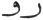
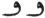

  
[Intangible Textual Heritage](../../index)  [Zoroastrianism](../index.md) 
[Index](index)  [Previous](sbe37119)  [Next](sbe37121.md) 

------------------------------------------------------------------------

[Buy this Book at
Amazon.com](https://www.amazon.com/exec/obidos/ASIN/1402156081/internetsacredte.md)

------------------------------------------------------------------------

*Pahlavi Texts, Part IV (SBE37)*, E.W. West, tr. \[1892\], at Intangible
Textual Heritage

------------------------------------------------------------------------

p. 401

##### FROM THE SELECTIONS

##### OF

## ZÂ*D*-SPARAM [1](#fn_1573.md).

1\. About the three divisions of revelation there is a condensed medium,
beneficial *and* small, of whose subdivision one category (ra*g*istakô)
is collection together; that is, the Ahunavair [2](#fn_1574.md) itself is a symbol of the Nasks.

2\. First, the Ahunavair is apportioned into its three degrees
(pa*d*mân), as shown in another chapter; *and* by a like system
(ra*g*istak) the Gâthas [3](#fn_1575.md), too,
are into three, which are the three-lined, four-lined, and
five-lined [4](#fn_1576.md); even so the Nasks

p. 402

are denominated Gâthic, Hadha-mãthric, and Law. 3. Then the Ahunavair is
apportioned into six which they call half-lines (nêm-gâs); so, too, the
Gâthas are into six, which are called the Ahunavaiti Gâtha, the Yasna,
the U*s*tavaiti [1](#fn_1577.md) Gâtha, the
Spe*n*tâ-mainyû (S*p*etamatŏ) Gâtha, the Vohû-khshathra Gâtha, *and* the
Vahi*s*tôi*s*ti Gâtha; even so the Nasks are into six, as the Gâthas are
into two, which are called one the Gâthic creation—*which* is the
Yast [2](#fn_1578.md)—*and* one the rest *of* the
Gâthic; also the Hadha-mãthric into two, one the Mãthra of the
arranger—which is the P*âk*înŏ and Ra*d*ŏ-dâ*d*ŏ-aîtŏ [3](#fn_1579.md)—and one the Mãthra full of good
tokens, which is the rest *of* the Hadha-mãthra; and also the Law into
two, one the law against the demons—which is the Vendîdâ*d* [4](#fn_1580.md)—and one the law of Zaratû*s*t, *which*
is the rest *of* the Law. 4. Then it is apportioned into twenty-one,
such as the twenty-one words (mârîk) of the Ahunavair; *also* the Gâthas
are *into* twenty-one, which are the Ahunavair, the praise of
righteousness, the performance of the good, *and* from Yânîm-manô unto
Airyaman [5](#fn_1581.md) which, *being*

p. 403

accomplished (âka*rd*ŏ), are twenty-one; and the Nasks are twenty-one.

5\. Then the Gâthas are apportioned into 278 [1](#fn_1582) stanzas (v*êk*êstŏ.md); and the Nasks
also into 278 categories, every single category *having* borne a form
like a single verse [2](#fn_1583.md), as regards
how much and how any*thing* good is indicated, such as the
Patkâr-ra*d*istân [3](#fn_1584.md), in which
*what is* legally disputable is reported (pê*d*âkŏ); the
Zâkhmistân [4](#fn_1585.md), by which the penalty
of assault (zâkhm) is reported; the Stôristân [5](#fn_1586.md), by which the sin and amount of
penalty *for* a wound, as regard beasts *of burden and* cattle, are
reported; the Aratê*s*târistân [6](#fn_1587.md),
by which battle is reported; the Pasû*s*-haûrvastân [7](#fn_1588.md), by which the customary keeping of
sheep in control is reported; the *G*ûr*d*âî-zarîtunistân ('*corn-sowing
code*') [8](#fn_1589.md), by which agriculture is
reported; the Varistân [9](#fn_1590.md), by which
an ordeal *being* accomplished is reported; and others of a like
description.

p. 404

6\. Then the Gâthas are apportioned into 1061 [1](#fn_1591) metrical lines (gâs.md), and the Nasks
into 1000 Hâs *and* Fargar*d*s [2](#fn_1592.md),
*and*, since the Hâ*d*ôkht [3](#fn_1593.md) is
the priestly master (ra*d*ŏ) of the Nasks, *and* the remedy [4](#fn_1594) (darmôn.md) which is a perfect statement
about the master of the resurrection, the existence of *its* fargar*d*s
about the other fargar*d*s is therefore 1000 remedies fully combined,
*being* the corn and fodder that are shut up (bastakŏ) when, over that
thousand, they supply one that is great, which *in* every way protects
*them* from hail and rain, *from* the wind which is hot *and* that which
is cold.

7\. Then the Gâthas are apportioned into 6666 words (mârîk) [5](#fn_1595.md), and *as to* the Nasks, too, their own
6666 ordinances (dâ*d*istânŏ) are therein severed. 8. And the 6666
words, which are in the Gâthas, are

p. 405

an indicator of *the period* from the adversary *having* come to the
creatures, as far as unto the end of the six millenniums [1](#fn_1596.md)—each millennium *being* ten
centuries—which amount to 60 single centuries—a century *being* ten
tens [2](#fn_1597.md)—and up to *the time* when
its [3](#fn_1598.md) cold *and* distress arrive,
which become awful; the 600, including the excess as far as one
ten [4](#fn_1599.md), are years of the 6000 years
which are the words of the six Gâthas that are the first indicator of
the six millenniums; therefore of the 60 centuries are then the 600 and
those which are *added* to *them* (zak-î gha*l*).

9\. And after those 6000, which are the 6000 years, are the
Airyaman [5](#fn_1600.md) of Ashavahi*s*t *and*
the accompanying sayings (ham-v*âk*ŏ) which are at the end of the
Gâthas; those are the 57 years of Sôshâns [6](#fn_1601.md), and for the sake of them, too, are
the Airyaman *and* from the praise of righteousness at *its* end *to*
the consecration of the Airyaman, originally 57 words (mârîk), because
the praise of righteousness for the Airyaman is 12, and the consecration
of the Airyaman is 21, *of* the original 57 [7](#fn_1602.md).

------------------------------------------------------------------------

### Footnotes

[401:1](sbe37120.htm#fr_1614.md) Who was
high-priest of Sîrkân, in the south of Persia, towards the end of the
ninth century, being contemporary with the last reviser of the Dinka*rd*
(see S.B.E., vol. xviii, p. xxvii). This extract from his Selections
constitutes the 'particulars about the Gâthas and the connection of the
Ahunavair with the Nasks,' mentioned in the final footnote to Zs. XI,
10. For the Pahlavi text the translator is dependent upon a single MS.,
copied from K35 when this latter MS. was complete, and said to be now in
the library of Dastûr Jâmâspji Minochiharji in Bombay.

[401:2](sbe37120.htm#fr_1615.md) See Dk. VIII,
Chap. I, 7.

[401:3](sbe37120.htm#fr_1616.md) The word gâsânŏ
is usually written like dahi*s*nŏ in the MS.

[401:4](sbe37120.htm#fr_1617.md) The three-lined
stanzas of the Gâthas are 100 in the Ahunavaiti (Yas. XXVIII-XXXIV), 40
in the Yasna of seven hâs (Yas. XXXV-XLI), and 22 in the Vohû-khshathra
(Yas. LI), altogether 162 three-lined stanzas; the four-lined are one in
the U*s*tavaiti (Yas. XLVI, 15), 41 in the Spe*n*tâ-mainyû (Yas.
XLVII-L), and nine in the Vahi*s*tôi*s*ti (Yas. LIII), altogether 51
four-lined stanzas; p. 402 and the five-lined
stanzas are the remaining 65 in the U*s*tavaiti (Yas. XLIII-XLVI);
making the total of 278 stanzas mentioned in § 5. Yas. XLII is a later
supplement to the Yasna of seven hâs, and, in the MSS. Pt4, Mf4, it is
headed as follows:—*Av*ar vaharakŏ-î h*a*ft hâ*d*ŏ Yastô y*az*i*s*nîk
bûn, 'the beginning of worshipping as regards the portions of the Yasna
of seven hâs.'

[402:1](sbe37120.htm#fr_1618.md) The MS. corrupts
these two names into the one word asnavatŏ by omitting the syllables
aû*s*ta.

[402:2](sbe37120.htm#fr_1619.md) The
Stô*d*-ya*s*t, or first of the Gâthic Nasks (see Dk. VIII, Chap. I, 9).

[402:3](sbe37120.htm#fr_1620.md) The third and
fourth of the Hadha-mãthric Nasks (ibid. 10).

[402:4](sbe37120.htm#fr_1621.md) The fifth of the
Legal Nasks (ibid. 11).

[402:5](sbe37120.htm#fr_1622.md) The three sacred
formulas, Yathâ-ahû-vairyô, Ashem-vohû, p.
403 and YêNhê-hâtãm, with the seventeen hâs of the five real
Gâthas, and either the Yasna of seven hâs, counted as a single item, or
the Airyaman, will make up the twenty-one divisions (compare the names
applied to each fargar*d* of the Sû*d*kar, Var*s*tmânsar, and Bakŏ Nasks
in Dk. IX).

[403:1](sbe37120.htm#fr_1623.md) See § 2 n; here
the MS. has 288, by miswriting, in both occurrences of the ciphers.

[403:2](sbe37120.htm#fr_1624.md) Doubtful; the
text appears to be as follows:—ko*l*â ra*g*istakŏ-aê bûr*d*ŏ *s*an mânâk
ak gâh.

[403:3](sbe37120.htm#fr_1625.md) See Dk. VIII,
Chap. XVI.

[403:4](sbe37120.htm#fr_1626.md) Equivalent to
Zatamistân (ibid. Chap. XVII), see Darmesteter's suggestion (ibid. Chap.
XVI, 8 n).

[403:5](sbe37120.htm#fr_1627.md) Ibid. Chap.
XXIV; here spelt Stôritân by mistake.

[403:6](sbe37120.htm#fr_1628.md) Ibid. Chap.
XXVI.

[403:7](sbe37120.htm#fr_1629.md) Ibid. Chap.
XXIII; here written Pa*s*û*s*-haûristân.

[403:8](sbe37120.htm#fr_1630.md) Ibid. Chap.
XXXI, 30-32.

[403:9](sbe37120.htm#fr_1631.md) Ibid. Chap.
XLII; here written Varîstân.

[404:1](sbe37120.htm#fr_1632.md) See Sls. XIII,
50; that this number is correct may be seen from the details given in §
2 n.

[404:2](sbe37120.htm#fr_1633.md) See Dk. VIII,
Chap. I, 20; here the MS. has âyûînŏ instead of hâtŏ, by miswriting.

[404:3](sbe37120.htm#fr_1634.md) The sixth of the
Gâthic Nasks (see Dk. VIII, Chap. I, 9).

[404:4](sbe37120.htm#fr_1635.md) See Dk. VIII,
Chap. XLV, 13, where the word used is bêsh*âz*ŏ.

[404:5](sbe37120.htm#fr_1636.md) According to
Sls. XIII, 50 the six Gâthas (including the Yasna of seven hâs) contain
5567 vâ*k*ak, 9999 mârîk, and 36,554 khûr*d*ak; which enumeration makes
the meaning of mârîk doubtful. In our present text, however, it must
have its usual meaning of 'word,' as the number of 6666 words in the six
Gâthas can be obtained by including the customary repetition of the
first stanza of each Hâ of the five real Gâthas, with the text of the
Airyaman and of the introductions to Yas. XXVIII, XXXV, and probably the
homage formula prefixed to each Gâtha; also by considering each
component of a compound as a separate word, and all verbal prefixes as
separable; and by counting all enclitics except -*k*â, in accordance
with the different modes of treating -*k*îd and -*k*â in counting the
words of the Ahunavair. If the three sacred formula were included, and
the Airyaman and five homage formulas were omitted, the total would be
nearly the same.

[405:1](sbe37120.htm#fr_1637.md) The three
millenniums during which Aûha*r*ma*zd* and Aharman had nearly equal
influence, and the last three millenniums during which the power of
Aharman diminishes (see Bd. I, 20).

[405:2](sbe37120.htm#fr_1638.md) Assuming that
  stands for  .

[405:3](sbe37120.htm#fr_1639.md) Assuming that
mûna*s*, 'whose,' stands for amata*s*.

[405:4](sbe37120.htm#fr_1640.md) As the cipher
for 'one' precedes that for 'ten,' it may possibly mean 'one *less than*
ten,' as in the Roman IX. At any rate, 6609 years with the 57 accounted
for in § 9 make up the requisite total of 6666; but the mode of making
this number correspond with the six millenniums is not very clear.

[405:5](sbe37120.htm#fr_1641.md) Yas. LIV, 1.

[405:6](sbe37120.htm#fr_1642.md) See Dk. VIII,
Chap. XIV, 14; Bd. XXX, 7.

[405:7](sbe37120.htm#fr_1643.md) The Airyaman
contains 24 words, its Ashem-vohû 12, and its consecration (Yas. LIV, 2)
21 words, making altogether 57 words.

------------------------------------------------------------------------

[Next: Dinka*rd*. Book III, Chapter VII](sbe37121.md)
