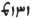

  
[Intangible Textual Heritage](../../index)  [Zoroastrianism](../index) 
[Index](index)  [Previous](sbe37120)  [Next](sbe37122) 

------------------------------------------------------------------------

[Buy this Book at
Amazon.com](https://www.amazon.com/exec/obidos/ASIN/1402156081/internetsacredte)

------------------------------------------------------------------------

*Pahlavi Texts, Part IV (SBE37)*, E.W. West, tr. \[1892\], at Intangible
Textual Heritage

------------------------------------------------------------------------

p. 406

### DÎNKA*RD*.—BOOK III.

#### CHAPTER VII [1](#fn_1603).

#### The ninth question.

1\. Another apostate enquired thus: 'When there is Mãthra that is said
*to be* all in the words of Aûha*r*ma*zd* to Zaratû*s*t, *whether* it be
in the words of Frashô*s*tar *and* *G*âmâsp [2](#fn_1604), *or* be in the words of Vohûman [3](#fn_1605) and the sacred beings, *or* be in
words of theirs published before *the time of* Zaratû*s*t, *or* even
after *that of* *S*ênô [4](#fn_1606), is *it
to be* considered *by* us, as to that which is relating to us, *that*
what is the utterance of Aûha*r*ma*zd* to Zaratû*s*t is only the Gâthic,
and the rest is composed *by* Zaratû*s*t and his disciples from the
world, even statements due to a good inclination for conversion
(va*s*takîh)?'

2\. The reply is *that* the other Mãthra which is separate from the
Gâthas, if it *be apart* from the Gâthas, is *still* owing to the
composition of the Yathâ-ahû-vairyô [5](#fn_1607); *and* the same separate Mãthra, which
is from a witness about *it*, is the evidence with Aûha*r*ma*zd* himself
in vigorous omniscience and composition, and not owing to the knowledge
of mankind, which shall not attain even to an atom of the atoms thereof.
3. The arising of the Mãthra, through the speaking of many voices, is
not all the speaking of Aûha*r*ma*zd* to Zaratû*s*t through those

p. 407

voices, but the speaking of several separately, through which the
speaking of the voice would be evidently *that of* Aûha*r*ma*zd*; that
is this Mãthra. 4. *And* just as the speaking forth of Zaratû*s*t and
other good *men*, as well as evil *ones*, likewise *of* those who are
demons, even as far as the evil spirit, is stated by Aûha*r*ma*zd* in
public, that statement would become even that of the evil spirit and
demons, *and* the Mãthra and Law against the demons *would* likewise
*become* spoken *by* the demons. 5. And the Mãthra is all *confided by*
Aûha*r*ma*zd* to Zaratû*s*t through many voices, *being* an avowal of
Aûha*r*ma*zd* to Zaratû*s*t, and an existence which is not inconsistent
(han-bêshin); just as the Gâthas, which even you *admit to be*, as a
whole, *confided by* Aûha*r*ma*zd* to Zaratû*s*t, are spoken through the
voice of Zaratû*s*t, be they through the voices of the archangels, be
they through the voice of Gô*s*-aûrvan [1](#fn_1608), *or* be they *through* the voices of
other sacred beings, to all *they* are spoken *by* Aûha*r*ma*zd* to
Zaratû*s*t, *and* are not inconsistent. 6. But owing to the disposition
of an apostate *there* is a longing scrutiny about his own *statements,
and* evil-thinking scrutiny about the statements protecting the
spiritual lord.

------------------------------------------------------------------------

### Footnotes

[406:1](sbe37121.htm#fr_1644) According to
Peshotan's notation; the text followed is that of the MS. B, written
A.D. 1659.

[406:2](sbe37121.htm#fr_1645) See Dk. VIII,
Chap. XXXVIII, 68.

[406:3](sbe37121.htm#fr_1646) This seems a
more likely reading than 'Hôm' for the imperfect word  .

[406:4](sbe37121.htm#fr_1647) See Chap.
CXCVII, 6 n.

[406:5](sbe37121.htm#fr_1648) See Dk. VIII,
Chap. I, 7 n.

[407:1](sbe37121.htm#fr_1649) See Dk. IX,
Chap. XV, 3.

------------------------------------------------------------------------

[Next: Dinka*rd*. Book III, Chapter CLXI](sbe37122)
