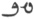
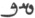

  
[Intangible Textual Heritage](../../index)  [Zoroastrianism](../index.md) 
[Index](index)  [Previous](sbe4708)  [Next](sbe4710.md) 

------------------------------------------------------------------------

[Buy this Book at
Amazon.com](https://www.amazon.com/exec/obidos/ASIN/1417930055/internetsacredte.md)

------------------------------------------------------------------------

*Pahlavi Texts, Part V: Marvels of Zoroastrianism (SBE47)*, E.W. West,
tr. \[1897\], at Intangible Textual Heritage

------------------------------------------------------------------------

### CHAPTER V.

1\. About the marvellousness which is manifested from the acceptance of
the religion *by* Vi*s*tâsp onwards till the departure (vîkh*êz*ŏ) of
Zaratû*s*t, *whose* guardian spirit is reverenced, to the best
existence, when seventy-seven years [2](#fn_208.md) had elapsed onwards from *his* birth,
forty-seven onwards from

p. 74

*his* conference, *and* thirty-five years onwards from the acceptance of
the religion *by* Vi*s*tâsp [1](#fn_209.md).

2\. One *marvel* is this *which is* declared that, when Zaratû*s*t
chanted revelation in the abode of Vi*s*tâsp, *it was* manifest *to* the
eye that it is danced to *with* joyfulness, both by the cattle *and*
beasts of burden, and *by* the spirit of the fires which *are* in the
abode. 3. By *which*, too, a great wonder is proclaimed, like this
*which* revelation mentions thus: '*There* seemed a righteous joyfulness
of all the cattle, beasts *of burden*, and fires of the place, *and
there* seemed a powerfulness of every kind of well-prepared spirits and
of those quitting the abode (mân-hishânŏ), "that will make us [2](#fn_210.md) henceforth powerful through religion,"
when they fully heard those words which *were* spoken by the righteous
Zaratû*s*t of the Spîtâmas.'

4\. And one *marvel* is the provision, *by* Zaratû*s*t, of the
achievement *of* ordeal, that indicator of the acquitted *and*
incriminated for sentence *by* the judge, in obscure legal proceedings;
*of* which *it* is said in revelation *there are* about (*k*îgûn)
thirty-three kinds. 5. These, too, the disciples of Zaratû*s*t kept in
use, after that *time*, until the collapse of the monarchy of Irân; and
the custom *of* one of them is that of pouring melted metal on the
breast, as in the achievement of the saintly (hû-fravar*d*ŏ) Âtûrpâ*d*
son of Mâ*r*aspend, through whose preservation a knowledge

p. 75

about the religion *was* diffused in the world; and of the
manifestation, too, through that great wonder, this is also said, on the
same subject, in the good religion, that of those many, when they behold
that rite of ordeal, it convinces the wicked ones [1](#fn_211.md).

6\. One *marvel* is that which is afterwards manifested, after the
former captivity of Zaratû*s*t [2](#fn_212.md) and
his speaking about the religion to Vi*s*tâsp and those of the
realm [3](#fn_213.md), *such* as the acceptance of
the religion *by* Vi*s*tâsp *and* that which Zaratû*s*t said to him at
*his* original arrival, as regards the declaration of a ruler's
religion, thus: 'Thine is this disposition, *and* this religion which is
calling (khrôsakŏ) is a property of that description *which* thou
puttest together, *O* Kaî-Vi*s*tâsp! so that *if* thou wilt accept this
disposition of thine, thou wilt possess this religion which exists (that
is, the learning of learnings), *and be* the ruler that shall cause
*its* progress; thou *wilt* possess in this disposition of thine, as *it
were*, a new support (stûnakŏ), *and* any one will uphold *thee* by
upholding *it*, as thou art the possessor of the support of this
religion.' 7. Also the victory of Vi*s*tâsp over Ar*g*âsp the Khyôn and
other foreigners in that awful battle [4](#fn_214.md), just as Zaratû*s*t explained unto
Vi*s*tâsp in revelation; *and* much which is declared by revelation.

8\. One *marvel* is the disclosure by Zaratû*s*t, in complete
beneficence, medical knowledge, acquaintance with character, and other
professional retentiveness (pîshakŏ-gîrûkîh), secretly *and* completely,
of *what* is necessary for legal knowledge and spiritual

p. 76

perception; also the indication, by revelation, of the rites for driving
out pestilence (s*êg*ŏ), overpowering the demon and witch, and disabling
sorcery and witchcraft. 9. The curing *of* disease, the counter-action
of wolves *and* noxious creatures, the liberating of rain, *and* the
confining of hail, spiders, locusts, and other terrors of corn *and*
plants *and* adversaries of animals, *by* the marvellous rites which are
also relating to the worship of Khû*r*da*d* *and* Amû*r*da*d* [1](#fn_215.md), and many other rites which *were* kept
in use until the collapse of the monarchy of Irân; and there are some
which have remained even *till* now [2](#fn_216.md), *and* are manifested with a trifle of
marvellousness by the sacred fires. to. And the disclosure to mankind
*of* many running waters from marvellous streams (ardâyâ), and remedies
for sickness which *are* mixed (farga*rd*akŏ) by well-considering
physicians; many *are* spiritual and celestial, gaseous (vâyîg) and
earthy; and the worldly advantage of others, too, is the praise (l*â*fŏ)
which ought to come to one for angelic [3](#fn_217.md) wisdom.

11\. One is the marvel of the Avesta itself, which, according to all the
best reports *of* the world, is a compendium of all the supremest
statements of wisdom.

12\. One *marvel* is the coming of this also to

p. 77

\[paragraph continues\] Vi*s*tâsp, which
the archangels announced as a recompense for accepting the
religion [1](#fn_218.md), as he saw Pêshyôtan the
happy ruler, that immortal and undecaying son, not wanting food,
large-bodied, completely strong, fully glorious, mighty, victorious, and
resembling the sacred beings; the unique splendour of Pêshyôtan for the
sovereignty of Kangd*ez* *in* yonder *world*, as allotted to him *by*
the creator Aûha*r*ma*zd*, is manifested even through that great wonder
to the multitude [2](#fn_219.md).

------------------------------------------------------------------------

### Footnotes

[73:2](sbe4709.htm#fr_208.md) The MS. has '57
years,' through   '50'
being written instead of  
'70'; but see Chap. III, 51 which states the interval of thirty years
between his birth and conference.

[74:1](sbe4709.htm#fr_209.md) The contents of this
chapter and the next, as far as VI, 11, may be connected with the
following summary in Dk. VIII, xiv, 9:—'Information also *as to* many
other things which are marvellous, and *as to* a summary of the
statements of these seven enquiries, which is *derived* from knowledge
of every kind.' For the seven enquiries, see Zs. XXII.

[74:2](sbe4709.htm#fr_210.md) Or, perhaps, 'make
the abode.'

[75:1](sbe4709.htm#fr_211.md) §§ 4, 5 are already
translated in AV. p. 145.

[75:2](sbe4709.htm#fr_212.md) See Chap. IV, 67-69.

[75:3](sbe4709.htm#fr_213.md) See Chap. IV, 73.

[75:4](sbe4709.htm#fr_214.md) See Chap. IV, 88-90.

[76:1](sbe4709.htm#fr_215.md) These two archangels
personify health and immortality, respectively (see Chap. II, 19), and
are supposed to have special charge of water and plants.

[76:2](sbe4709.htm#fr_216.md) The ninth century,
unless this phrase be copied from one of the sources of the Dînka*rd*.

[76:3](sbe4709.htm#fr_217.md) The MS. has
yazdânŏ-khira*d*ŏîh which has the meaning given in the text; but this
word can also be read gehânŏ-khira*d*ŏîh, 'worldly wisdom,' though
gêhânŏ is the more usual orthography.

[77:1](sbe4709.htm#fr_218.md) See Chap. IV, 81.

[77:2](sbe4709.htm#fr_219.md) It is singular that
nothing is stated here about the death or departure of Zaratû*s*t, which
event, according to § 1, ought to have concluded this chapter. But in
Chap. III, 39, Dûrâsrôb evidently foretells that Zaratû*s*t will be
killed by the evil eye of Brâ*d*rôk-rêsh. In Dk. V, iii, 2, the killing
of Zaratû*s*t by Brâ*d*rôk-rêsh the Tûr is merely mentioned. In Zs.
XXIII, 9, it is stated that Zaratû*s*t passes away (vi*d*îrê*d*ŏ)
forty-seven years after his conference and preaching to Vi*s*tâsp. While
the modern Persian Zaratû*s*t-nâma does not mention his death, though it
speaks of Bartarûsh as his chief enemy in his younger days. But compare
Chap. III, 22.

------------------------------------------------------------------------

[Next: Chapter VI](sbe4710.md)
