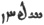

  
[Intangible Textual Heritage](../../index)  [Zoroastrianism](../index) 
[Index](index)  [Previous](sbe4709)  [Next](sbe4711) 

------------------------------------------------------------------------

[Buy this Book at
Amazon.com](https://www.amazon.com/exec/obidos/ASIN/1417930055/internetsacredte)

------------------------------------------------------------------------

*Pahlavi Texts, Part V: Marvels of Zoroastrianism (SBE47)*, E.W. West,
tr. \[1897\], at Intangible Textual Heritage

------------------------------------------------------------------------

### CHAPTER VI.

1\. About the marvellousness which is manifested after the departure
(vîkhê*z*ŏ) of Zaratû*s*t, whose guardian spirit is reverenced, to the
best existence, *and* in the life*time* of Vi*s*tâsp.

2\. One *marvel* is this which is declared by revelation, about the
provision of a chariot [3](#fn_220) by
Srîtô [4](#fn_221) of the Vîsraps [5](#fn_222); this is through a famous wonder and

p. 78

the coming of a report about the marvellousness of that chariot to
Vi*s*tâsp, Vi*s*tâsp's begging that chariot from Srîtô, and Srîtô
*saying* in reply to Vi*s*tâsp: 'That chariot is for a righteous man,
*in* which the soul of Srîtô in the life*time* of Srîtô's body [1](#fn_223), *and* that of that man in the
life*time* of his body, come visibly together once in the worldly
existence.' 3. And the soul of Sritô, through the generosity of that
Srîtô, presents that chariot to the eyesight of that man of
righteousness; thereby it becomes evident he had seen *it*, and is told
not to act in another manner. 4. The exalted Kaî-Vî*s*tâsp, as becoming
from revelation more particularly aware of this marvel about the future
at that time, and for the sake of this marvel being published to the
worldly existence (gêhânîgîh), and of *his* becoming

p. 79

more invoking *for* the supremacy of the Ma*zd*a-worshipping religion,
became discernible by those of the realm, is sought for, *and* is most
attended.

5\. A great wonder became manifest to Vi*s*tâsp and those of the world,
just as revelation mentions thus: 'Thereupon the archangels are letting
forth the soul of that *Srîtô* from the light of the supreme heaven,
from the light on to the earth created by Aûha*r*ma*zd*; *and* the soul
of Vi*s*tâsp proceeded from him into the light to meet *it*. 6.
Vi*s*tâsp proceeded on to the propitious south (rapîtvînŏ); he *was*
producing more gain than the gainers, and he was more inquisitive than
the inquisitive; to all whom he saw he spoke, and unto such as spoke he
listened; when he gazed at them looking simultaneously they stood up,
*and* obeisance *was* offered by them unto the soul *and* person of
Vi*s*tâsp.'

7\. Immediately upon that no delay occurred until *there* came on at a
run—*besides* the soul of Sritô of the Vîsraps—the most horrid
(agrandtûm) of demons, from the horrid northern quarter of the horrid
destroyer (za*d*âr), that was himself black, and his deeds, too, were
very black. 8. And as he comes himself, so also he grumbles to the soul
of Srîtô thus: 'Give a maintenance (khvârag) *to* Vi*s*tâsp who is thy
driver [1](#fn_224), for the sake of good
fellowship and service, and for that, righteousness is suitable unto a
pure *one*; do not *give it* as a thing which is protective (that is, do
not *give it* for the sake of worldly gratuity), *but* for love of the
righteousness which is owing to the perfect existences.'

9\. When those words were fully heard by Srîtô of

p. 80

the Vîsraps, the early bestower (levînŏ-vakhsh), he stood still and so
he spoke in words thus: 'For righteousness I give thee, O mighty
Kaî-Vi*s*tâsp this chariot which is without a driver, only for love of
the righteousness which is owing to the perfect existences.' 10. As much
for righteousness as is best for righteousness, and as much for the soul
as is best for the soul, the gift of the whole *was* secured (that is,
its acceptance *was* announced as often as three times).

11\. Then that chariot became two chariots, one spiritual and the other
worldly; in the worldly *one* the exalted Kaî-Vi*s*tâsp travelled forth
unto the village of the Nô*d*ars [1](#fn_225)
in the joyfulness *of* good thoughts, and in the spiritual *one* the
soul of Srîtô of the Vîsraps travelled forth unto the best existence.

12\. One *marvel* is this which is declared that in fifty-seven years
onwards from the acceptance of the religion *by* Zaratû*s*t [2](#fn_226), the arrival of the religion is
published in the seven regions [3](#fn_227);
*and* within the life*time* of Vi*s*tâsp, the circumstance (aê*d*ûnŏîh)
is manifested by the coming of *some* from *other* regions to
Frashô*s*tar of the Hvôbas [4](#fn_228) for
enquiry *about* the

p. 81

religion, *even* as revelation mentions thus: 'Two whose names are thus,
Spîtôî*s* [1](#fn_229) and Arezrâspô [2](#fn_230), who have hastened unto Frashô*s*tar of
the Hvôbas in search of wisdom.'

13\. Thus much splendour and wonder of Vi*s*tâsp *and* those of the
realm regarding Zaratû*s*t [3](#fn_231), and
thus much due to the coming of the archangels from the sky to the earth
before Vi*s*tâsp, as evidence about the true prophesying of
Zaratû*s*t [4](#fn_232); and that, too, about
Pêshyôtan [5](#fn_233), the chariot of
Srîtô [6](#fn_234), and other subjects seen
written above, *are* declared by the Avesta, which is the same that they
accepted from Zaratû*s*t, as the culmination [7](#fn_235) (*av*arîgânîh) of Aûha*r*ma*zd*'s words.
14. And if this splendour, glory, *and* wonder that *are* written above
as regards *what* those learned *men* of the realm saw—which *are* in
the statement revealed by the Avesta—*had* not occurred, king Vi*s*tâsp
and those learned *men* of the realm would not have seen what this
Avesta had revealed to them—which *was* thus much splendour and wonder
reported by it to them—*and* not one word about leaving *its*
preservation to us would be annexed.

------------------------------------------------------------------------

### Footnotes

[77:3](sbe4710.htm#fr_220) Pahl. r*âê* which is
written exactly like the Pahlavi ciphers for twenty-two and, no doubt,
stands for Av. ratha.

[77:4](sbe4710.htm#fr_221) So spelt ten times
in §§ 2-11, but here Srâtô. It is also Srîtô in Dk. V, iii, 2.

[77:5](sbe4710.htm#fr_222) Pahl. Vîsrapân in §§
9, 11 and Dk. V, iii, 2; but here it is p. 78
Visrapân, and in § 7 the first letter is omitted, leaving only îsrapân.
In Pahl. Vd. XX, 11 (Sp.) we have Srît-î 
 (in L4), which latter name may also be îsrapânŏ,
though more likely to be read Sêr*z*ânŏ when considered by itself. It is
almost certain that the person mentioned in Pahl. Vd. XX, 11 is intended
to be the same as that named here in the text. But it is doubtful if
this person be the Av. Thrita son of Sâyu*z*dri (or Sâi*z*dri) of Yt. V,
72; XIII, 113. As the legend in the text appears to refer to the soul of
Srîtô, or Thrita, revisiting the world to meet Vi*s*tâsp, this Srîtô may
have been the warrior Srîtô, the seventh brother, employed by Kaî-Ûs,
about 350 years earlier, to kill the frontier-settling ox of that time,
but there seem to be no means of so identifying him with absolute
certainty.

[78:1](sbe4710.htm#fr_223) This is the literal
meaning of the Pahl. 'mûn rûbân-î Srîtô pavan zîndagîh-î Srîtô tanŏ,'
but it is not quite consistent with Srîtô's return to the earth as a
spirit. The Indian copyists seem to have observed this, as they have
omitted several words, so as to alter the meaning to the
following:—'That chariot is for a man of the righteous, *with* whom
Srîtô in the life*time* of that *man's* body comes visibly together,
&c.' But the sentence is not quite grammatical.

[79:1](sbe4710.htm#fr_224) This speech seems
intended as veiled irony.

[80:1](sbe4710.htm#fr_225) Nô*d*ar (Av.
Naotara) was a son of king Mânû*sk*îhar (Bd. XXXI, 13) and an ancestor
of king Vi*s*tâsp. Vi*s*tâsp being a descendant of Kaî-Kavâ*d*(Bd. XXXI,
28, 29) who was the adopted son of Aûzôbô (Bd. XXXI, 24) a son of Zâgh,
son of Ma*s*vâk, son of Nô*d*ar (Bd. XXXI, 23 corrected from XXXIII, 5).
Hûtôs, the wife of Vi*s*tâsp, was also of the village of the Nô*d*ars
(Yt. XV, 35).

[80:2](sbe4710.htm#fr_226) That is fifty-seven
years after the conference of Zaratû*s*t (see Chap. V, 1).

[80:3](sbe4710.htm#fr_227) See the summary in
Dk. VIII, xiv, 10:—'Likewise, about the communication of Zaratû*s*t's
knowledge of the Ma*zd*a-worshipping religion to the world, his
attracting mankind to the religion, *and* the ages, after Zaratû*s*t,
until the renovation *of the universe*.'

[80:4](sbe4710.htm#fr_228) Av. Ferashao*s*trô
Hvôgvô (Yas. LI, 17); he was a brother p. 81of
*G*âmâsp (Dk. V, ii, 12; iii, 4; Zs. XXIII, 10), and the father of
Zaratû*s*t's wife Hvôvi. The Hvôvas (Pahl. Hvôbas) were a numerous
family.

[81:1](sbe4710.htm#fr_229) Av. gen. Spitôi*s*
(Yt. XIII, 121). He was high-priest of Frada*d*afsh, the south-east
region.

[81:2](sbe4710.htm#fr_230) Av. Erezrâspa
(ibid.) He was high-priest of Vîda*d*afsh, the south-west region (see
Bd. XXIX, I). These foreign envoys were brothers, each being a son of
Uspãsnu.

[81:3](sbe4710.htm#fr_231) See Chap. IV, 73.

[81:4](sbe4710.htm#fr_232) See Chap. IV, 70-82.

[81:5](sbe4710.htm#fr_233) See Chap. V, 12.

[81:6](sbe4710.htm#fr_234) See §§ 2-11.

[81:7](sbe4710.htm#fr_235) See Chap. V, 11.

------------------------------------------------------------------------

[Next: Chapter VII](sbe4711)
