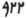
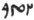

  
[Intangible Textual Heritage](../../index)  [Zoroastrianism](../index.md) 
[Index](index)  [Previous](sbe4721)  [Next](sbe4723.md) 

------------------------------------------------------------------------

[Buy this Book at
Amazon.com](https://www.amazon.com/exec/obidos/ASIN/1417930055/internetsacredte.md)

------------------------------------------------------------------------

*Pahlavi Texts, Part V: Marvels of Zoroastrianism (SBE47)*, E.W. West,
tr. \[1897\], at Intangible Textual Heritage

------------------------------------------------------------------------

### CHAPTER XIV.

1\. About the wonderful striving of the fiend for the destruction of
Zaratû*s*t. 2. When it became near to his birth, the Fever demon, the
Pain demon, and the Wind demon of Aharman, each one with 150 demons,
have come out to kill Zaratû*s*t, *and* from his spirit they have gone
forth to his mother. 3. And she is hurried from there by Fever, Pain,
and Wind; and at *the distance of* one league (parasang) *there* was a
wizard, Impudent (Storkŏ) by name, who was the most medical of wizards;
in hope of practice he stood up from his seat, as she stopped in her
progress.

4\. A messenger *of* Aûha*r*ma*zd* uttered a cry thus: 'Do not go to a
wizard! for they are not healing (bêshazinî*d*âr) for thee; but go back
to the house, wash *thy* hands on the morrow with cow's butter held over
the fire, also burn (tâpŏ) [1](#fn_423.md)
firewood

p. 141

*and* incense for thy own self *and thy* progeny which is in thy womb.'
5. And she acted accordingly and became well [1](#fn_424.md); *and* the co-operators of the demon,
*and* those of equal power, who *had* not obtained their remedy from her
body, are again exposed [2](#fn_425.md), and spoke
thus: 'On account of the existence of fire from all sides we have not
succeeded; *it is* a help for every one who is her friend more than
opponent; therefore it was not for us, because of the power within her.'

6\. The same night as she gave birth, Aharman selected commanders and
arrayed his champions (gû*r*d); there are *some* who *are* with one
thousand demons, and there are *some* who *are* with two thousand
demons; pursuing *and* attacking they have contended. 7. The opposing
stand *of* the sacred, beings [3](#fn_426.md),
especially of the glory itself at the family [4](#fn_427.md) fire, was manifest at that birth; and
for its splendour and brightness (pa*d*rôkŏ), settled opposite a distant
place, they have then found no remedy.

8\. At last, Aharman sends Akômanô [5](#fn_428.md)
on, and spoke to him thus: 'Thou canst be very spiritual, who canst be
most intimate; thou canst go with deceit into the mind of Zaratû*s*t,
and make him turn

p. 142

*his* mind to us who are demons.' 9. And Aûha*r*ma*zd* sends Vohûmanô on
against him; Akômanô advanced to the front, *and* had come forward to
the door, *and* wished to go inside.

10\. Vohûmanô schemingly (*k*ârakŏgarîhâ) turned [1](#fn_429.md) back, and exclaimed to Akômanô thus: 'Go
inside!' 11. Akômanô imagined thus: '*There* is nothing to be
accomplished by me of what *was* mentioned to me, for Vohûmanô has gone
back.' 12. And Vohûmanô went inside, *and* mingled with the reason
(vârôm) of Zaratû*s*t, *and* Zaratû*s*t laughed outright [2](#fn_430.md), for Vohûmanô is a gratifying spirit.

13\. Also seven wizards [3](#fn_431.md) were
seated before him, *and* owing to the light in the dwelling, his
*having* laughed at birth was conveniently seen, which is opposed to the
*habit* of the rest of mankind who cry out at birth *and* are quite
terrified.

14\. Also, at the same time of birth, he authoritatively accepted the
religion from Aûha*r*ma*zd*, as it is stated in revelation, that he
spoke at birth thus: 'As is the will of the spiritual lord (ahvô) mayst
thou be who art the officiating priest (zôtŏ) (that is, mayst thou be
the leader of the creatures) [4](#fn_432.md).'

15\. As Zaratû*s*t, on account of his worldly body, spoke with a worldly
voice, Aûha*r*ma*zd* spoke *in* reply to him, on account of the spirits,
thus: 'So

p. 143

mayst thou be the priestly authority (ra*d* shâe), and so mayst thou be
virtuous, owing to whatsoever righteousness *occurs;* and I confidently
proclaim *thee* righteous (that is, I am thy controller) [1](#fn_433.md).'

16\. Another day, Pôrûshaspô went and enquired of the wizards who kept
in front at the place, thus: 'What is the *cause* when infants cry out
at birth, beyond that *which occurs* when they laugh out-right [2](#fn_434.md)?' 17. And they replied thus: 'Because
*those who* are made to cry *have* seen mortality as *their* end, *and
those* having laughed *have* seen their own righteousness.'

------------------------------------------------------------------------

### Footnotes

[140:1](sbe4722.htm#fr_427.md) T has 'consume
(vi*dâz*ŏ).'

[141:1](sbe4722.htm#fr_428.md) Compare Dk. VII,
ii, 53-55.

[141:2](sbe4722.htm#fr_429.md) T has '*and* all
the co-operators *who had* entered her body, and those of equal power
*who had* reached them, returned helpless from them.'

[141:3](sbe4722.htm#fr_430.md) Thus summarized in
Dk. VIII; xiv, 2:—'Also about the arrival of both spirits, the good
*one* for developing, and the evil *one* for destroying; the victory
*of* the good spirit, and the rearing of Zaratû*s*t.' The 'rearing' is
continued in Chaps. XV-XX.

[141:4](sbe4722.htm#fr_431.md) Assuming that   stands for   dû*d*ak.

[141:5](sbe4722.htm#fr_432.md) The archdemon of
'evil thought' (Bd. XXVIII, 7) and special opponent of Vohûmanô, the
archangel of 'good thought.'

[142:1](sbe4722.htm#fr_433.md) Assuming that *s*tŏ
stands for va*s*tŏ.

[142:2](sbe4722.htm#fr_434.md) Compare Dk. VII,
iii, 2; V, ii, 5. This laughing is not mentioned in Dk. IX, xxiv.

[142:3](sbe4722.htm#fr_435.md) 'Seven midwives'
are mentioned in Dk. VII, iii, 2.

[142:4](sbe4722.htm#fr_436.md) This is one form of
the Pahlavi Ahunavair (see Dk. IX, xxiv, 4). At this point the text in
the MSS. is interrupted by the erroneous insertion of Chap. XII, 8-16,
the contents of a loose folio in some former copy, which have been
restored to their original position in this translation.

[143:1](sbe4722.htm#fr_437.md) Compare Dk. IX,
xxiv, 4.

[143:2](sbe4722.htm#fr_438.md) Compare Dk. VII,
iii, 24, 25.

------------------------------------------------------------------------

[Next: Chapter XV](sbe4723.md)
