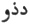

  
[Intangible Textual Heritage](../../index)  [Zoroastrianism](../index) 
[Index](index)  [Previous](sbe4728)  [Next](sbe4730) 

------------------------------------------------------------------------

[Buy this Book at
Amazon.com](https://www.amazon.com/exec/obidos/ASIN/1417930055/internetsacredte)

------------------------------------------------------------------------

*Pahlavi Texts, Part V: Marvels of Zoroastrianism (SBE47)*, E.W. West,
tr. \[1897\], at Intangible Textual Heritage

------------------------------------------------------------------------

### CHAPTER XXI.

1\. About his coming to thirty years of age *it is* thus declared, that
*on* the lapse of thirty years onwards from *his* appearance, *on* the
day Anêrân of the month Spenda*r*ma*d* [2](#fn_469), he had proceeded in that direction *in*
which *there* occurred the *so-*called festival of spring (*g*a*s*nŏ-î
vahâr) [3](#fn_470), forty-five days beyond

p. 155

new-year's day, *at* a place become specially noted, where people went,
from many quarters, out to the place of festival (*g*a*s*nŏ*k*âr).

2\. When Zaratû*s*t, for the sake of going off to the festival place,
halted on the way in walking, he chanced upon a solitary (aêvatâk)
plain, and he saw, in a vision, that mankind and a much-adorned worldly
*existence were* kept away to the north, so that all the people in the
earth have become fully manifest in the north. 3. And he at the head
(pavan têkh) of them *was* Mê*d*yômâh, son of Arâstâî [1](#fn_471), *even* as Ârâstâî was brother of
Pôrûshaspô [2](#fn_472); Mê*d*yômâh *was* the
leader of all mankind *who* have gone out to the presence of Zaratû*s*t,
and he became *their* guide, so that first Mê*d*yômâh *and* afterwards
the whole material existence are attracted.

4\. And about his coming out to the conference, *on* the lapse of those
forty-five days, *at* the place of festival *at* dawn *on* the day
Dadvô [3](#fn_473)-pavan-Mit*r*ô of the month
A*rd*avahi*s*tô. 5. And Zaratû*s*t, for the purpose of squeezing the
Hôm, went forth to the bank of the water of the Dâîtîh, because it is
the river [4](#fn_474) of the conference for
the supremacy (patîh) of Zaratû*s*t, *and* is the water of *Âv*ân [5](#fn_475) which has consisted of four channels
(bêtâ). 6. Zaratû*s*t also

p. 156

passed on through it; and its first *channel* was up to the ankle [1](#fn_476), the second up to the knee, the third up
to the parting of the two thighs, and the fourth up to the neck. 7. This
was an indicator that his religion comes four times to supremacy; the
manifestations of which are through Zaratû*s*t, Aûshê*d*ar,
Aûshê*d*ar-mâh, and Sôshâns [2](#fn_477).

8\. When he came up from the water, and put on his clothes, he then saw
the archangel Vohûmanô [3](#fn_478) in the form
(âyûînakŏ) of a man, handsome, brilliant, and elegant, who wore his hair
curve-tailed [4](#fn_479), because the curved
tail is an indication of duality; *who* had put on *and* wore a dress
like silk, than which *there* was no making anything superior, for it
was light itself; and his height was nine *times* as much as *that of*
Zaratû*s*t.

9\. He also enquired of Zaratû*s*t [5](#fn_480)
thus: 'Who mayst thou be, and from whom of them mayst thou be? also what
is mostly thy desire, and the endeavour in thy existence?' 10. And he
replied thus: 'I am Zaratû*s*t of the Spîtâmas; among the existences
righteousness is more *my* desire, and my wish is that I *may* become
aware *of* the will of the sacred beings, and *may* practise so much
righteousness as they exhibit to me in the pure existence.'

11\. And Vohûmanô directed Zaratû*s*t [6](#fn_481) thus: 'Do

p. 157

thou proceed to an assembly of the spirits!' 12. As much as Vohûmanô
walked on in nine steps, Zaratû*s*t *did* in ninety steps, and when he
had gone ninety steps farther than him, he saw the assembly of the seven
archangels. 13. When he came within twenty-four feet of the archangels,
he then did not see his own shadow on the ground, on account of the
great brilliancy of the archangels; the position of the assembly was in
Iran, and in the direction of the districts on the bank of the water of
the Dâîtîh. 14. Zaratû*s*t offered homage, and spoke thus: 'Homage to
Aûha*r*ma*zd*, and homage to the archangels!' *and* he went forward
*and* sat down in the seat of the enquirers.

15\. As to the asking of questions by Zaratû*s*t, he enquired of
Aûha*r*ma*zd* thus: 'In the embodied world which is the first of the
perfect ones, which the second, *and* which the third?' 16. And
Aûha*r*ma*zd* replied thus: 'The first perfection is good thoughts, the
second good words, *and* the third good deeds.'

17: Zaratû*s*t also enquired thus: 'Which *thing* is good, which is
better [1](#fn_482), and which is the best of
all habits?' 18. *And* Aûha*r*ma*zd* replied thus: 'The title [2](#fn_483) of the archangels is good, the sight of
them is better, and carrying out their commands is the best of all
habits.'

19\. Afterwards he demonstrated the duality of the original evolutions
(bûn ga*s*tânŏ) [3](#fn_484), and the
divergence in each control, *and* spoke thus: 'Of those spirits, he who
*was* wicked preferred the

p. 158

practice which is iniquitous (Aharman's desire was *for* the practice
which is iniquitous), *and* the spirit of righteousness, the propitious
(Aûha*r*ma*zd*) prefers righteousness [1](#fn_485).' 20. Specially he demonstrated the
divergence in each control of the exhibitors of light, and he spoke
thus: 'Neither our thoughts [2](#fn_486), nor
desires, nor words, nor deeds, nor religion, nor spiritual faculties
*agree* [3](#fn_487)*; he* who is loving light,
his place is with the luminaries; *and he* who is *loving* darkness is
with the dark ones [4](#fn_488).'

21\. On the same day also, his omniscient wisdom appeared three times:
as regards the same first questions, it pointed out the sky in great
light and splendour, and in its exhibition *of* the prevention *of*
darkness, at the sight of which *it becomes* an opposing existence as
regards that darkness. 22. And it exhibited its own appearance
proportionally *to* the sky, when it kept its head at the summit of the
sky, *its* feet at the bottom of the sky, and *its* hands reached to
both sides of the sky; the sky also kept *it* covered, in the manner of
a garment.

23\. The six archangels [5](#fn_489) were
manifest by their similar stature (ham-ba*s*nîh), in such manner that it
is obvious each one successively is apparently one finger's *breadth*
shorter than the other. 24. The archangels exhibited three kinds *of*
achievement

p. 159

\[paragraph continues\] (pasâkhtan) [1](#fn_490) for the religion; first, *by* means of
fires, and Zaratû*s*t walked three steps on *them*, with *the words*,
'good thoughts, good words, and good deeds,' and *was* not burnt; and
secondly, hot metal is poured on to *his* chest, cooled thereby, and,
grasping *it* with *his* hand, he held *it* for the archangels. 25.
Aûha*r*ma*zd* spoke thus: 'After *the establishment of* the pure
religion, when a dispute occurs in the religion, those who are thy
disciples *will* pour *it* on to a spiritual lord, they *will* take *it*
up with the hand, *and will* thoroughly believe in him who is over the
whole embodied existence.' 26. The third *was* cutting with a knife,
*and* the vital parts (ahvôn) becoming visible, which are inside the
abdomen, *with* a flowing forth of blood; and, after the hands are
rubbed over *it*, it became healed. 27. And this is pointed out, namely:
'Thy and thy [coreligionists’](errata.htm#1) accepting of the pure
religion is, as to the steadfast *in* other religions, such that,
through such-like burning of fire, pouring of hot metal, and through an
operation with a sharp instrument, *there* is no perversion from the
good religion.'

------------------------------------------------------------------------

### Footnotes

[154:1](sbe4728.htm#fr_472) T inserts 'not'
here, which is clearly wrong, and must have been introduced by some
copyist who did not observe that the assembly, though learned, was
sinful; and that the object of the anecdote is to exhibit Zaratû*s*t's
ability to distinguish between good works and sin, when still untaught
by the sacred beings.

[154:2](sbe4729.htm#fr_473) On the last day of
the twelfth Parsi month.

[154:3](sbe4729.htm#fr_474) The Maidhyôzaremaya
season-festival, held on the fifteenth day of the second Parsi month.

[155:1](sbe4729.htm#fr_475) See Yt. XIII, 95.

[155:2](sbe4729.htm#fr_476) So Mê*d*yômâh was
first cousin of Zaratû*s*t, and became his first convert; see also Chap.
XXIII, 1.

[155:3](sbe4729.htm#fr_477) The Pahlavi letters
represent Av. dadhv*a*u, 'creator'; compare the Khvârizmian name   of the fifteenth day of the
month in Sachau's Albîrûnî, p. 57, l. 35. The date here given is the
fifteenth of the second month, as in § 1.

[155:4](sbe4729.htm#fr_478) Assuming that ru*d*
stands for rû*d*.

[155:5](sbe4729.htm#fr_479) Probably Anâhita,
the female spirit of pure water, mentioned by her title Arêdvisûr in
Chap. XVI, 3.

[156:1](sbe4729.htm#fr_480) Literally 'up to
the leg (zang).'

[156:2](sbe4729.htm#fr_481) The past and future
apostles of Zoroastrianism. For the last three, see Dk. VII, ix-xi.

[156:3](sbe4729.htm#fr_482) Compare Dk. VII,
iii, 51-54.

[156:4](sbe4729.htm#fr_483) Assuming that
va*g*dumak is a variant of the usual ga*g*dûmak. The scorpion (va*g*dum)
would be a sign of duality, as, being a noxious creature, it was
produced by the evil spirit Aharman.

[156:5](sbe4729.htm#fr_484) Compare Dk. VII,
iii, 55-59.

[156:6](sbe4729.htm#fr_485) Compare ibid. iii,
60-6a.

[157:1](sbe4729.htm#fr_486) Both MSS. have
'worse' here.

[157:2](sbe4729.htm#fr_487) This title,
ameshaspenta, is 'immortal benefactor.'

[157:3](sbe4729.htm#fr_488) The two prime
movers in creation.

[158:1](sbe4729.htm#fr_489) Quoted from Pahl.
Yas. XXX, 5 ab. The words in parentheses are glosses inserted by the
Pahlavi translator.

[158:2](sbe4729.htm#fr_490) Both MSS. have
'spirits' by inserting a stroke in the middle of the Pahlavi word.

[158:3](sbe4729.htm#fr_491) An imperfect
quotation, omitting glosses, from Pahl. Yas. XLIV, 2 cde (Sp.).

[158:4](sbe4729.htm#fr_492) A similar idea is
expressed in Vd. XIX, 30, but the Pahlavi version of half of it is lost.

[158:5](sbe4729.htm#fr_493) Apart from
Aûha*r*ma*zd*, their president.

[159:1](sbe4729.htm#fr_494) By way of ordeal, a
relic of the old faith in incantation.

------------------------------------------------------------------------

[Next: Chapter XXII](sbe4730)
