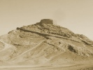

  
[Intangible Textual Heritage](../../index)  [Zoroastrianism](../index) 
[Wisdom of the East](../../woe/index)  [Index](index) 
[Previous](toz05)  [Next](toz07) 

------------------------------------------------------------------------

  
*The Teachings of Zoroaster*, by S.A. Kapadia, \[1905\], at Intangible
Textual Heritage

------------------------------------------------------------------------

p. 103

# NOTES

Yima was known in the Shah Nameh [\*](#fn_84) as Jamshid. Pride was the cause of his
downfall. God conferred favours on him, and, according to the Vendidad,
he became a mighty and prosperous king. Being elated by success, he
disowned God, and in the words of Firdosi thus expressed himself:

"'Behold in me the monarch of the world!  
 By me all nature speaks, by me the thunder's hurl’d.  
 For me the demons all their magic spread.'  
 So vain his soul he knew not what he said.  
 'This world is mine, no other God I know,  
 From me alone all excellence can flow."'

This act of heresy caused his empire to crumble to pieces, and, mighty
as he was, he was taken prisoner by the wicked Zohak and sawn in two
between planks.

Zohak according to Firdosi, was a son of
an Arabian prince. Early in life he had sold his soul to the Devil. He
started his infamous reign by murdering his father. At the time when he
conquered Jamshid, the Devil had bestowed on him two serpents, one on
each shoulder, who had to be fed with human brains. This curse of the
Devil brought terrible ruins to the soil of ancient Iran. According to
the old Persian legend, Zohak was chained

p. 104

up in a cave on Mount Demavend by Feridoon, who conquered and ascended
the throne of Iran. Zohak is destined to remain there, a prey to
anguish, till the day of judgment. Night and day he licks his iron
fetters so as to thin the metal and break his bonds. A cock, placed
there by the Guardian Angel, gives forth his clarion notes on the break
of day, and the fetters of Zohak, rendered thin by hours of licking,
with a clang and clatter immediately resume their original size. Thus
once more the labour of Zohak has to be begun again. This will go on
till the final trumpet call. It is the punishment to one who, in his
early folly, sold his soul to the Evil One.

Gāo was a blacksmith during the reign of
Zohak. His son was captured by Zohak's retainers, and was destined to
feed the serpents with his brains. Gāo, in his terrible anguish to save
his child such a horrible and atrocious death, tore off his leathern
apron, and, waving it aloft, raised a cry for freedom from his tyrant.
The band of soldiers gathered around him under Feridoon, the conqueror
of Zohak and liberator of Iran, adopted his apron as the royal standard,
which was handed down from generations of rulers of ancient Iran
bedecked with precious stones and which was carried aloft in the
forefront of numerous battles of historical renown as "Gaviani Zoondo."
It proudly floated and shared all the glories of the Persian Empire and
veneration of its doughty warriors.

\_\_\_\_\_\_\_\_\_\_\_\_\_\_\_\_\_\_\_\_\_\_\_\_\_\_\_\_\_\_\_\_\_\_\_\_\_\_\_\_\_\_\_\_\_\_  
*Printed and bound by Hasell, Watson and Viney,
London and Aylesbury*.

 

 

 

 

------------------------------------------------------------------------

### Footnotes

[103:\*](toz06.htm#fr_84) History of Persian
kings, by the great epic poet Firdosi.

------------------------------------------------------------------------

[Next: Advertisements](toz07)

